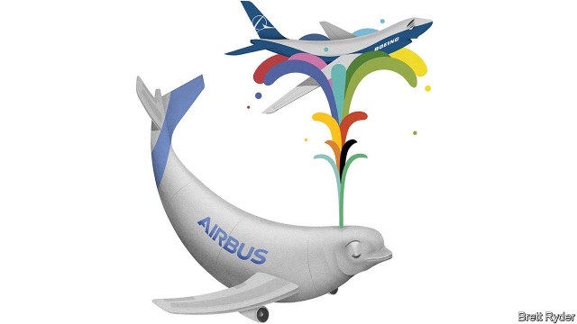

###### Schumpeter

# Airbus risks losing its competitive thrust 

##### Even though Boeing is in trouble, this is no time for the European planemaker to rest on its laurels 

 

> Apr 11th 2019 

NO AIRCRAFT BETTER sums up the quaint absurdity of Airbus’s origins than the Beluga. The cargo jet, which resembles a winged whale, carries aerofoils, tails and bits of fuselage from production sites across Europe to be turned into aeroplanes in Toulouse and Hamburg. In a normal company, it would be redundant. Like the Beluga, Airbus is far from normal. Started in 1967 as a jumble of aerospace firms from Germany, France, Britain and, later, Spain, it needs the ungainly plane to make it function smoothly. 

As one of Europe’s biggest industrial firms, though, Airbus is neither quaint nor absurd. It has stood out for its innovation, competitiveness and, sometimes, inspired leadership. Under Tom Enders, an outspoken former German paratrooper, it has achieved its mission of becoming (Beluga notwithstanding) a more “normal” company. Mr Enders managed to reduce the influence and ownership of the French and German states. Airbus’s share price quadrupled in his seven-year tenure. Its American former head of sales, John Leahy, who retired last year, was a salesman extraordinaire, racking up, he claims, $1.6trn of aircraft sales at Airbus, making him the nemesis of its arch-rival, Boeing. With such men, it was harder to argue that the aerospace industry was a lazy duopoly. 

But in the past year Airbus has acquired a controlling stake in the C Series jet, designed by Bombardier of Canada, while Boeing has joined forces with Embraer, Bombardier’s Brazilian rival, making the fortress in single-aisle commercial-aircraft manufacturing even more impregnable. Meanwhile, Boeing is in disarray following two air disasters since last October that have grounded its bestselling jet. On the face of it, both developments are good for Airbus. In fact they could be the biggest potential traps for Guillaume Faury, the 51-year-old Frenchman who replaced Mr Enders on April 10th, because they risk dulling Airbus’s competitive edge. 

From an operational point of view, Mr Faury takes over at an ideal time. Like everyone at Airbus, he will lament the crashes of Boeing’s 737 MAX aircraft in Ethiopia and Indonesia, which killed 346 people. Undeniably, though, the longer that plane is grounded, the stronger the outlook for Airbus’s own highly successful narrow-body, the A320neo. Airbus may already be reaping the benefits: a bumper deal for 290 A320s from China last month was a further kick in the teeth for Boeing. In February Airbus took the tough decision to scrap its loss-making A380 super-jumbo. That will bolster margins on commercial aircraft, which hit 9% last year, according to Bloomberg—short of Boeing’s 13% but an improvement. 

One of the curiosities of the Airbus-Boeing duopoly is how restrained those margins were—especially at Airbus. In his recent book about the global jetliner business, “AeroDynamic”, Kevin Michaels, an aerospace analyst, notes that between 2011 and 2017 both firms delivered more than 6,600 A320s and 737s between them. Normally, a duopoly and sky-high barriers to entry would have allowed them to jack up prices. Instead, they offered big discounts. The competition for orders was cut-throat, partly owing to the “John Leahy factor”, Mr Michaels writes.As operating margins at both firms have crept up recently, however, both have reduced the share of sales they spend on research and development of commercial aircraft. This is partly because the experience of building complex and costly new planes, such as Boeing’s 787 Dreamliner and Airbus’s A380, has been chastening. Such “moonshots” have gone out of fashion. Excessive re-engineering also played a part. Boeing’s 737 series dates back to 1967, the same year Airbus was conceived, and has been tinkered with extensively. As Boeing grapples with the two disasters, the prospect of deciding swiftly to build a new mid-sized aircraft, known as NMA, is receding. That takes more pressure off Airbus to innovate. 

Meanwhile, Airbus’s shareholders are clamouring for it to follow Boeing in handing back more cash through dividends and buy-backs. That is common across the capital markets. But it would make both companies keener than ever to milk their duopoly status. Richard Aboulafia of the Teal Group, a consultancy, describes Boeing dismissively as a “legacy jet manufacturer and distributor of shareholder returns”. Its rising payouts may be one reason Boeing’s shares have not fallen more steeply, despite the firm’s admission this month that its software contributed to the crashes. Airbus will be tempted to move in the same direction. 

The European firm would be wise to resist this urge and instead consider ploughing money back into the business. For a start, Mr Faury must contend with Brexit, which risks disrupting Airbus supply chains in Europe but may provide an opportunity to expand its operations beyond the continent. Then there is the long-running stand-off with Boeing over subsidies and tax breaks. On April 8th the Trump administration threatened tariffs on $11bn worth of European goods, including aircraft and helicopters, which would hurt Airbus. The European Union immediately threatened retaliation. Nothing will be decided until the World Trade Organisation sets the level of damages this summer. But one thing is clear: it will be harder for either firm to rely on state support in the future. 

Meanwhile, Mr Faury has a chance to take advantage of a coming wave of technological change. Acknowledging this, he talks of innovation over the next decade and beyond that could match anything in the history of aviation. That includes engine electrification, artificial intelligence and advanced connectivity that would change how aircraft are developed, manufactured, flown, powered and serviced. It means increased use of new materials (see article) and 3D printing, and greater efforts to reduce greenhouse-gas emissions. Airbus may be slow to embrace these long-term opportunities, given its cosy position. Gingerliness may even bring short-term gains. But technology could lower barriers to entry. In the end, ambition will pay off—even if it endangers the Beluga. 

-- 

 单词注释:

1.Schumpeter[]:n. 熊彼特（美籍奥匈帝国经济学家, 当代资产阶级经济学代表人物之一） 

2.airbus['eәbʌs]:空中客车 

3.boe[bəu]:abbr. back outlet eccentric 后偏心（轮）出口 

4.planemaker['plein,meikә(r)]:n. <美>飞机制造商 

5.laurel['lɒ:rәl]:n. 月桂树, 荣誉 vt. 使戴桂冠, 授予荣誉 

6.APR[]:[计] 替换通路再试器 

7.quaint[kweint]:a. 古雅的, 离奇有趣的, 奇怪的 

8.absurdity[әb'sә:diti]:n. 荒谬, 悖理, 荒谬的言行 

9.beluga[bә'lu:gә]:n. 大白鳇, 白鲸 

10.aerofoil['eәrәfɔil]:[机] 机翼, 螺旋桨, 机舵总称 

11.fuselage['fju:zilɑ:dʒ]:n. 机身 

12.toulouse[tu:'lu:z]:n. 图卢兹（法国南部城市） 

13.hamburg['hæmbә:^]:n. 汉堡（德国城市） 

14.redundant[ri'dʌndәnt]:a. 多余的, 过多的, 冗长的 [医] 过多的, 多余的 

15.jumble[dʒʌmbl]:vi. 搀杂, 混杂 vt. 搞乱, 使混乱 n. 混乱, 薄饼 

16.aerospace['єәrәuspeis]:n. 航天空间, 航天技术 

17.Spain[spein]:n. 西班牙 

18.ungainly[.ʌn'geinli]:a. 难看的, 不优雅的, 粗陋的 

19.innovation[.inәu'veiʃәn]:n. 改革, 创新 [法] 创新, 改革, 刷新 

20.competitiveness[]:[经] 竞争 

21.tom[tɒm]:n. 雄性动物, 雄猫 

22.ender[]:n. 安德（游戏中的人物名）；恩德（男子名） 

23.paratrooper['pærәtru:pә]:n. 伞兵 

24.notwithstanding[.nɒtwiθ'stændiŋ]:adv. 虽然, 尽管 prep. 尽管 conj. 虽然 

25.quadruple['kwɒdrupl]:a. 四倍的, 四重的, 四部分组成的 n. 四倍 vt. 使成四倍 vi. 成为四倍 

26.tenure['tenjuә]:n. 享有, 保有期 [经] (财产,职位等的)占有, 占有权 

27.john[dʒɔn]:n. 盥洗室, 厕所, 嫖客 

28.Leahy[]:n. (Leahy)人名；(英)莱希 

29.extraordinaire[,ekstrә,ɔ:di'neә]:<法>adj.[用作后置形容词]异常的,特别的,非凡的 

30.nemesis['nemisis]:n. 复仇女神, 给与惩罚的人, 天罚, 报应 

31.duopoly[dju'ɔpәli]:[经] 双头垄断的生产者 

32.C[si:]:[计] 调用, 访问, 呼叫；电容, 进位, 通道, 字符, 清除, 常数, 控制, 周期；C 程序设计语言 [化] 碳的化学符号; 胞苷 

33.sery[]:n. (Sery)人名；(俄)谢雷；(科特)塞里 

34.bombardier[.bɒmbә'diә]:n. 投弹手, 炮兵军士 

35.embraer[]:abbr. 巴西航空工业公司（the Empresa Brasileira de Aeronáutica） 

36.Brazilian[brә'ziljәn]:n. 巴西人 a. 巴西的, 巴西人的 

37.fortress['fɒ:tris]:n. 城堡, 要塞 vt. 筑要塞, 以要塞防守 

38.manufacturing[.mænju'fæktʃәriŋ]:n. 制造业 a. 制造业的 

39.impregnable[im'pregnәbl]:a. 无法攻取的, 坚强不屈的, 驳不倒的 

40.disarray[.disә'rei]:vt. 弄乱, 使混乱, 使脱去衣服 n. 无秩序, 杂乱, 不整齐的衣着 

41.bestselling[]:a. 畅销的 

42.Guillaume[,^i:'jәum]:纪尧姆(①姓氏 ②Charles Edouard, 1861-1938, 生于瑞士的法国物理学家, 曾获1920年诺贝尔物理学奖) 

43.lament[lә'ment]:n. 悲叹, 悔恨, 恸哭, 挽歌, 悼词 vt. 哀悼 vi. 悔恨, 悲叹 

44.MAX[mæks]:[计] 最大 

45.Ethiopia[.i:θi'әupiә]:n. 埃塞俄比亚 

46.Indonesia[.indәu'ni:ʒә]:n. 印尼 

47.undeniably[]:adv. 确凿无疑地；不可否认地 

48.bumper['bʌmpә]:n. 缓冲器, 满杯 a. 大胜利的 

49.scrap[skræp]:n. 碎片, 残余物, 些微, 片断, 铁屑, 吵架 vt. 扔弃, 敲碎, 拆毁 vi. 互相殴打 a. 零碎拼凑成的, 废弃的 

50.bolster['bәulstә]:n. 支持, 长枕 vt. 支持, 支撑 

51.jetliner['dʒetlainә]:n. 喷气客机 

52.aerodynamic[,eәrәudai'næmik]:a. 空气动力学的 

53.kevin['kenin]:n. 凯文（男子名） 

54.michael['maikl]:n. 迈克尔（男子名） 

55.analyst['ænәlist]:n. 分析者, 精神分析学家 [化] 分析员; 化验员 

56.jack[dʒæk]:n. 插座, 千斤顶, 男人 vt. 抬起, 提醒, 扛举, 增加, 提高, 放弃 a. 雄的 [计] 插座 

57.dreamliner[]:[网络] 梦幻客机；梦想飞机；梦想客机 

58.chasten['tʃeisәn]:vt. 惩罚；磨炼；抑制 

59.moonshot['mu:nʃɒt]:n. （火箭等的）向月球发射 

60.conceive[kәn'si:v]:vt. 构思, 认为 vi. 怀孕 

61.tinker['tiŋkә]:n. 补锅匠, 会做各种修补活计的人 vi. 做焊锅匠, 笨拙的修补 vt. 修补 

62.extensively[]:adv. 广大, 广延, 外延, 大面积(耕种), 粗放, 广博, 广泛, 广阔 

63.grapple[græpl]:v. 抓住, 掌握 n. 抓住, 系紧, 掌握, 与...扭打 

64.swiftly['swiftli]:adv. 很快地, 即刻 

65.NMA[]:NetWare管理代理 

66.recede[ri'si:d]:vi. 向后退, 退却, 收回, 降低, 减弱 [医] 退缩 

67.innovate['inәuveit]:vi. 改革, 创新 

68.shareholder['ʃєә.hәuldә]:n. 股东 [法] 股东, 股票持有人 

69.clamour['klæmә]:n. 喧闹 v. 大声地要求 

70.dividend['dividend]:n. 被除数, 股利 [计] 被除数 

71.statu[]:[网络] 状态查看；雕像；特级雪花白 

72.richard['ritʃәd]:n. 理查德（男子名） 

73.aboulafia[]:[网络] 阿波拉弗亚；阿布拉费 

74.teal[ti:l]:n. 短颈野鸭 

75.consultancy[]:n. 商量, 协商, 磋商, 会诊, 与...商量, 咨询, 请教, 找(医生)看病, 查阅, 考虑 [经] 咨询业务, 咨询服务 

76.dismissively[]:adv. 轻蔑地；不屑一顾地 

77.legacy['legәsi]:n. 祖先传下来之物, 遗赠物 [经] 遗产, 遗赠物 

78.distributor[dis'tribjutә]:n. 分发者, 分布者, 散布者, 分配者, 销售者, 分配器, 配电盘, 自动拆版机 [计] 分配器 

79.payout['pei'aut]:n. 支出, 付出款项 [经] 付出款项, 花费, 支出 

80.steeply['sti:pli]:adv. 险峻地 

81.contend[kәn'tend]:vi. 奋斗, 斗争, 竞争 vt. 为...斗争 

82.Brexit[]:[网络] 英国退出欧盟 

83.disrupt[dis'rʌpt]:a. 分裂的, 中断的 vt. 使分裂, 使瓦解 

84.tariff['tærif]:n. 关税, 关税表, 价格表, 收费表 vt. 课以关税 [计] 价目表 

85.retaliation[ri.tæli'eiʃәn]:n. 报复 [法] 报仇, 报复, 回敬 

86.organisation[,ɔ: ^әnaizeiʃən; - ni'z-]:n. 组织, 团体, 体制, 编制 

87.technological[.teknә'lɒdʒikl]:a. 技术的 [经] 工艺的, 技术的 

88.electrification[i.lektrifi'keiʃәn]:n. 起电, 带电, 电气化 [化] 起电 

89.connectivity[kәnek'tiviti]:[计] 连通性, 连通度 

90.emission[i'miʃәn]:n. 发射, 射出, 发行 [医] 发射, 遗精 

91.gingerliness['dʒindʒәlinis]:n. 小心翼翼, 慎重 

92.endanger[in'deindʒә]:vt. 危及 [法] 使危险, 危及 

