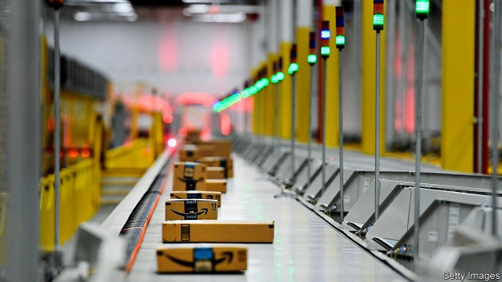

###### The learning machine

# Amazon’s empire rests on its low-key approach to AI 

##### Unflashy but high-powered machine learning powers everything from its fulfilment centres to the cloud 

 

> Apr 11th 2019 

AMAZON’S SIX-PAGE memos are famous. Executives must write one every year, laying out their business plan. Less well known is that these missives must always answer one question in particular: how are you planning to use machine learning? Responses like “not much” are, according to Amazon managers, discouraged. 

Machine learning is a form of artificial intelligence (AI) which mines data for patterns that can be used to make predictions. It took root at Amazon in 1999 when Jeff Wilke joined the firm. Mr Wilke, who today is second-in-command to Jeff Bezos, set up a team of scientists to study Amazon’s internal processes in order to improve their efficiency. He wove his boffins into business units, turning a cycle of self-assessment and improvement into the default pattern. Soon the cycle involved machine-learning algorithms; the first one recommended books that customers might like. As Mr Bezos’s ambitions grew, so did the importance of automated insights. 

Yet whereas its fellow tech titans flaunt their AI prowess at every opportunity—Facebook’s facial-recognition software, Apple’s Siri digital assistant or Alphabet’s self-driving cars and master go player—Amazon has adopted a lower-key approach to machine learning. Yes, its Alexa competes with Siri and the company offers predictive services in its cloud. But the algorithms most critical to the company’s success are those it uses to constantly streamline its own operations. The feedback loop looks the same as in its consumer-facing AI: build a service, attract customers, gather data, and let computers learn from these data, all at a scale that human labour could not emulate. 

Consider Amazon’s fulfilment centres. These vast warehouses, more than 100 in North America and 60-odd around the world, are the beating heart of its $207bn online-shopping business. They store and dispatch the goods Amazon sells. Inside one on the outskirts of Seattle, packages hurtle along conveyor belts at the speed of a moped. The noise is deafening—and the facility seemingly bereft of humans. Instead, inside a fenced-off area the size of a football field sit thousands of yellow, cuboid shelving units, each six feet (1.8 metres) tall. Amazon calls them pods. Hundreds of robots shuffle these in and out of neat rows, sliding beneath them and dragging them around. Toothpaste, books and socks are stacked in a manner that appears random to a human observer. Through the lens of the algorithms guiding the process, though, it all makes supreme sense. 

Human workers, or “associates” in company vernacular, man stations at gaps in the fence that surrounds this “robot field”. Some pick items out of pods brought to them by a robot; others pack items into empty pods, to be whirred away and stored. Whenever they pick or place an item, they scan the product and the relevant shelf with a bar-code reader, so that the software can keep track. 

The man in charge of developing these algorithms is Brad Porter, Amazon’s chief roboticist. His team is Mr Wilke’s optimisation squad for fulfilment centres. Mr Porter pays attention to “pod gaps”, or the amount of time that the human workers have to wait before a robot drags a pod to their station. Fewer and shorter gaps mean less down time for the human worker, faster flow of goods through the warehouse, and ultimately speedier Amazon delivery to your doorstep. Mr Porter’s team is constantly experimenting with new optimisations, but rolls them out with caution. Traffic jams in the robot field can be hellish. 

Amazon Web Services (AWS) is the other piece of core infrastructure. It underpins Amazon’s $26bn cloud-computing business, which allows companies to host websites and apps without servers of their own. 

AWS’s chief use of machine learning is to forecast demand for computation. Insufficient computing power as internet users flock to a customer’s service can engender errors—and lost sales as users encounter error pages. “We can’t say we’re out of stock,” says Andy Jassy, AWS’s boss. To ensure they never have to, Mr Jassy’s team crunches customer data. Amazon cannot see what is hosted on its servers, but it can monitor how much traffic each of its customers gets, how long the connections last and how solid they are. As in its fulfilment centres, these metadata feed machine-learning models which predict when and where AWS is going to see demand. 

One of AWS’s biggest customers is Amazon itself. And one of the main things other Amazon businesses want is predictions. Demand is so high that AWS has designed a new chip, called Inferentia, to handle these tasks. Mr Jassy says that Inferentia will save Amazon money on all the machine-learning tasks it needs to run in order to keep the lights on, as well as attracting customers to its cloud services. “We believe it can be at least an order-of-magnitude improvement in cost and efficiency,” he says. The algorithms which recognise voices and understand human language in Alexa will be one big beneficiary. 

The firm’s latest algorithmic venture is Amazon Go, a cashierless grocery. A bank of hundreds of cameras watches shoppers from above, converting visual data into a 3D profile which is used to track hands and arms as they handle a product. The system sees which items shoppers pick up and bills them to their Amazon account when they leave the store. Dilip Kumar, Amazon Go’s boss, stresses that the system is tracking the movements of shoppers’ bodies. It is not using facial recognition to identify them and to link them with their Amazon account, he says. Instead, this is done by swiping a bar code at the door. The system ascribes the subsequent actions of that 3D profile to the swiped Amazon account. It is an ode to machine learning, crunching data from hundreds of cameras to determine what a shopper takes. Try as he might, your correspondent could not fool the system and pilfer an item. 

AI body-tracking is also popping up inside fulfilment centres. The firm has a pilot project, internally called the “Nike Intent Detection” system, which does for fulfilment-centre associates what Amazon Go does for shoppers: it tracks what they pick and place on shelves. The idea is to get rid of the hand-held bar-code reader. Such manual scanning takes time and is a bother for workers. Ideally they could place items on any shelf they like, while the system watches and keeps track. As ever, the goal is efficiency, maximising the rate at which products flow. “It feels very natural to the associates,” says Mr Porter. 

Amazon’s careful approach to data collection has insulated it from some of the scrutiny that Facebook and Google have recently faced from governments. Amazon collects and processes customer data for the sole purpose of improving the experience of its customers. It does not operate in the grey area between satisfying users and customers. The two are often distinct: people get social media or search free of charge because advertisers pay Facebook and Google for access to users. For Amazon, they are mostly one and the same (though it is toying with ad sales). Where regulators do raise concerns is over Amazon’s dominance in its core business of online shopping and cloud computing. This power has been built on machine learning. It shows no signs of waning. 

-- 

 单词注释:

1.AI[ai]:[计] 附加信息, 人工智能 [化] 人工智能 

2.unflashy[]:[网络] 不爽 

3.fulfilment[]:n. 履行, 结束, 完成, 实现, 满意, 称心 [法] 履行, 实现, 完成 

4.APR[]:[计] 替换通路再试器 

5.memo['memәu]:n. 备忘录 [经] 备忘录 

6.les[lei]:abbr. 发射脱离系统（Launch Escape System） 

7.missive['misiv]:n. 公文, 书信 a. 送出的 

8.alway['ɔ:lwei]:adv. 永远；总是（等于always） 

9.amazon['æmәzɒn]:n. 亚马孙河 [医] 无乳腺者 

10.datum['deitәm]:n. 论据, 材料, 资料, 已知数 [医] 材料, 资料, 论据 

11.prediction[pri'dikʃәn]:n. 预言, 预报 [化] 预测 

12.jeff[dʒef]:n. 杰夫（男子名, 等于Jeffrey） 

13.wilke[]: [人名] 威尔克 

14.bezos[]:贝索斯（人名） 

15.boffin['bɒfin]:n. 研究员, 科学工作者 

16.default[di'fɒ:lt]:n. 违约, 不履行责任, 缺席, 默认值 v. 疏怠职责, 缺席, 拖欠, 默认 [计] 默认; 默认值; 缺省值 

17.algorithm['ælgәriðm]:n. 算法 [计] 算法 

18.automate['ɔ:tәmeit]:vt.vi. (使)自动化 [计] 自动化 

19.tech[tek]:n. 技术学院或学校 

20.Titan['taitn]:n. 提坦, 太阳神, 巨人 

21.flaunt[flaunt]:n. 炫耀, 飘扬 v. 炫耀, 飘扬 

22.prowess['prauis]:n. 英勇, 勇敢, 超凡技术 

23.siri[siri]:n. iPhone 4S上的语音控制功能 

24.alexa[]:n. 亚莉克莎（女子名） 

25.predictive[pri'diktiv]:a. 预言性的, 成为前兆的 

26.constantly['kɒnstәntli]:adv. 不变地, 不断地, 时常地 

27.streamline['stri:mlain]:n. 流线, 流线型 vt. 使成流线型, 使合理化 

28.emulate['emjuleit]:vt. 效法, 尽力赶上, 同...竞争 [计] 仿真 

29.dispatch[dis'pætʃ]:vt. 派遣 n. 派遣, 急件 [计] 调度 

30.Seattle[si'ætl]:n. 西雅图 

31.hurtle['hә:tl]:vi. 猛冲, 碰撞, 突进 vt. 猛撞, 猛投 n. 投掷, 碰撞, 碰撞声 

32.conveyor[]:n. 搬运者, 传达者, 转让财产者, 输送机, 输送设备 [计] 传送机, 传送带 

33.moped['mәuped]:n. 助动车 

34.seemingly['si:miŋli]:adv. 看来似乎, 表面上看来 

35.bereave[bi'ri:v]:vt. 使孤寂, 使丧失, 使失去 

36.cuboid['kju:bɒid]:a. 立方形的, 骰骨的 n. 骰骨, 立方体 

37.shelve[ʃelv]:vt. 放置架子上, 搁置 vi. 渐渐倾斜 

38.pod[pɒd]:n. 豆荚, (豆荚状的)保护性外壳, 扁豆形矿体 vt. 从豆荚中剥出 vi. 结豆荚 

39.shuffle['ʃʌfl]:n. 拖着脚走, 曳步, 混乱, 蒙混, 洗纸牌 v. 拖曳, 马虎地做, 笨手笨脚地穿(脱)衣, 推诿, 洗牌 [计] 混洗 

40.len[]:n. 伦恩（男子名） 

41.vernacular[vә'nækjulә]:n. 本地话, 方言 a. 地方的, 用本地语写成的 

42.whir[hwә:]:n. 呼呼声, 飕飕声 vi. 作呼呼声, 发飕飕声 vt. 使呼呼响 

43.brad[bræd]:n. 角钉, 曲头钉 

44.roboticist[rәj'bɔtisist]:n. 机器人专家 

45.optimisation[ɒptɪmaɪ'seɪʃən]: [医]最佳化, 最优法; 最优化 

46.squad[skwɒd]:n. 班, 小队, 小集团 vt. 编成班 

47.speedy['spi:di]:a. 快的, 迅速的 [经] 快的, 迅速的 

48.doorstep['dɒ:step]:n. 门阶 

49.hellish['heliʃ]:a. 地狱的, 凶恶的, 令人毛骨悚然的 

50.aw[ɔ:]:int. 哦！噢！（表示抗议, 厌恶, 讨厌等） 

51.infrastructure['infrәstrʌktʃә]:n. 基础结构, 基础设施 [经] 基础设施 

52.underpin[.ʌndә'pin]:vt. 从下面支承, 支撑, 支持 [经] 支撑 

53.APP[]:[计] 应用, 应用程序; 相联并行处理器 

54.server['sә:vә]:n. 服伺者, 上菜用具, 发球员 n. 服务器 [计] 服务器, 服务器启动程序, 服务台程序 

55.computation[.kɒmpju'teiʃәn]:n. 计算, 计数, 计算结果 [经] 计算, 估计, 计算法 

56.computing[kәm'pju:tiŋ]:[计] 计算 

57.engender[in'dʒendә]:vt. 产生, 引起 vi. 发生, 形成 

58.andy['ændi]:n. 安迪（男子名, 等于Andrew） 

59.Jassy['jɑ:si]:n. 雅西（德国人名） 

60.crunch[krʌntʃ]:v. 嘎吱嘎吱的咬嚼, 压碎, 嘎吱嘎吱地踏过 n. 咬碎, 咬碎声 

61.cannot['kænɒt]:aux. 无法, 不能 

62.metadata[]:[计] 元数据 

63.chip[tʃip]:n. 屑片, 薄片, 碎片 vt. 削, 切, 削成碎片, 使摔倒, 凿 vi. 削下屑片 [计] 孔屑; 组件; 晶片; 芯片 

64.beneficiary[.beni'fiʃәri]:n. 受惠者, 受益人 a. 受封的 

65.algorithmic[]:[计] 算法的 

66.shopper['ʃɒpә]:n. 购物者 [经] 顾客, 购物的人 

67.profile['prәufail]:n. 侧面, 轮廓, 传略 vt. 描绘...轮廓, 写...的传略 [计] 提问档; 剖面图法; 剖面法 

68.dilip[]:[网络] 迪利普；陈爱龙 

69.Kumar[]:n. 库马尔（姓氏） 

70.swipe[swaip]:n. 强打, 用力挥击, 尖刻的话, 碰擦, 起重杆 vt. 强打, 用力挥击, 偷 

71.ode[әud]:n. 颂诗, 赋 

72.pilfer['pilfә]:v. 盗取, 小偷小摸, 剽窃 

73.internally[in'tәnәli]:[计] 内部的 

74.Nike['naiki:]:n. 胜利女神, 奈克导弹 

75.intent[in'tent]:n. 意图, 含义, 故意 a. 专心的, 决心的, 热心的 

76.bother['bɒðә]:vt. 烦扰, 迷惑 vi. 烦恼, 操心 n. 麻烦, 纠纷, 讨厌的人 

77.ideally[ai'diәli]:adv. 完美地, 理想地 

78.maximise['mæksimaiz]:vt. 把...增加到最大限度, 把...扩大到最大限度, 充分重视, 找出...的最高值 

79.insulate['insjuleit]:vt. 使绝缘, 隔离 [医] 绝缘 

80.scrutiny['skru:tini]:n. 细看, 仔细检查, 监视, 选票检查 [经] 复查, 评核, 仔细检查 

81.facebook[]:n. 脸谱网 

82.google[]:谷歌；搜索引擎技术；谷歌公司 

83.advertiser['ædvәtaizә]:n. 做广告者, 广告客户 [经] 广告商, 广告者 

84.regulator['regjuleitә]:n. 调整者, 校准者, 校准器, 调整器, 标准钟 [化] 调节剂; 调节器 

85.dominance['dɔminәns]:n. 优势, 显性, 统治, 控制, 支配 [计] 控制, 扰势 

86.online[]:[计] 联机 

87.wane[wein]:n. 减少, 衰微, 败落, 亏缺, 月亏 vi. 变小, 亏缺, 衰落, 消逝, 退潮 

