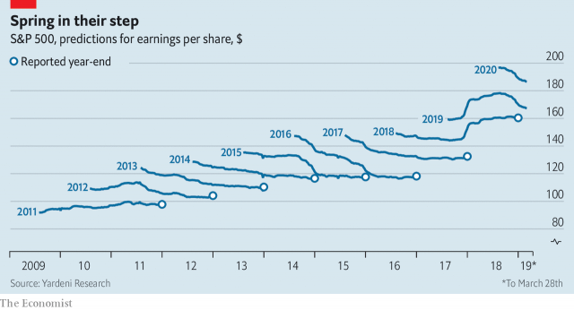

###### American companies

# Do spring profits foreshadow an earnings winter? 

##### Probably not 

 

> Apr 11th 2019 

SPRING IS ALL about growth. Not, it appears, for American bottom lines. As S&P 500 firms start reporting first-quarter results, FactSet, a data firm, estimates that their total earnings per share fell for the first time since 2016, by 4.2% year on year. Last year profits were fertilised by President Donald Trump’s tax giveaway. Now margins are shrinking and the world economy has slowed. After upward revisions a year ago, profit forecasters have been pruning rosy predictions for 2019 and 2020. Still, they are not expecting a prolonged earnings winter. Corporate America looks ever the hardy perennial. 

-- 

 单词注释:

1.foreshadow[fɒ:'ʃædәu]:vt. 成为前兆, 预示 

2.earning['ә:niŋ]:n. 收入（earn的现在分词） 

3.APR[]:[计] 替换通路再试器 

4.factset[]:[网络] 辉盛；研究系统公司；辉盛研究系统 

5.datum['deitәm]:n. 论据, 材料, 资料, 已知数 [医] 材料, 资料, 论据 

6.fertilise['f\\:tilaiz]:vt. 使肥沃, 施肥于, 使多产, 使丰富, 使受精 

7.giveaway['givә.wei]:n. 泄漏, 免费赠品 

8.forecaster['fɔ:kɑ:stә]:n. 预报员 

9.prune[pru:n]:n. 洋李, 李子干, 深紫红色, 傻瓜 vt. 修剪, 砍掉, 删除 vi. 删除, 删节 

10.rosy['rәuzi]:a. 蔷薇色的, 玫瑰红色的 

11.prediction[pri'dikʃәn]:n. 预言, 预报 [化] 预测 

12.prolong[prәu'lɒŋ]:vt. 延长, 拖延, 拖长 [化] 冷凝管 

13.corporate['kɒ:pәrit]:a. 社团的, 合伙的, 公司的 [经] 团体的, 法人的, 社团的 

14.hardy['hɑ:di]:a. 难的, 艰苦的, 坚硬的, 勇敢的 adv. 努力地, 辛苦地, 坚硬地 

15.perennial[pә'reniәl]:a. 常年的, 长期的, 反复的 [医] 多年生的 

