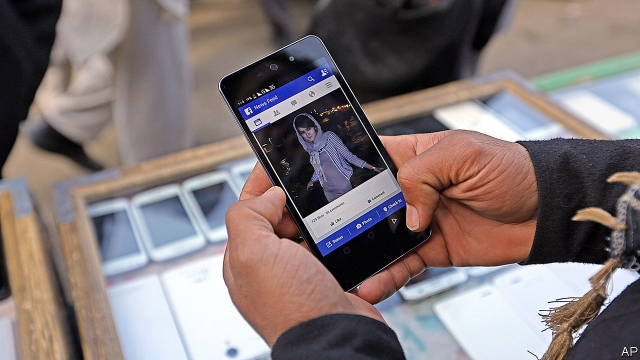

###### Social costs and benefits

# Facebook dominates Afghan e-commerce 

##### Recent changes to the social network’s newsfeed has made life harder for online retailers 

 

> Apr 11th 2019 

SAID SALIM, a 26-year-old entrepreneur in Kabul, Afghanistan’s mountain-fringed capital, recently opened his first shop. On the top floor of Dawoodzai mall, one of Kabul’s fanciest shopping destinations, he stands behind a counter stacked with his best-selling products: bottles of hair-loss lotion from Russia; posture-correcting devices from China; children’s toys from the United Arab Emirates. Missing, however, are customers. The real storefront for Mr Salim’s enterprise is Facebook. His “Global Online Shop” takes virtually all its orders over the internet. Its deliveries go out to customers by motorbike. 

Few Afghans surf the internet. Although mobile phones have spread rapidly—and enterprising firms have put up masts even in places beset by fighting between government forces and the Taliban—only one in ten Afghans uses them to access the web. At least in big cities, though, that is changing fast. Younger, more affluent Kabulis are addicted to their phones. In the absence of e-commerce giants such as Amazon or Alibaba, small online retailers, who import products in bulk and sell them on, have stepped in. Facebook, access to which mobile-phone operators throw in at no extra charge, has become the country’s premier internet bazaar. 

Online business in Afghanistan faces the same grievous problems as the offline sort. Security is the most obvious. Nemat Ullah, a business graduate who set up his shop “Smart Sales Online” in 2017, says that last year one of his delivery drivers was murdered and his packages stolen. Smaller obstacles add up, too. Drivers can spend hours searching for a customer in streets unencumbered by a system of addresses. Without trademarks, competition is vicious—a successful shop can expect a flurry of imitators, often selling cheaper, poorer-quality versions of its wares. 

The biggest problem of late has been Facebook itself. It is impossible to run an online store any other way, says Mr Ullah; other, unsubsidised mobile data is too pricey. But relying on Facebook means that to reach his potential customers he has to buy advertisements from it. Recently, as the social network has tried to reduce the clutter on its users’ feeds, the price of advertising has gone up. Mr Ullah complains that it currently costs him $10 to reach 1,000 customers. Previously, he could get to four times as many for that amount. His weekly advertising bill has soared. “I need a real shop,” he says. 

-- 

 单词注释:

1.facebook[]:n. 脸谱网 

2.Afghan['æfgæn]:a. 阿富汗的, 阿富汗人的 n. 阿富汗人, 阿富汗语, 阿富汗毛毯 

3.newsfeed[]:新闻供应 

4.online[]:[计] 联机 

5.retailer['ri:teilә]:n. 零售商人, 传播的人 [经] 零售商 

6.APR[]:[计] 替换通路再试器 

7.Salim[]:n. 萨利姆（非盟达尔富尔特使）；沙林（男子名）；三林集团（印尼企业名） 

8.entrepreneur[.ɒntrәprә'nә:]:n. 企业家, 主办人 [经] 承包商, 企业家 

9.Kabul['kɑ:bәl]:n. 喀布尔(阿富汗首都) 

10.mall[mɔ:l]:n. 林荫路 

11.lotion['lәuʃәn]:n. 洗液 [化] 洗剂 

12.emirate[e'miәrit]:n. 埃米尔的地位, 酋长国 

13.storefront['stɒ:frʌnt]:n. 店面 

14.online[]:[计] 联机 

15.Afghan['æfgæn]:a. 阿富汗的, 阿富汗人的 n. 阿富汗人, 阿富汗语, 阿富汗毛毯 

16.surf[sә:f]:n. 海浪, 拍岸浪 vi. 作冲浪运动 

17.enterprising['entәpraiziŋ]:a. 有魄力的, 有进取心的, 有事业心的 

18.mast[mɑ:st]:n. 桅, 桅杆, 杆 vt. 装桅杆于 

19.beset[bi'set]:vt. 围绕, 使苦恼, 镶嵌 

20.addict[ә'dikt]:vt. 使沉溺, 使上瘾 n. 入迷的人, 上瘾者 

21.amazon['æmәzɒn]:n. 亚马孙河 [医] 无乳腺者 

22.alibaba[]:n. 阿里巴巴（公司名） 

23.bazaar[bә'zɑ:]:n. 集市, 市场, 义卖市场 

24.Afghanistan[æf'gænistæn]:n. 阿富汗 

25.grievous['gri:vәs]:a. 痛苦的, 严重的, 充满悲伤的 [法] 极大的, 严重的, 惨无人道的 

26.offline[]:[计] 挂线, 脱机 

27.Nemat[]:[网络] 线虫 

28.ullah[]:[网络] 隐身 

29.unencumbered['ʌnin'kʌmbәd]:a. 没有阻碍的, 不受妨碍的, 没有负担的, 没有家累的, 没有子女的 

30.trademark['treidmɑ:k]:n. 商标 [法] 商标 

31.flurry['flә:ri]:n. 疾风, 飓风, 慌张 vt. 使恐慌, 使激动 vi. 慌张 

32.imitator['imi,teitә]:n. 模仿者, 临摹者, 仿造者, 伪造者 [计] 模拟, 模拟程序, 模拟器 

33.ware[wєә]:n. 物品, 器具, 货物, 商品, 陶器 vt. 留心, 小心 a. 知道的, 意识到的, 留神的 

34.unsubsidised[]:[网络] 未受资助的 

35.datum['deitәm]:n. 论据, 材料, 资料, 已知数 [医] 材料, 资料, 论据 

36.pricey['praisi]:a. 昂贵的, 价格高的 

37.clutter['klʌtә]:n. 杂乱 vt. 弄乱, 使凌乱 

38.advertising['ædvәtaiziŋ]:n. 广告业, 广告 a. 广告的 [计] 发广告 

39.currently['kʌrәntli]:adv. 现在, 当前, 一般, 普通 [计] 当前 

40.soar[sɒ:]:n. 高扬, 翱翔 vi. 往上飞舞, 高耸, 翱翔 

