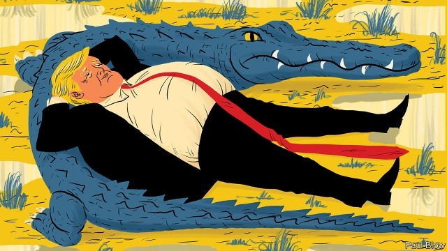
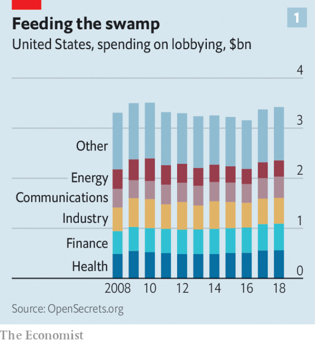
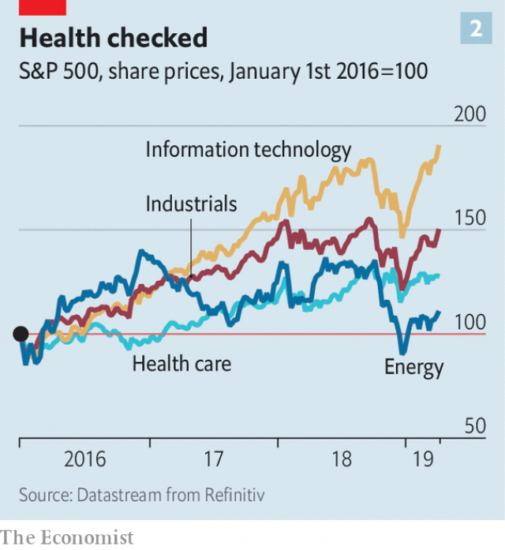

###### The influence business

# Lobbying in Donald Trump’s Washington 

##### Advancing corporate America’s interests is no easier under the CEO president 

 

> Apr 11th 2019 

SINCE DONALD TRUMP was elected president, received wisdom has it, big business has run rampant in Washington, DC. The chief-executive-in-chief has filled his cabinet with fellow plutocrats, executives and, horrors, lobbyists. One who used to represent the coal industry runs the Environmental Protection Agency (EPA). The acting interior secretary, David Bernhardt, risks so many potential conflicts of interest from his previous life lobbying for energy and natural-resources firms that he carries around a card listing all 22 of them. Last year businesses spent more than $3.4bn advancing their interests in the halls of government, 8.5% more than before the self-styled “CEO president” took office (see chart 1). The health-care, finance and industrial sectors each splurged over $500m. 

Yet these sums may reflect not how easy life is for corporate America in Mr Trump’s Washington, but how difficult. The Chamber of Commerce, which has had the ear of every president, has successfully championed massive corporate-tax cuts but failed to dissuade the president from imposing tariffs and curbing immigration. Big Pharma, which had managed to raise drug prices regardless of which party controlled the White House, is being pressed by Mr Trump to lower them. Big Tech has three firms among the ten biggest spenders on lobbying—Alphabet, Facebook and Amazon—but few friends in Washington, not least because Silicon Valley has been critical of the president, often vocally so. 

An interrogation of data and, mostly on the condition of anonymity, of lobbyists from across the political spectrum confirms that advancing corporate interests in Mr Trump’s Washington is no easier than under previous presidents. In some ways, it has got harder. And its results, gauged by firms’ stockmarket performance, are ambiguous. Tax cuts have helped fuel a bull market in equities. But health care, which spends more than any other industry, has lagged behind (see chart 2). 

 

One reason is that there is more to lobbying than buttering up the administration. As one veteran lobbyist notes, “80% of what business cares about is in the ambit of Congress.” Lawmakers, meanwhile, have grown charier of business folk. And not just left-leaning Democratic representatives swept onto Capitol Hill in November’s mid-term elections; high drug prices have so angered ordinary Americans that even previously reliable Republican allies in Congress can no longer protect pharmaceutical firms. Tech firms are out of favour on both sides of the aisle. Gone are the days when a well-connected fixer could have a discreet word with a committee chairman and make a client’s problem go away. Social media mean no more “quiet issues”, says Tony Fratto, a former senior official in George W. Bush’s administration and now an adviser at Hamilton Place Strategies. 

More counterintuitively, currying favour with Mr Trump’s supposedly business-friendly administration is no picnic, either. Lobbyists cite four main reasons. 

First, the president is an outsider. “Trump owes nothing to us,” explains one of Big Pharma’s top lobbyists. Nor do many of his appointees. Mr Trump rejected experienced Republicans who had not supported his candidacy, confides a senior financial lobbyist whose paymaster is an ardent Trump supporter. As a result, his administration is full of unknown entities. 

Many, it is true, are business-friendly, especially compared with Barack Obama’s big-government-loving lieutenants. But, and this is lobbyists’ second headache, this must be weighed against the Trump bureaucracy’s inefficiency. People are promoted for fealty to Mr Trump, not competence, which puts off many Republican technocrats; two years into the president’s term, a record number of jobs across the executive branch remain unfilled. “You don’t take every issue to the White House,” notes Thomas Donahue, the long-serving head of the Chamber of Commerce. On most, lobbyists must try to win over other officials. The top lobbyist for a big technology firm struggles to find out who is working on given issues and how to reach them to build connections. Sometimes, he says, it is difficult to tell if anyone is working on them at all. James Connaughton, a senior environmental official in George W. Bush’s administration, calls Mr Trump’s unceremonious rollback of environmental rules “not deregulation but non-regulation”. Anarchy is bad for business. 

 

Third, respectable businesses promoting their legitimate interests worry about being sullied by association with Mr Trump’s entourage, or his views. His campaign manager and personal lawyer have been sentenced to prison terms. The president himself is under investigation for alleged campaign-finance violations. A veteran lobbyist turned unregistered influencer is convinced that “everything will be investigated at some point”. She makes sure all her contacts with government are above board. 

Mr Trump’s opinions, meanwhile, do not necessarily reflect the interests of corporations. His anti-environmentalism has helped some polluters, particularly in his beloved coal industry, but provoked unease among big firms. Carmakers and large utilities both oppose laxer rules, which could backfire. A conservative lobbyist takes pains to distinguish his blue-chip clients from small-time coal firms seeking cronyistic carve-outs from the EPA. Several corporate-advisory councils to Mr Trump’s administration disbanded in the wake of his refusal to condemn white supremacists. Get close to the president, sums up Mr Fratto, and “you take on all of the baggage of Trump”. 

Finally, the intrigue of the Trump White House would baffle a Kremlinologist. A lobbyist for a leading private-equity firm warns that power there “shifts around very quickly”. Boutique lobbying shops have mushroomed, as under every new president. These claim to offer access, observes a former Republican heavyweight turned lobbyist, “but lack substance”. In any case, only a handful of Mr Trump’s closest advisers carry any clout with their boss. Chief among them is Jared Kushner, his son-in-law, whom one lobbyist describes as “the last guy to put the president to bed”. Even so, Mr Trump can catch out top aides with tweets born of gut feelings. “How do you lobby Trump’s gut?” grumbles an environmental lobbyist with experience in the Clinton administration. 

Lobbyists are not short of ideas. Some use hyper-targeted advertising to reach the president as he watches Fox News or retreats to his Mar-a-Lago resort in Florida, according to a recent exposé by the Washingtonian, a magazine. T-Mobile, a telecoms firm, recently admitted to spending $195,000 at Mr Trump’s hotel near the White House, with executives reportedly sporting bright pink shirts emblazoned with the firm’s logo. Others advise clients to find a way to create jobs and to let the president take credit. A lobbyist for the lobbying industry warns that firms can no longer be too critical of the president, lest he unleash a withering tweet. But, he says, you can appeal to Mr Trump via Snapchat or Twitter. To reach the president, “you’ve got to make him the hero of your story,” counsels a seasoned Democratic lobbyist. 

Some bosses, for their part, are getting more personally involved with the president, risk to reputation notwithstanding. “Trump wants to hear directly from business leaders,” says a former adviser to the president, whose administration he calls “the most CEO-friendly” ever. A Democratic operative agrees, noting the difference between Mr Trump and Mr Obama’s posture of “we know what’s best for the American people”. A Republican member of one of Mr Trump’s disbanded CEO councils recalls how past administrations’ meetings with bosses “felt perfunctory”, whereas now “they seem to pay attention and seek company input”. When in late March Mr Trump addressed the Business Roundtable of America’s biggest firms, Jeff Bezos, boss of Amazon, joined for the first time, even though Mr Trump had mocked him on Twitter as Jeff Bozo. 

The “swamp” of Washington has not been drained, as Mr Trump implausibly pledged to do in his campaign. In some ways, concedes Anthony Scaramucci, a Trump loyalist who briefly served in his White House, it “has gotten extra swampier”—a state of affairs he blames on both Democrats and Republicans. Unregistered “strategic advisers” began replacing registered lobbyists, whose number has fallen from 14,000 to 11,500 in a decade, before Mr Trump came along. Sheila Krumholz, head of the Centre for Responsive Politics, an independent watchdog that monitors lobbying trends, worries about influence-peddlers “trading on only whom they know and not what they know”. Disclosure requirements remain weak and poorly enforced. Hyper-partisanship in Congress makes the House Democrats’ sweeping anti-corruption bill, which was passed in March and, among other things, would tighten rules on lobbying, unlikely to clear the Republican-controlled Senate. 

Swampier does not necessarily mean better for corporate America. It does, though, benefit the lobbying ecosystem’s endemic species, which thrive on chaos. Haley Barbour, a former governor of Mississippi, ex-chairman of the Republican National Committee and one of Washington’s most influential lobbyists, praises Mr Trump’s tax cuts and deregulation efforts. Even so, he warns, “the next reform might not be good for your firm, so you need somebody advocating your position to the White House.” A friendly swamp creature will be there to help. 

-- 

 单词注释:

1.lobby['lɒbi]:n. 大厅, 休息室, 游说议员者 vi. 游说议员, 游说 vt. 游说 

2.Washington['wɒʃiŋtn]:n. 华盛顿 

3.corporate['kɒ:pәrit]:a. 社团的, 合伙的, 公司的 [经] 团体的, 法人的, 社团的 

4.ceo[]:abbr. 首席执行官；执行总裁（chief executive officer） 

5.APR[]:[计] 替换通路再试器 

6.rampant['ræmpәnt]:a. 猖獗的, 蔓生的, 猛烈的, 跃立作扑击状的 

7.DC[]:直流电 [计] 数据单元, 数据中心, 数据代码, 数据通信, 数据控制, 数字控制, 直流 

8.plutocrat['plu:tәkræt]:n. 富豪, 财阀 

9.lobbyist['lɔbiist]:n. 说客 [法] 院外活动集团成员 

10.environmental[in.vaiәrәn'mentәl]:a. 周围的, 环境的 [经] 环境的, 环保的 

11.Epa[]:[经] 环保协会 

12.david['deivid]:n. 大卫；戴维（男子名） 

13.Bernhardt[]:n. (Bernhardt)人名；(罗)贝恩哈特；(法)贝纳尔；(英、德、西、瑞典、捷)伯恩哈特 

14.sector['sektә]:n. 扇形, 部门, 部分, 函数尺, 象限仪, 段, 区段 vt. 把...分成扇形 [计] 扇面; 扇区; 段; 区段 

15.splurge[splә:dʒ]:n. 炫耀, 夸示 vi. 炫耀, 卖弄, 挥霍 vt. 挥霍 

16.dissuade[di'sweid]:vt. 劝阻 [法] 劝阻, 劝止 

17.tariff['tærif]:n. 关税, 关税表, 价格表, 收费表 vt. 课以关税 [计] 价目表 

18.curb[kә:b]:n. 抑制, 勒马绳, 边石 vt. 抑制, 束缚, 勒住 

19.pharma[]:n. 制药公司 

20.tech[tek]:n. 技术学院或学校 

21.spender['spendә]:n. 挥霍者, 挥金如土的人 [法] 挥金如土者, 挥霍钱财者 

22.facebook[]:n. 脸谱网 

23.silicon['silikәn]:n. 硅 [化] 硅Si 

24.vocally['vәukli]:adv. 用声音, 用口头 

25.interrogation[in.terәu'geiʃәn]:n. 审问, 疑问句, 问号 [电] 询问 

26.datum['deitәm]:n. 论据, 材料, 资料, 已知数 [医] 材料, 资料, 论据 

27.anonymity[.ænә'nimiti]:n. 匿名, 姓氏不明 [计] 匿名信件 

28.spectrum['spektrәm]:n. 光谱, 范围, 系列 [化] 光谱 

29.stockmarket[s'tɒkmɑ:kɪt]: 证券市场; 证券交易所; 证券行情 

30.equity['ekwiti]:n. 公平, 公正 [经] 权益, 产权 

31.ambit['æmbit]:n. 周围, 范围, 界限, 领域 

32.lawmaker[lɒ:'meikә]:n. 立法者 

33.charier[ˊtʃєәriә]:谨慎的,吝啬的,害羞的,吹毛求疵的,chary的比较级 

34.Capitol['kæpitl]:n. 国会大厦, 州议会大厦, 朱比特神庙 

35.ally['ælai. ә'lai]:n. 同盟者, 同盟国, 助手 vt. 使联盟, 使联合, 使有关系 vi. 结盟 

36.pharmaceutical[,fɑ:mә'sju:tikәl]:a. 药学的, 制药的, 药用的, 药物的, 药剂师的, 药师的 n. 药品, 成药, 药剂 

37.aisle[ail]:n. 走廊, 侧廊, 过道 [机] 走道 

38.fixer['fiksә]:n. 定色剂, 定影剂, 毒贩子 [化] 定影剂; 定香剂; 固色剂; 固着剂; 固定剂 

39.discreet[dis'kri:t]:a. 小心的, 慎重的 

40.tony['tәuni]:a. 高贵的, 时髦的 

41.fratto[]:[网络] 弗兰托 

42.george[dʒɔ:dʒ]:n. 乔治（男子名）；自动操纵装置；英国最高勋爵勋章上的圣乔治诛龙图 

43.W['dʌb(ә)lju:]:[计] 等待, 写, 字 [医] 钨(74号元素) 

44.adviser[әd'vaizә]:n. 顾问, 劝告者, 指导教师 [法] 顾问, 劝告者 

45.hamilton['hæmiltәn]:n. 汉密尔顿（男子名）；哈密尔顿（美国城市名） 

46.counterintuitively[]:反常识地 

47.curry['kʌri. 'kә:ri]:n. 咖哩粉, 咖哩饭菜 vt. 用咖哩粉调味, 用马梳梳, 制革 

48.supposedly[sә'pәuzidli]:adv. 想象上, 看上去像, 被认为是, 恐怕, 按照推测 

49.cite[sait]:vt. 引用, 引证, 表彰 [建] 引证, 指引 

50.outsider[' aut'saidә]:n. 外人, 局外人, 非会员, 外行, 门外汉, 比赛中获胜可能性不大的选手 [经] 外船公司 

51.appointee[ә.pɒin'ti:]:n. 被任命者 [法] 被指定的人, 被任命者 

52.candidacy['kændidәsi]:n. 候选人的地位, 候选资格 [法] 候选人的身份, 资格 

53.confide[kәn'faid]:vt. 吐露, 委托 vi. 信赖 

54.paymaster['pei,mɑ:stә]:n. 出纳员, 军需官 [经] 出纳员, 军需机 

55.ardent['ɑ:dnt]:a. 热心的, 激动的, 燃烧般的 [医] 灼热的; 热心的 

56.supporter[sә'pɒ:tә]:n. 支持者, 后盾, 迫随者, 护身织物 [法] 支持者, 赡养者, 抚养者 

57.entity['entiti]:n. 实体, 实存物, 存在 [计] 实体 

58.barack[bɑ:'ræk]:n. 巴拉克（男子名） 

59.inefficiency[.ini'fiʃәnsi]:n. 无效率, 无能 [化] 效率低; 效率差 

60.fealty['fi:әlti]:n. 忠诚, 忠贞, 忠实 

61.technocrat['teknәukræt]:n. 技术专家治国论者, 技术专家统治论者 

62.unfilled['ʌn'fild]:a. 未填充的, 空的 

63.thoma[]:n. (Thoma)人名；(阿尔巴、阿拉伯)索玛；(英、德、罗、匈、捷、塞、瑞典)托马 

64.donahue[]:n. (Donahue)人名；(英)多纳休 

65.jame[]: 灰岩井 

66.connaughton[]: [人名] 康诺顿 

67.environmental[in.vaiәrәn'mentәl]:a. 周围的, 环境的 [经] 环境的, 环保的 

68.unceremonious['ʌn.seri'mәuniәs]:a. 不拘礼节的, 随便的, 无礼貌的 

69.rollback['rәulbæk]:n. 回降, 卷回, 推回去 [电] 滚返 

70.deregulation[di:.regju'leiʃәn]:n. 撤消(价格等的)管制规定, 解除控制 

71.anarchy['ænәki]:n. 无政府状态, 政治混乱 [法] 混乱, 无秩序, 无政府状态 

72.respectable[ri'spektәbl]:a. 值得尊重的, 人格高尚的, 相当数量的 n. 品格高尚的人 

73.legitimate[li'dʒitimәt]:a. 合法的, 正当的, 婚生的 vt. 认为正当, 立为嫡嗣, 使合法 

74.sully['sʌli]:vt. 玷污, 弄脏 n. 污点, 脏污 

75.entourage[,ɔntu'rɑ:ʒ]:n. 全体随行人员, 陪同人员 

76.allege[ә'ledʒ]:vt. 宣称, 主张, 提出, 断言 [法] 断言, 指称, 指证 

77.violation[.vaiә'leiʃәn]:n. 违反, 违背, 妨碍 [法] 违犯, 违背, 违反 

78.unregistered[ʌn'redʒistәd]:[法] 未登记的, 未注册的 

79.influencer[]:n. 影响者 

80.polluter[]:n. 污染者, 污染物质 

81.provoke[prә'vәuk]:vt. 激怒, 惹起, 诱导 [法] 刺激, 煽动, 激怒 

82.unease[.ʌn'i:z]:n. 不安 

83.carmaker['kɑ:,meikә(r)]:n. 汽车制造商 

84.laxe[]:[网络] 长；莱加内斯；林子豪 

85.backfire[.bæk'faiә]:n. 逆火, 回火, 放火 vi. 放逆火, 预先放火, 发生意外 

86.client['klaiәnt]:n. 客户, 顾客, 委托人 [计] 客户, 客户机, 客户机程序 

87.cronyistic[]:[网络] 裙带裙 

88.disband[dis'bænd]:vt. 解散, 遣散 vi. 被解散 

89.supremacist[sә'premәsist, sju-]:n. 至上主义者 

90.intrigue[in'tri:g]:n. 阴谋, 复杂的事 vi. 密谋, 私通 vt. 激起...的兴趣, 用诡计取得 

91.baffle['bæfl]:vt. 困惑, 为难, 使挫折 vi. 徒作挣扎 n. 迷惑, 挡板 

92.kremlinologist[.kremli'nɒlәdʒist]:n. 苏俄政体研究者 

93.quickly['kwikli]:adv. 很快地 

94.boutique[bu:'ti:k]:n. 专卖流行衣服的小商店 

95.heavyweight['heviweit]:n. 重量级拳击运动员, (非正式)有影响的要人 a. 最重量级的 

96.clout[klaut]:n. 敲击, 破布 vt. 打补钉 

97.jare[]:abbr. Japanese Antarctic Research Expedition 日本南极科学考察队 

98.kushner[]: [人名] 库什纳 

99.aide[eid]:n. 助手, 副官 [计] 数据输入的可说明性 

100.tweet[twi:t]:vi. 啁啾 n. 小鸟叫声 

101.gut[gʌt]:n. 剧情, 内容, 内脏, 肚子, 海峡, 勇气 vt. 取出内脏, 毁坏...的内部 

102.grumble['grʌmbl]:n. 怨言, 满腹牢骚 vi. 抱怨, 发牢骚, 发隆隆声 vt. 抱怨 

103.clinton['klintәn]:n. 克林顿（男子名） 

104.advertising['ædvәtaiziŋ]:n. 广告业, 广告 a. 广告的 [计] 发广告 

105.Florida['flɒridә]:n. 佛罗里达州 

106.Washingtonian[,wɔʃiŋ'tәuniәn]:a. 华盛顿市的 

107.telecom['telәkɔm]:telecommunication 电信 

108.reportedly[ri'pɒ:tidli]:adv. 根据传说, 根据传闻, 据报道 

109.emblazon[im'bleizn]:vt. 用纹章装饰, 盛饰, 颂扬 

110.logo['lәugәu]:n. 连合活字, 商标, 徽标 [计] 徽标 

111.unleash[.ʌn'li:ʃ]:vt. 解开...的皮带, 发出, 发动 

112.wither['wiðә]:vt. 使凋谢, 使消亡, 使畏缩 vi. 枯萎, 衰退 

113.Snapchat[]:[网络] 图片分享；阅后即焚；刷机教程 

114.twitter['twitә]:n. 啁啾, 唧唧喳喳声 vi. 啭, 啁啾, 颤抖 vt. 嘁嘁喳喳地讲, 抖动 

115.counsel['kaunsәl]:n. 商议, 忠告, 法律顾问 v. 商议, 劝告 

116.notwithstanding[.nɒtwiθ'stændiŋ]:adv. 虽然, 尽管 prep. 尽管 conj. 虽然 

117.operative['ɒpәrәtiv]:a. 动作的, 运转的, 有效的, 关键的, 手术的 n. 技工, 侦探 

118.posture['pɒstʃә]:n. 姿势, 态度, 情形, 形势 vt. 作...的姿势 vi. 作姿势 

119.perfunctory[pә'fʌŋktәri]:a. 敷衍的, 随随便便的, 得过且过的 

120.roundtable[]:a. 圆桌的, 圆台 

121.jeff[dʒef]:n. 杰夫（男子名, 等于Jeffrey） 

122.bezos[]:贝索斯（人名） 

123.amazon['æmәzɒn]:n. 亚马孙河 [医] 无乳腺者 

124.mock[mɒk]:n. 嘲笑, 戏弄, 模仿 a. 假的, 伪造的, 模拟的 adv. 虚伪地 vt. 嘲弄, 模仿, 使失望, 欺骗, 挫败 vi. 嘲弄 

125.bozo['bәuzәu]:n. 家伙, 新兵, 大汉 

126.implausibly[im'plɔ:zəbli]:adv. 难以置信地 

127.pledge[pledʒ]:n. 诺言, 保证, 誓言, 抵押, 信物, 保人, 祝愿 vt. 许诺, 保证, 使发誓, 抵押, 典当, 举杯祝...健康 

128.concede[kәn'si:d]:vt. 承认, 退让 vi. 让步 

129.anthony['æntәni]:n. 安东尼（人名） 

130.loyalist['lɒiәlist]:n. 忠诚的人, 反对独立者, 反佛朗哥派的人 

131.briefly['brifli]:adv. 简短地, 扼要地, 简明地, 简单地 

132.democrat['demәkræt]:n. 民主人士, 民主主义者, 民主党党员 [经] 民主党 

133.unregistered[ʌn'redʒistәd]:[法] 未登记的, 未注册的 

134.sheila['ʃi:lә]:n. 姑娘, 小姐 

135.krumholz[]:[网络] 克鲁姆霍尔茨 

136.responsive[ri'spɒnsiv]:a. 回答的, 应答的, 易感应的 

137.politic['pɒlitik]:a. 精明的, 明智的, 策略的 

138.watchdog['wɒtʃdɒg]:n. 看门狗, 监察人 [化] 监控设备; 监视器 

139.disclosure[dis'klәuʒә]:n. 揭发, 泄露, 揭发(或暴露)的事实 [经] 揭示, 披露 

140.poorly['puәli]:adv. 贫穷地, 不充分地, 贫乏地 a. 身体不舒服的 

141.tighten['taitn]:vt. 勒紧, 使变紧 vi. 变紧, 绷紧 

142.swampier[ˈswɔmpɪə]:a. 沼泽的( swampy的比较级 ); 似沼泽的, 软而湿的 

143.endemic[en'demik]:n. 地方病 a. 某地(或某些人中)流行的, 地方的 

144.specie['spi:ʃi]:n. 硬币 [经] 硬币 

145.chao[]:n. 钞（货币） 

146.haley[]:n. 哈利（人名） 

147.barbour[]:n. 巴伯衫（商标名称） 

148.Mississippi[.misi'sipi]:n. 密西西比河, 密西西比州 

