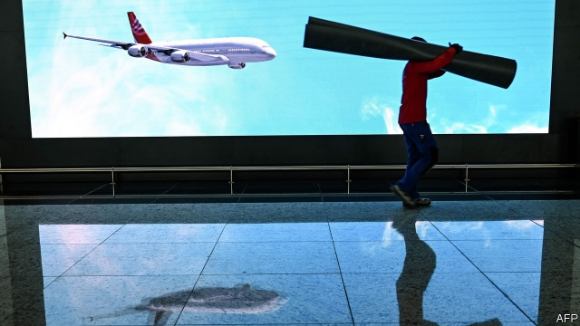
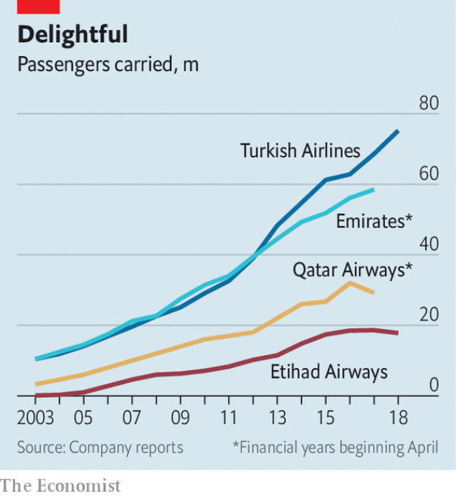

###### Flying high

# Turkish Airlines takes on Emirates, Etihad and Qatar Airways 

##### A new mega-airport poses the biggest threat yet to the Gulf carriers 

 

> Apr 11th 2019 

AIRPORT MEGAPROJECTS are ten a penny these days. China is building Beijing Daxing International Airport, a new hub airport near its capital, with a total capacity up to 100m passengers a year. Construction has begun on a vast new airport for Dubai, which its government hopes will eventually draw 130m flyers annually. Abu Dhabi and Qatar plan to erect cavernous new terminals. Yet perhaps none is as ambitious as Istanbul’s New Airport, on Europe’s eastern fringe in Turkey. It became fully operational on April 6th, and aims not just to impress visitors but also to help the country’s flag carrier, Turkish Airlines, wrest the skies from its successful Gulf rivals. 

It is easy to dismiss the endeavour as a white elephant erected by Turkey’s sultan-like president, Recep Tayyip Erdogan. Everything about it is huge. Turkish, which is by far the new airport’s biggest user, had to move 10,000 pieces of equipment weighing over 47,000 tonnes 40km (25 miles) from its old home at Ataturk airport. In less than five years a forested valley the size of Manhattan has been transformed into a facility with enough room for 3,000 flights a day carrying 90m flyers a year. That could make it one of the world’s largest airports by international passenger numbers. If all goes to plan, by 2028 the airport will have six runways and capacity for 200m passengers a year. 

Its $11bn price tag, too, is gargantuan, especially when Turkey’s economy is shrinking and inflation is more than 20%. Delays and cost overruns forced the grand opening to be postponed by six months. In the rush to get the airport finished at least 52 builders have died, sparking protests. 

Foreign airline executives see more than a prestige project, however. Compared with many of those in the Gulf, this one presents a sounder business case, thinks Mark Martin, an aviation consultant based in Dubai. Turkish is growing at an annual rate of 30%, unlike its Gulf rivals, whose expansion has stalled or gone into reverse (see chart). While it was fast running out of room at Ataturk airport, the threat it posed was limited. No longer. 

 

Over the past decade the Gulf’s three biggest carriers—Emirates of Dubai, Etihad of Abu Dhabi and Qatar Airways—redefined air travel. Most international carriers transport passengers to and from the airlines’ home countries. Emirates, Etihad and Qatar used their “super-connector” home bases as places where flyers changed planes en route to elsewhere. The focus on higher-margin long-haul routes allowed them to charge less for superior service, luring passengers away from hub airports in America and Europe, and from the Western airlines that use them. 

Now they risk being disrupted in turn by Turkish. The new airport is designed to turn Turkish into a fully fledged super-connecting airline. Fees that airlines, including Turkish, are charged for every passenger favour those in transit over those who start or end their journey there. Kadri Samsunlu, chairman of IGA, the new airport’s operator, also says that its shopping areas were designed to be more attractive even than Dubai’s and Qatar’s. 

The falling value of Turkey’s currency has also proved beneficial. Analysts at CAPA, an aviation consultancy, calculate that Turkish earns 14% of its revenue in Turkish lira, but incurs 26% of its expenses in the currency. A weaker lira therefore lets it undercut rivals in the Gulf, which do not enjoy a similar advantage. 

Finally, Istanbul is helped by its proximity to Europe. Turkish can use smaller narrow-body aeroplanes, which are cheaper to operate, on its routes to Europe. The Gulf carriers have to use bigger, more expensive wide-body jets that are great for long-haul flights but less efficient for middling distances. Smaller aircraft, including long-haul ones, allow Turkish to offer more flights to most destinations each day. Business travellers are willing to pay a premium for such flexibility. 

The Gulf carriers are not giving up without a fight. In February Emirates cancelled most of its remaining orders for the Airbus A380 super-jumbo, the world’s biggest passenger plane, in favour of smaller models. Sir Tim Clark, the president of Emirates, hopes that a partnership with flydubai, another Emirati airline that flies only narrow-body jets, will help it to preserve market share. If imitation is the sincerest form of flattery, Gulf carriers are reciprocating Turkish’s earlier compliments. 

-- 

 单词注释:

1.Turkish['tә:kiʃ]:n. 土耳其语 a. 土耳其的, 土耳其人的, 土耳其语的 

2.emirate[e'miәrit]:n. 埃米尔的地位, 酋长国 

3.Etihad[]:[网络] 阿提哈德航空；阿提哈德航空公司；阿联酋联合航空 

4.Qatar['kɑ:tәr]:n. 卡塔尔 

5.airway['єәwei]:n. 空中航线, 风道 [医] 导气管 

6.APR[]:[计] 替换通路再试器 

7.megaproject[me'ɡæprədʒekt]:n. 特大工程, 特大项目 

8.hub[hʌb]:n. 毂, 木片, 中心 [计] 插座; 插孔; 集线器, 集中器, 连接器, 中继站 

9.dubai['dju:bai]:n. 迪拜（阿拉伯联合酋长国的酋长国之一）；迪拜港（阿拉伯联合酋长国港市） 

10.flyer['flaiә]:n. 飞鸟, 飞行物, 飞行员, 快车, 传单, 飞跳 [经] 投机买卖, 孤注一掷, (广告)传单 

11.annually['ænjuәli]:adv. 一年一次, 每年 [经] 年度的, 每年的 

12.abu[]:abbr. 亚洲广播联盟（Asian Broadcast Union） 

13.cavernous['kævәnәs]:a. 似巨穴的 [医] 空洞的 

14.ambitious[æm'biʃәs]:a. 有野心的, 抱负不凡的, 雄心勃勃的 

15.fringe[frindʒ]:n. 边缘, 端, 流苏, 穗, 初步 vt. 加穗于, 加饰边于 a. 边缘的, 附加的 

16.fully['fuli]:adv. 十分地, 完全地, 充分地 

17.wrest[rest]:n. 扭, 拧 vt. 夺取, 猛扭, 歪曲, 费力取得 

18.endeavour[in'devә]:n. 努力, 力图, 尽力 vi. 努力, 力图, 尽力 

19.recep[]:n. (Recep)人名；(土)雷杰普 

20.tayyip[]:[网络] 塔伊普 

21.erdogan[]:[网络] 埃尔多安；土耳其总理埃尔多安；艾尔多安 

22.tonne[tʌn]:n. 吨, 公吨 [经] 吨 

23.Ataturk[]:阿塔图尔克（人名） 

24.les[lei]:abbr. 发射脱离系统（Launch Escape System） 

25.Manhattan[mæn'hætәn]:n. 曼哈顿 

26.runway['rʌnwei]:n. 跑道, 河床, 过道 [化] 单轨架空道; 吊车道 

27.gargantuan[gɑ:'gæntʃuәn]:a. 巨大的, 庞大的 

28.inflation[in'fleiʃәn]:n. 胀大, 夸张, 通货膨胀 [化] 充气吹胀; 膨胀 

29.overrun[.әuvә'rʌn]:n. 蔓延, 风行一时, 超过限度 vt. 蔓延, 蹂躏, 超过, 泛滥 vi. 泛滥, 超载限度 [计] 超限 

30.builder['bildә]:n. 建立者 [机] 组份 

31.prestige[pre'sti:ʒ]:n. 声望, 威望, 威信 [经] 商誉, 声誉 

32.Martin['mɑ:tin]:n. 马丁, 圣马丁鸟 

33.stall[stɒ:l]:n. 厩, 停车处, 牧师职位, 货摊, 托辞, 拖延 vt. 关入厩, 停顿, 推托, 支吾, 使陷于泥中 vi. 被关在厩内, 陷于泥中, 停止, 支吾 

34.en[en]:n. 字母N, (铅字)半方 prep. 在...中, 作为 

35.lure[luә]:n. 饵, 诱惑 vt. 引诱, 诱惑 

36.disrupt[dis'rʌpt]:a. 分裂的, 中断的 vt. 使分裂, 使瓦解 

37.fledge[fledʒ]:vt. 喂养, 用羽毛盖上, 装上羽毛 vi. 长羽毛 

38.transit['trænsit]:n. 经过, 通行, 运输, 运输线, 转变 vt. 运送, 使通过, 经过 vi. 通过 

39.kadri[]:[网络] 卡德里 

40.iga[]:abbr. integrating gyro (scope) accelerometer 综合回转（范围）加速计 

41.analyst['ænәlist]:n. 分析者, 精神分析学家 [化] 分析员; 化验员 

42.capa[]:n. 斗牛士的红色斗篷 

43.consultancy[]:n. 商量, 协商, 磋商, 会诊, 与...商量, 咨询, 请教, 找(医生)看病, 查阅, 考虑 [经] 咨询业务, 咨询服务 

44.lira['liәrә]:n. 里拉 

45.incur[in'kә:]:vt. 招致, 蒙受, 遭遇 [经] 招致, 蒙受, 担负 

46.undercut['ʌndәkʌt]:n. 底切, 牛腰部下侧嫩肉, 下口, 下旋削球 vt. 廉价出售, 底切, 雕出, 下旋削球 vi. 切除底部 

47.Istanbul[.istæn'bu:l]:n. 伊斯坦布尔 

48.proximity[prɒk'simiti]:n. 接近, 亲近 

49.middling['midliŋ]:a. 中等的, 普通的, 平凡的 adv. 中等 

50.traveller['trævlә]:n. 旅行者 [经] 旅行商 

51.premium['pri:miәm]:n. 额外补贴, 奖金, 奖赏, 保险费 [医] 保险费 

52.flexibility[.fleksi'biliti]:n. 弹性, 适应性 [计] 灵活性; 适应性 

53.airbus['eәbʌs]:空中客车 

54.tim[tim]:n. 蒂姆（男子名） 

55.clark[]:n. 克拉克（男子名） 

56.partnership['pɑ:tnәʃip]:n. 合伙, 合股, 合作关系 [经] 合伙(合作)关系, 全体合伙人 

57.Emirati[]:n. (Emirati)人名；(意)埃米拉蒂 

58.imitation[.imi'teiʃәn]:n. 模仿, 效法, 冒充, 赝品 [医] 模仿, 仿制, 仿制品 

59.flattery['flætәri]:n. 谄媚, 阿谀, 巴结 

60.reciprocate[ri'siprәkeit]:vt. 回报, 互换, 交换, 报答, 使往复运动 vi. 往复运动, 回报, 互换, 酬答 

61.compliment['kɒmplimәnt]:n. 称赞, 恭维, 敬意 vt. 称赞, 褒扬, 恭维 

