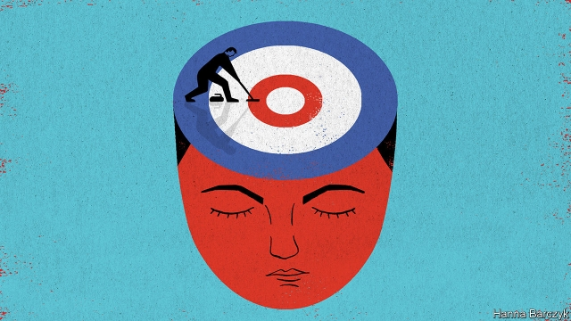

###### Chaguan

# Need a metaphor for a rising China? Try its national curling squad 

##### It helps that the sport is seen in China as a chess-like activity for brainy folk 

 

> Apr 11th 2019 

IN THE PAST athletes in China had a particular image problem, reports Lei Yi, a sports official. Almost universally, she regrets to say, people thought that sports were for strong, fit people who “don’t have a brain”. Happily, views have changed. Specifically, says Ms Lei, sports are seen as a way to teach young Chinese useful lessons about working hard, believing in themselves and in their team, and not giving up easily. 

If Ms Lei’s case for sports sounds a little light on fun and heavy on improving virtues, she has an excuse. She is a team leader from China’s General Administration of Sport, and has less than four years to prepare a dozen perfectly trained athletes for the Beijing Winter Olympics in 2022. Her domain is curling, a team game played on ice that was almost unknown in China 20 years ago. Almost five centuries after matches were first recorded on the frozen ponds of Scotland and the Low Countries, curling has been declared a sport that plays to China’s strengths. 

Curling is a bit like lawn bowls, except played on ice with a lump of polished granite that can, as it glides, have its trajectory altered by team-mates madly scrubbing the ice in its path. The stone’s squat shape gives the sport its Chinese name of binghu, or “ice kettle”. The central authorities and local governments are building curling rinks from Tianjin on the coast to Xining on the Tibetan plateau. They eventually hope to build them in every province, says Ms Lei. During the Winter Olympics in 2022 a swimming arena from the Beijing games of 2008, the Water Cube, will host curling matches as the Ice Cube. 

Kate Caithness, president of the World Curling Federation, the governing body based in Scotland, has become a frequent visitor to China. She found officials drawn to curling’s reputation as “chess on ice”—a brainy sport best mastered by years of dogged practice. Ms Caithness watched as Beijing Sports University opened a college of curling last year, and as it promptly began scouring the student population for youngsters with the right mix of stamina and mental toughness to play the sport. 

The aim is to meet two distinct goals set by Xi Jinping, the country’s leader. At the elite level, China has a reasonable chance of winning Olympic medals in curling, says Ms Caithness. That would fulfil Mr Xi’s quest for grand sporting achievements, of a sort that would bring closer his “Chinese dream” of prosperity and national pride. At the amateur level, the game is accessible enough to help meet another of Mr Xi’s stated targets, namely to turn at least 300m Chinese into winter-sports enthusiasts. 

Just in case the squad that Ms Lei oversees was not feeling enough pressure, in February Mr Xi dropped in on their camp at the National Winter Sports Training Centre. “Strong sports make the country strong and a strong country makes sports strong,” he declared. The squad could be a metaphor for a rising China. It is part of a national programme for high performance in sports. The team comprises 60 curlers, ranging in age from 18 to 35. They live in a boarding house and practise, work out and take lessons in patriotism for six days a week. Their base is a sleek new complex of glass, concrete and painted metal beams in the heart of the former Shougang steelworks, an old state-owned factory that closed in 2011. Ice-skating and ice-hockey teams have their own camps nearby. To either side loom the rusting hulks of disused blast furnaces, wrapped in bulbous, elephantine pipework. 

Asked about curling’s appeal in China, Ms Lei notes that it is one of very few team sports in the Winter Olympics. That matters, because in Chinese culture “we always advocate that you need to put your country’s interest over your personal interest, and your team’s interest over your personal interest,” she says. She describes how, in curling, a skilful player may have to bow to the team’s interest and take a boringly safe shot, rather than “have a showtime” and try for personal glory. She describes an almost military chain of command, with the “skip” or captain at the top. 

If some sports reward individual creativity, even a touch of wildness, others favour discipline. Ms Lei says there is creativity in curling, but concedes that “discipline is more important”. Patience, too, is needed to endure three-hour games, and tournaments that could involve 33 hours on the ice, or “torture”, as Ms Lei cheerfully calls it. 

The junior game is a bit more joyful, as a visit to the Xuhui District Youth Sports School in Shanghai shows. In China winter sports are associated with the country’s bluff, hard-living north-east. But affluent Shanghai, as if eager to shed its business-obsessed, slightly effete image, has invested in three curling rinks since 2012. In all 1,500 students have signed up. It helps that curling is less dangerous than ice hockey and speed skating, says Zhou Wenjia, general secretary of the Shanghai Curling Association. “Shanghai parents are quite protective of their kids,” she explains. Her association assures anxious parents that sports will develop their children’s willpower, as well as their physical fitness. “I don’t know if it’s authoritative, but I have heard that Chinese and Jewish people have the highest IQs,” adds Ms Zhou, venturing that this gives Chinese players “quite the advantage”. 

On this spring evening dozens of teenagers wait to go on the ice. With national youth games coming up, they are practising six nights a week with their professional coach, Kim Ji-sun, who was skip of the South Korean women’s team at the Sochi Olympics in 2014. Tang Qinsheng, waiting for his grandson in the rink’s viewing gallery, credits team sports with making the 13-year-old more outgoing, as well as more organised about doing his homework between practices. He approves of curling, calling it “a refined sport”. 

To date Canada is the world’s curling superpower, with over a million regular players. China has a long way to go but—as in other areas—its ambitions already reveal a lot. 

-- 

 单词注释:

1.metaphor['metәfә]:n. 隐喻 

2.squad[skwɒd]:n. 班, 小队, 小集团 vt. 编成班 

3.brainy['breini]:a. 脑筋好的, 聪明的 

4.APR[]:[计] 替换通路再试器 

5.lei['leii:]:n. 花环 

6.yi[ji:]:n. 彝人；彝语 

7.universally[ju:ni'v\\:sәli]:adv. 宇宙, 全世界, 普遍, 一般, 普通, 全体, 一致, 通用, 万能, 广用, 广泛 

8.specifically[spi'sifikli]:adv. 特定地, 明确地, 按特性 

9.les[lei]:abbr. 发射脱离系统（Launch Escape System） 

10.domain[dәu'mein]:n. 领域, 领土, 产业, 范围 [计] 域, 区域, 支配命令 

11.granite['grænit]:n. 花岗岩 [化] 花岗岩 

12.trajectory[trә'dʒektri]:n. 轨道, 弹道, 轨线 [化] 轨道 

13.madly['mædli]:adv. 发狂地, 精神失常地, 愚蠢地 

14.scrub[skrʌb]:n. 用力擦洗, 矮树, 矮人, 渺小之物 vt. 用力擦洗, 擦掉, 摩擦 vi. 擦洗干净, 进行手臂消毒 a. 次等的, 矮小的, 非正规球队的, 临时凑合的 

15.squat[skwɒt]:n. 蹲, 窝 a. 蹲着的, 矮胖的 vi. 蹲下, 蹲坐, 蹲伏 vt. 使蹲下, 擅自占有 

16.rink[riŋk]:n. 溜冰场, 室内溜冰场 vi. 溜冰 

17.tianjin['tjɑ:n'dʒin]:n. 天津（中国一城市） 

18.Xining['ʃi:'niŋ]:西宁[青海省](旧译Sining或Hsining) 

19.Tibetan[ti'betn]:a. 西藏的 n. 藏语, 西藏人 

20.plateau[plæ'tәu]:n. 高地, 高原, (上升后的)稳定水平 [医] 高原, 平顶, 坪 

21.arena[ә'ri:nә]:n. 角斗场, 舞台, 场地 [医] 尿沉渣, 尿沙; 脑沙 

22.kate[keit]:n. 凯特（女子名, 等于Catherine） 

23.Caithness['keiθnes]:n. 凯思内斯郡（苏格兰草原郡名） 

24.federation[fedә'reiʃәn]:n. 联邦, 联合, 联盟 [法] 联邦, 联盟, 联邦政府 

25.promptly['prɒmptli]:adv. 敏捷地, 迅速地 

26.scour['skauә]:vt. 擦亮, 洗涤, 清洗, 冲刷成, 急速穿过 vi. 擦, 洗, 冲刷, 腹泻, 急速穿行 n. 擦, 洗, 腹泻, 洗涤剂 

27.stamina['stæminә]:n. 精力, 活力, 耐力, 雄蕊 [医] 耐力, 精力; 雄蕊 

28.toughness['tʌfnis]:n. 有粘性, 强硬, 强健 [化] 韧性 

29.elite[ei'li:t]:n. 精华, 精锐, 中坚分子 

30.quest[kwest]:n. 探索, 寻求, 调查 v. 寻找, 找, 追寻猎物 

31.enthusiast[in'θju:ziæst]:n. 热心家, 狂热者, 爱好者 

32.oversee[.әuvә'si:]:vt. 向下看, 了望, 监督, 偷看到 [法] 监察, 监督, 俯瞰 

33.curler['kә:lә]:n. 卷发的人, 卷发夹子 

34.patriotism['peitriәtizm]:n. 爱国心, 爱国精神, 爱国主义 

35.sleek[sli:k]:a. 光滑的, 油嘴滑舌的, 线条明快的, 圆滑的, 时髦的 vt. 使光滑, 掩盖 vi. 打扮漂亮, 滑动 

36.steelwork[]:n. 钢铁工程, 钢结构, 钢制品 [化] 钢结构 

37.loom[lu:m]:n. 织布机, 若隐若现的景象 vi. 朦胧地出现, 隐约可见, 可怕地出现 

38.hulk[hʌlk]:n. 船体, 笨重的船, 废然大物 

39.disused[]:a. 不用, 废弃 

40.bulbous['bʌlbәs]:a. 球茎的, 球茎状的, 由球茎生长的 [医] 球状的, 球的 

41.elephantine[.eli'fæntain]:a. 象的, 巨大的, 粗笨的 

42.pipework[ˈpaɪpwɜ:k]: 管道工程管（组） 

43.alway['ɔ:lwei]:adv. 永远；总是（等于always） 

44.skilful['skilful]:a. 灵巧的, 熟练的, 制作精巧的 

45.boringly[]:adv. 无趣地；沉闷地 

46.showtime['ʃәutaim]:n. 好戏上演；（电视等的）节目播放时间 

47.creativity[.kri:ei'tiviti]:n. 创造力, 创造性 

48.wildness['waildnis]:n. 野生, 野蛮, 粗暴 

49.concede[kәn'si:d]:vt. 承认, 退让 vi. 让步 

50.cheerfully['tʃiәfuli]:adv. 高高兴兴地 

51.xuhui[]:[网络] 徐汇区；徐家汇；上海徐汇区瑜伽馆 

52.bluff[blʌf]:n. 断崖, 绝壁, 吓唬 a. 直率的 v. 吓唬, 欺骗 

53.effete[i'fi:t]:a. 贫瘠的, 枯竭的, 衰微的 

54.hockey['hɒki]:n. 冰球, 曲棍球 

55.zhou[dʒәj]:n. 周（中国姓氏）；周朝（中国古代王朝） 

56.willpower['wilpauә]:n. 毅力, 意志力 

57.fitness['fitnis]:n. 适合, 合宜, 合理, 恰当, 健康 [医] 适合性, 适应性 

58.authoritative[ɒ:'θɒritәtiv]:a. 权威性的, 官方的, 命令式的 [法] 官方的, 当局的, 权威的 

59.IQ[]:智商, 智力商数 

60.kim[]:n. 金姆（人名） 

61.Korean[kә'riәn]:n. 朝鲜人, 朝鲜语 a. 朝鲜人的, 朝鲜语的 

62.Sochi['sәutʃi]:索契[苏联高加索中西部黑海东岸港市](著名疗养地) 

63.tang[tæŋ]:n. 强烈味道, 特殊的气味, 特性, 柄脚, 当的一声, 墨角藻 vt. 使发气味, 装刀柄于, 使发出当的一声 vi. 发出当的一声 

64.superpower[.sju:pә'pauә]:n. 超级强权, 超级大国 [经] 超级大国 

