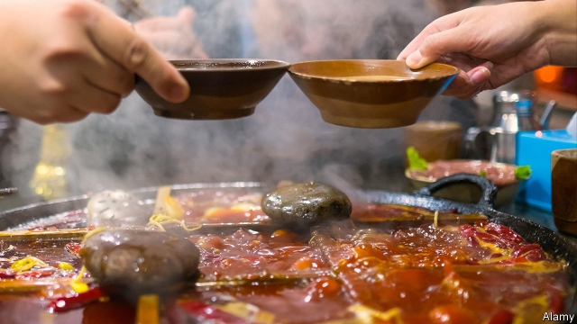

###### The gripes of broth

# Two cities tussle over who makes the tastiest Sichuan hotpot 

##### A fiery dish takes China by storm, irking snooty food critics 

 

> Apr 13th 2019 

CHENGDU, THE capital of Sichuan province, has an ancient rivalry with Chongqing, a city to its south-east. Residents of Chongqing accuse their Chengdu cousins of being pompous. The people of Chongqing are hotheads, Chengdu dwellers shoot back. Both cities share a love of spice-laden Sichuan cuisine, which in recent decades has conquered Chinese palates. But they are at war over which has the best Sichuan hotpot—a type of DIY-cooking that involves boiling vegetables and slices of meat in a communal broth with chillies and numbing peppercorns. 

A private museum in Chongqing, opened several years ago, makes the case for Chongqing-style hotpot. It describes how it developed from a method used to make cheap offcuts of meat taste delicious. But Chengdu is playing catch-up. In January the city sold a plot of land on condition that the developer build a hotpot museum on part of it. Such presumptuous behaviour will test the famous fiery tempers of Chongqing-ites. Chengdu may be the capital of Sichuan cuisine’s eponymous province, but Chongqing was part of Sichuan for long periods of history until 1997. It is now the capital of its own province-sized region, which is also called Chongqing. 

The two cities are among many in China with their own styles of hotpot. The stories behind these dishes reveal how different regions like to see themselves. Chongqing’s is said to highlight the ingenuity of the proletariat. Other places describe their hotpots as the sophisticated food of emperors. Some say theirs have military origins: warriors on the march boiling scraps in their helmets. Hotpot contents are equally diverse. To keep warm in winter, Beijingers boil fatty lamb in a berry broth. Mint-suffused Yunnanese hotpot reflects the province’s links with South-East Asia. 

But Sichuan-style broths are the most commonly savoured in China. In recent years their popularity has been booming. China has around 350,000 hotpot restaurants. About 40,000 of them are said to be in the Chongqing region alone. Hotpot restaurants in China are more profitable than other kinds, according to iiMedia, a consultancy. Haidilao, a well-known Sichuan-based hotpot chain, raised nearly $1bn when it was listed on the Hong Kong exchange in September. The company is taking its hotpot global. It expanded into Canada in December. Branches are set to open in London later this year. 

The more adventurous tastes of younger Chinese are fuelling demand. One-third of customers at hotpot restaurants in China are aged between 25 and 30, iiMedia says. They often have little time to cook at home and are unburdened by child-care duties. They like the social aspects of sharing hotpots. Round-the-clock restaurants are sprouting up to allow leisurely feasting. 

While younger Chinese are increasingly health-conscious, they seem to brush off regular hotpot-hygiene scandals. A viral video of a pregnant woman fishing a rat from her broth caused a cooling in the shares of Xiabuxiabu, a chain restaurant named after a Japanese style of hotpot, but they heated up again a few days later. Haidilao even won plaudits when it admitted that rats had been found in some kitchens and vowed to clean up its act. News of other businesses reusing weeks-old oil in the broth is greeted with a shrug. The grubbiest hotpot joints are usually the best, young people often say with a grin. 

Not all Chinese warm to hotpot. Some older Sichuanese disown it altogether. They complain that it is causing an escalation of chilli-use in other dishes that drowns out subtle flavours. Chua Lam, a celebrity food critic based in Hong Kong, caused a stir in December when he wished hotpot would disappear from the face of the Earth. He dismissed it as “the most uncultured form of cooking”, requiring no real culinary knowledge. 

But Chengdu’s plans for a museum suggest that Sichuan hotpot is not only growing in popularity, but is also becoming iconic. If it can set the West on fire, officials may hope it will become a delicious new source of Chinese soft power. There will be plenty of glory for both Chengdu and Chongqing to bask in if that happens. 

-- 

 单词注释:

1.gripe[graip]:n. 紧握, 柄, 把手, 控制 vt. 抓紧, 抱住, 使肠痛, 激怒 vi. 肠绞痛, 抱怨 

2.broth[brɒθ]:n. 原汁清汤, 肉汤 [医] 肉汤(培养基) 

3.tussle['tʌsl]:n. 扭打, 争斗, 论争 vi. 扭打, 打斗 

4.Sichuan['si:tʃ'wɑ:n]:四川(位于中国西南部、长江上游) 

5.hotpot['hɒtpɒt]:n. 罐焖土豆牛肉, 罐焖土豆羊肉 

6.fiery['faiәri]:a. 炽热的, 热烈的, 暴躁的 

7.irk[ә:k]:vt. 使厌倦, 使苦恼 

8.snooty['snu:ti]:a. 傲慢的, 自大自满的, 鄙视别人的 

9.APR[]:[计] 替换通路再试器 

10.chengdu['tʃʌŋ'du:]:n. 成都市（中国四川省省会） 

11.rivalry['raivlri]:n. 竞争, 对抗 [医] 拮抗 

12.chongq[]:[网络] 重庆 

13.chengdu['tʃʌŋ'du:]:n. 成都市（中国四川省省会） 

14.pompous['pɒmpәs]:a. 爱炫耀的, 虚夸的, 盛大的 

15.hothead['hɒthed]:n. 性急人 

16.dweller['dwelә]:n. 居民 

17.palate['pælit]:n. 腭, 味觉, 趣味, 爱好 [医] 腭 

18.communal['kɒmjunәl]:a. 公有的, 公社的 [法] 公共的, 自治体的, 巴黎公社的 

19.chilly['tʃili]:a. 寒冷的, 冷淡的, 不友好的 [建] 番椒, 冷 

20.peppercorn['pepәkɔ:n]:n. 空有其名的租金, 微不足道的答礼, 空有其名的答礼 

21.offcut[ˈɒfkʌt]:n. （木材等的）斜料, 纸边; 边角料 

22.developer[di'velәpә]:n. 开发者 [计] 显影器 

23.presumptuous[pri'zʌmptʃuәs]:a. 放肆的, 冒昧的, 傲慢的 

24.eponymous[i'pɒnimәs]:a. 齐名的 

25.ingenuity[.indʒi'nju:iti]:n. 心灵手巧, 精巧, 精巧设计 

26.proletariat[.prәuli'tєәriәt]:n. 无产阶级 

27.sophisticate[sә'fistikeit]:n. 久经世故的人, 精于...之道的人 vt. 篡改, 曲解, 使变得世故, 掺合, 弄复杂 vi. 诡辩 

28.warrior['wɒ:riә]:n. 战士, 勇士, 武士, 鼓吹战争的人, 战斗, 尚武 

29.scrap[skræp]:n. 碎片, 残余物, 些微, 片断, 铁屑, 吵架 vt. 扔弃, 敲碎, 拆毁 vi. 互相殴打 a. 零碎拼凑成的, 废弃的 

30.hotpot['hɒtpɒt]:n. 罐焖土豆牛肉, 罐焖土豆羊肉 

31.equally['i:kwәli]:adv. 相等地, 同样地, 平等地 

32.beijingers[]:[网络] 北京人 

33.fatty['fæti]:a. 肥胖的, 脂肪的, 含脂肪的 [医] 脂肪的 

34.Yunnanese[]:[网络] 云南；云南人 

35.savour['seivә]:n. 滋味, 气味, 食欲 vi. 有...的滋味 vt. 品味, 加调味品于, 使有风味, 尝到 

36.popularity[.pɒpju'læriti]:n. 名声, 受大众欢迎, 流行 

37.consultancy[]:n. 商量, 协商, 磋商, 会诊, 与...商量, 咨询, 请教, 找(医生)看病, 查阅, 考虑 [经] 咨询业务, 咨询服务 

38.hong[hɔŋ]:n. （中国、日本的）行, 商行 

39.kong[kɔŋ]:n. 含锡砾石下的无矿基岩；钢 

40.adventurous[әd'ventʃәrәs]:a. 喜欢冒险的, 有进取心的, 危险的 

41.unburden[.ʌn'bә:dn]:vt. 使卸去负荷, 使安心, 吐露心事消除思想负担 

42.sprout[spraut]:n. 芽, 萌芽 vt. 使发芽, 摘去芽 vi. 长芽, 抽条 

43.leisurely['li:ʒәli]:a. 悠闲的, 从容的 adv. 从容地, 悠闲地 

44.viral['vairәl]:a. 病毒的, 病毒引起的 [医] 病毒的 

45.plaudit['plɒ:dit]:n. 拍手喝彩, 称赞, 赞美 

46.vow[vau]:n. 誓约, 誓言, 许愿 vi. 起誓, 发誓, 郑重宣言 vt. 立誓, 起誓要, 郑重地宣布 

47.grubby['grʌbi]:a. 污秽的, 肮脏的, 生蛆的 

48.grin[grin]:n. 露齿笑 v. 露齿而笑 

49.sichuanese[]:[网络] 四川人；四川话 

50.disown[dis'әun]:vt. 否认 [计] 不认, 驱逐 

51.escalation[.eskә'leiʃәn]:n. 扩大, 增加 [经] 调查, 价格调整 

52.subtle['sʌtl]:a. 敏锐的, 精细的, 狡猾的, 稀薄的, 灵巧的, 微妙的 [医] 锐敏的; 精细的 

53.chua[]:n. 蔡氏（中文英译姓氏） 

54.lam[læm]:v. 打, 鞭笞, 逃脱 n. 逃亡 

55.celebrity[si'lebrti]:n. 名声, 名人 

56.uncultured['ʌn'kʌltʃәd]:a. 未受教育的, 无教养的, 未耕作的 

57.culinary['kʌlinәri]:a. 厨房的, 烹调用的 

58.iconic[ai'kɔnik]:[计] 图标的 

59.bask[bɑ:sk]:vi. 晒太阳, 感到舒适 

