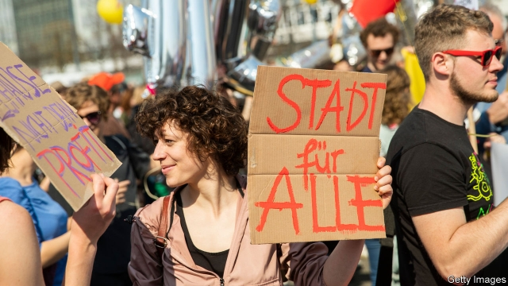
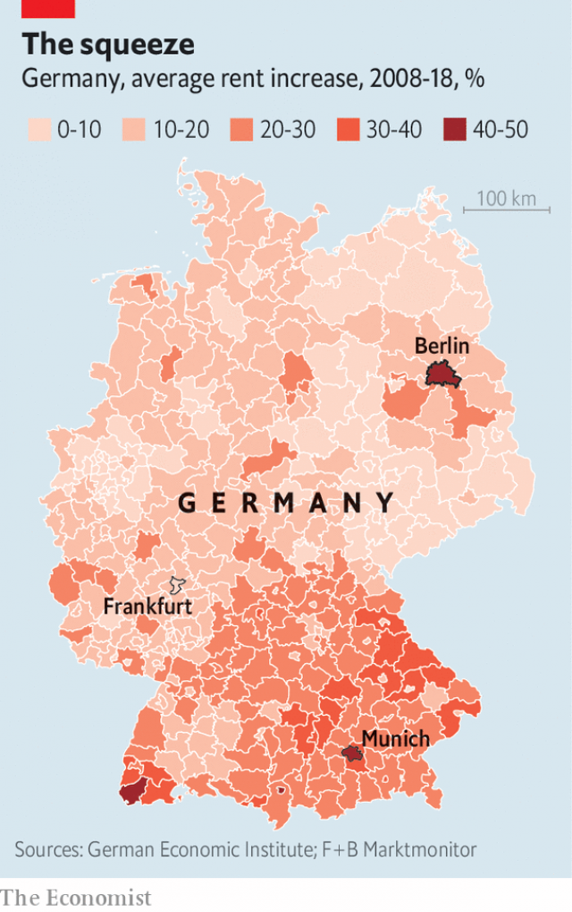

###### Hand over the keys

# A referendum to expropriate apartments from big landlords in Berlin 

##### Locals complain of high rents, and block plans to build more homes 

 

> Apr 11th 2019 

SARAH-LENA KNUST, a mild-mannered young PR consultant, is an unlikely radical. But finding a place to live in Germany’s booming capital tests the hardiest soul. Since moving to Berlin last year Ms Knust has twice struggled to find affordable housing. The last flat-viewing she attended attracted 30 rivals. The place she eventually found will suck up nearly half her income. “I knew it would be hard,” she sighs. “But I didn’t think it would be like this.” 

Such tales are familiar in a city where the days of paying next to nothing for cavernous apartments are long gone. That is why tens of thousands of Berliners, including Ms Knust, have lent their names to a radical proposal: to expropriate private housing. The campaign, launched at a “rent insanity” protest in Berlin on April 6th, is gathering signatures to force a citywide vote on whether to oblige companies that own over 3,000 properties to sell them to the city. It relies on a novel interpretation of a constitutional provision that allows private assets to be “transferred to public ownership”. Views vary on whether that will pass muster in the courts, but over half of Berliners back the plan, in a city where 85% rent. Firms owning almost 250,000 properties, around 15% of Berlin’s housing stock, would be affected. Deutsche Wohnen (DW), the biggest, has become the symbolic target of the measure. 

Germany’s big cities remain cheap by European standards, but several have experienced dramatic rent increases in the past decade (see map). Tight regulation, including a “rent brake” law in 2015, has failed to satisfy tenants. Almost half of big-city voters say they struggle to find affordable housing. Harald Simons at Leipzig University says the problem is rooted in city planners’ failure in the 2000s to predict population growth. Fifteen years ago Berlin had 150,000 empty flats and the city was demolishing public housing. Municipalities planned for demographic decline. But then came waves of immigrants and young Germans attracted by thriving job markets. Cities exploded—280,000 moved to Berlin in the past six years—and construction fell behind. Last year the Hans Böckler Foundation found that 77 German cities lack 1.9m affordable apartments. “We must build, build and build,” says Mr Simons. 

 

Construction has speeded up, but it can still take between eight and ten years from zoning decisions to completion. Nimbyism is one problem; in 2014 Berliners voted against a proposed housing scheme on the Tempelhof Feld, a former airport now used for sunbathing and skating. In some cities land sits idle as investors wait for its value to appreciate. Labour shortages in the construction sector add to the problem, and rent brakes also discourage new building. 

Helge Peters, a spokesman for the expropriation campaign, says that supply and demand mismatches do not capture the story. In 2004, after a banking crash, Berlin sold off much of its public housing at fire-sale prices. These properties were acquired by listed companies like DW, which channelled funds from institutional investors fleeing lacklustre bond markets. Such firms squeeze poor tenants so they can pay higher dividends, claims Mr Peters, resulting in “targeted social displacement”. Tenants say large landlords delay maintenance while circumventing rent caps by charging for unwanted “modernisation”. 

For all that, sceptics wonder if the cost of expropriation—which the city’s Senate (government) puts at between €26bn and €36bn ($29bn-41bn), and campaigners say could be as low as €7bn—is justified in debt-laden Berlin. The plan would not lower rents or increase housing supply, says Philip Grosse, CFO of Deutsche Wohnen. He wants politicians to show some backbone. But Berlin’s Senate, a coalition of Social Democrats (SPD), Greens and the hard left, is split. Many hope to forestall the proposal by buying up private housing and tightening regulation. Some in the SPD urge a five-year rent freeze. Many national politicians share Mr Grosse’s assessment that expropriation would turn Berlin into a “no-man’s-land” for private capital. For many Berliners, that is precisely the point. 

-- 

 单词注释:

1.referendum[.refә'rendәm]:n. （就重大政治或社会问题进行的）全民公决，全民投票 

2.expropriate[eks'prәuprieit]:vt. 剥夺, 没收, 征用 [法] 征用, 没收, 剥夺...的所有权 

3.Berlin[bә:'lin]:n. 柏林, (软质)柏林毛线 

4.APR[]:[计] 替换通路再试器 

5.knust[]:abbr. Kwame Nkrumah University of Science and Technology 瓜米鲁玛科技大学 

6.PR[]:与公众的关系, 公关 [计] 模式识别, 实际记录, 前缀, 程序寄存器 

7.hardy['hɑ:di]:a. 难的, 艰苦的, 坚硬的, 勇敢的 adv. 努力地, 辛苦地, 坚硬地 

8.knust[]:abbr. Kwame Nkrumah University of Science and Technology 瓜米鲁玛科技大学 

9.affordable[]:[计] 普及型 

10.cavernous['kævәnәs]:a. 似巨穴的 [医] 空洞的 

11.tens[]:十位 

12.Berliner[bә'linә]:n. 柏林市民 

13.insanity[in'sæniti]:n. 疯狂, 愚顽, 精神错乱 [医] 精神病 

14.citywide['siti.waid]:a. 全市的, 全市性的 

15.constitutional[.kɒnsti'tju:ʃәnl]:a. 宪法的, 立宪的, 体质的 [医] 全身的; 体质的 

16.asset['æset]:n. 资产, 有益的东西 

17.muster['mʌstә]:n. 召集, 集合, 检阅, 清单, 花名册, 样品 vt. 召集, 集合, 应召 vi. 集合, 集中 

18.deutsche[]:n. 德意志联邦共和国马克 

19.dw[]:abbr. 发展的宽度（Developed Width）；蒸馏水（Distilled Water）；双重墙（Double Wall）；双重载（Double Weight） 

20.symbolic[sim'bɒlik]:a. 象征的, 符号的 [电] 符号化 

21.voter['vәutә]:n. 选民, 投票人 [法] 选民, 选举人, 投票人 

22.HARALD['hɑ:ræld]:n. 哈拉尔德（丹麦国王） 

23.simon['saimәn]:n. 西蒙（男子名） 

24.leipzig['laipzi^]:n. 莱比锡城 

25.demolish[di'mɒliʃ]:vt. 毁坏, 破坏, 粉碎 

26.municipality[.mju:nisi'pæliti]:n. 自治区, 市当局, 市民 [法] 市, 自治市, 自治地区 

27.demographic[.demә'græfik]:a. 人口统计的 [法] 人口统计的, 人口学的 

28.han[hæn]:n. 汉朝；汉民族 

29.zoning['zәuniŋ]:n. 分区制 [医] 带现象(补体结合) 

30.completion[kәm'pli:ʃәn]:n. 完成 [经] 完井, 结束, 完工 

31.NIMBYism[]:n. 邻避主义 

32.Tempelhof['tempәlhәuf]:柏林郊外的国际飞机场 

33.feld[]:n. 菲尔德（姓氏） 

34.investor[in'vestә]:n. 投资者 [经] 投资者 

35.sector['sektә]:n. 扇形, 部门, 部分, 函数尺, 象限仪, 段, 区段 vt. 把...分成扇形 [计] 扇面; 扇区; 段; 区段 

36.helge[]:[网络] 黑尔厄；快乐的；成功的 

37.peter['pi:tә]:vi. 逐渐消失, 逐渐减少 

38.spokesman['spәuksmәn]:n. 发言人, 代言者 

39.expropriation[eks.prәupri'eiʃәn]:n. 征用, 收用, 征收 [经] 征用, 没收, 征购 

40.mismatch[mis'mætʃ]:n. 错配 vt. 错配, 使...成不相配的婚姻 

41.institutional[.insti'tju:ʃәnәl]:a. 制度的, 公共机构的, 学会的 [法] 组织机构的, 制度的, 公共机构的 

42.lacklustre['læklʌstә]:a. 无光泽的, 无生气的 n. 无光泽, 无生气 

43.dividend['dividend]:n. 被除数, 股利 [计] 被除数 

44.displacement[dis'pleismәnt]:n. 换置, 移位, 移动, 取代 [化] 顶替展开法 

45.circumvent[.sә:kәm'vent]:vt. 绕行, 陷害, 包围, 智取 

46.unwanted[.ʌn'wɒntid]:a. 没人要的, 不需要的, 多余的 

47.modernisation[,mɔdәnai'zeiʃәn;-ni'z-]:n. <主英>=modernization 

48.sceptic['skeptik]:n. 怀疑论者 

49.campaigner[kæm'peinә]:n. 从军者, 老兵, 竞选者 

50.philip['filip]:n. 菲利普（男子名） 

51.grosse[]:n. (Grosse)人名；(瑞典、德、捷)格罗塞；(英、法)格罗斯 格罗斯 

52.cfo[]:abbr. 首席财务官（Chief Finance Officer） 

53.backbone['bækbәun]:n. 脊椎, 志气, 骨干, 支柱 [计] 主干网, 主干网点 

54.coalition[.kәuә'liʃәn]:n. 结合体, 结合, 联合 [经] 联合, 联盟 

55.democrat['demәkræt]:n. 民主人士, 民主主义者, 民主党党员 [经] 民主党 

56.spd[]:abbr. 电涌保护器；补充石油税；统计过程诊断（Statistical Process Diagnosis） 

57.forestall[fɒ:'stɒ:l]:vt. 预先阻止, 先...一步行动, 占先一步, 垄断, 阻碍 [法] 先采取行动预防或阻止, 垄断 

58.tighten['taitn]:vt. 勒紧, 使变紧 vi. 变紧, 绷紧 

59.precisely[pri'saisli]:adv. 精确地, 明确地, 刻板地, 拘泥地, 正好, 恰恰, 对, 正是如此, 确实如此, 不错 

