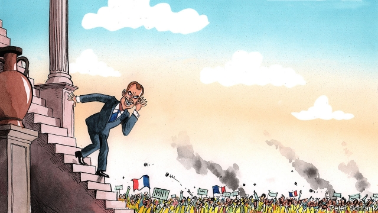

###### Jupiter listens

# Emmanuel Macron ends his “great national debate” 

##### The people have spoken, but what did they mean? 

 

> Apr 11th 2019 

AT ONE town-hall meeting in southern France, discussion touched on the reintroduction of bears in the Pyrenees. At another, in Burgundy, Emmanuel Macron was questioned about poor provision for those with autism. The “great national debate”, which began in January and ended this week, has drawn attention to the marathon total of 92 hours that the French president has spent listening to such grievances and answering queries in public debates. Yet the consultation has reached far wider than these presidential shows. It constitutes an intriguing study in how to defuse social protest—and the limits of using such a tool to do so. 

Mr Macron launched his great debate in response to the gilets jaunes (yellow jackets) movement. This began last November as a protest against an increase in the tax on motor fuel, but grew into a widespread and sometimes violent rebellion against his haughty style and top-down method of governing. Despite much initial scepticism and mockery, the results, presented this week, involved fully 1.9m contributions to an official online forum, 10,134 town-hall meetings, 16,337 “books of grievances” submitted by mayors, 27,374 emails and letters, and 21 citizens’ assemblies. 

All these comments have now been transcribed, digitised and analysed, partly by tech firms using AI, and the raw data have been made public. The results reveal some areas of national consensus, notably that curbing climate change is “urgent”, or that the French pay too much tax. There is a broad desire for more local decision-making and public services. And even the French agree that dealing with their bureaucracy is “complicated, incomprehensible, rigid and compartmentalised”. 

Yet, inevitably, opinion is split on many other matters. The same share of respondents argue, for instance, that France should be more welcoming to migrants as plead for tougher treatment of them. Participants propose plenty of green ideas, including better recycling procedures, or less meat-eating. Yet 58% say that they would not be prepared to pay, for example, a carbon tax in order to encourage greener behaviour. Such are the paradoxes of direct democracy. 

Perhaps the most contentious point concerns taxes and public spending. Edouard Philippe, the prime minister, acknowledged that the debate had revealed a ras-le-bol (fed-upness) over taxes. France has the highest overall tax take as a share of GDP in the EU. But Mr Philippe also insisted that the results showed the “maturity” of respondents, who know that “we can’t reduce taxes if we don’t reduce public spending.” This may be wishful thinking. The results suggest that 75% favour cuts to public spending, but this was a response to a question asking how, not whether, the budget deficit should be reduced. 

The great debate, in other words, was not a statistical national poll. Indeed part of the point, says Stanislas Guerini, head of Mr Macron’s party, La République en Marche, was “to put the voice of the gilets jaunes in perspective”. Online, for instance, only 10% of respondents called for the return of a wealth tax. Yet polls suggest that three-quarters of the French are in favour. Which is partly why opposition parties, and many gilets jaunes, have denounced the whole exercise. Christian Jacob, parliamentary leader of the centre-right Republicans, called it a “great masquerade”. 

Given the conflicting demands, Mr Macron now faces the perilous task of coming up with decisions that neither disappoint nor divide. He is expected to unveil his choices in the coming weeks. In some ways, though, the debate has already served part of its purpose. It has enabled the Jupiterian Mr Macron to show that he is willing to step out of his palace and listen to people. It has provided an alternative way to release national frustration. On the streets, the numbers taking part in weekend gilets jaunes marches have dropped from 280,000 in November to 22,000. The president’s ratings remain low, but have recovered to where they were last October, before the protests broke out. 

-- 

 单词注释:

1.Jupiter['dʒu:pitә]:n. 朱庇物(罗马神话中的主神), 木星 

2.emmanuel[i'mænjuәl]:n. 以马内利（耶稣基督的别称）；伊曼纽尔（男子名, 等于Immanuel） 

3.macron['mækrәn]:n. 长音符号 

4.APR[]:[计] 替换通路再试器 

5.reintroduction[.ri:intrә-'dʌkʃәn]:n. 再介绍；再引入 

6.Pyrenees[,pirә'ni:z]:比利牛斯山脉[欧洲西南部] 

7.Burgundy['bә:gәndi]:n. 勃艮第(法国一地区), 勃艮第葡萄酒 

8.autism['ɒ:tizm]:n. 孤独症 [医] 孤独癖, 自我中心主义 

9.grievance['gri:vәns]:n. 委屈, 冤情, 苦况 [经] 不满(对雇用条件的) 

10.query['kwiәri]:n. 疑问, 疑问号, 质问, 查询 v. 询问, 质问 [计] 查询 

11.consultation[.kɒnsәl'teiʃәn]:n. 请教, 咨询, 磋商会 [医] 会诊 

12.presidential[.prezi'denʃәl]:a. 总统制的, 总统的, 首长的, 统辖的 [法] 总统的, 议长的, 总经理的 

13.constitute[kәn'stitjut]:vt. 构成, 组成, 任命 [建] 构造, 组成 

14.intrigue[in'tri:g]:n. 阴谋, 复杂的事 vi. 密谋, 私通 vt. 激起...的兴趣, 用诡计取得 

15.defuse[.di:'fju:z]:vt. 去掉...的引信, 平息 

16.gilet[dʒi'lei]:n. 背心, 马甲 

17.jaune[]:[网络] 汝拉 

18.haughty['hɒ:ti]:a. 傲慢的, 骄傲的, 崇高的 

19.scepticism['skeptisizm]:n. 怀疑论, 怀疑主义 [医] 多疑癖 

20.mockery['mɒkәri]:n. 嘲弄, 笑柄, 歪曲 

21.fully['fuli]:adv. 十分地, 完全地, 充分地 

22.online[]:[计] 联机 

23.forum['fɒ:rәm]:n. 论坛, 公开讨论的广场, 法庭, 讨论会 [法] 讨论会, 专题讨论, 公共论坛 

24.transcribe[træn'skraib]:vt. 抄写, 译, 意译, 录制, 改编 [计] 转录 

25.digitise['dɪdʒɪtaɪz]:vt. 数码化 

26.tech[tek]:n. 技术学院或学校 

27.AI[ai]:[计] 附加信息, 人工智能 [化] 人工智能 

28.datum['deitәm]:n. 论据, 材料, 资料, 已知数 [医] 材料, 资料, 论据 

29.notably['nәjtbәli]:adv. 显著地, 著名地, 尤其, 特别 

30.curb[kә:b]:n. 抑制, 勒马绳, 边石 vt. 抑制, 束缚, 勒住 

31.bureaucracy[bjuә'rɒkrәsi]:n. 官僚, 官吏 [法] 官僚主义, 官僚政治, 官僚机构 

32.incomprehensible[in.kɒmpri'hensәbl]:a. 不能理解的, 费解的, 无限的 

33.compartmentalise[,kɔmpɑ:t'mentəlaiz]:vt. [主英国英语] = compartmentalize 

34.inevitably[in'evitәbli]:adv. 不可避免地 

35.respondent[ri'spɒndәnt]:a. 回答的, 应答的, 反射的 n. 应答者, 被告 

36.migrant['maigrәnt]:n. 候鸟, 移居者 [法] 移居者 

37.plead[pli:d]:vi. 辩护, 恳求 vt. 为...辩护, 提出...借口, 托称, 恳求 

38.participant[pɑ:'tisipәnt]:n. 参加者, 参与者 a. 有份的, 参加的, 参与的 

39.recycling[]:[电] 再循环 

40.les[lei]:abbr. 发射脱离系统（Launch Escape System） 

41.paradox['pærәdɒks]:n. 似非而是的论点, 自相矛盾的话, 悖论, 怪人怪事 [化] 佯谬 

42.contentious[kәn'tenʃәs]:a. 好争吵的, 爱争论的, 有异议的 [法] 诉讼的, 争执的, 引起争论的 

43.Edouard[]:n. (Edouard)人名；(俄)爱德华 

44.Philippe[]:菲力浦（人名）；百达翡丽手表 

45.EU[]:[化] 富集铀; 浓缩铀 [医] 铕(63号元素) 

46.maturity[mә'tjuәriti]:n. 成熟, 完备, 到期 [医] 成熟, 成熟期, 发育期 

47.wishful['wiʃful]:a. 愿望的, 渴望的, 一厢情愿的 

48.deficit['defisit]:n. 赤字, 不足额 [医] 短缺 

49.stanislas[]: [男子名] 斯坦尼斯拉斯来源于斯拉夫语，含义是“军营”(war camp) 

50.guerini[]:[网络] 格里尼 

51.La[lɔ:, lɑ:]:[医] 镧(57号元素) 

52.en[en]:n. 字母N, (铅字)半方 prep. 在...中, 作为 

53.Marche[]:n. 马尔什（法国中部地区旧省）；马尔凯（位于意大利中部） 

54.online[]:[计] 联机 

55.opposition[.ɒpә'ziʃәn]:n. 反对, 敌对, 相反, 在野党 [医] 对生, 对向, 反抗, 反对症 

56.denounce[di'nauns]:vt. 告发, 抨击, 谴责 [法] 谴责, 斥责, 告发 

57.jacob['dʒeikәb]:n. [圣经]雅各（以色列人的祖先）；雅各布（男子名） 

58.parliamentary[.pɑ:lә'mentәri]:a. 国会的, 议会的, 议会制度的 

59.masquerade[.mɑ:skә'reid]:n. 化装舞会, 伪装 vi. 参加化装舞会, 伪装, 假装 

60.perilous['perilәs]:a. 危险的, 濒临毁灭的 

61.unveil[.ʌn'veil]:vt. 揭开, 揭幕, 除去...的面纱 vi. 显露, 除去面纱 

62.frustration[frʌs'treiʃәn]:n. 挫折, 顿挫 [医] 挫折 

63.rating['reitiŋ]:n. 等级, 额定功率, 责骂 [经] 等级评定 

