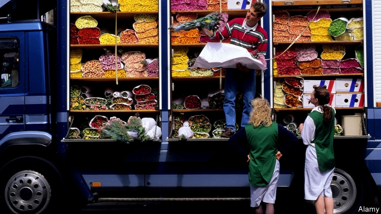
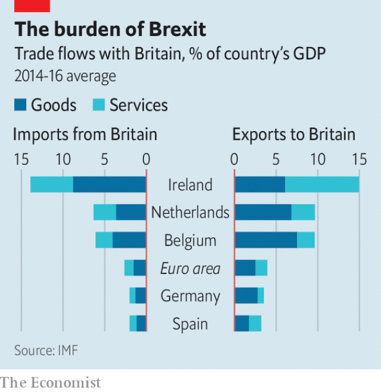

###### Trading jitters

# Europe’s small open countries brace for Brexit 

##### Ireland, the Netherlands and Belgium are most exposed 

 

> Apr 11th 2019 

NEARLY 3,400 lorries are ferried between Rotterdam’s port and Britain every day. They roll on and off the boats, carrying much of the 54m tonnes of goods that are traded between the Netherlands and Britain each year. The precise form of Brexit is still being wrangled over in Westminster. But unless Britain decides to stay in the EU’s single market and customs union (which seems unlikely), trade will become less seamless. 

Truckers might need to ensure that their cargo has the right paperwork, or risk being turned away at the port. Some British products—such as livestock—might need to be inspected by vets upon entering the EU. Delays at the border could ruin produce going the other way: around €825m ($930m)-worth of flowers and plants are shipped to Britain from the Netherlands every year, says Matthijs Mesken of VGB, which represents Dutch wholesalers and exporters. Delivery takes place a matter of hours after an order is placed. 

Brexit contributes to the “pervasive uncertainty” which, in the words of Mario Draghi, the head of the European Central Bank (ECB), clouds the euro zone’s economic horizon. A study in 2018 by the IMF found that Britain’s economy, already deeply integrated with the rest of the EU, became even more so after the 2007-08 financial crisis. The worst effects of loosening those ties will be felt in Britain. But others in Europe will not go unscathed. Small open economies are the most vulnerable. 

The countries with the closest trading ties with Britain include Belgium, Ireland and the Netherlands. According to the IMF, Ireland’s exports of goods and services to Britain amounted to 15% of GDP in 2014-16, and those of Belgium and the Netherlands nearly 10%. All three also rely relatively heavily on imports from Britain. 

 

Ireland and the Netherlands are intertwined with Britain in other ways too. Thanks to history and geography, migrant flows between Ireland and Britain are large, equivalent to nearly a fifth of the population of Ireland. (Malta and Cyprus, which also have historical ties to Britain, see large migrant flows, too, relative to their size.) The Netherlands is a big investor in British business: its stock of foreign direct investment in the country was equivalent to an average of almost 80% of Dutch GDP in 2014-16, the highest share in the EU. 

Irish and Dutch financial firms have relatively high exposures to British borrowers. Luxembourg also has close trade and investment links, according to analysis by S&P Global, a credit-ratings agency. But that may partly reflect the fact that some British firms register there for tax purposes. 

Larger countries are better insulated, but certain sectors are still exposed. A study by Hans-Ulrich Brautzsch and Oliver Holtemöller for the Halle Institute of Economic Research finds that 15,000 jobs in Germany—around 1% of employment in its car industry—depend either directly or indirectly on exports to Britain. S&P analysts note that Spain is most exposed through its ownership of banks, telecoms and insurance firms in Britain. 

The IMF reckons that the long-term impact of Brexit on the EU27 as a whole would be modest, provided a deal is struck. But some countries might still suffer. If Britain left the single market and instead signed a free-trade deal with the EU, the fund reckons output in Ireland would eventually fall by 2.5%, and that in Belgium and the Netherlands by 0.5-0.7%. In the event of no deal, the losses would nearly double. 

As small members of a monetary union, these countries cannot expect the ECB to come to their rescue with euro-zone-wide monetary loosening. Instead, their governments would probably need to stimulate their economies. Whereas Ireland and the Netherlands have the fiscal space to cushion the blow, Belgium, with a public-debt ratio of around 100% of GDP, has less room to act. 

For now, though, the focus is on minimising near-term disruption. Ireland has promised its farmers help in the event of a no-deal Brexit. In Rotterdam the port authority plans to extend its digital-clearance system for non-EU imports to include British exports. Hundreds of extra customs officers have been hired. Lorries that arrive without the right documents will be directed to contingency parking spaces while they seek clearance, says Leon Willems of the port authority. Clarity on Britain’s plans would help the preparations. But, he sighs, they are still a “black box”. 

-- 

 单词注释:

1.jitter['dʒitә]:vi. 神经过敏, 战战兢兢 [计] 跳动; 抖动 

2.brace[breis]:n. 支柱, 曲柄, 支撑, 一对 vt. 紧缚, 支撑, 激励 vi. 打起精神 [计] 花括号 

3.Brexit[]:[网络] 英国退出欧盟 

4.Netherlands['neðәlәndz]:n. 荷兰 

5.APR[]:[计] 替换通路再试器 

6.tonne[tʌn]:n. 吨, 公吨 [经] 吨 

7.wrangle['ræŋgl]:vi. 争论, 口角 vt. 辩驳, 放牧 n. 口角, 吵嘴 

8.Westminster['westminstә]:n. 威斯敏斯特 

9.les[lei]:abbr. 发射脱离系统（Launch Escape System） 

10.seamless['si:mlis]:a. 无缝的, 无缝合线的 [医] 无缝的 

11.trucker['trʌkә(r)]:n. 卡车驾驶员, 从事货车运输业者, 以物易物者, 小贩 

12.vet[vet]:n. 兽医 vi. 当兽医 vt. 诊断, 检审 

13.EU[]:[化] 富集铀; 浓缩铀 [医] 铕(63号元素) 

14.matthijs[]:[网络] 马太依斯；马达斯；马戴斯 

15.VGB[]:[=vigabatrin]氨己烯酸 

16.Dutch[dʌtʃ]:n. 荷兰人, 荷兰语 a. 荷兰的 

17.wholesaler['hәulseilә]:n. 批发商 [经] 批发商 

18.exporter[ik'spɒ:tә]:n. 出口商, 输出者, 出口公司 [经] 出口商, 输出者 

19.pervasive[pә'veisiv]:a. 普遍的, 流行的, 到处蔓延的, 到处渗透的 

20.uncertainty[.ʌn'sә:tnti]:n. 不确定, 不可靠, 不确定的事物 [化] 不确定度 

21.mario['mæriәj, 'mɑ:-]:n. 马里奥（男子名） 

22.Draghi[]:[网络] 行长德拉吉；总裁德拉吉；欧洲央行德拉吉 

23.ECB[]:[计] 事件控制块 

24.euro['juәrәu]:n. 欧元（欧盟的统一货币单位） 

25.IMF[]:国际货币基金组织 [经] 国际货币基金 

26.unscathed[.ʌn'skeiðd]:a. 没有受伤的, 未受损伤的 

27.vulnerable['vʌlnәrәbl]:a. 易受伤害的, 有弱点的, 易受影响的, 脆弱的, 成局的 [医] 易损的 

28.intertwine[.intә'twain]:v. (使)纠缠, (使)缠绕 

29.migrant['maigrәnt]:n. 候鸟, 移居者 [法] 移居者 

30.Malta['mɒ:ltә]:n. 马尔他 

31.Cyprus['saiprәs]:n. 塞浦路斯 [经] 赛浦路斯 

32.investor[in'vestә]:n. 投资者 [经] 投资者 

33.borrower['bɒrәuә]:n. 借用人, 剽窃者 [经] 借款人, 借用人 

34.luxembourg['luksәm,bә:^]:n. 卢森堡公国；卢森堡（卢森堡公国首都） 

35.insulate['insjuleit]:vt. 使绝缘, 隔离 [医] 绝缘 

36.sector['sektә]:n. 扇形, 部门, 部分, 函数尺, 象限仪, 段, 区段 vt. 把...分成扇形 [计] 扇面; 扇区; 段; 区段 

37.oliver['ɒlivә]:n. 脚踏铁锤 

38.halle[]:n. 哈雷（德国城市） 

39.indirectly[]:adv. 间接, 曲折, 迂回, 不直截了当, 不诚实, 不坦率 [计] 间接地 

40.analyst['ænәlist]:n. 分析者, 精神分析学家 [化] 分析员; 化验员 

41.Spain[spein]:n. 西班牙 

42.telecom['telәkɔm]:telecommunication 电信 

43.reckon['rekәn]:vt. 计算, 总计, 估计, 认为, 猜想 vi. 数, 计算, 估计, 依赖, 料想 

44.monetary['mʌnitәri]:a. 货币的, 金钱的 [经] 货币的, 金融的 

45.cannot['kænɒt]:aux. 无法, 不能 

46.fiscal['fiskәl]:a. 财政的, 国库的 [经] 财政上的, 会计的, 国库的 

47.minimise[]:vt. 使减到最少/最小, 使降到最低限度, 使缩到最小, 极度轻视 

48.disruption[dis'rʌpʃәn]:n. 分裂, 崩溃, 瓦解 

49.Rotterdam['rɔtәdæm]:[经] 鹿特丹 

50.contingency[kәn'tindʒәnsi]:n. 偶然性, 可能性, 意外事故 [经] 意外事故, 意外开支, 偶然事故 

51.clearance['kliәrәns]:n. 清除, 间隙 [化] 间隙; 空隙 

52.leon['li(:)әn]:n. 利昂（男子名, 等于Leo） 

53.Willem[]:n. (Willem)人名；(葡、荷、南非)威廉 

54.clarity['klærәti]:n. 清楚, 明晰 [化] 透明度; 透明性; 清晰性 

