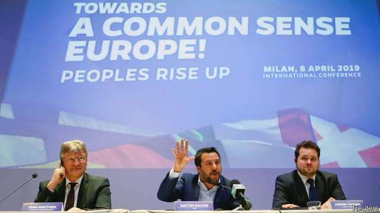

###### A posse of patriots

# Matteo Salvini’s improbable dream of a pan-European nationalist alliance 

##### Nationalists tend not to agree with each other 

 

> Apr 11th 2019 

AN ITALIAN nationalist joining forces with a German one to promise “a new European dream”, as Matteo Salvini termed it, is bound to stir the odd qualm. But oblivious, or indifferent, to historical echoes, Mr Salvini, the leader of Italy’s Northern League, on April 8th sat cheerfully alongside Jörg Meuthen of the Alternative for Germany (AfD) on a platform in Milan as he announced the formation of a new, nativist bloc in the next European Parliament. Mr Meuthen said it would be called the European Alliance for People and Nations. And, said Mr Salvini, the aim was “to take in groups with which we have never collaborated before”. 

Gail McElroy, a political scientist at Trinity College, Dublin, who has made a study of the European Parliament, said it was likely that the radical right will make some gains at the European elections on May 23rd-26th. “But there is a long history of populist parties forming groups that then fall apart.” Ominously for Mr Salvini, none of the party leaders he had hoped to attract to his new band bothered to show up in Milan. 

Movements created to protect national interests and exalt national identities tend to make awkward bedfellows, after all. Jaroslaw Kaczynski’s government in Poland and Viktor Orban’s in Hungary have long turned a deaf ear to Italy’s pleas for a redistribution within the EU of asylum-seekers arriving from Africa. That problem has now been skirted: the new mantra of the populist right is that the answer is to seal Europe’s frontiers. But agreeing on economic policy will be more difficult. The AfD and other hard-right northern European groups support precisely the kind of fiscal austerity Mr Salvini claims is holding back the Italian economy. 

Encouraging industrial figures for February, published on April 10th, raised hopes that, after two quarters of negative growth in the second half of 2018, Italy could now emerge from technical recession. But the outlook remains cloudy. The day before, the cabinet slashed its growth forecast for 2019 from 1% to 0.2%. It also acknowledged that, as a result, Italy would fail to meet the targets it agreed upon with the European Commission for its budget deficit and public debt. The government now expects a fiscal shortfall this year of 2.4% of GDP rather than 2.0%, and a rise in Italy’s already hefty debt stock to 132.6% of GDP from 132.2%. 

The slowdown could explain the first, faint signs that the surge in support for Mr Salvini, driven largely by his hardline stance on immigration, may have peaked. Since the general election in March 2018, when the League won less than 18% of the vote, polls have shown its popularity climbing steadily. But a survey published on April 1st found it had dipped slightly for the first time, by half a percentage point. 

Until now, Mr Salvini, the interior minister and a deputy prime minister in the coalition government of Giuseppe Conte, has escaped most of the blame for the downturn. Economic policy is primarily the responsibility of the finance minister, Giovanni Tria, an independent, and Mr Salvini’s fellow-deputy prime minister, Luigi Di Maio, leader of the anti-establishment Five Star Movement (M5S). But in recent days the Captain, as his followers call him, has taken an increasingly assertive role, insisting that Mr Tria honour a pledge in the coalition pact to introduce a flat tax for poorer households: he has suggested a rate of 15% for those with incomes of less than €50,000. The aim, as with Italy’s expansionary 2019 budget, is to stimulate growth by boosting domestic demand. 

Mr Salvini is taking a huge gamble, both politically and economically. He has now raised the hopes of millions of Italians, who will be horribly disappointed if he fails to deliver. There is little scope for tax cuts, not least because of a deal struck with the European Commission in 2011 at the height of the euro crisis which means the government has to find at least €23bn in extra revenue or spending cuts to avoid having to increase the rate of VAT, already uncomfortably high at 22%. Nicola Nobile of Oxford Economics, a consultancy, calculates that, after slower-than-expected growth has been taken into account, the overall squeeze will be around €35bn. If the government wants to stay below the euro zone’s deficit target, he says, “and unless it can find money elsewhere, it will not have the scope for this flat tax.” 

Mr Salvini is hoping that he will not need to respect the euro zone’s fiscal stability rules for much longer. He has repeatedly predicted a populist victory in next month’s ballot that will transform the outlook of the commission and prompt a relaxation of the fiscal strictures that weigh on Italy. But there are a couple of snags. 

The basis for his new bloc is an existing alliance that includes the League and Marine Le Pen’s National Rally in France. The EU’s poll of polls sees it winning 61 of the 705 seats in the next parliament (excluding Britain’s). That is fewer than the prospective haul of three other alliances. The AfD could perhaps contribute another 13 seats. If Mr Salvini can woo Mr Orban’s Fidesz in Hungary, which has been suspended from the main conservative bloc in the European Parliament, and Jaroslaw Kaczynski’s Law and Justice party (PiS) in Poland, he could boost the tally to more than 100 seats. 

But even in the unlikely event of both PiS and Fidesz joining Mr Salvini, the alliance would lag far behind the mainstream conservative and socialist groups. “And when push comes to shove, they will ally to keep these people at the margins,” says Ms McElroy. “It’s what they’ve been doing for 40 years.” The other snag? National governments, not the parliament, put up candidates for the commission, though the parliament has to approve them. 

Since entering government, Mr Salvini has shown himself to be a spectacularly adroit operator. But he will need to take care in the weeks ahead that he does not set himself up for failure. 

-- 

 单词注释:

1.posse['pɒsi]:n. 一队, 一团, 地方武装团队 [法] 可能性 

2.patriot['peitriәt]:n. 爱国者, 爱国主义者 

3.matteo[]:马泰奥（人名） 

4.improbable[im'prɒbәbl]:a. 不大可能的, 不象发生的, 荒谬可笑的 [法] 未必会的, 不大可能发生的, 未必确实的 

5.nationalist['næʃәnәlist]:n. 国家主义者, 民族主义者 

6.alliance[ә'laiәns]:n. 联盟, 联合 [法] 同盟, 联盟, 联姻 

7.APR[]:[计] 替换通路再试器 

8.salvini[]:[网络] 索氏丽体鱼；萨尔维尼 

9.qualm[kwɒ:m]:n. 晕眩, 不安, 疑虑 [法] 疑虑, 不安, 内疚 

10.oblivious[ә'bliviәs]:a. 遗忘的, 健忘的, 不知不觉的 [法] 忘却的, 健忘的, 不在意的 

11.cheerfully['tʃiәfuli]:adv. 高高兴兴地 

12.meuthen[]:莫伊滕 

13.afd[]:abbr. 自动装填装置（Automatic Feeding Device） 

14.Milan[mi'læn]:n. 米兰 

15.nativist['neitivist]:n. 先天论者, 乡土主义者, 本土主义者 

16.bloc[blɒk]:n. 集团 

17.alliance[ә'laiәns]:n. 联盟, 联合 [法] 同盟, 联盟, 联姻 

18.gail[^eil]:n. 盖尔（女子名, 等于Gale或Gayle） 

19.mcelroy[]:n. (McElroy)人名；(英)麦克尔罗伊 

20.trinity['triniti]:n. 三人一组, 三个一组的东西, 三位一体 

21.Dublin['dʌblin]:n. 都柏林 

22.Populist['pɔpjulist]:n. 民粹派的成员 

23.ominously['ɒmɪnəslɪ]:adv. 恶兆地, 不吉利地; 预示地 

24.bother['bɒðә]:vt. 烦扰, 迷惑 vi. 烦恼, 操心 n. 麻烦, 纠纷, 讨厌的人 

25.exalt[ig'zɒ:lt]:vt. 提升, 提高, 赞扬, 使得意 vi. 使人兴奋, 使人得意 

26.bedfellow['bed.felәu]:n. 同床者, 伙伴 

27.jaroslaw[]:[网络] 雅罗斯瓦夫；加洛斯罗；雅洛斯瓦夫 

28.Poland['pәulәnd]:n. 波兰 

29.Viktor[]:维克托（人名） 

30.Hungary['hʌŋgәri]:n. 匈牙利 

31.plea[pli:]:n. 恳求, 辩解, 抗辩, 诉讼, 请愿, 托词 [法] 抗辩, 申诉案件, 答辩 

32.redistribution['ri:distri'bju:ʃәn]:n. 重新分配, 再分发 [计] 重新分配 

33.EU[]:[化] 富集铀; 浓缩铀 [医] 铕(63号元素) 

34.mantra['mʌntrә, 'mæn-]:颂歌, 咒语(尤指四吠陀经典内作为咒文或祷告唱念的) 

35.precisely[pri'saisli]:adv. 精确地, 明确地, 刻板地, 拘泥地, 正好, 恰恰, 对, 正是如此, 确实如此, 不错 

36.fiscal['fiskәl]:a. 财政的, 国库的 [经] 财政上的, 会计的, 国库的 

37.austerity[ɒ'sterәti]:n. 朴素, 苦行, 严格, 严峻 

38.recession[ri'seʃәn]:n. 后退, 凹处, 衰退, 归还 [医] 退缩 

39.slash[slæʃ]:v. 猛砍, 乱砍 n. 猛砍, 乱砍, 删减 [计] 斜线 

40.deficit['defisit]:n. 赤字, 不足额 [医] 短缺 

41.shortfall['ʃɒ:tfɒ:l]:n. 不足, 不足量 [经] 缺少, 不足, 亏舱运费 

42.hefty['hefti]:a. 重的, 肌肉发达的 

43.slowdown['slәudaun]:n. 降低速度, 减速 

44.surge[sә:dʒ]:n. 巨涌, 汹涌, 澎湃 vi. 汹涌, 澎湃, 颠簸, 猛冲, 突然放松 vt. 使汹涌奔腾, 急放 [计] 电压尖峰 

45.hardline[]:n. 强硬路线 [电] 硬线 

46.stance[stæns]:n. 准备击球姿势, 站立的姿势, 位置, 姿态 [经] 地位, 形势 

47.les[lei]:abbr. 发射脱离系统（Launch Escape System） 

48.popularity[.pɒpju'læriti]:n. 名声, 受大众欢迎, 流行 

49.coalition[.kәuә'liʃәn]:n. 结合体, 结合, 联合 [经] 联合, 联盟 

50.giuseppe[]:n. 朱塞佩（男子名） 

51.conte[kuŋt]:n. 短篇小说 

52.downturn['dauntә:n]:n. (尤指经济方面的)衰退, 下降趋势 [电] 低迷时期 

53.Giovanni[dʒo'vanni]:n. 乔瓦尼（人名） 

54.tria[]:[医] 试验 

55.luigi[]:n. （意）路易吉（男子名） 

56.DI[]:[计] 数据输入, 数据项, 设备独立性, 双整数 

57.maio[]:abbr. mobile allocation index offset 移动台划分系数偏置 

58.follower['fɒlәuә]:n. 从者, 属下, 追补者 [电] 随动机 

59.assertive[ә'sә:tiv]:a. 武断的, 过分自信的 [法] 断言的 

60.pledge[pledʒ]:n. 诺言, 保证, 誓言, 抵押, 信物, 保人, 祝愿 vt. 许诺, 保证, 使发誓, 抵押, 典当, 举杯祝...健康 

61.pact[pækt]:n. 契约, 协定, 条约 [化] 合同 

62.expansionary[ik'spænʃәnәri]:a. 扩张性的, 发展性的, 展开性的 

63.gamble['gæmbl]:n. 赌博, 冒险 v. 赌博, 孤注一掷 

64.politically[]:adv. 政治上 

65.economically[i:kә'nɔmikәli]:adv. 节约地, 不浪费地, 节省地, 节俭地, 在经济上, 在经济学上 

66.horribly['hɒrәbli]:adv. 可怕地, 非常地 

67.euro['juәrәu]:n. 欧元（欧盟的统一货币单位） 

68.VAT[væt]:n. 大桶 vt. 装入大桶, 在大桶里处理 

69.uncomfortably[ʌnˈkʌmftəbli]:adv. 不舒适地, 不自在地, 令人不快地 

70.nicola[]:n. 尼古拉（男子名） 

71.nobile[]:n. (Nobile)人名；(意、塞)诺比莱；(西)诺维莱 

72.Oxford['ɒksfәd]:n. 牛津, 牛津大学 

73.consultancy[]:n. 商量, 协商, 磋商, 会诊, 与...商量, 咨询, 请教, 找(医生)看病, 查阅, 考虑 [经] 咨询业务, 咨询服务 

74.ballot['bælәt]:n. 投票, 投票用纸, 抽签 vi. 投票, 抽签 vt. 投票选出, 拉选票 

75.relaxation[.ri:læk'seiʃәn]:n. 松弛, 放松, 减轻, 缓和, 休息, 休养 [化] 松弛; 驰豫 

76.stricture['striktʃә]:n. 狭窄, 指责, 束缚 [医] 狭窄 

77.snag[snæg]:n. (尖利的)突出物, (衣服等的)戳破处, 断牙, 意外障碍 vt. 造成阻碍, 抓住机会, 抢到, 清除障碍物 

78.LE[]:[计] 小于或等于 

79.rally['ræli]:n. 重振旗鼓, 集合, 群众集会, 跌停回升 v. 重整旗鼓, 集合, 恢复精神, 团结, 挖苦, 嘲笑 

80.prospective[prәs'pektiv]:a. 预期的, 将来的 [经] 预期的, 未来的 

81.haul[hɒ:l]:n. 用力拖拉, 拖运, 强拉, 捕获量, 拖运距离 vi. 拖, 拉, 改变方向, 改变主意 vt. 拖拉, 拖运 

82.fidesz[]:[网络] 青年民主党；匈牙利执政党青民盟；匈牙利执政党青年民主党 

83.pi[pai]:n. 圆周率 [计] 处理器接口, 程序中断 

84.tally['tæli]:n. 符木, 记账, 得分, 比分, 计数器, 标签, 符合, 对应物 vt. 记录, 点数, 计算, 加标签于, 使符合 vi. 记帐, 符合, 吻合, 记分 [计] 计数 

85.mainstream['meinstri:m]:n. 主流 

86.shove[ʃʌv]:n. 推, 挤 vt. 推挤, 猛推, 强使 vi. 推 

87.ally['ælai. ә'lai]:n. 同盟者, 同盟国, 助手 vt. 使联盟, 使联合, 使有关系 vi. 结盟 

88.spectacularly[]:adv. 引人注目地；壮观地 

89.adroit[ә'drɒit]:a. 灵巧的, 敏捷的, 聪明的 

