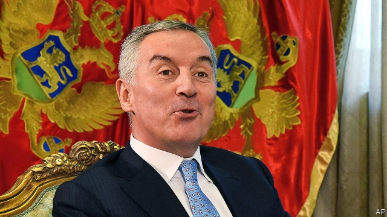

###### The monarch of Montenegro

# Why Milo Djukanovic is Europe’s most durable ruler 

##### Some 71% of Montenegrins want their leader “strong and resolute” 

 

> Apr 11th 2019 

IN 1989 HE was one of Europe’s youngest leaders. Thirty years later Milo Djukanovic, president of Montenegro and still only 57, has been in power, as either president, prime minister or just as ruling-party boss, for longer than anyone else in Europe. Montenegrins have to be in their 40s to remember politics before him. Other European leaders want to know the secret of his success. Unfortunately, he says, there is no simple explanation. On his wall hangs a portrait of King Nikola, who was deposed after 58 years in 1918. No, he has no intention of competing with him, he says. 

He might not have the choice. For the past nine weeks thousands of people have been taking to the streets of Podgorica, Montenegro’s capital, to demand that Mr Djukanovic step down. Yet he seems unfazed. In 2016, he says, a Russian-financed plot aimed to assassinate him and now the Russians are causing trouble again, even if many of the demonstrators do not realise who is stirring the political pot. Nonsense, scoffs Dejan Mijovic, an opposition politician. Democracy in Montenegro is a sham, he says; Mr Djukanovic holds all the levers of power, and now he needs to go. 

Montenegro’s fractious opposition has been given a burst of energy thanks to allegations by a former tycoon who now lives in London. Since January Dusko Knezevic, who was once close to Mr Djukanovic, has been releasing information that he hopes will bring down the president. He depicts a pattern of corruption around the state, and has even released a video of himself giving an official of Mr Djukanovic’s party an illegal campaign contribution. That transgression has been dealt with, says the president; but everything else that Mr Knezevic says is a lie coming from a fugitive from justice (he is accused of money-laundering). Mr Knezevic admits that he broke the law on campaign contributions, but says that is the only way to do business in a country where everything is a racket controlled by Mr Djukanovic. 

However the Knezevic affair and the opposition demonstrations play out, Mr Djukanovic’s political survival is remarkable. In 1989 he was a protégé of Slobodan Milosevic, the then Serbian leader. But as Mr Milosevic faced defeat in the war over Kosovo, Mr Djukanovic pivoted towards championing the restoration of Montenegro’s independence, lost in 1918 when Yugoslavia was created. He achieved this in 2006, and yet managed to maintain Montenegro as a Balkan rarity—a multi-ethnic state. He says he keeps trying to step back from power, but that there is always another task to accomplish. In 2017 Montenegro joined NATO. 

No government has ever changed hands at the ballot box in Montenegro. Fearing Russian interference, Western leaders seem in no mood to try to persuade the canny Mr Djukanovic to go. Between 1696 and 1918 Montenegro had seven leaders who ruled for an average of 32 years. One secret of their success was balancing the interests of competing clans. Asked whether running Montenegro today is similar, Mr Djukanovic says it is, swiftly adding that, unlike pre-modern rulers, he was elected. A recent poll found that 71% of Montenegrins want their leader “strong and resolute”. 

A secret of his own success is clientelism. One official claimed back in 2012 in a leaked tape that every public-sector job given out secures four votes for the ruling party. Still, the recent demonstrations show that a lot of people are fed up with Mr Djukanovic. In recent years, says Daliborka Uljarevic, an analyst, there has been a change of atmosphere. Anyone who dares to criticise the government risks being labelled “an enemy of the state” by the pro-government media, as she has been. 

The political atmosphere is toxic and the ruling party and its allies control only 42 of parliament’s 81 seats. Tycoons from Azerbaijan, Russia, Malaysia and the UAE have bought up property and developed luxury seaside resorts; but many folk feel that, as they struggle on low salaries and poor public services, a tiny group around Mr Djukanovic has got rich. Somerset Maugham once called the French Riviera “a sunny place for shady people”. One might say much the same about Montenegro. 

-- 

 单词注释:

1.monarch['mɒnәk]:n. 帝王, 统治者, 元首 [医] 单原型(植) 

2.Montenegro[.mɒnti'ni:grәu]:n. 黑山 

3.milo['mailәj, 'mi:lɔ:]:n. [植]蜀黍；麦洛（公元前6世纪的希腊摔跤能手） 

4.Montenegrin[.mɒnti'ni:grin]:a. 黑山的 n. 黑山人 

5.resolute['rezәlu:t]:n. 果断的人 a. 坚决的, 刚毅的, 毅然的 

6.APR[]:[计] 替换通路再试器 

7.politic['pɒlitik]:a. 精明的, 明智的, 策略的 

8.nikola[]:尼古拉（人名） 

9.depose[di'pәuz]:vt. 免职, 废黜, 作证 vi. 作证, 供证 

10.Podgorica['pɔ:d^ɔ:,ri:tsɑ:]:波德戈里察(南斯拉夫南部城市铁托格勒) 

11.unfazed[ʌnˈfeɪzd]:a. 不担忧的, 不苦恼的 

12.assassinate[ә'sæsineit]:vt. 暗杀, 行刺 [法] 暗杀, 行刺, 中伤 

13.demonstrator['demәnstreitә]:n. 论证者, 证明者, 指示者, 示威者 [医] 示教者 

14.scoff[skɒf]:n. 嘲笑, 愚弄, 笑柄, 食品 v. 嘲笑, 嘲弄, 贪吃, 狼吞虎咽地吃 

15.dejan[]:[网络] 德扬；戴扬 

16.opposition[.ɒpә'ziʃәn]:n. 反对, 敌对, 相反, 在野党 [医] 对生, 对向, 反抗, 反对症 

17.sham[ʃæm]:n. 假, 赝品, 骗子, 哄骗 a. 假的, 伪造的 vt. 假装, 冒充 vi. 装假 

18.fractious['frækʃәs]:a. 易怒的, 倔强的, 脾气不好的 

19.allegation[.æli'geiʃәn]:n. 断言, 主张, 申辩 [法] 声明, 事实陈述, 断言 

20.tycoon[tai'ku:n]:n. 企业界大亨, 将军 [经] 企业界巨头, 企业家 

21.dusko[]: [人名] 达斯科 

22.knezevic[]:[网络] 内泽维奇；科内泽维奇；克内热维奇 

23.depict[di'pikt]:vt. 描述, 描写 

24.corruption[kә'rʌpʃәn]:n. 腐败, 堕落, 贪污 [计] 论误 

25.transgression[træns'greʃәn]:n. 违反, 犯罪 [医] 亲和转移 

26.fugitive['fju:dʒitiv]:a. 逃亡的, 短暂的, 难捉摸的 n. 逃亡者, 亡命者, 难捕捉之物 

27.demonstration[.demәn'streiʃәn]:n. 示范, 实证 [医] 示教, 实物教授 

28.Slobodan[]:n. (Slobodan)人名；(塞、瑞典、马其)斯洛博丹 

29.Milosevic[]:n. 米洛舍维奇（人名） 

30.serbian['sә:bjәn]:a. 塞尔维亚人（语）的；塞尔维亚的 

31.Kosovo['kɔ:sәvәj]:科索沃[南斯拉夫自治省名] 

32.pivote[]:[网络] 在枢轴上转动 

33.restoration[.restә'reiʃәn]:n. 恢复, 归还, 复位 [医] 恢复, 康复, 复位, 回复, 修复 

34.Yugoslavia['ju:^әu'slɑ:vjә]:n. 南斯拉夫 [经] 南斯拉夫 

35.Balkan['bɒ:lkәn]:a. 巴尔干的 

36.alway['ɔ:lwei]:adv. 永远；总是（等于always） 

37.NATO['neitәj]:北大西洋公约组织, 北约组织 [经] 北大西洋公约组织 

38.ballot['bælәt]:n. 投票, 投票用纸, 抽签 vi. 投票, 抽签 vt. 投票选出, 拉选票 

39.canny['kæni]:a. 精明的, 谨慎的, 节约的 

40.clan[klæn]:n. 氏族, 宗族, 集团 [医] 支 

41.swiftly['swiftli]:adv. 很快地, 即刻 

42.clientelism[]:[网络] 庇护主义；侍从主义；保护主义 

43.analyst['ænәlist]:n. 分析者, 精神分析学家 [化] 分析员; 化验员 

44.criticise['kritisaiz]:v. 批评, 吹毛求疵, 非难 

45.toxic['tɒksik]:a. 有毒的, 中毒的 [医] 中毒的, 毒物的 

46.ally['ælai. ә'lai]:n. 同盟者, 同盟国, 助手 vt. 使联盟, 使联合, 使有关系 vi. 结盟 

47.Azerbaijan[,ɑ:zәbai'dʒɑ:n]:n. 阿塞拜疆 

48.Malaysia[mә'leiziә]:n. 马来西亚 [经] 马来西亚 

49.UAE[]:阿拉伯联合酋长国 

50.somerset['sʌmәsit. -set]:n. 有衬垫的马鞍（独腿者乘坐的） 

51.Maugham[mɔ:m]:毛姆(姓氏) 

52.riviera[,rivi'eәrә]:n. 海滨游憩胜地 

