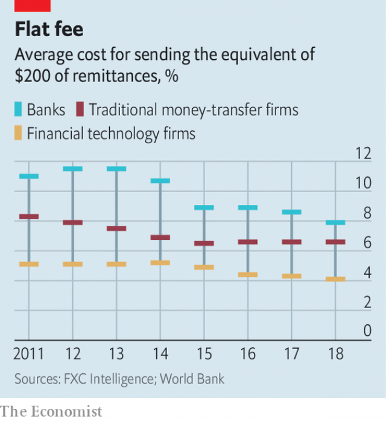

###### Special FX

# Fintech takes aim at the steep cost of international money transfers 

##### High-street banks and bureaus will soon have to come clear about hidden costs 

 

> Apr 11th 2019 

FOR MIGRANT workers, sending money home is an expensive chore. They send plenty: remittances to developing countries are set to reach $550bn this year, beating foreign direct investment, the World Bank said on April 8th. Total cross-border transfers to and from individuals and small businesses come to $10trn a year. But a hefty chunk is taken in fees along the way. 

American high-street banks can charge over 5% for smallish transfers between major currencies. MoneyGram, an established money-transfer giant, levies 5% for the hop from Britain (sterling) to Ireland (euros). Fees for minor currencies are swingeing. Wiring $200 from South Africa to Nigeria can take days, and costs over 25%. Cash transfers are even worse value. 

Now some fintechs are trying to disrupt the cosy status quo. In a world made smaller by Skype and instant messaging, “why does money still go on a donkey?” asks Taavet Hinrikus of TransferWise, a London-based fintech that typically charges a tenth as much as British banks. As yet the newcomers have merely nibbled around the edges. But as incumbents abandon tricky markets, technology improves and financial regulators take aim at unclear pricing, they look set to take a bigger bite. 

To send money across borders, banks use “correspondent” accounts they open with each other. When Anna at Bank A wants to wire $10 to Boris at Bank B, Bank A takes $10 from Anna’s account. It then sends a message through SWIFT—a system used by 11,000 banks to communicate—telling Bank B to wire $10 from its correspondent account into Boris’s. The matter is then settled. Money transfers become about moving data, not money. 

There is a wrinkle that will be familiar to air travellers. When two banks have no direct connection, the chain of requests has to involve stopovers. Each “airport” levies a fee and makes the transfer go through security, creating delays. That is happening more often. Afraid of falling foul of tightening anti-money-laundering rules, banks are increasing their oversight by shrinking their sprawling networks. The number of active correspondent relationships fell by 16% in the six years to 2018. 

That leaves space for fintechs willing to do the due diligence needed to forge their own correspondent relationships. Their costs are lower, too. They generally seek to reduce the “float”—the currency they must hold offshore to match users’ requests. Many of them save by aggregating transfers to net them out against payments going the other way. And, unencumbered by high-street banks’ outdated computer systems, they can be more technologically nimble. 

Some use machine learning to predict demand. Small World, a firm based in London, found that migrants send more money home when it is raining where they are living, says Nick Day, its boss. According to FXC Intelligence, a data provider, the best fintechs keep fees below 2%, and much less on popular routes. They are generally faster, too. London-based Azimo does near-instant transfers to over 80 countries. 

Remitly, based in Seattle, processes transfers of $6bn a year. But so far, rather than gobbling up market share, remittance-focused start-ups are taking slices of an expanding pie. Most stick to specific corridors and digital channels. That leaves many destinations, and customers holding cash, to decades-old giants like MoneyGram and Western Union, which runs a global network of 550,000 agents. 

 

Western Union is everywhere except in Iran and North Korea, says Hikmet Ersek, its chief executive. The firm, which handles $88bn of consumer-to-consumer transfers a year, is on average 15% dearer than competitors, he admits. But he does not see pressure on pricing, “because no one is in the last mile”. 

Challengers have taken a bigger share of transfers between developed countries. TransferWise, which processes $46bn a year, says it accounts for 15% of British consumers’ outbound transfers, beating banks. The banks seem unconcerned: their pricing has not budged since 2015. “The brand equity of big banks still allows them to charge more,” says Daniel Webber of FXC Intelligence. 

Opaque pricing makes that easier. Unlike loans, the cost of which is neatly captured in the interest rate, cross-border transfers attract two sorts of charges, a fixed commission and a margin on the mid-market exchange rate. And, like plane fares, fees can rise or fall depending on the timing and amount of the transfer. 

Regulators are turning their sights on what they see as a malfunctioning market. Last December the European Commission passed a law that will force banks and firms to disclose markups from 2020. Australia’s regulator is considering a similar move. 

Startups should benefit. A study in 2018 found that when fees were clear, the share of consumers who chose the cheapest provider of transfers rose by a quarter. But in the longer term the result may be to change the way incumbents work. In Europe mobile-only banks such as N26 and Monzo already use TransferWise to handle transfers. Their bricks-and-mortar peers should seek similar deals, says Martin Griffiths, head of fintech at Barclays, a British bank, if they do not want to see the market disrupted around them. 

-- 

 单词注释:

1.fx[]:abbr. 外汇（Foreign Exchange）；固定电台（Fixed Station） 

2.fintech[]:[网络] 金融科技；表面处理技术展；金融资讯科技服务 

3.APR[]:[计] 替换通路再试器 

4.migrant['maigrәnt]:n. 候鸟, 移居者 [法] 移居者 

5.chore[tʃɒ:]:n. 零工, 家务 [经] 零工 

6.remittance[ri'mitns]:n. 汇款 [经] 汇款, 寄款, 支付(金额) 

7.hefty['hefti]:a. 重的, 肌肉发达的 

8.chunk[tʃʌŋk]:n. 大块, 矮胖的人(或物) [经] 定样 

9.smallish['smɒ:liʃ]:a. 有点小的, 短小的 

10.moneygram[]:[网络] 速汇金；速汇金业务；速汇金国际有限公司 

11.levy['levi]:n. 税款, 所征的人数, 征收 vi. 征税, 课税 vt. 征收, 强求, 召集 

12.hop[hɒp]:n. 单脚跳, 跳跃, 舞会, 飞行 vi. 单脚跳, 跳跃 vt. 跃过, 跳上, 加蛇麻子于, 服麻醉药 [计] 跳跃式传输 

13.sterling['stә:liŋ]:n. 英国货币, 标准纯银 a. 英国货币的, 标准纯银的, 含标准成分的 

14.euro['juәrәu]:n. 欧元（欧盟的统一货币单位） 

15.swinge[swindʒ]:vt. 责打, 烤焦 

16.Nigeria[nai'dʒiriә]:n. 尼日利亚 

17.disrupt[dis'rʌpt]:a. 分裂的, 中断的 vt. 使分裂, 使瓦解 

18.statu[]:[网络] 状态查看；雕像；特级雪花白 

19.quo[]:vt. [古]说 

20.skype[]:n. 网络电话（一个网络语音沟通工具） 

21.fintech[]:[网络] 金融科技；表面处理技术展；金融资讯科技服务 

22.typically['tipikәli]:adv. 代表性地；作为特色地 

23.newcomer[nju:'kʌmә]:n. 新来者 

24.nibble['nibl]:n. 少量食物, 细咬, 轻咬, 啃 v. 一点一点地咬, 细咬, 吹毛求疵 [计] 半字节 

25.incumbent[in'kʌmbәnt]:a. 现任的, 依靠的, 负有义务的 n. 领圣俸者, 在职者 

26.tricky['triki]:a. 狡猾的, 机敏的 

27.regulator['regjuleitә]:n. 调整者, 校准者, 校准器, 调整器, 标准钟 [化] 调节剂; 调节器 

28.unclear[.ʌn'kliә]:a. 不易了解的, 不清楚的, 含混的 

29.anna['ænә]:n. 安娜（女子名） 

30.boris['bɔris]:n. 鲍里斯（男子名） 

31.B[bi:]:[计] 基地址, 数据库, 基极, 二进制, 块, 字组, 布尔, 总线, 占线, 字节 [医] 硼(5号元素) 

32.datum['deitәm]:n. 论据, 材料, 资料, 已知数 [医] 材料, 资料, 论据 

33.traveller['trævlә]:n. 旅行者 [经] 旅行商 

34.stopover['stɒp.әuvә]:n. 中途停留 

35.foul[faul]:a. 污秽的, 邪恶的, 恶臭的, 肮脏的, 恶劣的, 淤塞的 vt. 弄脏, 妨害, 污蔑, 犯规, 淤塞 vi. 腐烂, 犯规, 缠结 adv. 违反规则地, 不正当地 n. 犯规, 缠绕 

36.tighten['taitn]:vt. 勒紧, 使变紧 vi. 变紧, 绷紧 

37.oversight['әuvәsait]:n. 勘漏, 失察, 失败, 照料 [经] 监督权 

38.sprawl[sprɒ:l]:vi. 伸开手足躺, 爬行, 蔓生, 蔓延 vt. 懒散地伸开, 使蔓生, 使不规则地伸展 n. 伸开手足躺卧姿势 

39.diligence['dilidʒәns]:n. 勤奋 

40.forge[fɒ:dʒ]:n. 熔炉, 铁工厂 vt. 打制, 锻造, 伪造 vi. 锻造, 伪造 

41.aggregate['ægrigәt]:n. 合计, 总计, 聚集体 a. 合计的, 聚集的 v. 聚集, 集合, 合计达 [计] 聚合体; 聚集 

42.unencumbered['ʌnin'kʌmbәd]:a. 没有阻碍的, 不受妨碍的, 没有负担的, 没有家累的, 没有子女的 

43.outdate[.aut'deit]:vt. 使过时 

44.technologically[teknә'lɔdʒikәli]:adv. 技术上地；科技地 

45.nimble['nimbl]:a. 敏捷的, 伶俐的, 聪明的 

46.migrant['maigrәnt]:n. 候鸟, 移居者 [法] 移居者 

47.nick[nik]:n. 刻痕, 缺口, 划痕 vt. 刻痕于, 弄缺, 擦伤 vi. 狙击 

48.provider[prә'vaidә]:n. 供应者, 供养人, 伙食承办人 [计] 提供器 

49.les[lei]:abbr. 发射脱离系统（Launch Escape System） 

50.Seattle[si'ætl]:n. 西雅图 

51.gobble['gɒbl]:n. 火鸡叫声 vt. 狼吞虎咽 vi. 贪食, 咯咯叫 

52.Iran[i'rɑ:n]:n. 伊朗 

53.Korea[kә'riә]:n. 朝鲜, 韩国 

54.hikmet[]:[网络] 赫克买提；希可梅；亚萨维的赞诗 

55.Ersek[]:n. 厄塞克 

56.challenger['tʃælindʒә]:n. 挑战者 [经] 申请回避的人 

57.outbound['autbaund]:a. 开往国外的 [计] 出站 

58.budge[bʌdʒ]:vi. 微微移动 vt. 推动 n. 羔羊皮 

59.equity['ekwiti]:n. 公平, 公正 [经] 权益, 产权 

60.daniel['dænjәl]:n. 丹尼尔（男子名） 

61.Webber[]:n. 韦伯（姓氏） 

62.opaque[әu'peik]:n. 不透明物 a. 不透明的, 不传热的, 不传导的, 阴暗的 [计] 白底 

63.neatly['ni:tli]:adv. 整洁地, 干净地, 匀称地 

64.timing['taimiŋ]:n. 时间选择, 时间测定, 定时, 调速 [计] 定时器时钟 

65.malfunction[.mæl'fʌŋʃәn]:n. 故障, 失灵, 疾病 vi. 发生故障, 不起作用 [计] 故障 

66.markup['mɑ:kʌp]:n. 涨价, 利润, 标高价 

67.startup[]:[计] 启动 

68.peer[piә]:n. 同等的人, 匹敌, 贵族 vi. 凝视, 窥视, 费力地看, 隐现 vt. 与...同等, 封为贵族 

69.Martin['mɑ:tin]:n. 马丁, 圣马丁鸟 

70.griffith['^rifiθ]:n. 格里菲思（女子名, Griffin的异体） 

71.barclay['bɑ:kli]:n. 巴克利（姓氏, 男子名） 

