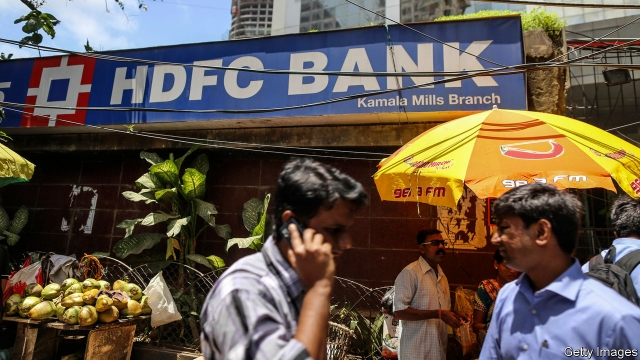

###### Bucking the trend

# How HDFC breaks the dismal pattern of Indian banking 

##### Its growth and profits put it in an elite global club 

 

> Apr 11th 2019 

INDIA’S BANKS have a poor reputation—and for good reason. The state-controlled ones offer cheap credit to the well-connected, have piles of bad loans and are barely accountable. Nor are the private ones flawless. In the past year the bosses of two of the biggest left after concerns were expressed by the Reserve Bank of India: at Axis Bank because of credit problems and at Yes Bank because of governance worries. The head of the second-largest, ICICI, stepped down because of a scandal involving loans to a firm whose shareholder had dealings with her husband. 

In this dismal scene one bank, HDFC, consistently shines. In the coming days it is expected to announce the latest in a series of stellar performances. Profits are expected to be around 20% higher than last year. Return on assets is 1.8% and return on equity is around 17%—excellent for a bank. The share price is 286 times what it was in 1995, when the firm went public—and 132 times its 1995 level in dollars. The bank’s market value is over $90bn, and Goldman Sachs thinks that it could exceed $200bn by 2024. That would gain HDFC admittance to a global elite now made up of American and Chinese behemoths. 

HDFC Bank is an offshoot of a mortgage company of the same name (the initials stand for “housing development finance corporation”), which was set up in 1977 by Hasmukh Parekh, the chairman of ICICI’s board. Mr Parekh persuaded his nephew, Deepak Parekh, then at Chase Manhattan Bank, to return to India to run the new company. In 1994 Deepak obtained a licence for a new bank and recruited people with experience similar to his own to run it—that is, Indians who had worked in big global banks. The chief executive, Aditya Puri, came from Citi; staff from Bank of America, ANZ Grindlays, Deutsche, Barclays, Standard Chartered and many others were also hired. 

He was initially hesitant about the move from Citi, says Mr Puri. At the time Citi seemed well-placed to become a dominant force in Asian finance. It and the other global banks in India had advanced products, good service and talented employees. But with hindsight it is clear that he made the right call. Though Citi retains a local business in many Asian countries, it largely serves a high-income niche. Most of the other foreign banks have retrenched and focused on cross-border transactions. 

The global banks were not wrong about the size of the opportunity. In the Indian market, says Mr Puri, “demand is not an issue”. A vast segment of the population was unbanked or underbanked—not just individuals, but also small businesses. 

At first HDFC Bank focused on large corporate customers, where its newly hired staff’s contacts were useful. The recruits from global banks brought valuable know-how with them. Notably, it did well in niches where Citi was strong, such as credit cards. It beefed up its technology and gained the scale needed to press into the mass market. Mr Puri says HDFC can now process a personal loan and put money in an account in 11 seconds. And it expanded its business offering to sophisticated areas, such as the payment mechanisms of India’s stock exchange. 

It also sought to serve small companies previously excluded from the financial system. In February it opened its 5,000th branch, giving it by far India’s largest private-bank network. Equally important are the 30,000 employees who promote phone-based banking to shops and individuals in smaller cities and villages. Among the most prominent of these marketers is Mr Puri. Though he owns neither a mobile phone nor a computer, he has begun showing up in far-flung regions to sell the bank’s services to small shops. These make more profitable customers than is generally understood, he says, since their entire financial lives are within the bank’s system and they are easy to cross-sell to. 

Of great interest to India’s business community is what comes next for HDFC. Indian law requires bankers to retire at 70; that gives Mr Puri a little over a year more in the job. Corporate bosses can stay until 75, so there may be a way to find him another five years. Plans are in place for both eventualities, he says. Romesh Sobti, who turned round another private bank, IndusInd, is also nearing retirement. The departure of a successful leader is always a ticklish moment—even more so in India’s harsh banking scene. 

-- 

 单词注释:

1.buck[bʌk]:n. 元, 雄鹿, 纨绔子弟, 鞍马, 培克(赌博时的庄家标志), 碱水, 自夸, 谈话 vi. 马背突然拱起, 反对, 吹牛, 闲聊 vt. 马背突然拱起将骑手摔下, 反对, 用碱水洗 a. 雄的 

2.hdfc[]:[网络] 金融公司；任命住房开发金融公司(Housing Development Finance Corporation)；印度住房开发金融公司 

3.dismal['dizmәl]:a. 阴沉的, 凄凉的, 令人忧郁的 n. 低落的情绪, 沼泽 

4.elite[ei'li:t]:n. 精华, 精锐, 中坚分子 

5.APR[]:[计] 替换通路再试器 

6.accountable[ә'kauntәbl]:a. 负有责任的, 可说明的, 可解释的 [经] 负有责任的 

7.flawless['flɒ:lis]:a. 无瑕疵的, 无缺点的 [化] 无裂纹的; 无裂缝的 

8.governance['gʌvәnәns]:n. 统治, 统辖, 管理 [法] 统治, 管理, 支配 

9.icici[]:abbr. Industrial Credit and Investment Corporation of India, Ltd. 印度工业信贷投资公司 

10.shareholder['ʃєә.hәuldә]:n. 股东 [法] 股东, 股票持有人 

11.dealing['di:liŋ]:n. 经营行为, 行为, 交易 [法] 待遇, 处置, 行为 

12.consistently[]:adv. 坚固, 坚实, 一致, 始终如一, 连贯 [计] 相容地 

13.sery[]:n. (Sery)人名；(俄)谢雷；(科特)塞里 

14.stellar['stelә]:a. 星的, 似星的, 星球的, 主要的 

15.asset['æset]:n. 资产, 有益的东西 

16.equity['ekwiti]:n. 公平, 公正 [经] 权益, 产权 

17.goldman[]:n. 高曼（姓氏） 

18.Sachs[zaks]:n. 萨克斯（汽车零配件生产厂商） 

19.admittance[әd'mitәns]:n. 进入, 进入权, 准许进入 [化] 导纳 

20.behemoth[bi'hi:mɔθ]:n. 庞然大物 

21.offshoot['ɒ:fʃu:t]:n. 分支, 旁系, 衍生事物 

22.mortgage['mɒ:gidʒ]:n. 抵押, 约束性义务, 抵押借款 vt. 抵押, 以...作担保, 把...许给 

23.parekh[]:[网络] 帕雷克；帕莱克 

24.deepak[]:n. 迪帕克（男子名） 

25.Manhattan[mæn'hætәn]:n. 曼哈顿 

26.aditya[]:n. (Aditya)人名；(英、尼)阿迪蒂亚 

27.puri['pu:ri]:n. [印尼]宫, 宫殿 

28.citi[]:n. 花旗集团 

29.anz[]:n. (Anz)人名；(德)安茨 abbr. 澳新银行（Australia and New Zealand Banking Group）；新西兰航空公司（Air New Zealand） 

30.grindlay[]: [人名] 格林德利 

31.deutsche[]:n. 德意志联邦共和国马克 

32.barclay['bɑ:kli]:n. 巴克利（姓氏, 男子名） 

33.charter['tʃɑ:tә]:n. 特许状, 执照, 宪章 vt. 特许, 发给特许执照 

34.initially[i'niʃәli]:adv. 最初, 开头 

35.hesitant['hezitәnt]:a. 迟疑的, 踌躇的, 犹豫不定的 

36.dominant['dɒminәnt]:a. 占优势的, 支配的 [医] 优性的, 显性的 

37.talented['tælәntid]:a. 天资高的, 有才能的 

38.hindsight['haindsait]:n. 枪的表尺, 事后聪明 

39.niche[nitʃ]:n. 壁龛 vt. 放入壁龛, 安顿 

40.retrench[ri'trentʃ]:vt. 紧缩, 减少, 删除 vi. 削减费用 

41.transaction[træn'sækʃәn]:n. 交易, 办理, 学报, 和解协议 [计] 事务处理 

42.unbanked[ʌn'bæŋkt]: [财]无银行账户 

43.corporate['kɒ:pәrit]:a. 社团的, 合伙的, 公司的 [经] 团体的, 法人的, 社团的 

44.notably['nәjtbәli]:adv. 显著地, 著名地, 尤其, 特别 

45.nich[]:abbr. 新生儿颅内出血（neonatal intracranial hemorrhage） 

46.sophisticate[sә'fistikeit]:n. 久经世故的人, 精于...之道的人 vt. 篡改, 曲解, 使变得世故, 掺合, 弄复杂 vi. 诡辩 

47.mechanism['mekәnizm]:n. 机械, 机构, 结构, 机理, 技巧 [化] 机理; 历程; 机构 

48.equally['i:kwәli]:adv. 相等地, 同样地, 平等地 

49.marketer['mɑ:kitә]:n. 赶集者, 市场商人 [经] 在市场买卖的人, 市场商人 

50.banker['bæŋkә]:n. 银行家, 庄家 [经] 银行业者, 银行家 

51.corporate['kɒ:pәrit]:a. 社团的, 合伙的, 公司的 [经] 团体的, 法人的, 社团的 

52.eventuality[i.ventʃu'æliti]:n. 可能发生的事, 可能性 

53.romesh[]:[网络] 罗米什 

54.retirement[ri'taiәmәnt]:n. 退休, 隐居, 撤退 [经] 退休, 退股, (固定资产)报废 

55.alway['ɔ:lwei]:adv. 永远；总是（等于always） 

56.ticklish['tikliʃ]:a. 易倒的, 不稳定的, 难对付的, 怕痒的 

