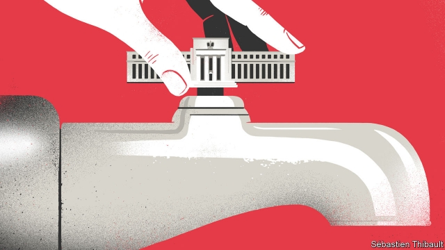

###### Free exchange

# How not to weaken central banks’ independence 

##### Why Stephen Moore and Herman Cain are poor picks for the Fed 

 

> Apr 13th 2019 

THERE ARE more than a few echoes of the Nixon era in the presidency of Donald Trump. Monetary reverberations are among them. Facing re-election in 1972, Richard Nixon felt he needed a strong economy at his back, and made a habit of haranguing Arthur Burns, the chairman of the Federal Reserve at the time. Burns recounted the meetings in his diaries: “The president looked wild; talked like a desperate man; fulminated with hatred against the press; took some of us to task…” Historians reckon Burns was too accommodating of Nixon’s demands, and so helped launch the inflation of the 1970s. Mr Trump is now waging his own assault on the Fed’s independence. He has repeatedly complained about the central bank’s decisions and urged it to take a more doveish stance. 

More strikingly Mr Trump, who has already chosen three of the five sitting members of the Fed’s board of governors, has named Stephen Moore and Herman Cain to fill the remaining two vacancies. In contrast to candidates who have come before, both are political activists. But the parallel with the 1970s is less apt than it seems. There are different ways to politicise monetary policy, and Mr Trump’s is particularly poisonous. 

Nixon’s inflation helped inform modern ideas of central-bank independence. In 1977 Finn Kydland and Edward Prescott, who won the Nobel prize together in 2004, published a seminal paper on the problem of “time inconsistency”. Governments can promise to keep inflation low, they argued, but that promise becomes harder to keep as time goes on. Once the public expects low inflation, there are political advantages to generating a burst of higher-than-anticipated price growth, which reduces the real (inflation-adjusted) value of debt and generates a short-run increase in real incomes and output. As governments succumb to the temptation to inflate, expectations adjust and the inflation rate needed to surprise the public rises ever higher. In the absence of a mechanism to keep inflation low, prices accelerate. Along with policy rules and inflation targets, central-bank independence became one of the ways governments’ promise not to inflate were made credible. 

Yet even as independence became more common, it remained incomplete. Governments are often responsible for setting central banks’ mandates, appointing their heads and determining what tools they can use to do their jobs. Many elected leaders have succumbed to the temptation to jawbone monetary policymakers. In the months before the election of 1992, George H.W. Bush urged Alan Greenspan to cut interest rates; he later blamed the Fed for his loss at the polls. In his memoirs Paul Volcker recalls an awkward meeting with Ronald Reagan and his chief of staff, James Baker, in which he was ordered not to raise rates in the run-up to the election of 1984. During the financial crisis, central banks around the world came under fire from politicians for having allowed financial excess to build up, bailing out banks during the crisis and using unconventional measures to support damaged economies. 

These political intrusions did not prevent central banks from keeping inflation low. On the contrary, economists are increasingly asking whether stubbornly low rates of inflation, interest and growth show that the need for independence was overstated. Inflation was high around the world in the 1970s. Perhaps rather than a weak-willed Fed chairman being to blame, the problem lay in factors specific to that period, or a flawed understanding of the relationship between monetary policy and inflation. 

Faced with today’s chronically low interest rates, central banks may need to revise their policy frameworks to stop economies falling into slumps. But without a shove from politicians, they may be too institutionally conservative to do so. Shinzo Abe, Japan’s prime minister, won election in 2012 on a promise to rejuvenate the economy, and immediately pressed the Bank of Japan to be more zealous. The result has been an impressive run of growth rather than a macroeconomic disaster. Structurally low interest rates also mean that central banks need more help from fiscal policymakers when demand slackens. That co-operation will inevitably weaken central banks’ institutional independence. 

Might one argue, then, that by pressing the Fed to aid his re-election campaign Mr Trump is undercutting a norm that has outlived its usefulness—even, that he could be helping America claw its way out of the low-rate trap that has ensnared most of the rich world? In fact, the selection of Mr Moore and Mr Cain suggests a very different sort of politicisation is at work. Neither is a professional economist; both have worked extensively in Republican politics. Mr Moore advised Mr Cain during his campaign for the Republican presidential nomination in the election of 2012, which was derailed after a promising start by allegations of sexual harassment. Both have expressed monetary-policy positions that might mark them out as hawks. In 2008, when the American economy was on the brink of a deep recession, Mr Moore said that the Fed should be raising rates rather than cutting them, and predicted high inflation to come. Mr Cain has said he favours a return to the gold standard. But politics, rather than data or principles, appears to guide their views. Mr Moore now joins the president in complaining that the Fed is holding back growth unnecessarily. Mr Cain has repeatedly claimed, falsely, that statistical agencies faked economic data in an effort to boost the fortunes of Barack Obama. 

Perhaps, if appointed, the pair would surprise Mr Trump and vote as his prior picks have, in an orthodox fashion. If they behave instead as party loyalists, the greatest risk is not that an ineffectual Fed will allow inflation like that of the 1970s to take hold. The opposite might well result if the pair revert to hawkishness when power changes hands. The danger is rather that the Fed will become a political weapon, and that America will move closer to becoming a nation where the welfare of the ruling party trumps that of the country as a whole. 

-- 

 单词注释:

1.stephen['sti:vn]:n. 斯蒂芬（男子名） 

2.moore['muә]:n. 摩尔（男子名） 

3.herman['hә:mәn]:n. 赫尔曼（男子名） 

4.cain[kein]:n. 凶手；杀兄弟者；该隐（亚当之子） 

5.APR[]:[计] 替换通路再试器 

6.nixon['niksn]:n. 尼克松（美国第37任总统） 

7.presidency['prezidәnsi]:n. 总统职权, 总裁职位 

8.monetary['mʌnitәri]:a. 货币的, 金钱的 [经] 货币的, 金融的 

9.reverberation[ri.vә:bә'reiʃәn]:n. 反响, 混响, 反射 [电] 交混回响 

10.richard['ritʃәd]:n. 理查德（男子名） 

11.harangue[hә'ræŋ]:n. 演讲, 热烈讨论, 长篇大论, 夸夸其谈 vt. 向...夸夸其谈地讲话 

12.arthur['ɑ:θә]:n. 亚瑟（男子名）；亚瑟王（传说中六世纪前后英国的国王, 圆桌骑士团的首领） 

13.recount[ri'kaunt]:vt. 详述, 叙述, 重新计算 n. 重新计算 

14.fulminate['fʌlmineit]:vt. 使爆发, 以严词谴责 vi. 爆炸, 怒喝, 电闪 n. 雷酸盐, 烈性炸药 

15.historian[hi'stɒ:riәn]:n. 历史学家, 记事者 

16.reckon['rekәn]:vt. 计算, 总计, 估计, 认为, 猜想 vi. 数, 计算, 估计, 依赖, 料想 

17.inflation[in'fleiʃәn]:n. 胀大, 夸张, 通货膨胀 [化] 充气吹胀; 膨胀 

18.assault[ә'sɒ:t]:n. 攻击, 袭击 vt. 袭击, 攻击 vi. 发动攻击 

19.doveish[]:[网络] 鸽子 

20.stance[stæns]:n. 准备击球姿势, 站立的姿势, 位置, 姿态 [经] 地位, 形势 

21.strikingly[]:adv. 显著地, 惊人地, 引人注目地 

22.vacancy['veikәnsi]:n. 空, 空白, 空缺, 空虚, 空闲 [化] 空位 

23.activist['æktivist]:n. 激进主义分子 

24.les[lei]:abbr. 发射脱离系统（Launch Escape System） 

25.apt[æpt]:a. 有...倾向的, 易于的, 恰当的, 聪明的 [计] 自动数控语言, 自动图象传输, 自动程序控制, 自动程序设计工具 

26.politicise[pɒ'lɪtɪsaɪs]:vt. 使政治化, 使具有政治性; 使对政治有兴趣 

27.monetary['mʌnitәri]:a. 货币的, 金钱的 [经] 货币的, 金融的 

28.Finn[fin]:n. 芬兰人 

29.kydland[]:[网络] 基德兰德；基德兰特；凯兰德 

30.edward['edwәd]:n. 爱德华（男子名） 

31.prescott['preskәt]:n. 普莱斯考特（男子名, 姓氏） 

32.Nobel['nәubel]:n. 诺贝尔 

33.seminal['seminl]:a. 精液的, 种子的, 生殖的 [医] 种子的; 精液的 

34.inconsistency[.inkәn'sistәnsi]:n. 不一致, 易变, 前后矛盾的事物 [法] 前后矛盾, 不一致 

35.succumb[sә'kʌm]:vi. 屈从, 屈服, 死 

36.inflate[in'fleit]:vt. 使膨胀, 使得意, 使通货膨胀, 使充气 vi. 充气, 膨胀 

37.mechanism['mekәnizm]:n. 机械, 机构, 结构, 机理, 技巧 [化] 机理; 历程; 机构 

38.credible['kredәbl]:a. 可信的, 可靠的 [法] 可信的, 可靠的 

39.incomplete[.inkәm'pli:t]:a. 不完全的, 未完成的, 不完善的 [机] 不完全的 

40.mandate['mændeit]:n. 命令, 指令, 要求 vt. 委任统治 

41.jawbone['dʒɒ:bәun]:n. 颚骨, 下颚骨, 信用 v. 赊买 

42.policymaker['pɔlisi.meikә]:n. 政策制定者；决策人 

43.george[dʒɔ:dʒ]:n. 乔治（男子名）；自动操纵装置；英国最高勋爵勋章上的圣乔治诛龙图 

44.hw[]:abbr. 半波（Half Wave）；热水（hot water）；硬件（Hardware） 

45.alan['ælәn]:n. 艾伦（男子名） 

46.Greenspan[]:[经] 格林斯班 

47.memoir['memwɑ:]:n. 传记, 实录, 追思录, 回忆录, 自传 [化] 研究报告 

48.paul[pɔ:l]:n. 保罗（男子名） 

49.Volcker[]:沃尔克（人名） 

50.ronald['rɔnәld]:n. 罗纳德（男子名） 

51.reagan[]:n. 里根（姓氏） 

52.jame[]: 灰岩井 

53.baker['beikә]:n. 面包师 [医] 烤箱(骨科用) 

54.bail[beil]:n. 保释, 拎环, 杓, 栅栏 vt. 保释, 舀水 

55.unconventional[.ʌnkәn'venʃәnl]:a. 不依惯例的, 非传统的, 非常规的 

56.intrusion[in'tru:ʒәn]:n. 闯入, 侵扰 [医] [向内]突入 

57.economist[i:'kɒnәmist]:n. 经济学者, 经济家 [经] 经济学家 

58.stubbornly[]:adv. 倔强地；顽固地 

59.overstate[.әuvә'steit]:vt. 夸大的叙述, 夸张, 过分强调 [经] 多计, 高估 

60.inflation[in'fleiʃәn]:n. 胀大, 夸张, 通货膨胀 [化] 充气吹胀; 膨胀 

61.flaw[flɒ:]:n. 缺点, 裂纹, 瑕疵, 一阵狂风 [化] 划痕; 裂缝; 裂纹 

62.chronically['krɒnikli]:adv. 慢性地, 长期地, 习惯性地 

63.slump[slʌmp]:n. 暴跌, 垂头弯腰的姿态 vi. 猛然掉落, 陷入, 衰落(经济等) 

64.shove[ʃʌv]:n. 推, 挤 vt. 推挤, 猛推, 强使 vi. 推 

65.institutionally[]:adv. institutional的变形 

66.shinzo[]:[网络] 晋三；爆裂战士战蓝宝；神像 

67.abe[eib]:n. 亚伯（男子名, 等于Abraham） 

68.rejuvenate[ri'dʒu:vineit]:vt. 使年轻, 使复原, 使恢复精神 vi. 返老还童, 复原 

69.macroeconomic[-mik]:n. 整体经济 

70.structurally[]:[计] 结构地 

71.fiscal['fiskәl]:a. 财政的, 国库的 [经] 财政上的, 会计的, 国库的 

72.slacken['slækәn]:vt. 使松弛, 放松, 放慢 vi. 变松弛, 减弱, 松劲 

73.inevitably[in'evitәbli]:adv. 不可避免地 

74.institutional[.insti'tju:ʃәnәl]:a. 制度的, 公共机构的, 学会的 [法] 组织机构的, 制度的, 公共机构的 

75.undercut['ʌndәkʌt]:n. 底切, 牛腰部下侧嫩肉, 下口, 下旋削球 vt. 廉价出售, 底切, 雕出, 下旋削球 vi. 切除底部 

76.norm[nɒ:m]:n. 基准, 模范, 标准, 准则, 平均数 [化] 定额 

77.outlive[aut'liv]:vt. 比...经久, 比...活得长, 度过(风暴)而健在 

78.ensnare[in'snєә]:vt. 以陷阱捕捉, 诱入圈套, 诱捕 

79.politicisation[]:[网络] 科学政治化 

80.extensively[]:adv. 广大, 广延, 外延, 大面积(耕种), 粗放, 广博, 广泛, 广阔 

81.politic['pɒlitik]:a. 精明的, 明智的, 策略的 

82.presidential[.prezi'denʃәl]:a. 总统制的, 总统的, 首长的, 统辖的 [法] 总统的, 议长的, 总经理的 

83.nomination[.nɒmi'neiʃәn]:n. 提名, 任命, 提名权 

84.derail[di'reil]:vt. 使出轨 n. 脱轨器 [计] 转移指令 

85.allegation[.æli'geiʃәn]:n. 断言, 主张, 申辩 [法] 声明, 事实陈述, 断言 

86.harassment['hærәsmәnt]:n. 困扰, 烦扰, 烦恼 [法] 折磨, 骚扰, 侵扰 

87.brink[briŋk]:n. 边缘, 陡岸 

88.recession[ri'seʃәn]:n. 后退, 凹处, 衰退, 归还 [医] 退缩 

89.datum['deitәm]:n. 论据, 材料, 资料, 已知数 [医] 材料, 资料, 论据 

90.unnecessarily[ʌn'nesisәrili]:adv. 不必要地, 多余地 

91.falsely['fɒ:lsli]:adv. 虚伪地, 错误地, 不实地 

92.fake[feik]:n. 假货, 欺骗, 诡计 a. 假的 vt. 假造, 仿造 vi. 伪装 

93.barack[bɑ:'ræk]:n. 巴拉克（男子名） 

94.obama[]:n. 奥巴马(姓) 

95.orthodox['ɒ:θәdɒks]:a. 正统的, 传统的, 惯常的 

96.loyalist['lɒiәlist]:n. 忠诚的人, 反对独立者, 反佛朗哥派的人 

97.ineffectual[.ini'fektʃuәl]:a. 无效的, 无益的 

98.revert[ri'vә:t]:vi. 恢复, 复归, 回复, 还原 vt. 使回复原状, 使回转 n. 恢复原信仰的人 [计] 还原 

99.hawkishness[]:鹰派人物 主战分子 贪婪的人 

100.trump[trʌmp]:n. 王牌, 法宝, 喇叭 vt. 打出王牌赢, 胜过 vi. 出王牌, 吹喇叭 

