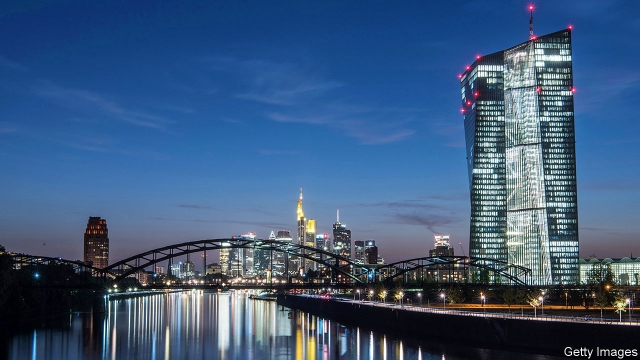
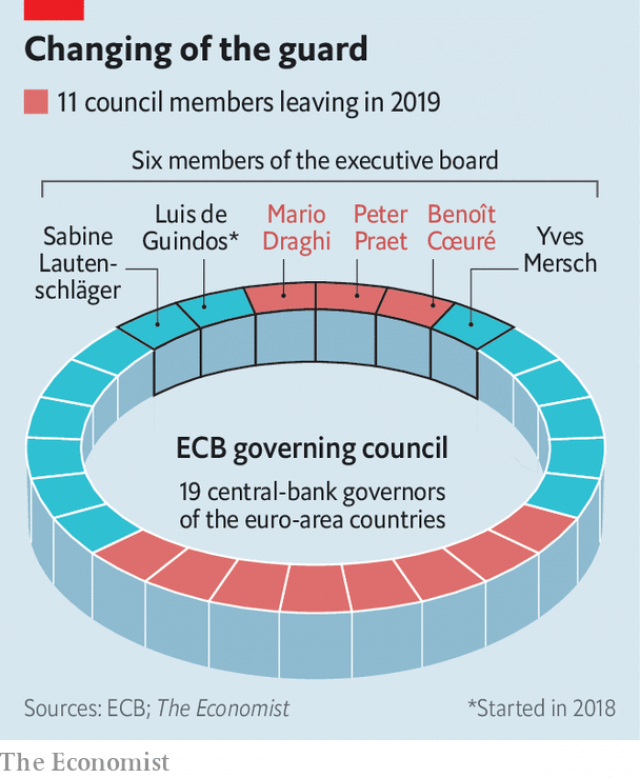

###### Succession questions

# Mario Draghi’s successor at the ECB has plenty to do 

##### The ECB has come into its own, but 2019 will still be a momentous year 

 

> Apr 13th 2019 

THE HEADQUARTERS of the European Central Bank (ECB) tower over the river Main. The institution has been equally imposing in the life of Europe’s monetary union. As its only policymaker, it rescued the euro from financial and sovereign-debt crises, and powered a recovery in 2015-17. 

But it cannot rest on its laurels. This year promises to be one of high drama. Three of its six-strong executive board will depart, notably its president, Mario Draghi, and its chief economist, Peter Praet (see graphic). By the end of the year eight of the 19 national central-bank governors on its rate-setting body will have stepped down. The end of Mr Draghi’s eight-year tenure coincides with European elections and the top jobs in Brussels coming up for grabs. That makes the choice to replace him unusually political. Should their quest for the commission or council presidencies fail, the French or Germans could seek to put a compatriot—or in the Germans’ case another hawkish northerner—into the ECB job as a consolation prize. 

All this could alter the course of monetary policy. Poor choices could mean blunders in dealing with a slowing economy or too-low inflation. The bank’s hard-won credibility as the guardian of the euro could come under threat. 

 

The ECB was set up in 1998, a central bank without a fiscal counterpart. To soothe German fears that it would go too easy on inflation, it was based in Frankfurt and modelled on the Bundesbank. Its intellectual direction came from its chief economist, Otmar Issing, a former Bundesbank rate-setter. Like other central banks, it targeted inflation. But to appease the Germans, it also concerned itself with the rate of money-supply growth. 

Two decades on, the Bundesbank’s influence has waned. The ECB focuses less on the money supply, after its link with inflation proved wildly unstable. Philip Lane, a doveish Irishman, takes over as chief economist in June. Neither the economic nor monetary-policy areas is overseen by a German staff member. 

To see why the choice of successor for Mr Draghi is so important, consider what he has done—and left undone. Observers are gushing: one compares him to Cincinnatus, a loyal citizen who saved the Roman republic from invasion. His open-minded pursuit of price stability led to the use of unconventional tools such as quantitative easing (QE) to stave off deflation, despite northern members’ horror of monetising government debt. Like other central banks, the ECB has gained bank-supervision and macroprudential powers since the crisis. 

Fittingly for a governor who sees communication as central to his role, his biggest policy intervention was uttered but not implemented. In 2012 he said he would do “whatever it takes” to save the euro, promising to buy unlimited amounts of government bonds if sovereigns hit trouble. The ECB’s communications compare well with those of other big central banks, says Marcel Fratzscher, a former staffer now at DIW, a think-tank. Recent policy shifts have caused remarkably little market volatility, unlike some by the Federal Reserve. 

The next boss, though, will need to overhaul the bank’s monetary-policy strategy. Mr Draghi seems almost certain to depart having never raised interest rates; price pressures and inflation expectations, currently subdued, are likely still to be well below target. An economic slowdown kiboshed rate rises this year: on April 10th the bank promised to keep them on hold in 2019. They are already at rock-bottom levels, and the bank has bought €2.6trn ($3trn) of government bonds. Should the slowdown worsen, the new boss will have to find the firepower to reassure markets. 

The ECB’s independence is a matter of international law. EU members must all agree to any changes to its mandate. But another risk defies any attempt to legislate: that of politicised appointments to its governing council. National central-bank governors are often picked for reasons of domestic politics. The march of populism across the continent complicates matters. Austria’s incoming central-bank boss has no monetary-policy experience and is reportedly linked to the FPö, a hard-right party. Italy’s populists want to “reboot” their central bank’s management. 

Such appointments could exacerbate divisions among the governing council, which tend to be along national lines. It must set policy for the euro zone as a whole. But some members still play to domestic audiences. Take the decisions to announce outright monetary transactions (OMTs) that backed up Mr Draghi’s “whatever it takes” commitment, and to begin QE. Both were attacked by some northern central-bank governors and faced legal challenge in Germany. Jens Weidmann, the head of the Bundesbank and a possible successor to Mr Draghi, testified against OMTs. 

One interpretation of a ruling on QE by the European Court of Justice in 2018 is that the ECB has room to raise self-imposed limits on the share of government bonds it can buy in each member country. But heightened national divisions would make it harder to build support in the governing council. It might not help that, according to the Eurobarometer poll, public trust in the bank is far below pre-crisis levels both in countries like Spain and Greece, where the ECB is regarded by some as partly to blame for austerity, and in Germany, no fan of low interest rates and bond-buying. 

As the ECB gains powers, clashes with politicians become more likely. It now oversees large lenders, in which governments also take a keen interest. Last year, under pressure from the European Parliament, its supervisory arm toned down a plan to ask banks to make more provisions for non-performing loans. It also withdrew a request for new powers to centralise the regulation of clearing houses. Governments had sought to narrow their scope; the bank says that threatened its ability to conduct independent monetary policy. 

The ECB keeps banking supervision and monetary policy quite separate. But the president will set the tone of its response to political pressure, argues Sir Paul Tucker, a former deputy governor of the Bank of England who has written a book on the power of central banks in democracies. And Mr Draghi’s successor will need great skill to nudge governments to speed up fiscal and banking reforms, he says, to avoid monetary policy being the only game in town. That person will have to direct the bank’s efforts to return inflation to target, and perhaps deal with a recession, while balancing competing political interests. If its only functioning economic institution stumbles, so too will the euro zone. 

-- 

 单词注释:

1.mario['mæriәj, 'mɑ:-]:n. 马里奥（男子名） 

2.successor[sәk'sesә]:n. 继承者, 接任者 [计] 后继 

3.ECB[]:[计] 事件控制块 

4.momentous[mәu'mentәs]:a. 重大的, 重要的 

5.APR[]:[计] 替换通路再试器 

6.headquarter[,hed'kwɔ:tә]:vt. 将...的总部设在 

7.equally['i:kwәli]:adv. 相等地, 同样地, 平等地 

8.monetary['mʌnitәri]:a. 货币的, 金钱的 [经] 货币的, 金融的 

9.policymaker['pɔlisi.meikә]:n. 政策制定者；决策人 

10.euro['juәrәu]:n. 欧元（欧盟的统一货币单位） 

11.cannot['kænɒt]:aux. 无法, 不能 

12.laurel['lɒ:rәl]:n. 月桂树, 荣誉 vt. 使戴桂冠, 授予荣誉 

13.notably['nәjtbәli]:adv. 显著地, 著名地, 尤其, 特别 

14.Draghi[]:[网络] 行长德拉吉；总裁德拉吉；欧洲央行德拉吉 

15.economist[i:'kɒnәmist]:n. 经济学者, 经济家 [经] 经济学家 

16.peter['pi:tә]:vi. 逐渐消失, 逐渐减少 

17.graphic['græfik]:a. 生动的, 轮廓分明的, 绘画似的, 图解的 [计] 图形的 

18.tenure['tenjuә]:n. 享有, 保有期 [经] (财产,职位等的)占有, 占有权 

19.coincide[.kәuin'said]:vi. 一致, 符合 [化] 重合 

20.Brussel[]:n. 布鲁塞尔（比利时首都） 

21.grab[græb]:n. 抓握, 掠夺, 强占, 东方沿岸帆船 vi. 抓取, 抢去 vt. 攫取, 捕获, 霸占 

22.quest[kwest]:n. 探索, 寻求, 调查 v. 寻找, 找, 追寻猎物 

23.presidency['prezidәnsi]:n. 总统职权, 总裁职位 

24.hawkish['hɒ:kiʃ]:a. 像鹰的, 鹰派的, 强硬派的 

25.consolation[.kɒnsә'leiʃәn]:n. 安慰, 令人安慰的事物 [法] 安慰, 慰问 

26.blunder['blʌndә]:n. 大错, 大失策 vi. 失策, 跌跌撞撞地走, 犯错 vt. 做错 

27.inflation[in'fleiʃәn]:n. 胀大, 夸张, 通货膨胀 [化] 充气吹胀; 膨胀 

28.credibility[.kredi'biliti]:n. 可信用, 确实性, 可靠 [法] 证据能力, 可信程度, 确实性 

29.guardian['gɑ:diәn]:n. 看守者, 监护人, 保护人 a. 保护的 

30.fiscal['fiskәl]:a. 财政的, 国库的 [经] 财政上的, 会计的, 国库的 

31.counterpart['kauntәpɑ:t]:n. 副本, 复本, 配对物, 相应物 [经] 副本, 正副二份中之一 

32.soothe[su:ð]:vt. 缓和, 使安静, 安慰, 奉承 vi. 起安慰作用 

33.frankfurt['fræŋkfәt]:n. 牛肉香肠, 猪牛肉混合香肠 

34.bundesbank['bundəs,bæŋk]:n. 德意志联邦银行 

35.otmar[]:[网络] 奥特马 

36.appease[ә'pi:z]:vt. 抚慰, 缓解, 平息, 姑息 [法] 使和缓, 使满足, 姑息 

37.wane[wein]:n. 减少, 衰微, 败落, 亏缺, 月亏 vi. 变小, 亏缺, 衰落, 消逝, 退潮 

38.les[lei]:abbr. 发射脱离系统（Launch Escape System） 

39.wildly[]:adv. 狂暴地, 激动地, 狂热地, 鲁莽地, 轻率地 

40.philip['filip]:n. 菲利普（男子名） 

41.doveish[]:[网络] 鸽子 

42.Irishman['airiʃmәn]:n. 爱尔兰人 

43.oversee[.әuvә'si:]:vt. 向下看, 了望, 监督, 偷看到 [法] 监察, 监督, 俯瞰 

44.cincinnatus[]:n. 罗马政治家 

45.unconventional[.ʌnkәn'venʃәnl]:a. 不依惯例的, 非传统的, 非常规的 

46.quantitative['kwɒntitәtiv]:a. 数量的, 定量的 [医] 定量的, 数量的 

47.qe[]:abbr. 量子电子学（Quantum Electronics） 

48.stave[steiv]:n. 狭板, 梯级, 棍棒, 诗句 vt. 击穿, 弄破, 敲打, 赶走 vi. 穿孔, 破碎 

49.deflation[di'fleiʃәn]:n. 放气, 缩小, 通货紧缩 [医] 放气, 解除气胀 

50.monetise['mʌnitaiz]:vt. 使货币化；把…定位法定货币（等于monetize） 

51.macroprudential[]:[网络] 宏观审慎；宏观审慎措施；宏观谨慎 

52.fittingly['fɪtɪŋlɪ]:adv. 适切地, 适合地 

53.intervention[.intә'venʃәn]:n. 插入, 介入, 调停 [经] 干预 

54.unlimited[.ʌn'limitid]:a. 无限的, 不受限制的, 无条件的 [经] 无限的, 不定的 

55.sovereign['sɒvrin]:n. 元首, 独立国 a. 具有主权的, 至高无上的, 国王的, 完全的 

56.marcel[mɑ:'sel]:n. 波浪形鬈发 vt. 把...烫成波浪形 vi. 烫发 

57.staffer['stɑ:fә]:n. (一名)职员(尤指编辑或记者) 

58.DIW[]:舰船在水上静上不动 

59.remarkably[ri'mɑ:kәbli]:adv. 显著地, 引人注目地, 非常地 

60.volatility[.vɒlә'tiliti]:n. 挥发性, 挥发度, 轻快, 易变, 短暂 [计] 变更率 

61.overhaul[.әuvә'hɒ:l]:vt. 分解检查, 翻修, 精细检查, 彻底革新 n. 分解检查, 精细检查, 大检修 

62.currently['kʌrәntli]:adv. 现在, 当前, 一般, 普通 [计] 当前 

63.subdue[sәb'dju:]:vt. 使服从, 压制, 减弱, 抑制, 克制 

64.slowdown['slәudaun]:n. 降低速度, 减速 

65.kibosh['kaibɒʃ]:n. 胡说 

66.worsen['wә:sn]:vt. 使更坏, 使恶化 vi. 变得更坏, 恶化 

67.firepower['faiәpauә]:n. 火力 

68.reassure[.ri:ә'ʃuә]:vt. 使...安心, 向...再保证 [法] 重新保证, 再保险, 使清除疑虑 

69.EU[]:[化] 富集铀; 浓缩铀 [医] 铕(63号元素) 

70.mandate['mændeit]:n. 命令, 指令, 要求 vt. 委任统治 

71.defy[di'fai]:vt. 藐视, 挑衅, 使落空 n. 挑战 

72.politicise[pɒ'lɪtɪsaɪs]:vt. 使政治化, 使具有政治性; 使对政治有兴趣 

73.politic['pɒlitik]:a. 精明的, 明智的, 策略的 

74.Populism['pɒpjulizm]:n. 平民主义, 民粹主义 

75.incoming['inkʌmiŋ]:a. 进来的, 刚开始的, 新来的 n. 进来 

76.reportedly[ri'pɒ:tidli]:adv. 根据传说, 根据传闻, 据报道 

77.Populist['pɔpjulist]:n. 民粹派的成员 

78.reboot[ri:'bu:t]:[计] 重新启动 

79.exacerbate[ek'sæsәbeit]:vt. 使恶化, 使增剧, 激怒, 使加剧 

80.outright['autrait]:a. 率直的, 完全的, 总共的, 直率的 adv. 完全地, 率直地, 立刻地, 一直向前 

81.transaction[træn'sækʃәn]:n. 交易, 办理, 学报, 和解协议 [计] 事务处理 

82.OMT[]:abbr. Orth-Mode Transducer 直接式收发转换器 

83.jen[]:n. 珍（女子名） 

84.weidmann[]:[网络] 德国央行行长魏德曼；魏德曼电力科技；德国央行行长魏斯曼 

85.testify['testifai]:v. 证明, 作证, 声明, 表明 

86.heighten['haitn]:vt. 增高, 提高, 加强 vi. 升高, 变大 

87.eurobarometer[]:[网络] 欧洲晴雨表；欧盟民意调查；欧洲晴雨表组织 

88.Spain[spein]:n. 西班牙 

89.austerity[ɒ'sterәti]:n. 朴素, 苦行, 严格, 严峻 

90.clash[klæʃ]:n. 冲突, 撞击声, 抵触 vi. 冲突, 抵触 vt. 使发出撞击声 [计] 对撞 

91.lender['lendә]:n. 出借人, 贷方 [经] 出借者, 贷方, 贷款人 

92.supervisory[.sju:pә'vaizәri]:a. 管理的, 监督的, 管理人的 [经] 监督的, 管理的 

93.centralise['sentrәlɑiz]:vt. 形成中心, 把统治权集中于中央, 把...集中起来, 成为...的中心, 集中 

94.supervision[.sju:pә'viʒәn]:n. 监督, 管理 [经] 监督, 管理 

95.paul[pɔ:l]:n. 保罗（男子名） 

96.tucker['tʌkә]:n. 打横褶的人, 打褶装置 vt. 使疲倦, 使筋疲力尽 

97.nudge[nʌdʒ]:n. 用肘轻推, 推动, 讨厌家伙 

98.recession[ri'seʃәn]:n. 后退, 凹处, 衰退, 归还 [医] 退缩 

