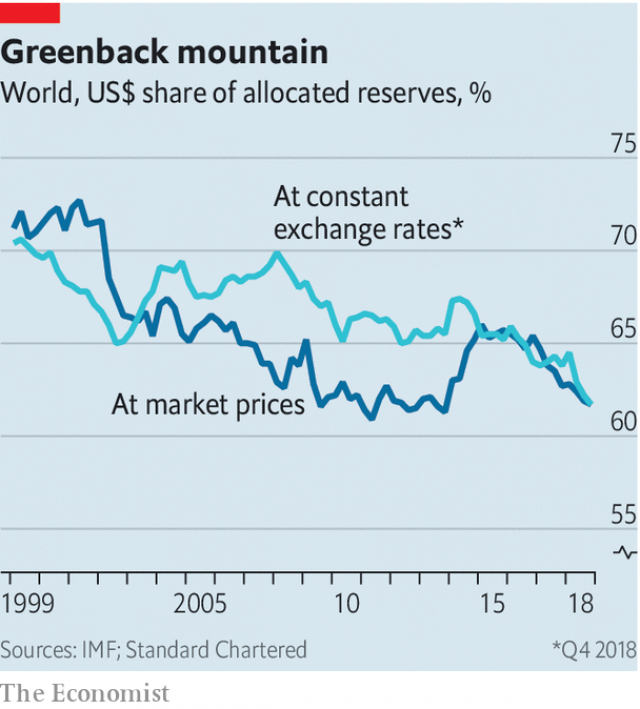

###### Buttonwood

# Reserve managers’ relationship with the dollar is unhealthy 

##### They may try to diversify, but the global currency will drag them back 

 

> Apr 11th 2019 

JAMES M. CAIN’S novel “The Postman Always Rings Twice” portrays a violent love affair between Frank Chambers, a drifter, and Cora Papadakis, a former beauty queen now married to a man she despises. Their romance is doomed from the beginning. Every attempt to find happiness fails. Any attempt at being apart is equally hopeless. “Why did you have to come back?” she hisses after one break-up. “I had to, that’s all,” he replies. 

The story comes to mind when contemplating the fate of the managers of the world’s $11trn-worth of foreign-exchange reserves. This is not to say they are obsessives wracked with guilt and paranoia (though a few might be). But rather that, like Frank and Cora, it has probably occurred to them that their dominant relationship, which is with the dollar, may not be entirely good for them. 

The latest figures from the IMF show that the share of dollars in global reserves fell to 62% at the end of last year. Reserve managers seem to be for a cooler, less intense affair with the dollar. But eventually, they will find that it is hard to break free. That is not so much because the alternatives to the dollar have flaws (though they do); rather, it is because the pain of a weaker dollar will become too much to bear. 

The dollar is the closest thing to a world currency. Commodities that are traded globally are quoted in dollars. So are other currencies. A lot of cross-border trade is invoiced and settled in dollars, too. Dollars are the unit by which the world of finance keeps score. So there is logic to countries keeping stores of them in reserve. It is generally dollars that you need in an emergency. 

But money is also a store of value. There is no guarantee that the dollar will hold its value better than other currencies. So like other portfolio managers, reserve-holders seek to diversify. That means fewer dollars. 

There are other reasons for breaking free of the greenback. Its global role gives America the means to impose financial sanctions to great effect. Its use of such powers has steadily grown. In response, Russia has slashed the share of dollars in its currency reserves. It is not hard to imagine that some other countries have weighed the odds of at some stage being caught in a dispute with America. 

Changes in the market value of currencies can mask underlying shifts in the mix of assets within reserves. For instance, if the euro falls sharply against the dollar, its share in reserves would also fall without any change in the stock of assets held. Steven Englander of Standard Chartered, a bank, applies a constant exchange rate to the IMF data to adjust for this valuation effect. What emerges is a clearer long-term trend downwards in dollar holdings and a sharp sell-off last year (see chart). What kept the dollar strong was the strength of private-sector purchases. 

 

Reserve managers appear to be countercyclical investors, selling when others are buying. This is rather cheering. The dollar looks overvalued on many benchmarks. And if anyone can take a long-term view, it ought to be reserve managers. Even so, Mr Englander suspects that some of them are waiting for signs of dollar weakness before selling. 

By then it may be too late. Once private-sector demand for dollars wanes, the combination of this downward pressure and selling by reserve managers might mean that the dollar has to fall a long way to balance supply and demand. That would be a big headache for reserve managers. In one regard they are not like other portfolio managers. They are also charged with keeping their own currency at a competitive level to support exports. 

Reserve managers who start off wanting to sell dollars often end up buying them back when they see competitiveness is at risk, says Mr Englander. Their attempts to diversify by, say, selling those dollars for euros is doomed to fail. It is hard to induce private-sector investors to buy dollars for euros when they, too, are trying to diversify away from them. The outcome, says Mr Englander, is that both dollar and non-dollar reserves increase, with the dollar share not much changed. 

In Cain’s novel, the star-crossed lovers are joined by a dark passion and by complicity in a murder. What tethers reserve managers to the dollar is not quite as sinister. For a while they can achieve a little distance: if they want to get out of dollars, they can do so while everyone else is trying to get into them. But if the dollar falls hard enough, they will be buyers. Ask a reserve manager, then, why he ever went back, and he may tell you: “I had to, that’s all.” 

-- 

 单词注释:

1.buttonwood['bʌtnwʊd]: 美洲悬铃木 

2.diversify[dai'vә:sifai]:vt. 使多样化, 使变化 

3.APR[]:[计] 替换通路再试器 

4.jame[]: 灰岩井 

5.M[em]:[计] 尾数, 主要, 媒体, 介质, 中等, 存储器, 方式, 分, 模, 乘法器, 兆, 毫 [医] 容积克分子(溶液), 容模的 

6.alway['ɔ:lwei]:adv. 永远；总是（等于always） 

7.portray[pɒ:'trei]:vt. 描绘, 描写, 描绘...的肖像 

8.drifter['driftә]:n. 漂流者, 漂流物, 漂网渔船 

9.cora['kɔ:rә]:n. 科拉 

10.papadakis[]:[网络] 总编帕帕达基斯；总编帕帕达基思；帕德基斯 

11.romance[rәu'mæns]:n. 冒险故事, 浪漫史, 传奇文学 vi. 写传奇, 作空想, 虚构 

12.doom[du:m]:n. 厄运, 不幸, 法律, 宣告, 判决, 死亡 vt. 命中注定, 判决 

13.equally['i:kwәli]:adv. 相等地, 同样地, 平等地 

14.hiss[his]:n. 嘘声, 嘶嘶声 vi. 发出嘘声, 发嘶嘶声 vt. 发嘶嘶声表示 

15.contemplate['kɒntempleit]:vt. 注视, 沉思, 盘算 vi. 冥思苦想 

16.obsessive[әb'sesiv,ɔb-]:a. 着迷的 

17.wrack[ræk]:n. 漂积海草, 失事船只, 破坏 vt. 严重伤害 

18.guilt[gilt]:n. 罪行, 内疚 [法] 罪, 犯罪, 罪行 

19.paranoia[.pærә'nɒiә]:n. 偏执狂, 多疑症 [法] 妄想狂, 偏执狂 

20.dominant['dɒminәnt]:a. 占优势的, 支配的 [医] 优性的, 显性的 

21.entirely[in'taiәli]:adv. 完全, 全然, 一概 

22.IMF[]:国际货币基金组织 [经] 国际货币基金 

23.les[lei]:abbr. 发射脱离系统（Launch Escape System） 

24.flaw[flɒ:]:n. 缺点, 裂纹, 瑕疵, 一阵狂风 [化] 划痕; 裂缝; 裂纹 

25.commodity[kә'mɒditi]:n. 农产品, 商品, 有用的物品 [经] 商品, 货物, 日用品 

26.globally[]:[计] 全局地 

27.invoice['invɒis]:n. 发票, 发货单 v. 开发票, 记清单 

28.portfolio[pɒ:t'fәuliәu]:n. 皮包, 公文包, 部长职务, 有价证券财产目录, 艺术代表作选辑 [法] 公文包, 文件夹, 阁员职务 

29.greenback['gri:nbæk]:n. 美钞, 绿背动物 [法] 美钞 

30.sanction['sæŋkʃәn]:n. 核准, 制裁, 处罚, 约束力 vt. 制定制裁规则, 认可, 核准, 同意 

31.slash[slæʃ]:v. 猛砍, 乱砍 n. 猛砍, 乱砍, 删减 [计] 斜线 

32.odds[ɒdz]:n. 可能性, 几率, 机会, 胜算, 不平等 

33.underlie[.ʌndә'lai]:vt. 位于...之下, 成为...的基础 

34.asset['æset]:n. 资产, 有益的东西 

35.euro['juәrәu]:n. 欧元（欧盟的统一货币单位） 

36.steven['sti:vn]:n. 史蒂文（男子名） 

37.englander['iŋ^lәndә(r)]:n. 英国人；英格兰人 

38.charter['tʃɑ:tә]:n. 特许状, 执照, 宪章 vt. 特许, 发给特许执照 

39.datum['deitәm]:n. 论据, 材料, 资料, 已知数 [医] 材料, 资料, 论据 

40.valuation[.vælju'eiʃәn]:n. 评价, 估价, 价值判断 [经] 估价, 计价, 评价 

41.downwards['daunwәdz]:adv. 向下 

42.holding['hәuldiŋ]:n. 把持, 支持, 保持 [法] 租借地, 占有物, 拥有的财产 

43.countercyclical[,kajntә'saiklikәl]:a. [经]反周期的( 指与商业周期既定阶段发展方向相反的,如在商业周期高涨阶段采取通货紧缩政策,以防止通货膨胀等问题出现) 

44.investor[in'vestә]:n. 投资者 [经] 投资者 

45.overvalue[.әuvә'vælju:]:vt. 估价过高, 过分尊重, 估计过高 

46.benchmark[]:[计] 基准程序; 基准 

47.wane[wein]:n. 减少, 衰微, 败落, 亏缺, 月亏 vi. 变小, 亏缺, 衰落, 消逝, 退潮 

48.competitiveness[]:[经] 竞争 

49.induce[in'dju:s]:vt. 引诱, 招致, 归纳出, 感应 [医] 诱导, 感应 

50.complicity[kәm'plisiti]:n. 同谋, 串通, 复杂 [法] 共谋, 共犯关系 

51.tether['teðә]:n. 系绳, 系链, 界限, 范围 vt. 栓, 束缚, 限制 

52.sinister['sinistә]:a. 不吉利的, 凶恶的, 左边的 [医] 左的 

53.buyer['baiә]:n. 买主, 买方 [经] 买主, 买方, 买手 

