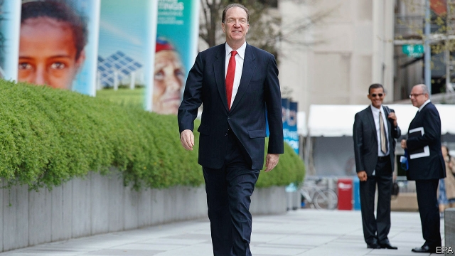

###### Malpass v Malpass

# The World Bank’s new boss will struggle to impose himself 

##### Some of David Malpass’s aims for the lender are at odds with each other 

 

> Apr 11th 2019 

WHEN HE WAS nominated to lead the World Bank by President Donald Trump, David Malpass, a former Treasury official, faced no rival for the position. He was approved unanimously by the bank’s board, which represents its 189 member governments, and began work promptly this week. The process could not have been easier. But stiffer resistance lies ahead. Chances are that nothing in the job will become him like the entering it. 

The institution he now leads is dedicated to eradicating poverty and fighting inequality. By its estimates, 10% of the world’s population (736m people) lived below the global poverty line in 2015 and perhaps 8.6% did in 2018. It aims to lower that share to 3% by 2030. 

Because poverty is falling quickly in India and Bangladesh, most of the people living so uncomfortably now reside in sub-Saharan Africa, especially Nigeria and the Democratic Republic of Congo. They are harder to reach, concentrated in “fragile” regions, afflicted by violence. They would benefit greatly from sound economic policies and rapid GDP growth. But in these settings, the bank cannot always count on governments using its money and advice well. It therefore tends to back tightly monitored projects that benefit the poor directly. A big initiative in Congo, for example, helps women giving birth and vaccinates children against tuberculosis, hepatitis B and other diseases. 

Mr Malpass no doubt applauds such efforts. But his animating passions lie elsewhere. He wants the bank to focus on promoting economic growth: “breakthroughs that materially raise median incomes”, as he wrote in the Financial Times shortly after his nomination. Bank insiders say he has shown a close interest in the world’s ten biggest emerging markets. Understanding their paths to growth may yield lessons for others. And improving their growth prospects would benefit both their own large populations and the world economy, in which they now weigh heavily. 

The bank’s influence on such countries is small. But the potential gains are so great that even a small nudge can yield a magnificent return. Lant Pritchett of Harvard University cites the example of the Indian Council for Research on International Economic Relations. This think-tank, based in Delhi, got started in the early 1980s with the help of $857,000 from the Ford Foundation (almost $3m measured using 2005 purchasing-power-parity rates). Mr Pritchett reckons that its research helped shape India’s successful response to its balance-of-payments crisis in 1991. Those reforms, in turn, set the stage for faster growth in a country hosting a sixth of humanity. Mr Pritchett has calculated that the 1991 response and later reforms added $3.6trn to India’s output from 1991 to 2010. Even if Ford’s money increased the chances of reform by only 1%, that represents a 12,000-fold return on its investment (ignoring the lag between outlay and the reforms). 

But this kind of thinking is out of fashion at the bank. The ten largest emerging markets are not necessarily its biggest clients. Nor, India aside, are they where many of the world’s poorest people live. Improving median incomes in these ten would not necessarily reduce poverty in Nigeria or Congo. Nor would it ensure that the incomes of the bottom 40% rise faster than the rest (which is one way the bank monitors its fight against inequality). Mr Malpass’s instincts may therefore fail to mesh with the bank’s institutional priorities. 

His interest in engaging with the world’s big emerging markets also sits uneasily with his other preoccupation: disengaging from the biggest emerging market of all. In his previous role at America’s Treasury he expressed worries about China’s “inroads” into the multilateral lenders. America agreed to an increase in the World Bank’s capital only on condition that in future it devoted a smaller share of its lending to countries as prosperous as China, charged them higher interest rates and encouraged them to “graduate” out of World Bank borrowing altogether. 

China’s income per person already exceeds the threshold for graduation ($6,795 in 2017). But it is not alone: 31 other eligible clients exceed that level, including some large countries with considerable clout (Brazil, Mexico, Turkey). Efforts to usher them off the bank’s books would meet insurmountable opposition. China and its peers will instead insist they do not meet the bank’s vaguer criteria for graduation, which include progress in institution-building. Thus China’s backers will highlight its shortcomings even as its critics, like Mr Malpass, tout its accomplishments. 

The duties Mr Malpass inherits from his predecessor, Jim Yong Kim, are lighter than those bequeathed to previous presidents. Mr Kim’s managerial failings prompted the bank to appoint a capable chief executive, Kristalina Georgieva, to handle day-to-day operations. By some estimates, she does 75-80% of the job that fell to previous presidents. Mr Malpass may therefore struggle to impose himself on the bank. Some powerful constituencies stand in opposition to his ideas—and some of his ideas stand in tension with each other. 

-- 

 单词注释:

1.Malpass[]:n. (Malpass)人名；(英)马尔帕斯 

2.V[vi:]:[计] 溢出, 变量, 向量, 检验, 虚拟, 垂直 [医] 钒(23号元素) 

3.david['deivid]:n. 大卫；戴维（男子名） 

4.lender['lendә]:n. 出借人, 贷方 [经] 出借者, 贷方, 贷款人 

5.odds[ɒdz]:n. 可能性, 几率, 机会, 胜算, 不平等 

6.APR[]:[计] 替换通路再试器 

7.nominate['nɒmineit]:vt. 提名, 任命, 命名 [法] 提名...为候选人, 指定, 推荐 

8.treasury['treʒәri]:n. 国库, 宝库, 财政部, 国库券 [经] 库存, 国库, 金库 

9.unanimously[]:adv. 全体一致, 无异议, 一致同意 

10.promptly['prɒmptli]:adv. 敏捷地, 迅速地 

11.dedicate['dedikeit]:vt. 献出, 贡献 

12.eradicate[i'rædikeit]:vt. 根除, 扑灭, 根绝, 消灭 

13.inequality[.ini'kwɒliti]:n. 不平等, 不同, 不平坦, 不平均 n. 不平等, 不等式 [计] 不等式 

14.quickly['kwikli]:adv. 很快地 

15.Bangladesh[,bɑ:ŋ^lә'deʃ]:n. 孟加拉国 [经] 孟加拉共和国 

16.uncomfortably[ʌnˈkʌmftəbli]:adv. 不舒适地, 不自在地, 令人不快地 

17.reside[ri'zaid]:vi. 住, 居留, 属于 [法] 居住 

18.Nigeria[nai'dʒiriә]:n. 尼日利亚 

19.Congo['kɔŋ^әu]:n. 刚果, 刚果河, 工夫茶 [建] 刚果, 直接刚果红 

20.afflict[ә'flikt]:vt. 使苦恼, 折磨 

21.cannot['kænɒt]:aux. 无法, 不能 

22.alway['ɔ:lwei]:adv. 永远；总是（等于always） 

23.tightly['taitli]:adv. 紧紧地, 坚固地 

24.vaccinate['væksineit]:v. 预防接种 

25.tuberculosis[tju,bә:kju'lәusis]:n. 肺结核 [医] 顿挫性结核 

26.hepatitis[.hepә'taitis]:n. 肝炎 [医] 肝炎 

27.B[bi:]:[计] 基地址, 数据库, 基极, 二进制, 块, 字组, 布尔, 总线, 占线, 字节 [医] 硼(5号元素) 

28.animate['ænimeit]:vt. 使有生气, 赋予生命 a. 有生命的, 有生气的 

29.materially[mә'tiәriәli]:adv. 实质上, 重大, 物质上 

30.median['mi:diәn]:a. 中央的, 中间的, 正中的 n. 正中动脉, 中位数, 中线 

31.nomination[.nɒmi'neiʃәn]:n. 提名, 任命, 提名权 

32.insider['in'saidә]:n. 内部的人, 权威人士, 知道内情的人 [经] 熟悉内情者 

33.nudge[nʌdʒ]:n. 用肘轻推, 推动, 讨厌家伙 

34.lant[]:n. 陈化尿液（用于清洁地板） 

35.PRITCHETT[]:n. (Pritchett)人名；(英)普里切特 

36.Harvard['hɑ:vәd]:n. 哈佛大学 

37.cite[sait]:vt. 引用, 引证, 表彰 [建] 引证, 指引 

38.ford[fɒ:d]:n. 浅滩, 福特汽车 v. 涉过, 涉水 

39.humanity[hju:'mæniti]:n. 人性, 人类, 博爱 

40.outlay['autlei]:n. 费用, 经费, 支出 vt. 花费 

41.client['klaiәnt]:n. 客户, 顾客, 委托人 [计] 客户, 客户机, 客户机程序 

42.mesh[meʃ]:n. 网孔, 网丝, 网眼, 网状物, 圈套, 陷阱, 啮合 vt. 以网捕捉, 啮合, 使缠住 vi. 落网, 相啮合 

43.institutional[.insti'tju:ʃәnәl]:a. 制度的, 公共机构的, 学会的 [法] 组织机构的, 制度的, 公共机构的 

44.uneasily[,ʌn'i:zili]:adv. 不自在地；不稳定地；心神不安地 

45.disengage[.disin'geidʒ]:vt. 使脱离, 使松开, 使摆脱约束(或义务等) vi. 脱离, 解脱 

46.inroad['inrәud]:n. 侵入, 得手, 侵害 [法] 袭击, 侵犯, 损害 

47.multilateral[.mʌlti'lætәrәl]:a. 多边的, 多国的 [经] 多边的, 涉及多方的 

48.threshold['θreʃәuld]:n. 门槛, 入口, 开端, 阈 [计] 阈; 阈值 

49.eligible['elidʒәbl]:a. 有资格当选的, 合格的 n. 有资格者, 合格者, 适任者 

50.clout[klaut]:n. 敲击, 破布 vt. 打补钉 

51.Brazil[brә'zil]:n. 巴西 

52.usher['ʌʃә]:n. 引座员, 招待员 vt. 引导, 招待 vi. 作招待员 

53.insurmountable[.insә'mauntәbl]:a. 难以克服的, 不能超越的 

54.opposition[.ɒpә'ziʃәn]:n. 反对, 敌对, 相反, 在野党 [医] 对生, 对向, 反抗, 反对症 

55.peer[piә]:n. 同等的人, 匹敌, 贵族 vi. 凝视, 窥视, 费力地看, 隐现 vt. 与...同等, 封为贵族 

56.vaguer[veiɡə]:a. 模糊的( vague的比较级 ); （思想上）不清楚的; （表达或感知）含糊的; 不具体的 

57.backer['bækә]:n. 援助者, 支持者 [经] 背书人, 支持人 

58.tout[taut]:vi. 招徕顾客, 兜售物品 vt. 招徕, 刺探...情报 n. 兜售者, 侦查者 

59.accomplishment[ә'kʌmpliʃmәnt]:n. 成就, 完成 

60.predecessor[.predi'sesә]:n. 前任, 先辈, 前身 [医] 初牙, 前辈, 祖先 

61.jim[dʒim]:n. 吉姆（人名） 

62.yong[]:n. 勇（汉语拼音） 

63.kim[]:n. 金姆（人名） 

64.bequeath[bi'kwi:ð]:vt. 遗赠, 遗留 [法] 遗赠, 遗留...给 

65.managerial[.mænә'dʒiәriәl]:a. 管理的 [经] 管理上的, 经营上的 

66.failing['feiliŋ]:n. 失败, 缺点 prep. 如果没有... a. 失败的 

67.georgieva[]:n. (Georgieva)人名；(塞)格奥尔基耶娃 

68.constituency[kәn'stitjuәnsi]:n. 选民, 顾客, 读者 [法] 选区, 全体选民, 选区内的选民 

