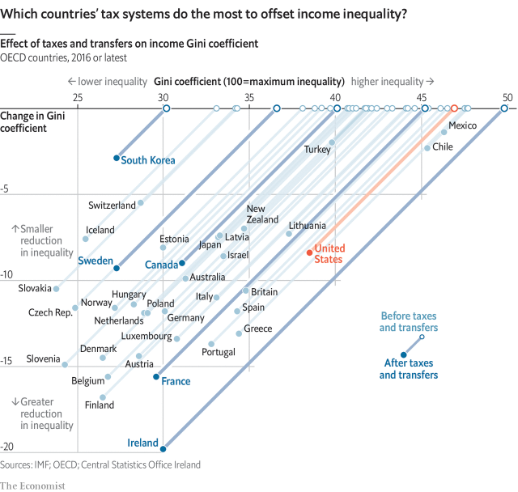

###### Tax and inequality

# American inequality reflects gross incomes as much as taxes 

##### How taxes and transfers affect the distribution of income 

 

> Apr 13th 2019 

WHEN PEOPLE think about which rich countries have the least equal income distributions, America often jumps to mind. The country has a much smaller welfare state than many of its European counterparts, which suggests it does not redistribute much. But does it? 

One common measure of income inequality is the Gini coefficient. The index ranges from zero to 100. A score of zero implies that income is shared equally; 100 implies that one person scoops the lot. By comparing a country’s Gini coefficient before and after taxes and transfers, a rough gauge can be created of how progressive (or regressive) its tax and benefit system is. 

By this measure at least, America’s tax system is in fact fairly progressive. It does roughly as much to reduce inequality as does Canada’s or Sweden’s (even though most European systems do more). What distinguishes America from those two countries is that its pre-tax Gini coefficient is high, so that the government has to put in more work to level the playing field. In contrast, countries with low pre-tax inequality, such as South Korea, manage to achieve low post-tax inequality without doing much by way of redistribution. 

The difference in countries’ Gini coefficients after taxes and transfers correlates strongly with the economic weight of government. In France government spending accounts for 57% of GDP. America’s federal, state and local authorities spend just 35%. Although pre-tax inequality is almost as high in France as in America, the two countries look very different after taxes. 

Nordic countries are generally thought to be champion redistributors. But within the OECD, a club of mostly rich countries, Ireland does most to slash inequality. After taxes and transfers, Ireland’s income distribution goes from the most skewed in our chart to the middle of the pack. The rich pay a higher share of income tax than in most other countries, while low-earning households receive generous tax credits. 

Most countries would struggle to copy the Irish system in full. Part of the reason Ireland is able to do so much redistribution is that it relies more than most on taxes paid by multinational companies. Foreign-owned firms accounted for 80% of corporate tax in 2017. Cross-country data suggest that if America wanted to bring its level of inequality down to the OECD average, it would have to boost government spending to 50% of GDP. That would require increases in taxes across the board—a highly unlikely prospect. 

-- 

 单词注释:

1.inequality[.ini'kwɒliti]:n. 不平等, 不同, 不平坦, 不平均 n. 不平等, 不等式 [计] 不等式 

2.APR[]:[计] 替换通路再试器 

3.counterpart['kauntәpɑ:t]:n. 副本, 复本, 配对物, 相应物 [经] 副本, 正副二份中之一 

4.redistribute[.ri:di'stribjut]:vt. 重新分配, 再分发 [经] 再分配, 重新分配 

5.gini[]:[网络] 基尼；基尼系数；吉尼 

6.coefficient[kәui'fiʃәnt]:n. 系数 [计] 系数 

7.equally['i:kwәli]:adv. 相等地, 同样地, 平等地 

8.scoop[sku:p]:n. 铲子, 勺子, 穴, 口, 独家新闻 vt. 汲取, 舀取, 挖空, 抢先报道 

9.regressive[ri'gresiv]:a. 后退的, 退化的, 回归的 [医] 退化的, 退行的, 消退的, 回归的 

10.Korea[kә'riә]:n. 朝鲜, 韩国 

11.redistribution['ri:distri'bju:ʃәn]:n. 重新分配, 再分发 [计] 重新分配 

12.correlate['kɒrәleit]:n. 有相互关系的东西, 相关物 vt. 使有相互关系 vi. 相关 

13.Nordic['nɒ:dik]:n. 北欧人, 日耳曼民族, 北欧两项滑雪 a. 北欧人的, 日耳曼民族的, 北欧两项滑雪的 

14.redistributors[]:[网络] 再分配者；再分配阶级 

15.Oecd[]:[经] 已开发国家组织 

16.slash[slæʃ]:v. 猛砍, 乱砍 n. 猛砍, 乱砍, 删减 [计] 斜线 

17.skew[skju:]:a. 斜的, 歪的 n. 歪斜, 偏态家庭关系 vi. 歪斜, 侧转 vt. 使歪斜, 曲解 [计] 扭斜; 歪斜; 偏斜 

18.multinational[.mʌlti'næʃәnl]:a. 多国的, 跨国公司的 n. 跨国公司 

19.corporate['kɒ:pәrit]:a. 社团的, 合伙的, 公司的 [经] 团体的, 法人的, 社团的 

20.datum['deitәm]:n. 论据, 材料, 资料, 已知数 [医] 材料, 资料, 论据 

