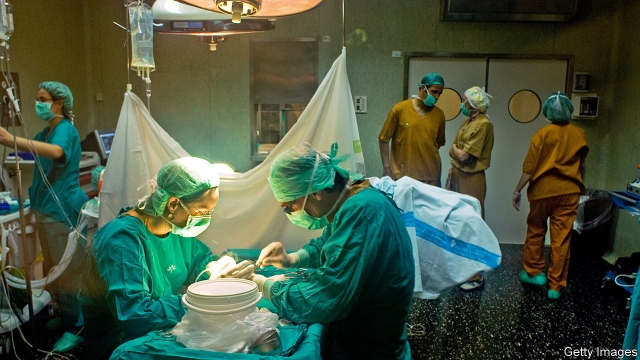

###### Living wills

# Kidney donors are wanted, dead or alive 

##### Since there are not enough of either kind, donation needs to be better organised 

 

> Apr 13th 2019 

MELISSA BENSOUDA, of Kansas City, Missouri, was 25 when she was diagnosed with late-stage kidney disease. She had to start dialysis, hooking up three times a week to a machine that filtered her blood. “It wipes you out,” she says. Queasy and fatigued, Ms Bensouda struggled to care for her children and to keep working full time. To secure a place on the waiting list for a kidney transplant, she had to tackle other health problems first. It took a year and cost $10,000 to treat dental problems, to which people with kidney disease are prone. In 2012, after nearly ten years on dialysis, Ms Bensouda was given a transplant. The new kidney lasted only five years. So she is back on the waiting list—along with 95,000 other Americans. 

In a typical year just one in five of them would get a transplant. One in ten would die or become too sick and drop off the list. Europe struggles, too. In the European Union in 2013 more than 4,000 patients died while on a kidney waiting list. 

And waiting lists are often just the tip of an iceberg. Many patients in Europe, for example, suspect that doctors prefer to keep them on dialysis—which is a big, lucrative business—rather than to get them fit for a transplant. In America many people who need a transplant never join the list because they cannot pay for the drugs they need to take afterwards. 

Some people’s kidneys fail because of a genetic disease or an injury. But the main reason is diabetes. This is caused predominantly by obesity, which is rampant in more and more countries. So kidney waiting lists will become even longer. 

Shortening them will save more than personal misery. In Britain a kidney transplant, which lasts for 10 to 13 years on average, starts saving the National Health Service (NHS) money compared with the cost of dialysis in the third year. In America a transplant saves $60,000 per year compared with remaining on dialysis. (In poor countries few people can afford dialysis, and so cannot wait for a deceased donor, meaning no waiting lists.) 

Roughly two-thirds of kidney transplants in rich countries are from deceased donors (see chart). The rest are from living donors who part with a kidney to help someone. One kidney can perfectly well manage the job of the two that most people are born with. 

 

Historically, northern European countries have promoted kidney donations from living donors. Southern Europeans have had reservations about the unnecessary surgery involved. Instead they have sought ways to increase donations from the dead. In Spain just 15% of families refuse to donate the organs of relatives who die; in Britain a third say no. Some are unsure what the deceased person wanted; others think that doctors might not do all they can to save their loved one if they can take the organs. Cultural differences play a role, too. Most Japanese, for example, feel uneasy about the idea of taking organs out of a dead body. 

By and large more people say they want to donate than actually volunteer to add their names to a donor registry. This has encouraged more countries to follow Spain, which has the world’s highest organ-donor rate and in 1979 became the first country to introduce a law making organ donation upon death the presumed choice of anyone who has not registered to opt out. England, France and the Netherlands recently changed their laws to that effect; Australia and several other countries are debating the idea. 

But in practice these new laws may not make much difference. In Spain, for a decade after 1979, donations did not increase. They did so only after other measures were introduced: a new transplant co-ordination hub; intensive-care doctors and nurses were trained in organ donation; and looking out for potential donors became the norm. Croatia copied the Spanish model (rebranding it “the Croatian model”) and saw organ transplants more than double between 2007 and 2011. 

All but a few presumed-consent countries still give next-of-kin a final say, as an extra safeguard (and to avoid an outcry from critics of organ donation). Mark Murphy, the outgoing head of the European Kidney Patients Federation, sees the fuss around presumed consent as a distraction. Politicians, he says, prefer to blame the organ shortage on bereaved people than to invest in the logistics and incentives proven to increase transplants. 

Beatriz Domínguez-Gil of the Spanish National Transplant Organisation says that Spain adapted earlier than other countries to the ageing of the pool of deceased donors. Its doctors learned to transplant organs from donors in their 70s and 80s (typically for older recipients). A quarter of deceased donors are people with devastating brain injuries put on organ-preservation treatment as part of their end-of-life care. In many countries they are sent instead for palliative care and lost as donors. 

At what stage doctors are allowed to retrieve organs matters hugely. In less than half of European countries can the process start after the heart stops (and organ damage begins), rather than when the brain shuts down too. Across Europe, the “no-touch” time before organ retrieval can then begin varies from 5 to 20 minutes. 

Nowhere, however, are enough kidneys available from the dead. Just 1-2% of people die in ways that make their organs suitable for donation—eg, from a brain injury sustained in an accident. So the living are needed. Some countries, such as Ireland and Germany, require a living donor to have close ties to the patient. But many allow people to donate a kidney to whomever they choose. Paula King, a 49-year-old American woman, decided to donate a kidney to a stranger after seeing the trouble a relative had in finding a bone-marrow donor, when nobody in the family was a match. “I wanted to alleviate the stress on another family out there at the mercy of a stranger,” says Ms King. In Britain such so-called “non-directed” donors account for nearly 10% of living-donor transplants. 

In the past, older people were rarely considered as potential donors. But it is clear that this is misguided, says Dorry Segev of the Johns Hopkins University in Baltimore. In fact, he says, predicting the lifetime risk of kidney failure for a 25-year-old is hard, whereas someone who has done well for 70 years will probably be fine with only one kidney. Between 2014 and 2018 in America the number of living kidney-donors aged 65 or older doubled; those aged 50-64 grew by more than a quarter. 

A kidney donor typically needs two days in hospital and about a month to recover. About 20% suffer some, mostly minor, complications. In many countries some would-be donors are deterred by the cost of travel and other expenses. In the Netherlands, which has the highest rate of living organ-donors in the rich world, kidney donors get three months of paid leave to recover, as well as payment for related costs—even such needs as dog-sitting. In America, by contrast, donors get only some expenses paid for, and only if they are poor. 

Almost half of would-be kidney donors are not biological matches for the person they want to help. So kidney-exchange schemes have evolved. In these a patient gets a kidney from a suitable living donor only if someone donates one on his behalf for another patient. Pioneered by South Korea in 1991, national kidney-for-kidney schemes have been adopted by Australia, Canada and many European countries. In America some transplant centres and several non-profit groups run their own. 

Britain’s exchange scheme conducts an algorithmic search for matches quarterly. Non-directed donors are precious, because they can be used where they are most needed, depending on the mix of blood groups and other criteria, and so initiate a chain of other matches—greatly boosting the number of transplants. Donors in a kidney-for-kidney swap have surgeries scheduled as close as possible in time—not because some may renege (that is rare) but because “life happens to people”, says Lisa Burnapp of the NHS. In a long gap, a recipient might become too ill for the operation, for example, or something unexpected might happen to prevent a donor from going ahead. 

Such schemes are particularly beneficial for people who have had a blood transfusion or are waiting for a second transplant, because donors who suit their mix of antibodies may be extremely rare. If all living donors in America were allocated through a nationwide exchange, kidney transplants from such volunteers could double, says Jayme Locke of the University of Alabama at Birmingham. 

But many people, understandably, cannot bring themselves to ask others for a kidney. The task is not just embarrassing, says Price Johnson, who speaks from experience; the aim is to find several volunteers in the hope that at least one would stick to it through the many tests and get medical clearance for the operation. 

To help with all that, patient groups have developed a train-a-friend model, finding people willing to search on the patient’s behalf and teaching them what to do. A dedicated Facebook app helps to create a social-media appeal with links to vetted information about kidney donation. A small trial in America found that after ten months users of the app were six times more likely than non-users to find a donor. But this “lost-dog” approach to finding donors means losing privacy, says Mr Johnson. He wishes that donors could be paid. 

The only country where that is legal is Iran. Buyers and sellers are mediated by patient foundations. The price of a kidney is set at roughly the average annual income of a family on the poverty line. The vast majority of sellers are poor; some sell a kidney to repay debts in order to avoid prison. Poor buyers rely on help from charities. 

Academics in America have proposed versions of this system as a solution to the country’s shortage of kidneys. Patient groups have not thrown their weight behind the idea. They are lobbying for European-style benefits for living donors. 

In five to ten years advances in medical technology could make this debate irrelevant. Both xenotransplants (pig kidneys adapted for humans) and bio-engineered artificial kidneys might become viable options within a decade. But for thousands of people whose kidneys have already stopped working, these medical miracles will come too late. They need a better system for organising the proven wonder of human-to-human transplants. 

-- 

 单词注释:

1.kidney['kidni]:n. 肾, 个性 [医] 肾 

2.donor['dәunә]:n. 捐赠人 [化] 给体; 供体 

3.donation[dәu'neiʃәn]:n. 捐赠物, 捐款, 捐赠 [经] 赠品, 捐款, 捐赠 

4.APR[]:[计] 替换通路再试器 

5.melissa[mә'lisә]:[医] │蜜蜂花, 蜜里萨香草 

6.bensouda[]:[网络] 本本达 

7.kansa[]:n. （日语）监察；堪萨人（旧时居住在美国堪萨斯州一带的印第安人） 

8.Missouri[mi'zuәri]:n. 密苏里州 

9.diagnose['daiәgnәuz]:v. 诊断 

10.kidney['kidni]:n. 肾, 个性 [医] 肾 

11.dialysis[dai'ælisis]:n. 透析, 渗析 [化] 渗析; 透析 

12.queasy['kwi:zi]:a. 呕吐的, 使人呕吐的 [经] 不稳定的 

13.bensouda[]:[网络] 本本达 

14.tackle['tækl]:n. 工具, 复滑车, 滑车, 装备, 扭倒 vt. 固定, 处理, 抓住 vi. 扭倒 

15.dental['dentl]:a. 牙齿的 [医] 牙的, 齿的, 齿音, 齿音字母 

16.prone[prәun]:a. 俯伏的, 面向下的, 有...倾向的 [医] 旋前的, 伏的, 俯的 

17.iceberg['aisbә:g]:n. 冰山, 冷冰冰的人 

18.lucrative['lu:krәtiv]:a. 有利益的, 获利的, 合算的 

19.cannot['kænɒt]:aux. 无法, 不能 

20.afterwards['ɑ:ftәwәdz]:adv. 然后, 后来 

21.diabetes[daiә'bi:ti:z]:n. 糖尿病, 多尿症 [医] 糖尿病; 多尿症 

22.predominantly[]:adv. 主要地, 显著地, 大多数地, 突出地 

23.obesity[әu'bi:siti]:n. 肥胖 [医] 肥胖, 多脂 

24.rampant['ræmpәnt]:a. 猖獗的, 蔓生的, 猛烈的, 跃立作扑击状的 

25.shorten['ʃɒ:tn]:vt. 弄短, 缩短, 减少 vi. 缩小, 变短 

26.misery['mizәri]:n. 痛苦, 悲惨, 不幸, 穷困 

27.nh[]:abbr. 不吸湿的（nonhygroscopic）；全日空航空公司；美国地名, 新罕布什尔（New Hampshire） 

28.decease[di'si:s]:n. 死亡 vi. 死亡 

29.historically[his'tɔrikәli]:adv. 历史上地；从历史观点上说 

30.Spain[spein]:n. 西班牙 

31.donate['dәuneit]:v. 捐赠 

32.unsure[.ʌn'ʃuә]:a. 不肯定的, 不确定的, 没有自信的 

33.cultural['kʌltʃәrәl]:a. 文化的, 教养的, 修养的 [医] 培养的 

34.registry['redʒistri]:n. 登记处, 登记名册 [计] 登录库 

35.presume[pri'zu:m]:vt. 假定, 推测, 擅自, 意味着 vi. 擅自行动, 相信 

36.opt[ɒpt]:vi. 选择 

37.Netherlands['neðәlәndz]:n. 荷兰 

38.hub[hʌb]:n. 毂, 木片, 中心 [计] 插座; 插孔; 集线器, 集中器, 连接器, 中继站 

39.norm[nɒ:m]:n. 基准, 模范, 标准, 准则, 平均数 [化] 定额 

40.Croatia[krәu'eiʃjә]:n. 克罗地亚 

41.rebranding[ˌri:'brændɪŋ]:n. 重新包装；重塑形象 

42.Croatian[krej'әiʃ(ә)n]:a. 克罗地亚的, 克罗地亚语的, 克罗地亚人的 n. 克罗地亚人, 克罗地亚语 

43.safeguard['seifgɑ:d]:n. 保卫, 保护措施, 防护设施 vt. 保卫, 保护 

44.outcry['autkrai]:n. 尖叫, 倒彩, 强烈抗议, 喊价 vi. 喊叫 vt. 叫得比...响 

45.murphy['mә:fi]:n. 马铃薯 

46.federation[fedә'reiʃәn]:n. 联邦, 联合, 联盟 [法] 联邦, 联盟, 联邦政府 

47.fuss[fʌs]:n. 大惊小怪, 小题大作, 忙乱 vi. 无事自扰, 焦急, 焦燥, 忙乱 vt. 使激动, 使烦燥 

48.distraction[dis'trækʃәn]:n. 娱乐, 分心的事物, 分心 [医] 注意力分散, 内脱位, 牙弓过宽 

49.bereaved[bi'ri:vd]:a. 丧失亲人的 bereave的过去式和过去分词 

50.logistic[lәu'dʒistik]:a. 逻辑的, 后勤学的 

51.incentive[in'sentiv]:n. 动机 a. 激励的 

52.beatriz[]:比阿特丽斯（人名） 

53.organisation[,ɔ: ^әnaizeiʃən; - ni'z-]:n. 组织, 团体, 体制, 编制 

54.typically['tipikәli]:adv. 代表性地；作为特色地 

55.recipient[ri'sipiәnt]:a. 领受的, 容易接受的, 感受性强的 n. 领受者, 容纳者, 容器 

56.devastate['devәsteit]:vt. 毁坏 [法] 使荒废, 毁灭, 掠夺 

57.palliative['pælieitiv]:a. 缓和的, 减轻的, 掩饰的 n. 辩解, 缓和物 

58.hugely['hju:dʒli]:adv. 巨大地, 非常地 

59.les[lei]:abbr. 发射脱离系统（Launch Escape System） 

60.retrieval[ri'tri:vl]:n. 取回, 恢复, 检索 [计] 检索 

61.whomever[ˌhu:mˈevə(r)]:pron. （作动词或介词的宾语时, 有时候用来替代whoever） 

62.paula['pɔ:lә]:n. 保拉（女子名） 

63.alleviate[ә'li:vieit]:vt. 减轻, 使缓和 

64.misguide[mis'gaid]:vt. 误导 

65.dorry[]:[网络] 东利；多莉；陀里 

66.segev[]:[网络] 塞格夫 

67.john[dʒɔn]:n. 盥洗室, 厕所, 嫖客 

68.hopkins['hɔpkinz]:n. 霍普金（姓氏） 

69.Baltimore['bɒ:ltimɒ:]:n. 巴尔的摩 

70.complication[.kɒmpli'keiʃәn]:n. 复杂化, 复杂情况 [医] 并发症, 并发病 

71.deter[di'tә:]:vt. 制止, 吓住, 威慑 

72.biological[.baiәu'lɒdʒikәl]:a. 生物学的 [医] 生物学的 

73.Korea[kә'riә]:n. 朝鲜, 韩国 

74.algorithmic[]:[计] 算法的 

75.initiate[i'niʃieit]:n. 入会, 开始 a. 新加入的 vt. 开始, 传授基本知识给 

76.renege[ri'ni:g]:vi. 违例出牌, 食言, 毁约 vt. 否认, 放弃, 拒绝 n. 出牌违例 

77.lisa['li:zә, 'laizә]:n. 丽莎（女子名） 

78.unexpect[]:[网络] 意想不到；使意外 

79.transfusion[træns'fju:ʃәn]:n. 倾注, 输血, 输液 [医] 输血, 输液 

80.antibody['æntibɒdi]:n. 抗体 [化] 抗体 

81.jayme[]:n. 【女名】女子名 [网络] 杰米；白文慧；卓恩 

82.locke[lɔk]:n. 洛克（姓氏） 

83.Alabama[.ælә'bæmә]:n. 亚拉巴马州 

84.Birmingham['bә:miŋәm]:n. 伯明翰 

85.understandably[]:adv. 可懂, 可了解, 可理解 

86.johnson['dʒɔnsn]:n. 约翰逊（姓氏） 

87.clearance['kliәrәns]:n. 清除, 间隙 [化] 间隙; 空隙 

88.dedicate['dedikeit]:vt. 献出, 贡献 

89.facebook[]:n. 脸谱网 

90.APP[]:[计] 应用, 应用程序; 相联并行处理器 

91.vet[vet]:n. 兽医 vi. 当兽医 vt. 诊断, 检审 

92.privacy['praivәsi]:n. 隐私, 隐居, 秘密 [计] 个人保密权 

93.Iran[i'rɑ:n]:n. 伊朗 

94.buyer['baiә]:n. 买主, 买方 [经] 买主, 买方, 买手 

95.mediate['mi:dieit]:a. 居间的, 间接的 vt. 斡旋, 调停 vi. 处于中间, 调解 

96.repay[ri'pei]:v. 偿还, 报答, 报复 

97.lobby['lɒbi]:n. 大厅, 休息室, 游说议员者 vi. 游说议员, 游说 vt. 游说 

98.irrelevant[i'relәvәnt]:a. 不恰当的, 无关系的, 不相干的 [法] 无关的, 不相干的, 离题的 

99.xenotransplant['zenəʊʃrænsplɑ:nt]:n. 异种器官移植 

100.viable['vaiәbl]:a. 能养活的, 能生长发育的 [医] 有活力的, 有生机的 

