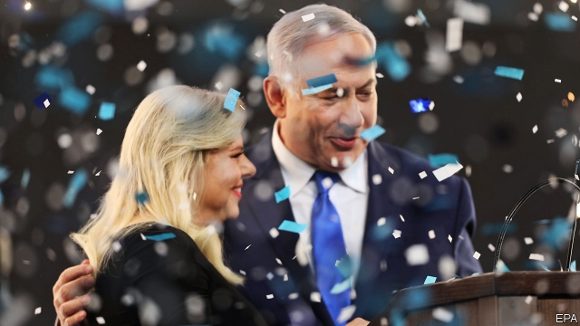

###### Bibi victorious

# America must stop Binyamin Netanyahu from annexing Palestinian land 

##### Some of his election pledges would kill the chance of a two-state solution 

 

> Apr 11th 2019 

MAKE IT OFFICIAL: henceforth, the Hebrew word for magician is Bibi. This is not just because Binyamin Netanyahu, Israel’s prime minister, appears to have won a record fifth term in office on April 9th. It is also because he pulled off the trick with corruption charges hanging over him, and in the face of a tough challenge from a new party packed with generals. Bibi, as he is known, made some parties vanish by taking their supporters, and conjured more seats for his own Likud party. He may soon surpass David Ben-Gurion, the country’s founding father, as Israel’s longest-serving leader (see article). 

His victory has come at a cost. His potion—mixing muscular nationalism with Jewish chauvinism and anti-elitism—has helped poison Israel’s politics. He claims he is innocent, blaming the charges against him on shadowy plots and sowing distrust of institutions: the police, the judiciary and the media. Mr Netanyahu may do yet more lasting damage. In the final days of the campaign he vowed to annex parts of the West Bank beyond Jerusalem, something no previous leader has thought prudent. This risks killing any chance of peace based on a two-state solution—which involves the creation of a Palestinian state—and of thus turning Israel into a rogue nation. 

Fear not, say the optimists: Mr Netanyahu was just throwing out sweets to win over right-wing voters; he knows full well that annexation of the occupied territories would breach international law, cause an outcry in Europe and alienate Arab states that have been moving closer to Israel. 

The problem with this view is that it ignores the changing political and strategic landscape. Mr Netanyahu must still form a government, which means making concessions to his likely allies on the right, who feel more strongly about annexation than he does. The prime minister’s legal troubles—he faces indictment on three cases of alleged corruption—leave him vulnerable. What will be the price when the Knesset considers a bill that would shield him from prosecution? If it is annexation, the process may begin with Maale Adumim, a large settlement on the outskirts of Jerusalem which the prime minister specifically promised to bring under Israeli sovereignty. But as Mr Netanyahu himself has said, it is unlikely to end there. 

America’s role has changed, too. For decades its presidents acted as a counterweight to Israeli annexationists (and gave cover to prime ministers fearful of standing up to them). President Donald Trump, though, has taken America’s finger off the scales. He has emboldened the right by recognising Israel’s annexation of the Golan Heights, which it captured from Syria in 1967, and moving the embassy to Jerusalem, a contested city. Mr Netanyahu made good use of these moves in his campaign. Even if he does not feel the need to go further by formally annexing territory, there is nothing to stop the creeping sort: the expansion of Jewish settlements and their infrastructure. That is happening with barely a peep from the world, let alone the divided Palestinians. 

The Trump administration says it is about to release a plan for the “ultimate deal” between Israelis and Palestinians. If this is to have any hope of success, or even of starting a process, the president must rule out unilateral annexation—whether or not the Palestinians participate. If Israelis can grab land at a whim, they will have little incentive to negotiate. If Palestinians see parts of their future state taken away willy-nilly, neither will they. 

In the end, Israel faces a stark choice. Jews and Arabs count roughly equal numbers between the Mediterranean and the Jordan river. So Israel cannot permanently hold on to all the land without sacrificing either its Jewish majority or the ideal of a proper democracy that does not discriminate against Arabs. The more Mr Netanyahu abandons land-for-peace, the more the choice will be annexation-for-apartheid. That dilemma is something even Bibi cannot conjure away. 

-- 

 单词注释:

1.bibi[]:n. 周笔畅 

2.binyamin[]:本雅明 

3.Netanyahu[]:n. 内塔尼亚胡（人名） 

4.annex[ә'neks]:n. 附加物, 附属建筑物 vt. 附加, 盖(印), 并吞 

5.Palestinian[,pælis'tiniәn]:[经] 巴勒斯坦的 

6.pledge[pledʒ]:n. 诺言, 保证, 誓言, 抵押, 信物, 保人, 祝愿 vt. 许诺, 保证, 使发誓, 抵押, 典当, 举杯祝...健康 

7.APR[]:[计] 替换通路再试器 

8.henceforth[hens'fɒ:θ]:adv. 自此以后, 今后 

9.Hebrew['hi:bru:]:n. 希伯来人, 希伯来语, 犹太人 a. 希伯来人的, 希伯来语的 

10.magician[mә'dʒiʃәn]:n. 魔术家, 幻术家, 术士 

11.corruption[kә'rʌpʃәn]:n. 腐败, 堕落, 贪污 [计] 论误 

12.supporter[sә'pɒ:tә]:n. 支持者, 后盾, 迫随者, 护身织物 [法] 支持者, 赡养者, 抚养者 

13.conjure['kʌndʒә]:vt. 念咒文召唤, 变戏法, 想象 vi. 变戏法, 施魔法 

14.Likud[li:'ku:d]:n. 利库德集团(以色列右翼党派的政治联盟,长期为以色列执政党) 

15.surpass[sә'pɑ:s]:vt. 超越, 凌驾, 胜过 

16.david['deivid]:n. 大卫；戴维（男子名） 

17.muscular['mʌskjulә]:a. 强壮的, 肌肉发达的, 有力的 [医] 肌的; 肌肉发达的 

18.nationalism['næʃәnәlizm]:n. 民族主义, 民族特性 

19.chauvinism['ʃәuvinizm]:n. 盲目的爱国主义, 沙文主义 [法] 沙文主义 

20.politic['pɒlitik]:a. 精明的, 明智的, 策略的 

21.shadowy['ʃædәui]:a. 有影的, 暗黑的, 朦胧的, 虚幻的 

22.distrust[dis'trʌst]:n. 不信任 vt. 不信任 

23.judiciary[dʒu:'diʃiәri]:a. 司法的, 法院的, 法官的 n. 司法部, 司法系统, 法官 

24.vow[vau]:n. 誓约, 誓言, 许愿 vi. 起誓, 发誓, 郑重宣言 vt. 立誓, 起誓要, 郑重地宣布 

25.Jerusalem[dʒә'ru:sәlәm]:n. 耶路撒冷 

26.prudent['pru:dnt]:a. 审慎的, 三思而后行的, 精明的, 节俭的 

27.creation[kri:'eiʃәn]:n. 创造, 创作物, 发明 [化] 产生 

28.Israel['izreil]:n. 以色列, 以色列后裔, 犹太人 

29.rogue[rәug]:n. 恶棍, 流氓, 小淘气 vt. 欺骗 vi. 游手好闲 

30.voter['vәutә]:n. 选民, 投票人 [法] 选民, 选举人, 投票人 

31.annexation[ænek'seiʃәn]:n. 合并, 附加, 附加物 [法] 兼并, 侵吞, 附加物 

32.breach[bri:tʃ]:n. 裂口, 违背, 破坏, 违反, 突破, 破裂 vt. 攻破, 突破 vi. 跳出水面 

33.outcry['autkrai]:n. 尖叫, 倒彩, 强烈抗议, 喊价 vi. 喊叫 vt. 叫得比...响 

34.alienate['eiljәneit]:vt. 使疏远, 离间, 转让 [法] 转让, 让与, 疏远 

35.landscape['lændskeip]:n. 风景, 山水, 风景画 vi. 从事景观美化 vt. 美化...景观 [计] 横向 

36.concession[kәn'seʃәn]:n. 特许, 让步, 认可 [经] 核准, 许可, 特殊(权) 

37.ally['ælai. ә'lai]:n. 同盟者, 同盟国, 助手 vt. 使联盟, 使联合, 使有关系 vi. 结盟 

38.indictment[in'daitmәnt]:n. 起诉, 控告, 起诉状 [经] 起诉书 

39.allege[ә'ledʒ]:vt. 宣称, 主张, 提出, 断言 [法] 断言, 指称, 指证 

40.vulnerable['vʌlnәrәbl]:a. 易受伤害的, 有弱点的, 易受影响的, 脆弱的, 成局的 [医] 易损的 

41.Knesset['kneset]:n. (以色列)议会 

42.maale[]:[网络] 马埃勒人 

43.specifically[spi'sifikli]:adv. 特定地, 明确地, 按特性 

44.Israeli[iz'reili]:a. 以色列的, 以色列人(语)的 n. 以色列人 

45.sovereignty['sɒvrәnti]:n. 主权, 独立国 [法] 主权, 主权国家, 统治权 

46.counterweight['kauntәweit]:n. 平衡物, 平衡力, 秤锤 [机] 配重 

47.annexationist[]:兼并主义者 

48.embolden[im'bәuldn]:vt. 使大胆, 使有胆量 

49.golan['^әj'lɑ:n]:Heights戈兰高地[叙利亚西南部](1967年被以色列占领) 

50.Syria['siriә]:n. 叙利亚 [经] 叙利亚 

51.formally['fɒ:mәli]:adv. 正式地, 形式上 

52.infrastructure['infrәstrʌktʃә]:n. 基础结构, 基础设施 [经] 基础设施 

53.Palestinian[,pælis'tiniәn]:[经] 巴勒斯坦的 

54.Israeli[iz'reili]:a. 以色列的, 以色列人(语)的 n. 以色列人 

55.unilateral[.ju:ni'lætәrәl]:a. 单方面的, 单边的, 片面的 [医] 单侧的, 一侧的 

56.grab[græb]:n. 抓握, 掠夺, 强占, 东方沿岸帆船 vi. 抓取, 抢去 vt. 攫取, 捕获, 霸占 

57.whim[hwim]:n. 一时的兴致, 冲动, 怪念头, 绞盘 

58.incentive[in'sentiv]:n. 动机 a. 激励的 

59.stark[stɑ:k]:a. 僵硬的, 完全的, 刻板的, 明显的, 荒凉的, 结实的 adv. 突出地, 简直, 全然 

60.Jew[dʒu:]:n. 犹太人, 守财奴, 犹太教信徒 vt. 欺骗, 杀价 

61.jordan['dʒɒ:dәn]:n. 约旦, 约旦河, 尿壶 

62.cannot['kænɒt]:aux. 无法, 不能 

63.discriminate[dis'krimineit]:v. 区别, 差别待遇 

