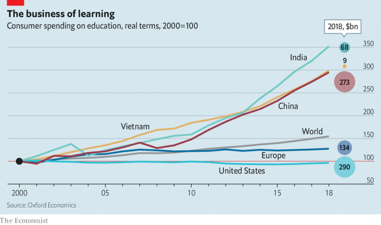

###### A class apart

# Governments should celebrate the boom in private education 

##### State schools can learn from the private sector; governments can work with it 

 

> Apr 11th 2019 

IF SPENDING IS a measure of what matters, then the people of the developing world place a high value on brains. While private spending on education has not budged in real terms in the rich world in the past ten years, in China and India it has more than doubled. The Chinese now spend 5% of household income on education and the Indians 4%, compared with 2.5% for the Americans and 1% for the Europeans. As a result, private schooling, tuition, vocational and tertiary education are booming in developing countries (see our Special report). 

Since brainpower is the primary generator of progress, this burst of enthusiasm for investing in human capital is excellent news for the world. But not everybody is delighted. Because private education increases inequality, some governments are trying to stop its advance. That’s wrong: they should welcome it, but spread its benefits more widely. 

Education used to be provided by religious institutions or entrepreneurs. But when governments, starting in Prussia in the 18th century, got into the business of nation-building, they realised they could use education to shape young minds. As state systems grew, private schooling was left to the elite and the pious. Now it is enjoying a resurgence, for several reasons. Incomes are rising, especially among the better off, at the same time as birth rates are falling. In China the former one-child policy means that six people—two parents and four grandparents—can pour money into educating a single child. The growth of the knowledge economy means that the returns to education are rising at the same time as the opportunities available to those without any schooling are shrinking. 

All over the developing world, people want more or better education than governments provide. Where cities are growing at unmanageable speed, the private sector is taking up the slack. In India the private sector now educates nearly half of all children, in Pakistan more than a third, and in both countries the state sector is shrinking. Even where the state does pretty well, as in East Asia, richer people still want better schooling for their children than the masses get. Thus Vietnam, which has an outstanding state-school system for a poor country, measured by its performance in the OECD’s PISA test, also has the fastest-growing private sector. 

In most ways, this is an excellent thing, because the world is getting more, and better, schooling. In rich countries, once the background and ability of the children who attend private schools are taken into account, their exam results are about the same as those in the state sector. But in developing countries private schools are better—and much more efficient. A study of eight Indian states found that, in terms of learning outcomes per rupee, private schools were between 1.5 times more cost-effective than state schools (in Bihar) and 29 times (in Uttar Pradesh). 

But private schools also increase inequality. They tend to sort children by income, herding richer ones towards better schools that will enhance their already superior life chances and poorer ones towards shoddy establishments that will further undermine their prospects. That is one reason why many governments are troubled by their rise. Other reasons are less creditable: teachers’ unions, which often have a hold over governments, tend to oppose them, and their growth reduces politicians’ power. So for good and bad reasons, governments are squeezing private schools, banning profits, cutting or capping fees, and using regulations to close them or make their life difficult. 

Governments are right to worry about private education’s contribution to inequality, but they are wrong to discourage its growth. The freedom to spend your money on improving your child’s potential is a fundamental one. Whether governments formally allow it or not, people will find ways of buying private education, by tutoring children out of school or bidding up the price of property near good state schools. 

Governments should instead focus on improving the public sector by mimicking the private sector’s virtues. Freedom from union power and independent management are at the root of its superior performance and greater efficiency. Governments should therefore do their best to weaken unions and give school principals more autonomy to innovate and to fire underperforming teachers. 

To spread the benefits of private schools more widely, governments should work with them, paying for education through vouchers which children can spend in private schools, or paying privately managed schools to educate publicly funded children. These schemes do not always succeed, but Chile, Pakistan and the Netherlands have all demonstrated that big, properly designed and managed voucher systems can work well. Children in Chile, whose entire system is voucher-based, do better than in any other Latin American country for which the OECD collects data. But vouchers should be limited to non-selective schools that do not charge top-up fees; otherwise governments will find themselves subsidising the better off and increasing inequality. 

The world faces plenty of problems. Governments should stop behaving as though one of them was private education. It will, rather, increase the chances of finding solutions. 

-- 

 单词注释:

1.sector['sektә]:n. 扇形, 部门, 部分, 函数尺, 象限仪, 段, 区段 vt. 把...分成扇形 [计] 扇面; 扇区; 段; 区段 

2.APR[]:[计] 替换通路再试器 

3.budge[bʌdʒ]:vi. 微微移动 vt. 推动 n. 羔羊皮 

4.vocational[vәu'keiʃәnl]:a. 职业的 [法] 职业上的, 天职的 

5.tertiary['tә:ʃiәri]:a. 第三的, 第三位的, 第三产业的 n. 第三修道会会员, 第三纪 第三的; 三代的(指无机盐) 

6.brainpower['breinpauә]:n. 智能, 智囊 

7.inequality[.ini'kwɒliti]:n. 不平等, 不同, 不平坦, 不平均 n. 不平等, 不等式 [计] 不等式 

8.entrepreneur[.ɒntrәprә'nә:]:n. 企业家, 主办人 [经] 承包商, 企业家 

9.Prussia['prʌʃә]:n. 普鲁士 

10.elite[ei'li:t]:n. 精华, 精锐, 中坚分子 

11.pious['paiәs]:a. 虔诚的, 敬神的, 尽责的, 可嘉的, 不可能实现的 

12.resurgence[ri'sә:dʒәns]:n. 再起, 复活, 再现 

13.unmanageable[.ʌn'mænidʒәbl]:a. 难管理的, 难处理的, 难操纵的, 处理不了的 [化] 难以加工的; 难以控制的; 难以管理的 

14.slack[slæk]:n. 松弛, 松懈, 淡季, 闲散, 家常裤 a. 松弛的, 不流畅的, 疏忽的, 无力的, 呆滞的, 软弱的, 漏水的 adv. 马虎地, 缓慢地 vt. 放松, 使缓慢 vi. 松懈, 减弱, 松弛 

15.Pakistan[.pɑ:ki'stɑ:n]:n. 巴基斯坦 

16.Vietnam[.vjet'næm]:n. 越南 

17.Pisa['pi:zә]:n. 比萨城 

18.rupee[ru:'pi:]:n. 卢比(印、巴等国货币单位) 

19.Bihar[bi'hɑ:]:n. 比哈尔邦(印度地名) 

20.uttar[]:[网络] 北方；乌塔茹阿；太邦 

21.Pradesh[]:邦 

22.shoddy['ʃɒdi]:a. 用长弹毛做的, 以次充好的 n. 长弹毛, 软再生毛, 赝品 

23.undermine[.ʌndә'main]:vt. 在...下面挖, 渐渐破坏, 暗地里破坏 [法] 暗中破坏, 以阴谋中伤伤害 

24.les[lei]:abbr. 发射脱离系统（Launch Escape System） 

25.formally['fɒ:mәli]:adv. 正式地, 形式上 

26.mimick[]:vt. 模仿, 摹拟 

27.autonomy[ɒ:'tɒnәmi]:n. 自治, 自治权 [医] 自主性 

28.innovate['inәuveit]:vi. 改革, 创新 

29.underperform[,ʌndәpә'fɔ:m]:vi.表现不佳,工作不如预期(或同行) vt.(股票等)运作差于(一般市场价格) 

30.voucher['vautʃә]:n. 证人, 保证人, 证明者, 凭证, 凭单 vt. 证实...的可靠性 

31.privately[]:adv. 秘密地；私下地 

32.alway['ɔ:lwei]:adv. 永远；总是（等于always） 

33.Chile['tʃili]:n. 智利 [化] 番椒; 辣椒 

34.Netherlands['neðәlәndz]:n. 荷兰 

35.Oecd[]:[经] 已开发国家组织 

36.datum['deitәm]:n. 论据, 材料, 资料, 已知数 [医] 材料, 资料, 论据 

37.subsidise[]:vt. 给...补助金, 津贴, 资助 

