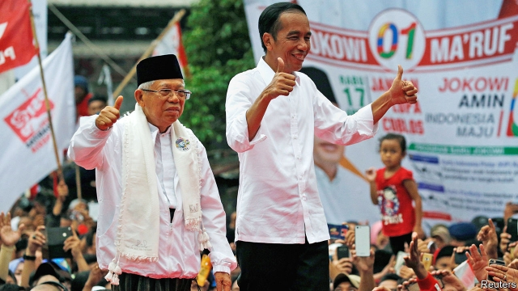

###### The wrong way to win

# Jokowi, the better candidate, is leading in Indonesia’s election 

##### But he has abandoned many of his most appealing positions to ensure victory 

 

> Apr 11th 2019 

AMERICA HAS more people, but not as many of them turn out to vote. India’s voters are conscientious and far more numerous, but it divides its national elections into seven phases spread over as many weeks, to make the process more manageable. So April 17th, when Indonesia’s 265m people pick a president, parliament and regional assemblies, is likely to be the biggest single day of voting in human history. 

In the presidential race Joko Widodo, the incumbent, faces Prabowo Subianto, a former general, just as he did at the previous election in 2014. Jokowi, as the president is known, is a small-businessman and former mayor from a mid-sized city who has worked hard to improve the lives of poor Indonesians. He has rolled out a national health-insurance scheme, pumped money into education and broken ground on lots of new infrastructure projects. Although he has not raised the growth rate to 7%, as he promised, his focus—development—is the right one. 

Mr Prabowo casts himself as a strongman, an unnerving pitch given that, as a general, he defended his father-in-law, Suharto, Indonesia’s dictator from 1967 to 1998. He promises to be more of an economic nationalist than Jokowi, and to make Indonesia great again. He has courted radical Islamists, doubtless hoping to capitalise on false rumours spread by social media that the president is a closet Christian or communist, a dangerous ploy in the world’s biggest Muslim country. His election would be a step backwards for Indonesia’s 20-year-old democracy. 

It is heartening, therefore, that most polls show Jokowi firmly in the lead. But that does not mean, unfortunately, that Indonesia’s democracy is healthy. For one thing, Jokowi has made himself the front-runner in part by imitating some of Mr Prabowo’s tactics (see article). He has nationalised a big gold and copper mine, and boosted spending on wasteful fuel subsidies he had previously cut. He has surrounded himself with generals with chequered pasts, such as Wiranto, who was head of the armed forces when East Timor voted for independence in 1999, prompting militias backed by the army to go on a rampage that claimed 1,400 lives. Jokowi has also shown scant regard for civil liberties when it suits him, standing by last year as the authorities found excuses to block lots of rallies by an opposition movement called “GantiPresiden” or “ChangePresident”. 

Indonesians might have been inclined to change their president if they had more of a choice. But Jokowi’s party, PDI-P, and the other big forces in politics have colluded to narrow their options. To run for president, a candidate must have the backing of parties with a fifth of the seats in parliament—a rule the president used to ensure Mr Prabowo was his only challenger. The threshold for parties to enter parliament has been steadily ratcheted upwards over the years, from 2% of the national vote in 2004 to 4% now. That is likely to trim the number of parties represented from ten to six or even four. Not that parties mean that much. After an election they all seek to join the president’s coalition, in order to win plum ministries and thus be able to hand out jobs and contracts to their allies. 

In fact, the only real ideological cleavage in Indonesia is between secularists and those who feel Islam should play a bigger role in public life. It is in this sense that Jokowi’s record is most disappointing. When a close political ally, Basuki Tjahaja Purnama (Ahok), the governor of Jakarta, was maliciously accused of blasphemy, Jokowi did not defend him. Instead he affected greater piety himself, praying with the protesters demanding that Ahok should be put on trial. As his running-mate in the current campaign, Jokowi has chosen a conservative cleric who testified against Ahok in court, helping condemn him to prison. The choice sends an appalling signal to the 12% of Indonesians who, like Ahok, are not Muslim. 

Jokowi’s instincts are secular. He has used his authority as president to ban one extremist group and thwart others. He is a heavy-metal fan; his wife does not wear a headscarf; his party is popular with religious minorities. But he clearly does not feel confident enough, despite his lead in the polls, to stand up to the zealots. The lesson they are learning from his tenure is that they can get their way through bullying and intimidation. Most Indonesians, by and large, understand the distinction between piety and intolerance perfectly well—and reflect that in their votes for moderate parties like the PDI-P. But their moderation will be to no avail if politicians, starting with Jokowi, are not willing to stand up for Indonesia’s long tradition of tolerance. 

-- 

 单词注释:

1.Jokowi[]:[网络] 佐科威；省长佐科威；雅加达市长 

2.APR[]:[计] 替换通路再试器 

3.voter['vәutә]:n. 选民, 投票人 [法] 选民, 选举人, 投票人 

4.conscientious[.kɒnʃi'enʃәs]:a. 有责任心的, 负责的, 本着良心的 [法] 凭良心做的, 有道德感的 

5.manageable['mænidʒәbl]:a. 易办的, 易管理的, 易控制的 

6.regional['ri:dʒәnәl]:a. 地方的, 地域性的 [医] 区的, 部位的 

7.presidential[.prezi'denʃәl]:a. 总统制的, 总统的, 首长的, 统辖的 [法] 总统的, 议长的, 总经理的 

8.Joko[]:[网络] 佐戈；上甲；彩绘阿祥 

9.widodo[]:[网络] 阿斯 

10.incumbent[in'kʌmbәnt]:a. 现任的, 依靠的, 负有义务的 n. 领圣俸者, 在职者 

11.prabowo[]:[网络] 拉波沃；拉博沃 

12.Indonesian[.indәu'ni:ʒәn]:a. 印尼的 n. 印尼人, 印尼语群 

13.infrastructure['infrәstrʌktʃә]:n. 基础结构, 基础设施 [经] 基础设施 

14.strongman[ˈstrɒŋmæn]:n. 大力士 

15.unnerve[.ʌn'nә:v]:vt. 使失去勇气, 使胆怯, 使不能自制 [医] 除神经 

16.Suharto[su'hɑ:təu]:n. 苏哈托（人名） 

17.dictator['dikteitә]:n. 命令者, 独裁者 

18.nationalist['næʃәnәlist]:n. 国家主义者, 民族主义者 

19.Indonesia[.indәu'ni:ʒә]:n. 印尼 

20.Islamist[iz'lɑ:mist]:n. 伊斯兰教主义者；回教教徒 

21.capitalise['kæpitәlaiz]:vt. 用大写字母写, 用大写字母印, 投资于, 使变为资本, 提供资本给 vi. 利用 

22.closet['klɒzit]:n. 壁橱, 小室 a. 秘密的, 空谈的 vt. 把...关入小室 

23.ploy[plɒi]:n. 手段, 活动, 玩乐 

24.Muslim['mjzlim; (?@) 'mʌzlem]:n. 伊斯兰教, 伊斯兰教教徒 

25.backwards['bækwәdz]:adv. 向后 

26.hearten['hɑ:tn]:vt. 使振作, 激励 vi. 振作 

27.tactic['tæktik]:n. 一项战术, 一条策略 a. 战术的, 顺序的, 排列的 

28.nationalise['næʃәnәlaiz]:vt. 把...收归国有, 使具有某国国籍, 使国有化 

29.wasteful['weistful]:a. 浪费的, 不经济的 

30.chequer['tʃekә]:n. (一粒)棋子, 西洋跳棋, 方格图案, 格子花, 花楸果, 排列成方格式的石头 vt. 把...画/制成方格图案形, 交替变换 

31.wiranto[]:[网络] 维兰托；兰多；维拉托 

32.Timor['ti:mɔ:]:帝汶岛(马来群岛中一岛) 

33.militia[mi'liʃә]:n. 义勇军, 民兵组织, 国民军 

34.rampage['ræmpeidʒ]:n. 乱闹, 乱冲, 暴跳 vi. 乱闹, 狂暴 

35.scant[skænt]:a. 不充分的, 不足的 vt. 减少, 吝啬, 限制, 藐视, 忽略 

36.rally['ræli]:n. 重振旗鼓, 集合, 群众集会, 跌停回升 v. 重整旗鼓, 集合, 恢复精神, 团结, 挖苦, 嘲笑 

37.opposition[.ɒpә'ziʃәn]:n. 反对, 敌对, 相反, 在野党 [医] 对生, 对向, 反抗, 反对症 

38.politic['pɒlitik]:a. 精明的, 明智的, 策略的 

39.collude[kә'lu:d]:vi. 共谋, 串通, 勾结 

40.challenger['tʃælindʒә]:n. 挑战者 [经] 申请回避的人 

41.threshold['θreʃәuld]:n. 门槛, 入口, 开端, 阈 [计] 阈; 阈值 

42.coalition[.kәuә'liʃәn]:n. 结合体, 结合, 联合 [经] 联合, 联盟 

43.plum[plʌm]:n. 李子 

44.ally['ælai. ә'lai]:n. 同盟者, 同盟国, 助手 vt. 使联盟, 使联合, 使有关系 vi. 结盟 

45.ideological[.aidiә'lɒdʒikәl]:a. 意识形态的, 空想的 [法] 思想的, 思想上的, 意识形态的 

46.cleavage['kli:vidʒ]:n. 劈开, 裂片, 分裂 [化] 解理 

47.secularist['sekjulәrist]:n. 现世主义者, 宗教与教育分离论者 

48.Islam['izlɑ:m]:n. 伊斯兰教 

49.Basuki[]:[网络] 钟万学；钟万学副省长 

50.Tjahaja[]:贾哈亚 

51.Purnama[]:[网络] 娜玛；采矿区 

52.Ahok[]:[网络] 钟万学；暰；阿学 

53.jakarta[dʒә'kɑ:tә]:n. 雅加达（印尼首都, 等于Djakarta） 

54.maliciously[]:adv. 有敌意地, 恶意地 

55.blasphemy['blæsfәmi]:n. 亵渎神明, 亵渎神明的言词 [法] 冒秽罪, 侮辱, 亵秽 

56.piety['paiәti]:n. 虔诚, 孝敬, 虔诚的行为 

57.protester[]:n. 抗议者, 持异议者, 拒付者 [经] 反对者 

58.cleric['klerik]:a. 牧师的, 教士的 

59.testify['testifai]:v. 证明, 作证, 声明, 表明 

60.appalling[ә'pɒ:liŋ]:a. 骇人的, 令人震惊的 

61.secular['sekjulә]:n. 修道院外的教士 a. 世俗的, 现世的, 长期的 

62.extremist[iks'tri:mist]:[经] 偏激份子 

63.thwart[θwɒ:t]:a. 横放的 vt. 反对, 阻挠, 横过 prep. 横过 adv. 横过 

64.headscarf[ˈhedskɑ:f]:n. 女人的头巾 

65.zealot['zelәt]:n. 热心者, 狂热者, 犹太教狂热信徒 [法] 狂热分子, 激烈分子 

66.tenure['tenjuә]:n. 享有, 保有期 [经] (财产,职位等的)占有, 占有权 

67.bully['buli]:n. 欺凌弱小者, 土霸 vt. 威胁, 恐吓, 欺负 vi. 欺负 a. 特好的, 第一流的 adv. 十分 

68.intimidation[in,timi'deiʃәn]:n. 恐吓, 威胁 [法] 恐吓, 威胁 

69.intolerance[in'tɒlәrәns]:n. 不宽容, 偏狭, 不容许相反的言论 [医] 不耐[性] 

70.moderation[.mɒdә'reiʃәn]:n. 缓和, 适度, 温和 [化] 慢化 

71.avail[ә'veil]:vi. 有用, 有利 vt. 有利于 n. 效用, 利益 

