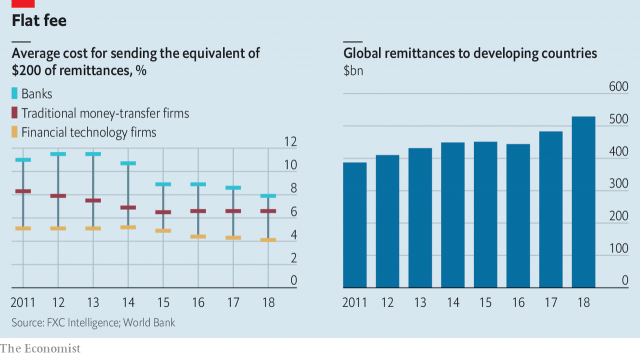

###### Making remittances cheaper

# The cost of cross-border payments needs to drop 

##### Sending money across borders costs too much 

 

> Apr 11th 2019 

FOR MOST of human history, sending money across borders has cost the earth. Thankfully for globetrotters and e-shoppers in the rich world, that has changed in the past decade. A shift from cash and travellers’ cheques towards digital payments has cut the cost of moving funds around. And a new generation of fintech firms has broken the stranglehold that big banks used to have on money transfers (see article). As a result, fees have fallen. The cost of a transfer between consumers or small firms who are both in G7 countries can now cost 2% or less. This year some $10trn will pass across borders. As prices fall further, the sums will grow. 

Yet one corner of this industry remains trapped in a dusty time warp: remittances, or the practice of foreign workers sending money to relatives back home. There the costs are still sky high, at about 7%. That matters. The sums involved are vast—$550bn of remittances will go to developing countries this year, more than all the capital they receive as investment from multinational companies, says the World Bank. There are 266m migrants, who often send money home. Many of them are poor, and so are almost all their relatives. 

Remittances cost the earth for several reasons. Typically at least one leg of the journey still involves physical cash—either in the “first mile”, when a construction worker or waiter hands over hard-earned banknotes to a specialist transfer firm or to a bank, or the “last mile” on the other side of the world, when the cash is handed over to their families, who lack bank accounts. These vast networks are expensive to maintain—Western Union, a 168-year-old transfer firm, is able to send cash to, or pick it up from, over half a million physical sites around the world. 

High fees also reflect anti-competitive behaviour and a growing thicket of Western money-laundering rules which are meant to police al-Qaeda barons, but which have ended up being a nightmare for expatriate Filipina maids. In combination, these two forces are strangling new entrants. Between 2011 and 2015, when the industry saw a brief flurry of startups, average remittance fees fell by 17%. But in 2016 the number of startup launches fell by half compared with the year before. Fees have since levelled off. 

To prod remittances into the 21st century, two things need to happen. In the short term governments in the developing world need to help unleash competition. Sometimes the big firms that dominate cash transfers, such as MoneyGram and Western Union, have exclusive partnerships with state-run bodies that have a dominant role in the first or last mile. For example, post offices that receive payments are often contractually committed to using a single transfer firm. Deals that lock out rivals should be banned. Governments in the rich world need to devise their money-laundering rules with competition in mind. Simple adjustments could lower the burden of compliance that startups face. For example, fintechs could be required to track every 20th transaction falling below a defined threshold, instead of every last one of them. 

In the long run the answer to the remittances puzzle is a shift away from expensive cash-based systems and a bypassing of banks and transfer firms altogether. This could yet happen. Across Africa, Asia and Latin America hundreds of millions of people are using e-commerce and transport applications on mobile phones that typically have payment systems and digital wallets, too. Entrepreneurs and tech firms are working out how to stitch all these local networks together. In time, perhaps, sending $200 from the rich world to the emerging one will cost almost nothing and the payments revolution will be complete. 

-- 

 单词注释:

1.remittance[ri'mitns]:n. 汇款 [经] 汇款, 寄款, 支付(金额) 

2.APR[]:[计] 替换通路再试器 

3.thankfully['θæŋkfulli]:adv. 感激地；感谢地 

4.globetrotter['^lәjbtrɔtә(r)]:n. 环球旅行者, 周游世界者, 环球游览者 

5.fintech[]:[网络] 金融科技；表面处理技术展；金融资讯科技服务 

6.stranglehold['stræŋglhәuld]:n. 勒颈, 压制自由, 抑制, 束缚 

7.les[lei]:abbr. 发射脱离系统（Launch Escape System） 

8.multinational[.mʌlti'næʃәnl]:a. 多国的, 跨国公司的 n. 跨国公司 

9.migrant['maigrәnt]:n. 候鸟, 移居者 [法] 移居者 

10.typically['tipikәli]:adv. 代表性地；作为特色地 

11.banknote['bæŋknәut]:n. 钞票 

12.thicket['θikit]:n. 丛林, 草丛 

13.baron['bærәn]:n. 男爵 [法] 男爵, 贵族, 大王 

14.nightmare['naitmєә]:n. 梦魇, 恶梦, 可怕的事物(或情景、人物) [医] 梦魇, 恶梦 

15.expatriate[eks'peitrieit]:n. 移居国外者, 侨民, 被流放者, 背井离乡者 vt. 逐出国外, 脱离国籍, 放逐 vi. 移居国外 

16.Filipina[filə'pi:nə]:n. 菲律宾妇女 

17.strangle['stræŋgl]:vt. 勒死, 扼死, 压制, 使窒息, 抑制 vi. 被扼死, 被绞死, 窒息而死 

18.entrant['entrәnt]:n. 新会员, 新成员, 进入者 

19.flurry['flә:ri]:n. 疾风, 飓风, 慌张 vt. 使恐慌, 使激动 vi. 慌张 

20.startup[]:[计] 启动 

21.prod[prɒd]:n. 刺针, 刺棒, 激励话, 提醒物 vt. 戳, 刺, 刺激 vi. 戳, 刺 

22.unleash[.ʌn'li:ʃ]:vt. 解开...的皮带, 发出, 发动 

23.moneygram[]:[网络] 速汇金；速汇金业务；速汇金国际有限公司 

24.partnership['pɑ:tnәʃip]:n. 合伙, 合股, 合作关系 [经] 合伙(合作)关系, 全体合伙人 

25.dominant['dɒminәnt]:a. 占优势的, 支配的 [医] 优性的, 显性的 

26.contractually[]:adv. 合约地；合同性地；契约规定地 

27.compliance[kәm'plaiәns]:n. 遵从, 顺从, 屈从 [化] 柔顺; 顺应 

28.transaction[træn'sækʃәn]:n. 交易, 办理, 学报, 和解协议 [计] 事务处理 

29.threshold['θreʃәuld]:n. 门槛, 入口, 开端, 阈 [计] 阈; 阈值 

30.bypass['baipɑ:s]:n. 旁路 vt. 省略, 绕过, 忽视, 回避 

31.typically['tipikәli]:adv. 代表性地；作为特色地 

32.entrepreneur[.ɒntrәprә'nә:]:n. 企业家, 主办人 [经] 承包商, 企业家 

33.tech[tek]:n. 技术学院或学校 

