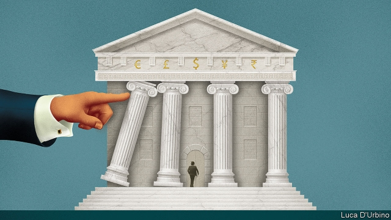

###### Central banks

# The independence of central banks is under threat from politics 

##### That is bad news for the world 

 

> Apr 13th 2019 

CRITICS OF ECONOMICS like to say that its abstract theories lack real-world pay-offs. There is a glaring counter-example: the global rise of central-bank independence in the past 25 years. In the 1970s it was normal for politicians to manipulate interest rates to boost their own popularity. That led to a plague of inflation. And so rich countries and many poorer ones shifted to a system in which politicians set a broad goal—steady prices—and left independent central bankers to realise it. In a single generation billions of people around the world have grown used to low and stable inflation and to the idea that the interest rates on their bank deposits and mortgages are under control. 

Today this success is threatened by a confluence of populism, nationalism and economic forces that are making monetary policy political again. President Donald Trump has demanded that interest rates should be slashed, speculated about firing the boss of the Federal Reserve and said he will nominate Stephen Moore and Herman Cain, two unqualified cronies, to its board. Brexiteers rubbish the competence and motives of the Bank of England, while in Turkey President Recep Tayyip Erdogan has been in a tug-of-war with the central bank. India’s government has replaced a capable central-bank chief with a pliant insider who has cut rates ahead of an election. And as we report this week, many top jobs at the European Central Bank (ECB), including the presidency, are up for grabs, and some could become part of a wider political struggle over who runs Europe’s institutions (see article). There is a genuine need for reflection on central banks’ objectives and tools. But dangerous forces are afoot that could have alarming consequences for economic stability. 

The problem of politicisation last became acute in the 1970s. After the post-war Bretton Woods currency system collapsed, central banks failed to tame racing inflation because politicians, who pulled the strings, were reluctant to bear the short-term cost of higher unemployment. Two decades of runaway prices and crises led to a new orthodoxy that central banks should be given operational autonomy to pursue an inflation target. In the euro zone, Japan and Britain central banks became legally independent in the 1990s. In America the White House refrained from even publicly discussing Fed policy (see Free exchange). This consensus survived the crash of 2007-08 and is one reason why global inflation has been only 4% a year on average over the past two decades. 

The fraying of central banks’ independence has several causes. One is populism. Leaders like Mr Trump combine the politician’s desire for low interest rates with a reckless urge to undermine institutions. Another is the scope of central banks’ activities, which expanded after the financial crisis. Most now hold huge portfolios of government bonds while, at the same time policing the financial industry. And the record of central banks is far from perfect. Because they have probably been too hawkish (despite their unconventional policies) the recovery from the crisis has been slow, undermining voters’ faith in the technocrats whose loyalty is supposedly to the public interest. All this makes it easier to view them as political. Meanwhile, the memory of the crises that led to independence has faded. 

Pressure is manifesting itself in different ways in different places. Mr Trump has launched an attack on the Fed. Although his legal authority to sack Jerome Powell, its chairman and a Trump appointee, is not clear, if he wins re-election in 2020 he will be able to nominate a new Fed chairman and two more governors. In Europe a flurry of job changes threatens to lower the calibre of decision-making at the ECB and feed underlying disagreements. By the end of the year, three members of the six-strong executive board and eight of the 19 national governors, who also vote on rates, will have left. The most notable of these is Mario Draghi, its head. His departure in October will happen almost concurrently with elections and a change in leadership at the European Commission and Council, a once-in-40-years overlap. Behind the political game of revolving chairs is a battle between countries to control policy. Northern Europeans have been suspicious of the ECB’s bond-buying, seeing it as cover for subsidising southern Europe. Rather than win by force of argument, they are seeking an edge by getting their own people into the top jobs. That will store up problems. 

Perhaps global inflation will rise again from its grave, in which case weaker central banks may struggle to kill it off. More likely is an economic downturn. The world economy has decelerated this year—on April 9th the IMF downgraded its forecasts. Central banks may find themselves needing to pep up their economies. 

This is what makes today’s politicisation so dangerous. Technocrats face a difficult challenge. The rich world has hardly any room to cut interest rates before hitting zero, so central banks will once again have to turn to unconventional stimulus, such as bond-buying. The Fed and other central banks may also need to co-operate globally, as in the wake of the crisis. The ECB will have to convince markets that it will do whatever it takes to contain another financial panic on Europe’s periphery. The presence of political appointees, who are either ill-qualified or northern European hawks, would make all these tasks harder. It is not just that their votes count, but also that they would poison the public debate about what central banks should and should not do to deal with recessions. 

It is right that the objectives and tools of monetary policy are subject to democratic scrutiny and that central bankers are accountable to legislatures. The Fed is reviewing its target in order to be prepared for a downturn. Other central banks should follow suit. In the long run, this secures their legitimacy and hence their independence. Yet in today’s political environment it is naive to think that politicians really want a considered debate. Instead, the more central banks are in the limelight, the more they will find their month-to-month decision-making subject to external pressure, or find themselves at the whim of boards packed with hacks. It is just that sort of politicisation that the theorists behind independent central banks wanted to avoid. Look back 40 years and you will get a flavour of what could go wrong. 

-- 

 单词注释:

1.politic['pɒlitik]:a. 精明的, 明智的, 策略的 

2.APR[]:[计] 替换通路再试器 

3.manipulate[mә'nipjuleit]:vt. 操纵, 利用, 操作, 巧妙地处理, 假造 

4.popularity[.pɒpju'læriti]:n. 名声, 受大众欢迎, 流行 

5.plague[pleig]:n. 瘟疫, 天罚, 麻烦, 灾祸 vt. 折磨, 使苦恼, 使得灾祸 

6.inflation[in'fleiʃәn]:n. 胀大, 夸张, 通货膨胀 [化] 充气吹胀; 膨胀 

7.banker['bæŋkә]:n. 银行家, 庄家 [经] 银行业者, 银行家 

8.mortgage['mɒ:gidʒ]:n. 抵押, 约束性义务, 抵押借款 vt. 抵押, 以...作担保, 把...许给 

9.confluence['kɒnfluәns]:n. 合流, 合流点, 集合, 人群 [医] 融合, 汇合 

10.Populism['pɒpjulizm]:n. 平民主义, 民粹主义 

11.nationalism['næʃәnәlizm]:n. 民族主义, 民族特性 

12.monetary['mʌnitәri]:a. 货币的, 金钱的 [经] 货币的, 金融的 

13.slash[slæʃ]:v. 猛砍, 乱砍 n. 猛砍, 乱砍, 删减 [计] 斜线 

14.speculate['spekjuleit]:vi. 深思, 推测, 投机 [经] 投机 

15.nominate['nɒmineit]:vt. 提名, 任命, 命名 [法] 提名...为候选人, 指定, 推荐 

16.stephen['sti:vn]:n. 斯蒂芬（男子名） 

17.moore['muә]:n. 摩尔（男子名） 

18.herman['hә:mәn]:n. 赫尔曼（男子名） 

19.cain[kein]:n. 凶手；杀兄弟者；该隐（亚当之子） 

20.unqualified[.ʌn'kwɒlifaid]:a. 不合格的, 无资格的, 不胜任的 [经] 无条件的, 不合格的, 无资格的 

21.crony['krәuni]:n. 密友, 亲密伙伴, 好朋友 

22.Brexiteers[]:支持英国退欧的人（Brexiteer的复数） 

23.recep[]:n. (Recep)人名；(土)雷杰普 

24.tayyip[]:[网络] 塔伊普 

25.erdogan[]:[网络] 埃尔多安；土耳其总理埃尔多安；艾尔多安 

26.pliant['plaiәnt]:a. 易弯的, 柔韧的, 柔顺的 

27.insider['in'saidә]:n. 内部的人, 权威人士, 知道内情的人 [经] 熟悉内情者 

28.ECB[]:[计] 事件控制块 

29.presidency['prezidәnsi]:n. 总统职权, 总裁职位 

30.grab[græb]:n. 抓握, 掠夺, 强占, 东方沿岸帆船 vi. 抓取, 抢去 vt. 攫取, 捕获, 霸占 

31.afoot[ә'fut]:a. 徒步的, 在进行中的, 活动中的 adv. 徒步, 在进行中 

32.politicisation[]:[网络] 科学政治化 

33.Bretton['bretәn]:Woods布雷顿森林 

34.runaway['rʌnә.wei]:n. 逃跑, 逃走的人, 逃亡, 压倒性的优胜 a. 逃亡的, 逃走的 

35.orthodoxy['ɒ:θәdɒksi]:n. 正统说法, 正教, 信奉正教 

36.autonomy[ɒ:'tɒnәmi]:n. 自治, 自治权 [医] 自主性 

37.euro['juәrәu]:n. 欧元（欧盟的统一货币单位） 

38.legally['li:gәli]:adv. 法律上, 合法地 [法] 法律上, 合法地, 法定地 

39.refrain[ri'frein]:n. 重复的话, 叠句, 副歌 vi. 节制, 避免, 克制 

40.fray[frei]:n. 磨损, 打架, 争论 vt. 使磨损 vi. 被磨损 

41.reckless['reklis]:a. 不介意的, 大意的, 鲁莽的, 不顾后果的 [法] 不注意的, 粗心大意的, 鲁莽的 

42.undermine[.ʌndә'main]:vt. 在...下面挖, 渐渐破坏, 暗地里破坏 [法] 暗中破坏, 以阴谋中伤伤害 

43.portfolio[pɒ:t'fәuliәu]:n. 皮包, 公文包, 部长职务, 有价证券财产目录, 艺术代表作选辑 [法] 公文包, 文件夹, 阁员职务 

44.hawkish['hɒ:kiʃ]:a. 像鹰的, 鹰派的, 强硬派的 

45.unconventional[.ʌnkәn'venʃәnl]:a. 不依惯例的, 非传统的, 非常规的 

46.technocrat['teknәukræt]:n. 技术专家治国论者, 技术专家统治论者 

47.supposedly[sә'pәuzidli]:adv. 想象上, 看上去像, 被认为是, 恐怕, 按照推测 

48.manifest['mænifest]:n. 载货单, 运货单, 旅客名单 a. 显然的, 明白的 vi. 显示, 出现 vt. 表明, 表现, 证明 

49.jerome[dʒә'rәum]:n. 杰罗姆（男子名） 

50.powell['pәuәl, 'pauәl]:n. 鲍威尔（英国物理学家） 

51.appointee[ә.pɒin'ti:]:n. 被任命者 [法] 被指定的人, 被任命者 

52.flurry['flә:ri]:n. 疾风, 飓风, 慌张 vt. 使恐慌, 使激动 vi. 慌张 

53.calibre['kælibә]:n. 口径, 才干, 水准 

54.underlie[.ʌndә'lai]:vt. 位于...之下, 成为...的基础 

55.notable['nәutәbl]:n. 著名人士, 值得注意之事物 a. 值得注意的, 显著的 

56.mario['mæriәj, 'mɑ:-]:n. 马里奥（男子名） 

57.Draghi[]:[网络] 行长德拉吉；总裁德拉吉；欧洲央行德拉吉 

58.concurrently[]:[计] 并行地 

59.overlap[.әuvә'læp]:n. 重叠, 重复, 部分的同时发生 vt. 重叠, 重复, 与...同时发生 vi. 迭盖, 部分的同时发生 [计] 重叠 

60.revolve[ri'vɒlv]:v. (使)旋转, 反复考虑, 循环出现 

61.subsidise[]:vt. 给...补助金, 津贴, 资助 

62.downturn['dauntә:n]:n. (尤指经济方面的)衰退, 下降趋势 [电] 低迷时期 

63.decelerate[.di:'selәreit]:v. (使)减速 

64.IMF[]:国际货币基金组织 [经] 国际货币基金 

65.downgrade['dajn^reid]:vt. 降低, 贬低 n. 下坡 a. 下坡 adv. 下坡 

66.pep[pep]:n. 活力, 气力, 劲头, 锐气 vt. 鼓起精神, 激励, 使充满活力 

67.stimulus['stimjulәs]:n. 刺激, 激励, 刺激品 [医] 刺激特, 刺激 

68.globally[]:[计] 全局地 

69.periphery[pә'rifәri]:n. 外围, 边缘地区, 圆周 [医] 外周, 周围 

70.recession[ri'seʃәn]:n. 后退, 凹处, 衰退, 归还 [医] 退缩 

71.scrutiny['skru:tini]:n. 细看, 仔细检查, 监视, 选票检查 [经] 复查, 评核, 仔细检查 

72.accountable[ә'kauntәbl]:a. 负有责任的, 可说明的, 可解释的 [经] 负有责任的 

73.legislature['ledʒisleitʃә]:n. 立法机关, 议会, 立法院 [法] 立法机构, 立法机关 

74.legitimacy[li'dʒitimәsi]:n. 合法, 正统, 正当 [法] 合法性, 正统性, 婚生 

75.naive[nɑ:'i:v]:a. 天真的, 纯真的, 幼稚的 

76.limelight['laimlait]:n. 石灰光, 石灰光灯, 以石灰光灯照射的舞台 vt. 使受到注目, 使显露头角 

77.whim[hwim]:n. 一时的兴致, 冲动, 怪念头, 绞盘 

78.hack[hæk]:n. 劈, 砍, 砍痕, 出租车, 干咳, 晒架, 鹤嘴锄 vt. 劈, 砍, 出租, 用旧 vi. 劈, 砍, 干咳, 驾驶出租车 a. 出租的 

79.theorist['θi:әrist]:n. 理论家, 理论工作者 

