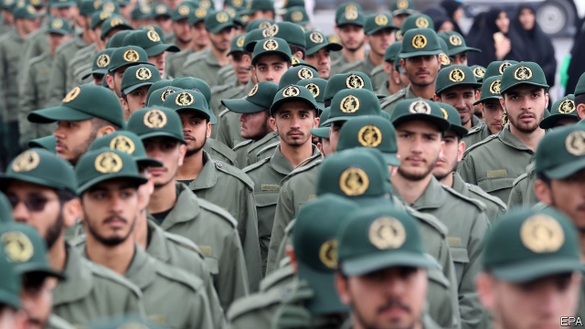

###### Tarred as terrorists inTehran

# America and Iran call each other sponsors of terror 

##### Donald Trump’s decision to brand Iran’s Revolutionary Guards terrorists could help them 

 

> Apr 11th 2019 

A  FEW YEARS before he became president, Donald Trump’s family probably did business with associates of Iran’s ideological armed force, the Revolutionary Guard Corps (IRGC). An article published in the New Yorker in 2017 says a tower bearing the Trump name in the Azerbaijani capital, Baku, was built by a company with links to the Guards. But on April 8th his administration blacklisted the force. Officials hailed the move as the first time America had branded a national army a terrorist outfit. “If you are doing business with the IRGC, you will be bankrolling terrorism,” Mr Trump said. 

The IRGC is Iran’s most powerful institution. It can field 180,000 troops, has the country’s best weapons and has bullied its way into vast swathes of the economy. It answers directly to the supreme leader, Ayatollah Ali Khamenei, not the president, Hassan Rouhani. Within hours of America’s designation the Guards duly declared that America’s central command, which has 200,000 personnel in the Middle East and Central Asia, was a terrorist organisation. 

America first branded Iran a sponsor of terror in 1984. It then designated the Quds Force (the IRGC’s unconventional-warfare arm that operates across the Middle East) a terrorist organisation in 2007. But a few years later America’s armed forces and the Quds Force became unofficial allies fighting against the jihadists of Islamic State. 

Despite the bluster, the latest labelling changes little. Mr Trump had already listed the Guards as a terrorist group in 2017. At the time he also imposed more stringent measures—including secondary sanctions on anyone doing business with it—than those required under this week’s listing. The State Department says the new action would prevent any of its members from entering America. But Iranians already faced a visa ban. “As a purely technical matter, it doesn’t mean a lot,” says Danny Glaser, a former official at the Treasury Department who oversaw sanctions enforcement. 

The bigger impact will be political, since the measures will deepen Iran’s sense of isolation. That hurts Mr Rouhani more than the Guards. Iran’s oil revenues and currency had already plummeted after Mr Trump last year reimposed sanctions and pulled out of the nuclear deal that Mr Rouhani had negotiated with world powers. Further pressure is expected when waivers America granted to Iran’s largest buyers of oil expire in May, and as America squeezes Iranian banks out of the international payments system. 

By contrast, sanctions make the IRGC’s smuggling networks lucrative. And politically it is making hay; its media outlets are stoking popular anger against the government’s weakness and allowing the hardliners to promote themselves as an alternative. In trying to hurt the Guards Mr Trump could be helping them, again. 

-- 

 单词注释:

1.tar[tɑ:]:n. 焦油, 柏油, 水手 vt. 涂以焦油, 玷污, 怂恿 a. 焦油的 

2.terrorist['terәrist]:n. 恐怖分子 [法] 恐怖份子, 恐怖主义 

3.Iran[i'rɑ:n]:n. 伊朗 

4.APR[]:[计] 替换通路再试器 

5.ideological[.aidiә'lɒdʒikәl]:a. 意识形态的, 空想的 [法] 思想的, 思想上的, 意识形态的 

6.corp[]:[经] 公司 

7.irgc[]: [体]国际比赛规则委员会 

8.yorker['jɒ:kә]:n. 贴板球 

9.Azerbaijani[,æzәbai'dʒɑ:ni]:阿塞拜疆人 

10.Baku[bɑ:'ku:]:n. 巴库 

11.blacklist['blæklist]:n. 黑名单 

12.hail[heil]:n. 冰雹, 致敬, 欢呼, 招呼 vt. 向...欢呼, 致敬, 招呼, 使象下雹样落下 vi. 招呼, 下雹 interj. 万岁, 欢迎 

13.outfit['autfit]:n. 用具, 配备, 机构 vt. 配备, 供应 vi. 得到装备 

14.terrorism['terәrizm]:n. 恐怖主义, 恐怖统治, 恐怖状态 [法] 胁迫, 暴政, 恐怖政治 

15.bully['buli]:n. 欺凌弱小者, 土霸 vt. 威胁, 恐吓, 欺负 vi. 欺负 a. 特好的, 第一流的 adv. 十分 

16.swathe[sweiθ]:vt. 绑, 裹, 包围 n. 带子, 绷带 

17.ayatollah[,aɪə'tɒlə]:n. 阿亚图拉（对伊朗等国伊斯兰教什叶派领袖的尊称） 

18.ALI[]:[计] 异步线路接口 

19.Khamenei[]:n. (Khamenei)人名；(伊朗)哈梅内伊 

20.Hassan[]:n. 哈山（男子名） 

21.rouhani[]:n. (Rouhani)人名；(伊朗)鲁哈尼 

22.designation[.dezig'neiʃәn]:n. 指示, 指定, 命名 [电] 指定 

23.duly['dju:li]:adv. 恰当地, 充分地, 适当地, 及时地 

24.organisation[,ɔ: ^әnaizeiʃən; - ni'z-]:n. 组织, 团体, 体制, 编制 

25.designate['dezigneit]:vt. 指定, 指明, 称呼 a. 已选出而未上任的 

26.quds[]:[网络] 圣城；昆茨 

27.unofficial[.ʌnә'fiʃәl]:a. 非正式的, 非官方的 [化] 非法定的; 未入药典的 

28.ally['ælai. ә'lai]:n. 同盟者, 同盟国, 助手 vt. 使联盟, 使联合, 使有关系 vi. 结盟 

29.jihadist[]:n. 伊斯兰圣战士 

30.Islamic[iz'læmik]:a. 伊斯兰教的, 穆斯林的 

31.bluster['blʌstә]:vt. 风狂吹, 咆哮, 汹涌 vi. 咆哮着说出, 恐吓 n. 狂风声, 巨浪声, 夸口, 大话 

32.stringent['strindʒәnt]:a. 迫切的, 严厉的, 银根紧的 [医] 约束的, 紧迫的 

33.sanction['sæŋkʃәn]:n. 核准, 制裁, 处罚, 约束力 vt. 制定制裁规则, 认可, 核准, 同意 

34.Iranian[i'reiniәn]:a. 伊朗的, 伊朗语系的 n. 伊朗人, 伊朗语 

35.Danny['dæni]:n. 丹尼（男子名, 等于Daniel） 

36.Glaser['^leizә]:格拉泽(①姓氏 ②Donald Arthur, 1926-, 美国物理学家, 曾获1960年诺贝尔物理学奖) 

37.treasury['treʒәri]:n. 国库, 宝库, 财政部, 国库券 [经] 库存, 国库, 金库 

38.oversee[.әuvә'si:]:vt. 向下看, 了望, 监督, 偷看到 [法] 监察, 监督, 俯瞰 

39.enforcement[in'fɒ:smәnt]:n. 执行, 强制 [法] 实施, 加强, 厉行 

40.isolation[.aisә'leiʃәn]:n. 隔绝, 孤立, 隔离 [化] 分离; 生物分离 

41.plummete[]:[网络] 直线下降 

42.reimpose[.ri:im'pәuz]:vt. 再强加, 重新征收 [经] 再征收, 重新征收 

43.waiver['weivә]:n. 放弃, 弃权, 弃权声明书 [经] 弃权, 放弃权利 

44.buyer['baiә]:n. 买主, 买方 [经] 买主, 买方, 买手 

45.expire[ik'spaiә]:vi. 期满, 呼气, 断气 vt. 呼出 

46.Iranian[i'reiniәn]:a. 伊朗的, 伊朗语系的 n. 伊朗人, 伊朗语 

47.smuggle['smʌgl]:vt. 偷运, 走私, 私运 vi. 走私 

48.lucrative['lu:krәtiv]:a. 有利益的, 获利的, 合算的 

49.politically[]:adv. 政治上 

50.stoke[stәuk]:v. 司炉, (使)大吃 

51.hardliner[ˌhɑ:d'laɪnə(r)]:n. 强硬路线者 

