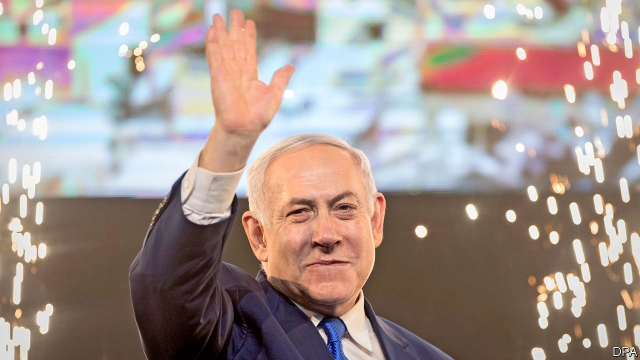
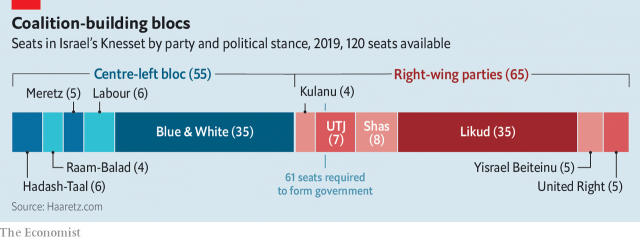

###### King Bibi keeps his crown

# Binyamin Netanyahu has won a fifth term 

##### What will he do next? 

 

> Apr 11th 2019 

AFTER MONTHS of heated campaigning, Israeli voters decided to change very little. With most of the votes counted the prime minister, Binyamin Netanyahu, has won a fifth term in office in an election on April 9th. His Likud party tied with Blue and White, a centre-left party led by Benny Gantz, a former army chief. Both had about 27% of the vote. But the right-wing and religious bloc, of which Likud is a part, won a combined 53%. 

That will give it a majority, probably with 64 seats in the 120-member Knesset (parliament), the same number it holds now. With several parties perched close to the 3.25% threshold to enter the Knesset, the results are still fluid. (Two have demanded a recount.) But Mr Gantz does not appear to have a viable coalition, nor a way to stop Mr Netanyahu from forming one. 

As with the previous election, in 2015, early exit polls suggested that Mr Netanyahu had been weakened. His rival rushed on stage to declare victory soon after voting stopped. “A historic day”, Mr Gantz declared, telling supporters he would form the next government. While he made promises, Mr Netanyahu made phone calls. He received pledges of support from the ultra-Orthodox parties and a far-right grouping, enough to bring him within striking distance of a majority. 

There were no signs of consternation as hundreds of Likud supporters streamed into the basketball arena the party had hired for election night. They had been in similar situations before. When Mr Netanyahu finally took the stage after 2am, most Israeli networks had revised their surveys to show him in the lead. On the screen behind him was the campaign slogan: “Netanyahu is in a different league.” The crowd was ecstatic. “This is a night of great victory,” he said. “The right-wing bloc will continue to lead Israel for four more years.” 

That may be a challenge—though not because of politics. Mr Netanyahu has been indicted, pending a hearing, in three corruption cases. Prosecutors accuse him of taking gifts from wealthy businessmen in exchange for favours and offering legal and regulatory help to media giants in order to secure better press coverage. He denies wrongdoing. Strikingly, the allegations did not make him any less popular. On the contrary: Likud’s share of the vote increased by three percentage points from 2015. Its projected 35 seats are the most it has won since 2003, when Ariel Sharon led the party. 

In an election that became a referendum on Mr Netanyahu, many Israelis appear to have voted strategically, favouring one of the two main parties in the hope it would be asked to form a government. It was an impressive showing for Mr Gantz, a political newcomer who faced a vicious campaign from his rival. But it came largely at the expense of other centre-left parties. Labour, which built the country and ruled for almost three decades, collapsed. It won less than 5% of vote. 

 

Other Israelis did not vote at all. Turnout was 68%, about four points lower than in 2015. Parties that cater to Arab citizens received just 328,000 votes, a 26% drop. 

The outcome, and the campaign before it, have deepened Israel’s divisions—not only between right and left but also between Jews and Arab Israelis, who are 21% of the population. Mr Netanyahu repeatedly accused his rivals of plotting to form a coalition with “Arab parties that oppose the Jewish state”. He encouraged an ally to join forces with a far-right Jewish supremacist party. On election day, in what looked like an attempt at voter intimidation, Likud distributed 1,200 cameras to its poll observers in Arab towns. 

In another sign of Likud’s rough nationalist tilt, one of the new Knesset members celebrating her election was May Golan, an activist who led the campaign to deport African refugees from Israel. In the past Ms Golan failed to enter the Knesset as a candidate of the racist Jewish Power party. Now she will sit with the ruling party. 

If he forms a right-wing coalition, Mr Netanyahu must pay heed to the demands of at least four other parties. Those representing the Ultra-Orthodox will want to preserve their exemption from the army draft and secure other giveaways on issues of religion and state. His hawkish partners will want him to fulfil a promise, made in the campaign’s final days, to start annexing parts of the occupied West Bank. That step would raise profound diplomatic and existential questions for Israel. The American president, Donald Trump, is expected to present his own peace plan soon. The Palestinian leadership, enraged at many of Mr Trump’s policies, will almost certainly reject it. Senior Likud members say that will clear the path for annexation. 

Mr Netanyahu, for his part, will be worried about his future. Wing 10 of Israel’s Maasiyahu jail is designed to hold former prime ministers. His predecessor, Ehud Olmert, was imprisoned there for taking bribes. With the election over, Mr Netanyahu’s lawyers will receive dossiers of evidence to prepare for pre-trial hearings, expected in the coming months. His allies have proposed a bill that would shield a sitting prime minister from prosecution. Some of his prospective coalition partners oppose it. Mr Netanyahu may seek to win their support by making other concessions. If he fails, his fifth term may be a short one. 

-- 

 单词注释:

1.bibi[]:n. 周笔畅 

2.binyamin[]:本雅明 

3.Netanyahu[]:n. 内塔尼亚胡（人名） 

4.APR[]:[计] 替换通路再试器 

5.Israeli[iz'reili]:a. 以色列的, 以色列人(语)的 n. 以色列人 

6.voter['vәutә]:n. 选民, 投票人 [法] 选民, 选举人, 投票人 

7.Likud[li:'ku:d]:n. 利库德集团(以色列右翼党派的政治联盟,长期为以色列执政党) 

8.benny['beni]:n. 安非他明(药片) 

9.gantz[]: [人名] 甘茨; [电影]杀戮都市/杀戮都市 

10.bloc[blɒk]:n. 集团 

11.Knesset['kneset]:n. (以色列)议会 

12.perch[pә:tʃ]:n. 栖木, 高位, 杆, 河鲈 v. (使)栖息, 就位, 位于, (使)暂歇 

13.threshold['θreʃәuld]:n. 门槛, 入口, 开端, 阈 [计] 阈; 阈值 

14.recount[ri'kaunt]:vt. 详述, 叙述, 重新计算 n. 重新计算 

15.viable['vaiәbl]:a. 能养活的, 能生长发育的 [医] 有活力的, 有生机的 

16.coalition[.kәuә'liʃәn]:n. 结合体, 结合, 联合 [经] 联合, 联盟 

17.historic[hi'stɒrik]:a. 历史上著名的, 有历史性的 

18.supporter[sә'pɒ:tә]:n. 支持者, 后盾, 迫随者, 护身织物 [法] 支持者, 赡养者, 抚养者 

19.pledge[pledʒ]:n. 诺言, 保证, 誓言, 抵押, 信物, 保人, 祝愿 vt. 许诺, 保证, 使发誓, 抵押, 典当, 举杯祝...健康 

20.grouping['gru:piŋ]:n. 分组 [计] 组 

21.consternation[.kɒnstә'neiʃәn]:n. 惊愕, 恐怖, 惊惶失措 

22.arena[ә'ri:nә]:n. 角斗场, 舞台, 场地 [医] 尿沉渣, 尿沙; 脑沙 

23.ecstatic[ik'stætik]:n. 狂喜的人 a. 狂喜的 

24.Israel['izreil]:n. 以色列, 以色列后裔, 犹太人 

25.politic['pɒlitik]:a. 精明的, 明智的, 策略的 

26.indict[in'dait]:vt. 起诉, 控告, 指控 [法] 控告, 揭发, 对...起诉 

27.pending['pendiŋ]:a. 未决定的, 待决的, 行将发生的, 向外伸出的 prep. 在等待...之际, 直到...时为止, 在...期间, 在...过程中 

28.corruption[kә'rʌpʃәn]:n. 腐败, 堕落, 贪污 [计] 论误 

29.prosecutor['prɒsikju:tә]:n. 实行者, 告发者, 公诉人 [法] 原告, 起诉人, 检举人 

30.regulatory['regjulәtәri]:a. 受控制的, 统制的, 调整的 [经] 规则的 

31.coverage['kʌvәridʒ]:n. 覆盖的范围, 保险总额, 新闻报导 [化] 可达范围; 覆盖度 

32.wrongdoing['rɒŋ'du:iŋ]:n. 干坏事, 坏事 

33.strikingly[]:adv. 显著地, 惊人地, 引人注目地 

34.allegation[.æli'geiʃәn]:n. 断言, 主张, 申辩 [法] 声明, 事实陈述, 断言 

35.les[lei]:abbr. 发射脱离系统（Launch Escape System） 

36.ariel['єәriәl]:n. 瞪羚 

37.sharon[]:n. 莎伦（女子名） 

38.referendum[.refә'rendәm]:n. （就重大政治或社会问题进行的）全民公决，全民投票 

39.Israeli[iz'reili]:a. 以色列的, 以色列人(语)的 n. 以色列人 

40.strategically[strә'ti:dʒikәli]:adv. 在战略上, 颇策略地 

41.newcomer[nju:'kʌmә]:n. 新来者 

42.vicious['viʃәs]:a. 邪恶的, 堕落的, 品性不端的, 恶毒的, 恶性的, 有错误的 [医] 缺点的, 恶的 

43.turnout['tә:naut]:n. 聚集的人群, 出席者, 产量 [化] 输出; 产额 

44.Jew[dʒu:]:n. 犹太人, 守财奴, 犹太教信徒 vt. 欺骗, 杀价 

45.ally['ælai. ә'lai]:n. 同盟者, 同盟国, 助手 vt. 使联盟, 使联合, 使有关系 vi. 结盟 

46.supremacist[sә'premәsist, sju-]:n. 至上主义者 

47.intimidation[in,timi'deiʃәn]:n. 恐吓, 威胁 [法] 恐吓, 威胁 

48.nationalist['næʃәnәlist]:n. 国家主义者, 民族主义者 

49.tilt[tilt]:n. 倾斜, 倾向, 船篷, 车篷 vt. 使倾斜, 使倾侧, 用帆布篷遮盖 vi. 倾斜, 翘起, 冲, 评击 [计] 倾斜 

50.golan['^әj'lɑ:n]:Heights戈兰高地[叙利亚西南部](1967年被以色列占领) 

51.activist['æktivist]:n. 激进主义分子 

52.deport[di'pɒ:t]:vt. 举止, 驱逐出境 [法] 放逐, 驱逐, 递解 

53.refugee[.refju'dʒi:]:n. 难民, 流亡者 [法] 避难者, 流亡者, 难民 

54.racist['reisist]:n. 种族主义者 [法] 种族主义的, 种族歧视 

55.heed[hi:d]:n. 注意, 留心 v. 注意, 留心 

56.exemption[ig'zempʃәn]:n. 解除, 免除, 免税 [化] 免检 

57.giveaway['givә.wei]:n. 泄漏, 免费赠品 

58.hawkish['hɒ:kiʃ]:a. 像鹰的, 鹰派的, 强硬派的 

59.annex[ә'neks]:n. 附加物, 附属建筑物 vt. 附加, 盖(印), 并吞 

60.profound[prә'faund]:a. 极深的, 深厚的, 深刻的, 渊博的 

61.diplomatic[.diplә'mætik]:a. 外交的, 老练的 [法] 外交的, 外交上的, 文献上的 

62.existential[.egzis'tenʃәl]:a. 有关存在的 

63.Palestinian[,pælis'tiniәn]:[经] 巴勒斯坦的 

64.enrage[in'reidʒ]:vt. 激怒, 使暴怒 

65.annexation[ænek'seiʃәn]:n. 合并, 附加, 附加物 [法] 兼并, 侵吞, 附加物 

66.predecessor[.predi'sesә]:n. 前任, 先辈, 前身 [医] 初牙, 前辈, 祖先 

67.ehud[]:[网络] 以笏；以色列；艾胡得 

68.olmert[]:n. [姓氏]奥尔默特 

69.bribe[braib]:n. 贿赂 vt. 贿赂, 收买 vi. 行贿 

70.dossier['dɒsiei]:n. 档案, 卷宗 [医] 病历表册, 病历夹 

71.prosecution[.prɒsi'kju:ʃәn]:n. 执行, 经营, 起诉 

72.prospective[prәs'pektiv]:a. 预期的, 将来的 [经] 预期的, 未来的 

73.concession[kәn'seʃәn]:n. 特许, 让步, 认可 [经] 核准, 许可, 特殊(权) 

