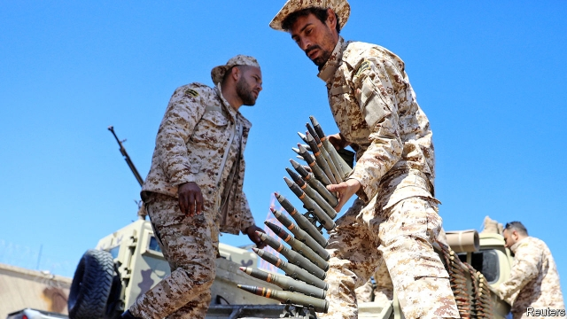

###### A bad and bloody bet

# Khalifa Haftar, Libya’s strongest warlord, makes a push for Tripoli 

##### But he faces stiff opposition and risks losing the territory he already holds 

 

> Apr 11th 2019 

THIS WAS supposed to be a rare moment of cautious optimism in Libya. On April 4th António Guterres, the UN’s secretary-general, arrived in Tripoli, the capital, to prepare for a peace conference which, he hoped, would lead to long-delayed elections later this year. But hours after he arrived Khalifa Haftar, the warlord who controls much of the country, launched an offensive to seize the city. At times his self-styled Libyan National Army (LNA) has reached within 10km or so of Tripoli’s centre. Dozens have been killed. Flights were suspended after General Haftar’s jets bombed the city’s only functioning airport. The conference has been cancelled. “The UN is deeply engaged in negotiations for peace,” Mr Guterres said later. “We’re not always successful, I must confess.” 

The general had long threatened to take Tripoli. Until now he was posturing. No one is quite sure why he chose this moment to move on the capital. Whatever his reasons, his offensive is starting to look like a big miscalculation. He would have entered the conference in an enviable position, holding most of Libya’s land and oil wells. Instead the LNA is now bogged down on several fronts. The general risks losing not only the battle for Tripoli but many of his other gains as well. 

He may have been encouraged by his recent romp through southern Libya, seized in a lightning campaign earlier this year. Many southerners welcomed the LNA. Their region is rife with ethnic and tribal fighting, and with smuggling gangs. Militants from neighbouring Chad and Sudan have joined the fray. Locals hoped the general would bring stability. He seized towns and a big oilfield with little bloodshed. 

 

Grabbing all the west will not be so easy. Militias from the port city of Misrata have vowed to block the LNA’s advance. One contingent has deployed to reinforce Tripoli. Another is preparing a counter-offensive to the south and east. The Misratans are the strongest force in western Libya and won a decisive victory over Islamic State (IS) in 2016. They resent General Haftar’s ambitions and are linked to the government in Tripoli through the interior minister, Fathi Bashagha, a Misratan. General Haftar had worked for months to co-opt forces in the west, some of whom are frustrated with the UN-backed Government of National Accord (GNA) in Tripoli. Now they seem united against him. 

His offensive is embarrassing his numerous foreign allies. Egypt and the United Arab Emirates have provided air support. France has special forces deployed in the east. Russia has sold him weapons. (The GNA counts Qatar, Turkey and Italy as partners.) The general’s friends nominally back the UN-led peace process but have tolerated and encouraged his machinations. France has not asked him to pull back. Instead it wants him to meet Fayez al-Serraj, the GNA’s leader, for peace talks in Geneva. Egypt did not even bother to sign an American-led statement calling for calm. 

After eight years of chaos, it is understandable why General Haftar looks appealing. He brought a measure of control to the east, while the GNA has struggled to keep Tripoli calm. Egypt and the UAE share his anti-Islamist politics. But the capture of Benghazi caused the destruction of large parts of the city. The general himself is 75 and in patchy health. His LNA is a hotch-potch of militias bound by mutual interests and money. It does not represent the entire country, and some of its members are not even Libyan. General Haftar’s empire may not outlast him. 

Even his attitude toward Islamists is driven by interests rather than ideology. Though he opposes the Muslim Brothers and their ilk, he has made common cause with the Madkhalis, an ultra-conservative sect backed by Saudi Arabia. They have sought to impose their puritanical views in the east. He may have hoped Tripoli’s Madkhali faction, now aligned with the GNA, would help him take the capital. The general met King Salman of Saudi Arabia in March, and may have won his support. 

By rushing the bulk of his forces west, the general has left a vacuum in the territory he already holds. Jihadists are trying to exploit it: IS attacked the central town of Fuqaha on April 9th. Unrest in the south and east would jeopardise the oil exports that provide 90% of government revenue. Output has recently increased, with Libya pumping some 1m barrels a day since the summer. The fighting may reduce global supplies already squeezed by sanctions on Iran and turmoil in Venezuela. On April 5th the price of Brent crude topped $70 a barrel, its highest level since November. 

Both sides claim to be winning. But the LNA may have overreached. It is stretched thin and will struggle to maintain supply lines across unfriendly territory. It captured, then lost, the defunct international airport on the edge of Tripoli. The GNA bombed an airfield its rival has used to launch air raids. An LNA retreat seems unlikely. It would be out of character, and humiliating, for General Haftar. But a long battle could spell final ruin for Libya. 

-- 

 单词注释:

1.bloody['blʌdi]:a. 血腥的, 嗜杀的, 有血的 

2.khalifa[kɑ:'li:fә]:n. (=caliph)哈里发(伊斯兰教国家政教领袖的尊称) 

3.warlord['wɒ:lɒ:d]:n. 军阀, 军阀式领袖 

4.tripoli['tripәli]:n. 硅藻土 [医] 硅藻岩 

5.opposition[.ɒpә'ziʃәn]:n. 反对, 敌对, 相反, 在野党 [医] 对生, 对向, 反抗, 反对症 

6.APR[]:[计] 替换通路再试器 

7.optimism['ɒptimizm]:n. 乐观主义, 乐观, 乐天 [医] 乐观主义, 乐观 

8.Libya['libiә]:n. 利比亚 

9.guterres[]:[网络] 古特雷斯 

10.offensive[ә'fensiv]:a. 令人不快的, 侮辱的, 攻击性的 [法] 攻击的, 进攻的, 冒犯的 

11.Libyan['libiәn]:a. 利比亚的 n. 利比亚人, 古代利比亚语 

12.LNA[]:n. 低噪声放大器；低噪声天线 [网络] 低噪声放大器(Low Noise Amplifier)；低杂讯放大器；低噪放 

13.UN[ʌn]:pron. 家伙, 东西 [经] 联合国 

14.negotiation[ni.gәuʃi'eiʃәn]:n. 谈判, 磋商, 交涉 [经] 谈判, 协商 

15.alway['ɔ:lwei]:adv. 永远；总是（等于always） 

16.posture['pɒstʃә]:n. 姿势, 态度, 情形, 形势 vt. 作...的姿势 vi. 作姿势 

17.miscalculation[]:n. 算错, 失算, 估计错误 [计] 计算错误, 算错 

18.enviable['enviәbl]:a. 令人羡慕的, 可羡慕的 

19.bog[bɒg]:n. 沼泽 vt. 使陷于泥沼 vi. 陷于泥沼 

20.romp[rɒmp]:n. 喧闹游玩, 顽皮女孩 vi. 喧闹玩耍, 轻快奔跑 

21.southerner['sʌðәnә]:n. 南方人 

22.rife[raif]:a. 流行的, 盛传的, 充满的 

23.ethnic['eθnik]:a. 人种的, 种族的 [医] 人种的 

24.tribal[traibl]:a. 部落的, 宗族的 

25.smuggle['smʌgl]:vt. 偷运, 走私, 私运 vi. 走私 

26.militant['militәnt]:a. 好战的 

27.Chad[tʃæd]:n. 乍得 [计] 孔屑 

28.Sudan[su:'dæn]:n. 苏丹 [化] 苯偶氮间苯二酚; 苏丹 

29.fray[frei]:n. 磨损, 打架, 争论 vt. 使磨损 vi. 被磨损 

30.bloodshed['blʌdʃed]:n. 流血 

31.grab[græb]:n. 抓握, 掠夺, 强占, 东方沿岸帆船 vi. 抓取, 抢去 vt. 攫取, 捕获, 霸占 

32.militia[mi'liʃә]:n. 义勇军, 民兵组织, 国民军 

33.Misrata[]:[网络] 米苏拉塔；米斯拉特；米苏拉塔市 

34.vow[vau]:n. 誓约, 誓言, 许愿 vi. 起誓, 发誓, 郑重宣言 vt. 立誓, 起誓要, 郑重地宣布 

35.contingent[kәn'tindʒәnt]:a. 或许发生的, 附随的, 偶然发生的 n. 偶然事件, 分遣队 

36.deploy[di'plɒi]:v. 展开, 配置 

37.decisive[di'saisiv]:a. 决定性的, 坚定的, 果断的 

38.Islamic[iz'læmik]:a. 伊斯兰教的, 穆斯林的 

39.resent[ri'zent]:vt. 愤恨, 憎恶, 怨恨 

40.fathi[]:[网络] 法蒂；法赛 

41.gna[]:abbr. Ghana News Agency 加纳通讯社; Galanthus nivalis agglutinin 雪花胺凝集素; Great Northern Insured Annuity Corporation 大北保险年金公司; Graysonia, Nashville and Ashdown Railroad <美国>格雷索尼亚-纳什维尔-阿什当铁路公司 

42.ally['ælai. ә'lai]:n. 同盟者, 同盟国, 助手 vt. 使联盟, 使联合, 使有关系 vi. 结盟 

43.Egypt['i:dʒipt]:n. 埃及 

44.emirate[e'miәrit]:n. 埃米尔的地位, 酋长国 

45.Qatar['kɑ:tәr]:n. 卡塔尔 

46.nominally['nɒminәli]:adv. 有名无实地, 名义上地, 名称上 

47.machination[mæki'neiʃәn]:n. 阴谋, 图谋, 策划 [法] 诡计, 奸计, 阴谋 

48.fayez[]:[网络] 法伊兹 

49.Geneva[dʒi'ni:vә]:n. 日内瓦, (荷兰)杜松子酒 

50.bother['bɒðә]:vt. 烦扰, 迷惑 vi. 烦恼, 操心 n. 麻烦, 纠纷, 讨厌的人 

51.chao[]:n. 钞（货币） 

52.understandable[.ʌndә'stændәbl]:a. 可以理解的 

53.UAE[]:阿拉伯联合酋长国 

54.politic['pɒlitik]:a. 精明的, 明智的, 策略的 

55.Benghazi[ben'ga:zi]:n. 班加西（利比亚北部港口城市） 

56.patchy['pætʃi]:a. 补缀的, 凑合的, 不调和的, 散落的, 斑驳的, 不完全的 

57.outlast[.aut'lɑ:st]:vt. 比...长久, 从...中逃生 

58.Islamist[iz'lɑ:mist]:n. 伊斯兰教主义者；回教教徒 

59.ideology[.aidi'ɒlәdʒi]:n. 思想体系, 意识形态, 观念学, 空论 [医] 观念学, 观念形态 

60.Muslim['mjzlim; (?@) 'mʌzlem]:n. 伊斯兰教, 伊斯兰教教徒 

61.ilk[ilk]:a. 相同的 n. 等级, 家族, 亲属, 种类 

62.sect[sekt]:n. 宗派, 教派 

63.saudi['sajdi]:a. 沙乌地阿拉伯（人或语）的 

64.Arabia[ә'reibiә]:n. 阿拉伯半岛 

65.puritanical[,pjuәri'tænikәl]:a. 清教徒的, 清教主义的, 宗教上极端拘谨的, 道德上极端拘谨的 

66.faction['fækʃәn]:n. 小派系, 内讧 [法] 宗派, 派别, 小集团 

67.align[ә'lain]:vi. 排列, 排成一行, 结盟 vt. 使结盟, 使成一行, 校正 

68.Salman[]:n. 萨尔曼（男子名） 

69.jihadist[]:n. 伊斯兰圣战士 

70.fuqaha[]:[网络] 法学家；回教法学家 

71.jeopardise[]:vt. 使受危险, 危及, 危害 [法] 使受危害, 使陷入危险, 危及 

72.sanction['sæŋkʃәn]:n. 核准, 制裁, 处罚, 约束力 vt. 制定制裁规则, 认可, 核准, 同意 

73.Iran[i'rɑ:n]:n. 伊朗 

74.turmoil['tә:mɒil]:n. 骚动, 混乱 

75.Venezuela[,vene'zweilә]:n. 委内瑞拉 

76.Brent[brent]:[经] 布兰特油田 

77.overreach[.әuvә'ri:tʃ]:vt. 扩展...以上, 过度伸张, 走过头 vi. 伸得过远, 过分, 过火 

78.unfriendly[.ʌn'frendli]:adv. 不友善地 

79.defunct[di'fʌŋkt]:a. 死的, 不能使用的 n. 死者 

80.airfield['єәfi:ld]:n. 飞机场 

81.humiliate[hju:'milieit]:vt. 使丢脸, 使蒙羞, 屈辱 

