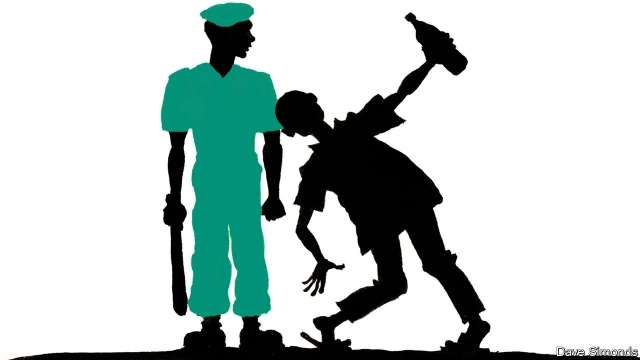

###### A bias against the pious

# Nigeria’s vice cops are feeling squeezed 

##### Voters rather enjoy sinning, and politicians have taken note 

 

> Apr 11th 2019 

ALTHOUGH IT IS guarded by high walls and a thick metal door, a nightclub in Kano hardly bothers to conceal its existence. Disco lights flash out on the surrounding streets. Pop music is pumped carelessly into the night air. Young men and women sip beer and sway to the rhythm, seemingly unconcerned that, under Islamic law, such depravity is punishable by whipping. 

Between 1999 and 2002 a dozen states in Nigeria’s mostly Muslim north, including Kano state (the capital of which is also called Kano), adopted penal codes based on sharia. At first these states strove zealously to enforce the new rules. Many recruited religious police forces, called the Hisbah, to confiscate alcohol and arrest adulterers (who are occasionally sentenced to death by stoning, but are never actually stoned) to ensure that citizens did not sin. Many northern politicians, while eager to appear pious, are not really committed to stamping out booze and fornication, perhaps because so many voters want to be left to their own vices. When budgets are tight, they find they don’t need so many morality police. “The government is not serious about sharia,” grumbles a cleric. 

Kano is still socially conservative, but residents say it feels less stifling than it was. In Sabon Gari, a neighbourhood full of Christian migrants from Nigeria’s south, bars and betting shops abound. To avoid upsetting southerners, northern states said sharia would not apply to Christians. However, in the past the Hisbah would scour the neighbourhood’s bars and brothels for Muslims, recalls a hotel-owner. “We don’t see them now,” she adds, except when they come for a drink. A dimly-lit bar in her hotel is filled with men wearing the robes and cap typical of northerners. 

At the headquarters of Kano’s Hisbah the morality police put on a brave face. Signs outside the building remind passers-by that God is great. Muhammad Rabiu Jakata, its director of statistics, boasts that the force is destroying more beer bottles and prosecuting more sinners than ever before. But in private a colleague confesses that all is not well. Kano’s last two governors have squeezed the Hisbah because they thought it was loyal to their respective predecessors, he says. Its ranks have fallen from 9,000 in 2010 to 7,000 today, and its budget has been cut by a third. “We still try to do everything,” says the officer, “but it is not like before.” Many residents of Kano now see the Hisbah as little more than a counselling service, useful for settling family disputes but not much else. “If I have a problem with my wife, I go to the Hisbah. If I have a problem with customers I will go to the federal police,” says Saminu, a textile merchant. 

Between gulps of beer, Danladi, a former civil servant, speculates that politicians have lost interest in sharia because they have exhausted its vote-winning potential. But being a Muslim, he admits, he wishes he could resist the temptation to drink. “We are all human beings,” he adds. “You rarely find a person who is perfect.” 

-- 

 单词注释:

1.bias['baiәs]:n. 偏见, 斜纹 a. 偏斜的 adv. 偏斜 vt. 使有偏见 [计] 偏流; 偏压; 偏磁; 偏离 

2.pious['paiәs]:a. 虔诚的, 敬神的, 尽责的, 可嘉的, 不可能实现的 

3.cop[kɒp]:n. 警官 vt. 抓住 

4.voter['vәutә]:n. 选民, 投票人 [法] 选民, 选举人, 投票人 

5.APR[]:[计] 替换通路再试器 

6.nightclub['naitklʌb]:n. 夜总会 

7.Kano['kɑ:nәu]:卡诺[尼日利亚北部城市] 

8.bother['bɒðә]:vt. 烦扰, 迷惑 vi. 烦恼, 操心 n. 麻烦, 纠纷, 讨厌的人 

9.disco['diskәu]:n. 夜总会, 迪斯科, 的士高 

10.carelessly['kєәlisli]:adv. 不注意地, 粗心地 

11.sip[sip]:n. 啜饮, 小口喝, 抿 vi. 啜饮 vt. 啜 [计] 单列直插式组件 

12.seemingly['si:miŋli]:adv. 看来似乎, 表面上看来 

13.unconcerned[.ʌnkәn'sә:nd]:a. 漠不关心的 [法] 无关的, 不相关的, 不关心的 

14.Islamic[iz'læmik]:a. 伊斯兰教的, 穆斯林的 

15.depravity[di'præviti]:n. 堕落, 腐败, 邪恶 [法] 堕落, 腐化, 败坏 

16.punishable['pʌniʃәbl]:a. 该罚的, 可罚的 [法] 该罚的, 可受惩处的 

17.Muslim['mjzlim; (?@) 'mʌzlem]:n. 伊斯兰教, 伊斯兰教教徒 

18.penal['pi:nl]:a. 有关处罚的, 刑的, 刑罚的, 刑法上的, (课税)繁重的 [法] 刑事的, 刑法的, 受刑罚的 

19.sharia[ʃә'ri:ә]:n. 伊斯兰教教法 

20.strive[straiv]:vi. 努力, 奋斗, 斗争 

21.zealously[]:adv. (正式)热心, 渴望, 积极, 热诚, 热情 

22.confiscate['kɒnfiskeit]:vt. 没收, 把...充公, 查抄 a. 被没收的 

23.adulterer[ә'dʌltәrә]:n. 奸夫 [法] 奸夫 

24.ston[]:n. 上海四通（电器品牌） 

25.booze[bu:z]:vi. 豪饮 n. 酒, 酒宴 

26.fornication[.fɒ:ni'keiʃәn]:n. 通奸, 乱伦 [医] 非法性交 

27.morality[mә'ræliti]:n. 道德, 教训, 品行 [法] 道德, 道义 

28.grumble['grʌmbl]:n. 怨言, 满腹牢骚 vi. 抱怨, 发牢骚, 发隆隆声 vt. 抱怨 

29.cleric['klerik]:a. 牧师的, 教士的 

30.socially['sәuʃәli]:adv. 在社会上, 在社交上, 以社会生活方式 

31.les[lei]:abbr. 发射脱离系统（Launch Escape System） 

32.stifle['staifl]:vt. 使窒息, 抑止, 扼杀 vi. 窒息, 被扼杀 

33.sabon[]:n. (Sabon)人名；(法)萨邦 

34.gari[]: [地名] [俄罗斯] 加里 

35.migrant['maigrәnt]:n. 候鸟, 移居者 [法] 移居者 

36.abound[ә'baund]:vi. 大量存在, 富于, 充满 

37.southerner['sʌðәnә]:n. 南方人 

38.scour['skauә]:vt. 擦亮, 洗涤, 清洗, 冲刷成, 急速穿过 vi. 擦, 洗, 冲刷, 腹泻, 急速穿行 n. 擦, 洗, 腹泻, 洗涤剂 

39.brothel['brɒθәl]:n. 妓院 [法] 妓院 

40.Muslim['mjzlim; (?@) 'mʌzlem]:n. 伊斯兰教, 伊斯兰教教徒 

41.northerner['nɔ:ðәnә]:n. 北方人 

42.headquarter[,hed'kwɔ:tә]:vt. 将...的总部设在 

43.muhammad[]:n. 穆罕默德 

44.statistic[stә'tistik]:n. 统计量 a. 统计的, 统计学的 

45.prosecute['prɒsikju:t]:vt. 告发, 起诉, 彻底进行, 执行, 从事 vi. 告发, 起诉, 作检察官 

46.sinner['sinә]:n. 罪人, 不知礼仪的人, 无赖 [法] 罪人, 无赖 

47.predecessor[.predi'sesә]:n. 前任, 先辈, 前身 [医] 初牙, 前辈, 祖先 

48.counsel['kaunsәl]:n. 商议, 忠告, 法律顾问 v. 商议, 劝告 

49.gulp[gʌlp]:vt. 吞, 大口大口地吸气, 吸收, 抑制 vi. 吞咽 n. 吞咽 [计] 字节组 

50.speculate['spekjuleit]:vi. 深思, 推测, 投机 [经] 投机 

