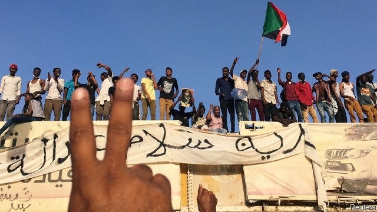

###### The people vs Bashir

# Sudan’s dictator, Omar al-Bashir, is forced out of power 

##### Mass protests triumph over a tyrant 

 

> Apr 11th 2019 

THE CRY rippled through the crowd in the early hours of April 11th, accompanied by the beating of drums and blasts on whistles: “It has fallen. We have won.” 

And, so it appears, they have. Almost exactly 30 years after Omar al-Bashir seized power in a bloodless coup, shunting aside his democratically elected predecessor, the man who did so much to wreck Sudan has himself been toppled. His fall marks the culmination of four months of almost ceaseless protests against one of Africa’s longest-ruling tyrants. “In spite of all hurdles and hardships, it is over,” said Ahmed Elyas, an engineer in Khartoum who was in the crowd. “We won.” 

As The Economist went to press tens of thousands of demonstrators—encamped outside the main army compound in central Khartoum since April 6th—waited on an announcement from the generals as the army moved troops onto the streets and state radio and television played patriotic music. Yet even amid the jubilation it was unclear whether this was a coup that would lead to another military strongman stepping in, or a revolution that would put civilians in charge. 

Initial reports were contradictory. Some suggested that the army was trying to form an interim administration led by Ahmed Awad Ibn Auf, the defence minister, who has had sanctions placed on him by America for his role in war crimes. But protest leaders including the Sudanese Professionals Association, a coalition of trade unions, said they would only accept a handover of power to a civilian transitional government. Unconfirmed reports said that Mr Bashir and two other people wanted by the International Criminal Court (ICC) for war crimes had been arrested. 

What is clear is that the fall of Mr Bashir is the latest in a wave of change that has swept away many of Africa’s longest-serving rulers, from Algeria to Zimbabwe. “It is the extinction of the dinosaurs,” says Alex Vines of Chatham House, a think-tank. Driving this are urbanisation and the spread of mobile phones, which make it easier to organise protests, says Judd Devermont of the Centre for Strategic and International Studies. Jon Temin of Freedom House, another American outfit, says three of the five countries posting the biggest moves towards democracy last year were African; Angola, Ethiopia and Gambia. “There is a growing people-power dynamic,” he says. 

The protests in Sudan erupted in December in response to rising food prices. But people soon turned their ire on Mr Bashir, who has governed woefully since 1989. His men have massacred and raped civilians in wars against rebels in Darfur and the south, acts that have led the ICC to indict him and some of those closest to him. 

His Islamist allies have flogged women for “immoral” behaviour, such as wearing trousers. Corruption is rife. The economy shrank by 2.3% in 2018. Inflation reached 70% at the start of the year (though the government claims it has since fallen). 

When protests broke out in December the government responded by arresting, beating and killing people. In February Mr Bashir declared a nationwide state of emergency, dissolved the government and replaced all 18 state governors with soldiers or securocrats. Yet still the crowds calling for him to go continued to swell. 

On April 6th, the anniversary of the revolutionary overthrow in 1985 of Gaafar Nimeiry, a previous military dictator of Sudan, tens of thousands took to the streets in the capital. Many hoped to repeat the earlier feat in which months of mass protests had prompted the army to step in and depose a hated tyrant. Democratic rule followed in 1986 before it was cut short by Mr Bashir’s coup a few years later. 

Within days of the new protests erupting in the capital, thousands of people set up camp outside the headquarters of the armed forces and Mr Bashir’s current residence. Although this is not the first time that Sudanese people have tried to rise up against Mr Bashir, the marked difference now was that they had won the support of sections of the armed forces. 

When the government tried to clear the protest in Khartoum using tear gas and bullets, soldiers and sailors joined the crowd and fired their guns to defend it. Naval officers exchanged fire with members of the spy agency and paramilitary forces. On April 9th some junior officers told the crowd they had joined the revolt. 

The big question now is who will succeed Mr Bashir. The formal opposition is less divided than it was in the past, but it still has no obvious leader of its own. Several are tainted in the eyes of protesters for having worked with the ruling National Congress Party (NCP) in the past. Yet a new government may have to include current and former members of the NCP for their bureaucratic expertise. 

Events in Sudan will be watched nervously by Mr Bashir’s fellow Arab and African leaders, who fear a second phase of the Arab spring that swept away several of them in 2011. After the recent resignation of Abdelaziz Bouteflika in Algeria, many are wondering: who’s next? 

-- 

 单词注释:

1.V[vi:]:[计] 溢出, 变量, 向量, 检验, 虚拟, 垂直 [医] 钒(23号元素) 

2.Bashir[]:n. (Bashir)人名；(英、俄、阿富、巴基)巴希尔；(阿拉伯)贝希尔 

3.dictator['dikteitә]:n. 命令者, 独裁者 

4.omar['әjmɑ:(r)]:n. 奥马尔（男子名） 

5.tyrant['taiәrәnt]:n. 暴君 [法] 专制君主, 暴君, 压制他人者 

6.APR[]:[计] 替换通路再试器 

7.ripple['ripl]:n. 涟波, 涟漪, 波纹, 粗钢梳 vt. 使起涟漪 vi. 起微波, 起潺潺声 

8.bloodless['blʌdlis]:a. 无血色的, 不流血的, 没精神的 [医] 无血的 

9.coup['ku:]:n. 砰然的一击, 妙计, 出乎意料的行动, 政变 [医] 发作, 中, 击 

10.shunt[ʃʌnt]:vt. 使转轨, 使分流, 回避讨论, 推延 vi. 转向一边, 转轨, 往返 n. 转轨, 分流 

11.democratically[.demә'krætikli]:adv. 民主地, 民主主义地 

12.predecessor[.predi'sesә]:n. 前任, 先辈, 前身 [医] 初牙, 前辈, 祖先 

13.Sudan[su:'dæn]:n. 苏丹 [化] 苯偶氮间苯二酚; 苏丹 

14.topple['tɒpl]:vt. 推翻, 颠覆 vi. 倒塌, 摇摇欲坠 

15.culmination[.kʌlmi'neiʃәn]:n. 顶点, 高潮, 最高点 

16.ceaseless['si:slis]:a. 不停的, 不断的 

17.hurdle['hә:dl]:n. 障碍, 跳栏, 临时活动篱笆 vt. 用篱笆围, 越过, 克服 

18.ahmed[]:n. 艾哈迈德（男子名） 

19.Khartoum[ka:'tu:m]:n. 喀土穆（苏丹首府） 

20.economist[i:'kɒnәmist]:n. 经济学者, 经济家 [经] 经济学家 

21.tens[]:十位 

22.patriotic[.peitri'ɒtik]:a. 爱国的, 有爱国心的 [法] 爱国的, 有爱国心的 

23.amid[ә'mid]:prep. 在其间, 在其中 [经] 在...中 

24.jubilation[.dʒu:bi'leiʃәn]:n. 欢呼, 喜欢, 庆祝 

25.unclear[.ʌn'kliә]:a. 不易了解的, 不清楚的, 含混的 

26.strongman[ˈstrɒŋmæn]:n. 大力士 

27.interim['intәrim]:a. 暂时的, 临时的, 间歇的 n. 过渡时期 

28.awad[]:n. (Awad)人名；(意、芬、阿拉伯)阿瓦德 

29.Ibn['ibən]:n. 伊本（阿拉伯男子名） 

30.auf[]:abbr. 法语国家大学协会（Agence universitaire de la Francophonie） 

31.sanction['sæŋkʃәn]:n. 核准, 制裁, 处罚, 约束力 vt. 制定制裁规则, 认可, 核准, 同意 

32.Sudanese[su:dә'ni:z]:a. 苏丹的, 苏丹人的 n. 苏丹人 

33.coalition[.kәuә'liʃәn]:n. 结合体, 结合, 联合 [经] 联合, 联盟 

34.handover['hændәuvә]:[计] 转移, 转换 

35.transitional[træn'siʒәnl]:a. 变迁的, 过渡期的 [医] 转变的, 过渡的; 过渡型单核白细胞 

36.unconfirmed['ʌnkәn'fә:md]:a. 未最后认可的, 未最后确定的, 未确证的, 未证实的 [经] 未确证的, 未认可的 

37.icc[]:abbr. 国际商会（International Chamber of Commerce）；国际计算中心（International Computation Centre）；印第安人申诉委员会（Indian Claims Commission）；国际版权公约（International Copyright Convention） 

38.Algeria[æl'dʒiәriә]:n. 阿尔及利亚 

39.Zimbabwe[zim'bɑ:bwei]:n. 津巴布韦 

40.extinction[ik'stiŋkʃәn]:n. 消失, 消灭, 废止 [化] 消光; 熄灭 

41.Alex[]:[计] 开放网络文件系统 

42.chatham['tʃætәm]:n. 查塔姆（姓氏） 

43.urbanisation[ˌɜ:bənaɪ'zeɪʃən]:n. 城市化（等于urbanization） 

44.judd[dʒʌd]:n. 贾德（姓氏） 

45.jon[dʒɔn]:n. 乔恩（男子名） 

46.Temin[]:n. (Temin)人名；(法)特曼；(英)特明 

47.outfit['autfit]:n. 用具, 配备, 机构 vt. 配备, 供应 vi. 得到装备 

48.Angola[æŋ'^әulә]:[经] 安哥拉 

49.Ethiopia[.i:θi'әupiә]:n. 埃塞俄比亚 

50.Gambia['gæmbiә]:n. 冈比亚 

51.ire[aiә]:n. 忿怒 [电] 美国无线电工程师学会 

52.woefully[]:adv. 悲伤地；不幸地；使人痛苦地 

53.rape[reip]:n. 抢夺, 掠夺, 强奸, 葡萄渣, 芸苔 vt. 掠夺, 抢夺, 强奸 

54.darfur[dɑ:'fuə]:n. 达尔富尔（苏丹地名） 

55.indict[in'dait]:vt. 起诉, 控告, 指控 [法] 控告, 揭发, 对...起诉 

56.Islamist[iz'lɑ:mist]:n. 伊斯兰教主义者；回教教徒 

57.ally['ælai. ә'lai]:n. 同盟者, 同盟国, 助手 vt. 使联盟, 使联合, 使有关系 vi. 结盟 

58.flog[flɒg]:vt. 鞭打, 鞭策, 严厉的批评, 迫使 

59.immoral[i'mɒrәl]:a. 不道德的, 邪恶的, 放荡的 [法] 不道德的, 道德败坏的, 邪恶的 

60.trouser['trauzә]:a. 裤子的 

61.corruption[kә'rʌpʃәn]:n. 腐败, 堕落, 贪污 [计] 论误 

62.rife[raif]:a. 流行的, 盛传的, 充满的 

63.inflation[in'fleiʃәn]:n. 胀大, 夸张, 通货膨胀 [化] 充气吹胀; 膨胀 

64.securocrats[sɪ'kjʊərəkræt]:〈南非〉军警官参政要员 拥护军警官参政者（security与bureaucrat的缩合） 

65.overthrow[.әuvә'θrәu]:n. 推翻, 瓦解, 倾覆 vt. 打倒, 推翻, 倾覆 

66.gaafar[]:[网络] 加法尔 

67.nimeiry[]:[网络] 尼迈里；尼梅瑞 

68.feat[fi:t]:n. 壮举, 功绩, 技艺表演 a. 灵巧的, 合适的, 整洁的 

69.depose[di'pәuz]:vt. 免职, 废黜, 作证 vi. 作证, 供证 

70.headquarter[,hed'kwɔ:tә]:vt. 将...的总部设在 

71.paramilitary[.pærә'militәri]:a. 辅助军事的 

72.opposition[.ɒpә'ziʃәn]:n. 反对, 敌对, 相反, 在野党 [医] 对生, 对向, 反抗, 反对症 

73.les[lei]:abbr. 发射脱离系统（Launch Escape System） 

74.taint[teint]:n. 污点, 耻辱, 感染 vt. 污染, 使腐败, 沾染, 腐蚀 

75.protester[]:n. 抗议者, 持异议者, 拒付者 [经] 反对者 

76.NCP[]:[计] 网络控制程序 

77.expertise[.ekspә:'ti:z]:n. 专家意见, 专门技术 [法] 专门知识, 专家意见 

78.nervously[]:adv. 焦急地；神经质地；提心吊胆地 

79.abdelaziz[]:n. (Abdelaziz)人名；(阿拉伯)阿卜杜勒-阿齐兹 

80.bouteflika[]:[网络] 布特弗利卡；阿尔及利亚总统布特弗利卡；布特佛里卡 

