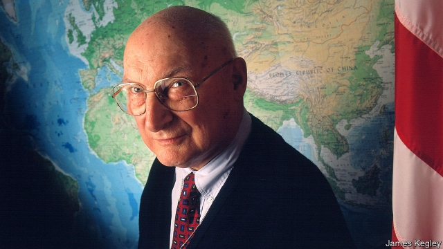

###### Ask the right question

# Obituary: Andrew Marshall died on March 26th 

##### The man who steered America’s military strategy for more than four decades was 97 

 

> Apr 11th 2019 

AT THE HEART of many a large and ambitious empire sits one man who is not the ruler, though the ruler often listens to him; and who runs no department, though his faithful followers are found all through government. He is rarely seen in public, publishes very little, avoids journalists, sits silently through meetings, and yet steers the country. For more than four decades, America’s version of this inscrutable figure was Andrew Marshall. 

He looked the part, small and benign, with a bald dome of a head, wire-rimmed glasses and a bureaucrat’s bland suit. He also inhabited the part, hidden behind thick buzzer-locked doors in the innermost A ring of the Pentagon in an office buttressed with papers and books on every branch of knowledge. There from 1973 he ran the Office of Net Assessment (ONA), a tiny independent think-tank whose remit was to compare the capabilities of the United States and its enemies in weaponry, troop training, efficiency, spending, deployment, planning, decision-making, readiness and any other point of variance. These painstaking assessments, highly classified, sparingly distributed and compiled at a rate of only six a decade, gave America as much detail about its adversaries as could be had. Then it could plan how to counter them. 

ONA, as he set it up and ran it (originally at Henry Kissinger’s request and in the NSC, but the Department of Defence was a much neater fit) was not a problem-solving place for times of crisis. Like him, it took the long view. Ten years ahead was his preferred span, with many longer backward reflections, influenced by his lifelong love of Toynbee’s “A Study of History”, to see how states amassed power and how, often foolishly, they lost it. He was no futurist, a word he disliked, since the non-rationality of humans, especially in war, made prediction impossible; if people wanted their fortune told, they should visit a gypsy. And his office was not there to give answers, offer bland-bunkum analysis or follow Pentagon fads, but to ask the right questions and provide true information. After that, there was only so much stupidity one man could prevent. 

For years all defence strategy centred on the Soviet Union, and there his chief questions were: could it afford its military machine? And was the government as ruthlessly monolithic as American officials supposed? His assessments, contrary to the CIA’s, answered no to both. (His estimate for the percentage of Soviet GDP going to military spending was almost triple the spooks’, for whom he had little time.) Once these facts were known, it made sense to deploy “competitive strategies”, borrowed from the business strategy he had studied at RAND in the mid-1960s, and make the weaker competitor overspend until it was driven out of the market. Hence the B2 Stealth bomber programme, to force the USSR to modernise its air defences, and Ronald Reagan’s strategic defence initiative (“Star Wars”), to strain to the utmost Soviet investment in its missile shield. These had the desired effect even when merely talked about; they hardly needed deploying. 

All this gave him a hawkish reputation, and certainly he had consorted with hawks at RAND, where from 1949 he spent two decades considering the nuclear threat. Never having fought in a war himself, since a heart murmur had kept him out of military service, he was shaken when, witnessing a nuclear test in the Nevada desert, he saw his bones through the palms of his hands. An arms race was not just about weapons, but about psychology: let us show you what we could do to you. The Pentagon did not fully appreciate that. He did, because he spent hours each day reading anthropology, economics and behavioural studies as well as war books, and instructed his recruits, whom he commissioned to write ONA’s studies, to do the same. To his trainees he was Yoda (the bald, benign Jedi Master of “Star Wars”, whom he had never heard of) and they were his Jedi Knights or alumni of “St Andy’s Prep”, sitting at his feet and, more usefully, lobbying fiercely for him when cutpurse or unpersuaded presidents tried to close ONA down. Thanks to these acolytes, as they moved on to think-tanks or government jobs, he kept his methods running through eight administrations. 

Prominent among them was his seven-page memo, “Some Thoughts on Military Revolutions” of 1993. These were ideas he had chewed on since the 1980s, on how advances in technology, coupled with operational changes, might radically alter warfare and sharpen America’s edge. As a free element in the Pentagon, disliking the grandiose talk of big platforms and one-or-two-theatre wars and the numbing inter-service rivalry, he relished a type of combat that would be nimbler and quicker, with sensor-fitted precision weapons, robotic devices and IT co-ordination between forces. This new thinking, the Revolution in Military Affairs, was adopted in 2001 by the Bush administration, only to be sideswiped by 9/11; but his points remained, and permeated. 

The terrorist attacks did not surprise him; America had been wide open. What did surprise him—apart from the speed with which the USSR fell apart—was the Pentagon’s new fixation on fighting terror, jumping from crisis to crisis. His mind was still set on the long view and the next great-power rival, and from the mid-1990s, too early for everyone else, he turned his gaze on China. Its sheer size implied that it must begin to compete for hegemony. As he had done with the Soviet Union, he watched its mindset and bureaucracy as well as its weapons, and ran war games encouraging officials to contemplate a sudden Chinese attack in the Pacific. Others thought that unlikely, but his question was: what if it did? 

Appropriately for one so hidden, he revealed almost nothing about his private life: his love of French food and sports, a first marriage that had lasted longer than his time in the Pentagon, and a flat in Alexandria even more piled with good reading than his office in the A ring. Among all those books and papers, however, there was no laptop or iPad; e-mails were read to him, and he never went on the internet. For him the world of strategic threats was tactile and physical, a matter of geography and the clash of forces. Cyberwarfare, of which he knew nothing, he left to the equally unknown master who, he hoped, would follow him. 

-- 

 单词注释:

1.andrew['ændru:]:n. 安德鲁（男子名） 

2.Marshall['mɑ:ʃәl]:n. 马歇尔（姓氏, 男子名, 等于Mar'shal） 

3.APR[]:[计] 替换通路再试器 

4.ambitious[æm'biʃәs]:a. 有野心的, 抱负不凡的, 雄心勃勃的 

5.follower['fɒlәuә]:n. 从者, 属下, 追补者 [电] 随动机 

6.silently['sailәntli]:adv. 默默地, 静静地 

7.inscrutable[in'skru:tәbl]:a. 难以了解的, 不能预测的 [法] 不可理解的, 不可思议的, 不可测知的 

8.benign[bi'nain]:a. 善良的, 良性的 [医] 良性的 

9.bald[bɒ:ld]:a. 秃头的, 光秃的, 单调的, 赤裸的 vi. 变秃 

10.dome[dәum]:n. 圆顶 vt. 加圆顶 vi. 成圆顶状 

11.bland[blænd]:a. 温和的, 乏味的, 冷漠的 [医] 温和的, 淡的 

12.innermost['inәmәust]:a. 内心的, 秘密的, 最深处的 

13.pentagon['pentәgәn]:n. 五角形, 五边形 [经] 五角平台 

14.buttress['bʌtris]:n. 拱壁, 扶壁, 支持物 vt. 支持, 以扶壁支撑 

15.ona[]:n. (Ona)人名；(俄、西、罗、乌干、挪、赤几)奥纳 原创网络动画（original aet anime） 起始节点位址（origin node address） 开放网络体系结构（open network architecture） 

16.remit[ri'mit]:vt. 宽恕, 赦免, 免除, 汇出, 缓解, 减轻, 把...提交, 使恢复原状, 推迟 vi. 缓解, 汇款 n. 移交的事物 

17.capability[.keipә'biliti]:n. 能力, 性能, 约束力 [化] 能力 

18.weaponry['wepәnri]:n. 武器, 军备, 武器设计研制学 

19.deployment[]:[计] 展开 

20.readiness['redinis]:n. 预备, 准备, 敏捷 

21.variance['vєәriәns]:n. 不一致, 变化, 变异, 分歧, 不和 [化] 方差; 变种 

22.painstaking['peinzteikiŋ]:n. 辛苦, 苦心, 工夫 a. 辛苦的, 勤勉的, 小心的 

23.sparingly[]:adv. 节约地, 爱惜地, 吝惜地, 少量地, 贫乏地 

24.adversary['ædvәsәri]:n. 敌手, 对手 a. 敌手的, 敌对的 

25.originally[ә'ridʒәnli]:adv. 本来, 原来, 最初, 就起源而论, 独创地 

26.henry['henri]:n. 亨利 [医] 亨[利](电感应单位) 

27.NSC[]:国家安全委员会 

28.lifelong['laiflɒŋ]:a. 终身的, 毕生的 

29.amass[ә'mæs]:vt. 积聚, 堆积 

30.foolishly['fu:liʃli]:adv. 愚笨地, 无聊地 

31.futurist['fju:tʃәrist]:n. 未来派画家, 未来主义者 

32.prediction[pri'dikʃәn]:n. 预言, 预报 [化] 预测 

33.gypsy['dʒipsi]:n. 吉卜赛人, 吉卜赛语 a. 象吉卜赛人的 vi. 流浪 

34.fad[fæd]:n. 时尚 [化] 黄素腺嘌呤二核苷酸 

35.stupidity[stju:'piditi]:n. 愚蠢, 糊涂事 [医] 迟钝 

36.ruthlessly['ru:θləslɪ]:adv. 无情地, 冷酷地, 残忍地 

37.monolithic[.mɒnәu'liθik]:a. 独石的, 完全统一的, 整体的 [化] 整体(铸,烧结)的; 龟甲网衬里; 单片; 单块 

38.triple['tripl]:n. 三倍数, 三个一组 a. 三倍的 vt. 使增至三倍 vi. 增至三倍 

39.deploy[di'plɒi]:v. 展开, 配置 

40.rand[rænd]:n. 兰特, (非正式)边, 田埂, 缘 [经] 兰特 

41.overspend[.әuvә'spend]:vt. 过度使用, 花费过多, 使筋疲力尽 vi. 超支 

42.stealth[stelθ]:n. 秘密行动, 秘密, 鬼祟 [法] 秘密行动, 鬼祟 

43.bomber['bɒmә]:n. 轰炸机, 投弹手 

44.USSR[]:苏联 

45.modernise['mɔdәnaiz]:vt.vi. (使)现代化, (使)适应现代需要 vi. 用现代方法 

46.ronald['rɔnәld]:n. 罗纳德（男子名） 

47.hawkish['hɒ:kiʃ]:a. 像鹰的, 鹰派的, 强硬派的 

48.consort['kɒnsɒ:t]:n. 配偶, 夫妻 vi. 陪伴, 结交, 符合 vt. 使结合 

49.murmur['mә:mә]:n. 低语, 低声的怨言 vi. 低语, 低声而言 vt. 低声说 

50.Nevada[ni'vædә]:n. 内华达 

51.fully['fuli]:adv. 十分地, 完全地, 充分地 

52.anthropology[.ænθrә'pɒlәdʒi]:n. 人类学 [医] 人类学 

53.behavioural[bi'heivjәrәl]:a. 行为的 

54.trainee[trei'ni:]:n. 实习生, 新兵, 受培训者 [经] 学徒工, 培训人员 

55.yoda[]:尤达（人名） 

56.jedi[]:n. 绝地武士 

57.knight[nait]:n. 骑士, 爵士 vt. 授以爵位 

58.alumni[ә'lʌmni]:pl. 男毕业生, 男校友 

59.ST[]:[计] 段表, 状态, 系统测试, 直端连接器 [化] 磺胺噻唑 

60.prep[prep]:n. (英)(非正式)准备功课, 预备学校, 预料 a. (美)(非正式)预备的, 准备的 vi. 进预备学校, 进行预备训练, 自修, 自我训练 vt. 预备, 给病人作手术前的准备, 准备 

61.usefully[]:adv. 有效地, 有用地 

62.lobby['lɒbi]:n. 大厅, 休息室, 游说议员者 vi. 游说议员, 游说 vt. 游说 

63.fiercely['fiәsli]:adv. 猛烈地, 厉害地 

64.cutpurse['kʌtpә:s]:n. 小偷, 扒手 

65.unpersuaded[,ʌnpә'sweidid]:a. 不被说服的,未被说服的 

66.acolyte['ækәulait]:n. 侍僧, 助手 

67.memo['memәu]:n. 备忘录 [经] 备忘录 

68.radically['rædikәli]:adv. 根本地, 完全地 

69.warfare['wɒ:fєә]:n. 战争, 战斗, 交战, 斗争, 竞争 [法] 战事, 作战, 交战 

70.grandiose['grændiәus]:a. 宏伟的, 壮丽的, 夸张的 [医] 夸大的 

71.rivalry['raivlri]:n. 竞争, 对抗 [医] 拮抗 

72.relish['reliʃ]:n. 滋味, 风味, 美味, 爱好, 食欲, 调味品 vt. 调味, 喜欢, 玩味 vi. 有味道 

73.combat['kɒmbæt]:n. 争斗, 战斗 vi. 战斗, 争斗 vt. 与...战斗, 与...斗争 

74.nimbler[ˈnɪmblə(r)]: nimble（灵活的）的比较级形式 

75.robotic[rәu'bɔtik]:a. 自动的；机器人的, 像机器人的 

76.sideswipe['saidswaip]:vt. 沿边擦过 n. 侧击, 间接的抨击 

77.permeate['pә:mieit]:vt. 弥漫, 渗透, 充满, 影响, 感染 vi. 透入, 散布 

78.terrorist['terәrist]:n. 恐怖分子 [法] 恐怖份子, 恐怖主义 

79.fixation[fik'seiʃәn]:n. 定置, 固定, 定色 [医] 固定; 固定法, 固定术; 定影 

80.sheer[ʃiә]:a. 绝对的, 全然的, 纯粹的, 透明的, 峻峭的 vi. 偏转, 偏航 vt. 使急转向, 使偏航 adv. 完全, 全然, 峻峭 n. 偏航 

81.hegemony[hi:'dʒemәni]:n. 霸权, 领导权, 支配权, 拥有支配权的政府 [法] 霸权, 盟主权 

82.mindset[]:n. 心态；倾向；习惯；精神状态 

83.bureaucracy[bjuә'rɒkrәsi]:n. 官僚, 官吏 [法] 官僚主义, 官僚政治, 官僚机构 

84.contemplate['kɒntempleit]:vt. 注视, 沉思, 盘算 vi. 冥思苦想 

85.appropriately[]:adv. 适当的, 恰如其分的, 恰当的, 合适的 

86.alexandria[,æli^'zɑ:ndriә]:n. 亚历山大港（位于埃及）；亚历山大市（美国弗吉尼亚一城市）；亚历山大大帝 

87.laptop[]:[计] 膝上型的 

88.ipad[]:n. 苹果平板电脑 

89.tactile['tæktail]:a. 触觉的, 有触觉的 [医] 触觉的 

90.clash[klæʃ]:n. 冲突, 撞击声, 抵触 vi. 冲突, 抵触 vt. 使发出撞击声 [计] 对撞 

91.cyberwarfare[]:[网络] 网络战；网络战争；网路战 

92.equally['i:kwәli]:adv. 相等地, 同样地, 平等地 

