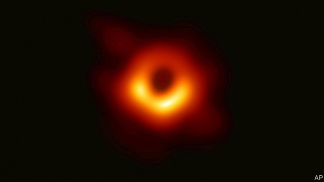

###### Staring into the abyss

# Astronomers take the first picture of a black hole 

##### Using a string of radio telescopes around Earth 

 

> Apr 11th 2019 

WHAT BLACK HOLES do to the things around them is hard to miss. Matter hurtling into them at almost the speed of light gives off all sorts of radiation, sometimes so much of it that it can be seen half a cosmos away. The black holes themselves, though, are another matter. They are, by cosmic standards, extremely small. And they are defined by having gravitational fields so strong that nothing, not even light, can escape them. That is why it is remarkable that an international team of more than 200 radio astronomers have, through years of painstaking work, actually contrived a glimpse of one. 

The black hole in question (pictured below) is located at the centre of a galaxy 55m light-years from Earth called Messier 87, one of the largest and most luminous galaxies in the nearby universe. Astronomers have for some time suspected that it houses a phenomenally massive black hole—one 6.5bn times more massive than the Sun, and more than a thousand times more massive than the black hole at the centre of the Milky Way galaxy in which the Earth and Sun sit. 

But massive does not mean large. The edge of a black hole is called an event horizon, because nothing that happens beyond it can ever be seen under any circumstances. The black hole in Messier 87 has an event about half a light-day across (about the size of the bit of the Solar System that has planets in it). This means that, seen from the Earth, it looks no larger than a coin on the surface of the Moon. 

The smaller the thing you are observing appears in the sky, the larger the aperture of the telescope you need to look for it. The Event Horizon Telescope (EHT) team put together one with an aperture the size of Earth by bringing together data from radio telescopes all around the world. Adding together the signals received by these various telescopes allowed them to synthesise an image as good as the one they would have got from single telescopes as large as the distance between any two of the dishes, though a great deal dimmer. This sort of “extremely long baseline interferometry” has been used for decades—but never before with this amount of data. 

In total, eight observatories on four continents were used to hunt for the black hole in Messier 87, including two, in Antarctica and Chile, that enjoy particularly dry skies. Because the observations needed to be precisely synchronised, each instrument was tethered to its own atomic clock. 

Once all the dishes were properly configured, the astronomers calculated they required ten days of clear weather in all the locations to collect the data that were needed. When they began their search in April 2017 the weather behaved, and they got five petabytes of data in seven days. These data were transported to the Haystack Observatory at the Massachusetts Institute of Technology in America and the Max Planck Institute for Radio Astronomy in Bonn, Germany, on half a tonne of hard drives. 

These many numbers underwent much crunching. On April 10th the result was revealed. The first real picture of a black hole, which looks satisfyingly black and blobby, consists of radiation emitted by hot gases on the far side of the black hole and then bent by its gravity into a tube of light with darkness in its central cavity. The brighter yellow at the base of the circle indicates gases moving particularly quickly, hinting at a something of a slingshot effect taking place as the vortex of gases travel in a clockwise direction, much like water pouring down a plug hole. 

In time, the same approach should be able to track changes in the environment around this black hole and others, helping to show, among other things, how the vast jets of energy it emits get their oomph and structure. In the meantime, there are two important take away messages. One is that black holes are round, as Einstein’s theory of relativity predicted they would be. The world is used to Einstein being proved right; but each test that might contradict him and doesn’t is an event. 

The other is that if they see a possibility fascinating and spectacular enough, astronomers will be remarkably dogged in its pursuit, even using the whole moving Earth to plumb the heavens. 

-- 

 单词注释:

1.abyss[ә'bis]:n. 深渊, 深邃, 地狱 

2.APR[]:[计] 替换通路再试器 

3.hurtle['hә:tl]:vi. 猛冲, 碰撞, 突进 vt. 猛撞, 猛投 n. 投掷, 碰撞, 碰撞声 

4.cosmos['kɔzmɔs]:n. 宇宙, 秩序, 和谐, 大波斯菊 [医] 大波斯菊 

5.cosmic['kɒzmik]:a. 宇宙的, 宇宙航行的, 无限的, 有秩序的 [医] 宇宙的 

6.gravitational[.grævi'teiʃәnәl]:a. 重力的 

7.painstaking['peinzteikiŋ]:n. 辛苦, 苦心, 工夫 a. 辛苦的, 勤勉的, 小心的 

8.contrive[kәn'traiv]:v. 发明, 设计, 图谋 

9.galaxy['gælәksi]:n. 银河, 星系, 一群(显赫的人物) [电] 银河系 

10.luminous['lu:minәs]:a. 发光的, 明亮的 [医] 发光的 

11.phenomenally[fi'nɔminәli]:adv. 现象, 从感官认识到, 非凡, 出众 

12.milky['milki]:a. 乳状的, 乳白色的, 柔和的 

13.aperture['æpә.tjuә]:n. 孔, 缝隙, 孔径 [计] 窗孔; 小孔 

14.EHT[]:abbr. extra high tension 极高压,超高压 

15.datum['deitәm]:n. 论据, 材料, 资料, 已知数 [医] 材料, 资料, 论据 

16.synthesise['sinθisaiz]:vt.vi. 综合, 合成, 接合 vt. 用合成法合成, 综合地处理 

17.baseline['beislain]:n. 基线, 基准 [计] 基线, 基准 

18.interferometry[,intәfiә'rɔmitri]:n .干涉测量(法) 

19.observatory[әb'zә:vәtәri]:n. 天文台, 气象台, 了望台 

20.Chile['tʃili]:n. 智利 [化] 番椒; 辣椒 

21.precisely[pri'saisli]:adv. 精确地, 明确地, 刻板地, 拘泥地, 正好, 恰恰, 对, 正是如此, 确实如此, 不错 

22.synchronise['siŋkrәnaiz, 'sin-]:vi. (使)同时发生, (使)整步, (使)同步, (使)同速进行 vt. 使在时间上一致, 校准, 把钟表拨至相同的时间, 把...并列对照 

23.tether['teðә]:n. 系绳, 系链, 界限, 范围 vt. 栓, 束缚, 限制 

24.configure[kәn'figә]:vt. 装配, 使成形 

25.petabyte[]:[计] 10的15次方字节 

26.haystack['heistæk]:n. 干草堆 

27.observatory[әb'zә:vәtәri]:n. 天文台, 气象台, 了望台 

28.Massachusetts[.mæsә'tʃu:sits]:n. 麻萨诸塞州 

29.MAX[mæks]:[计] 最大 

30.planck[plɑ:ŋk]:n. 普朗克（德国物理学家） 

31.Bonn[bɒn]:n. 波恩 

32.tonne[tʌn]:n. 吨, 公吨 [经] 吨 

33.crunch[krʌntʃ]:v. 嘎吱嘎吱的咬嚼, 压碎, 嘎吱嘎吱地踏过 n. 咬碎, 咬碎声 

34.satisfyingly['sætis,faiiŋli]:adv. 使人满意地 

35.blobby['blɔbi]:满是滴状斑点 

36.cavity['kæviti]:n. 洞, 空穴, 腔 [化] 空穴 

37.quickly['kwikli]:adv. 很快地 

38.slingshot['sliŋʃɒt]:n. 弹弓 

39.vortex['vɒ:teks]:n. 旋涡, 旋风, 涡流 [化] 涡旋 

40.clockwise['klɒkwaiz]:a. 顺时针方向的 adv. 顺时针方向地 

41.oomph[umf]:n. 性感, 热情, 精力, 吸引力 

42.Einstein['ainstain]:n. 爱因斯坦 [化] 爱因斯坦(能量的单位) 

43.fascinate['fæsineit]:vt. 令人入神, 使着迷 vi. 入迷 

44.spectacular[spek'tækjulә]:a. 公开展示的, 惊人的, 壮观的 n. 奇观, 惊人之举, 展览物 

45.remarkably[ri'mɑ:kәbli]:adv. 显著地, 引人注目地, 非常地 

46.plumb[plʌm]:n. 铅锤, 垂直 a. 垂直的 vt. 使垂直, 探测 vi. 成垂直 

