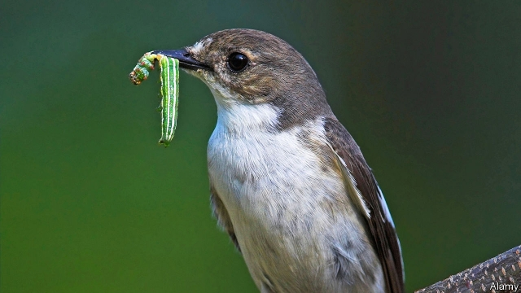

###### Doubling their luck

# How some birds are responding to climate change 

##### By laying a second clutch of eggs 

 

> Apr 11th 2019 

ONE OF THE great concerns that ornithologists have is that climate change will throw the nesting activities of birds out of sync with the availability of food for the raising of chicks. For one species, the pied flycatcher, a new study shows that some of its clan are proving to be remarkably adaptable. 

Upon returning to Europe from their African wintering grounds, the flycatchers time their egg-laying to the short period when juicy caterpillars are most abundant. During the past three decades this caterpillar peak has advanced by three weeks. Pied flycatchers initially had difficulty adjusting, but over time have started laying their eggs earlier to grab the caterpillars. Some, though, are doing a lot more to improve their reproductive chances of success, according to a study in the Journal of Avian Biology led by Christiaan Both of the University of Groningen, in the Netherlands. 

Like most bird species, pied flycatchers have long been thought to lay a single clutch of eggs during the breeding season. This was widely considered to be a trait that does not change. Then, in 2007, a Swiss team led by Pierre-Alain Ravussin began to suspect that clutch numbers were flexible. They discovered a female pied flycatcher that immediately produced a second brood with a new male after raising an early set of chicks. Aware of Dr Ravussin’s findings, Dr Both wondered whether this was just a single, odd instance or if second broods might be happening on a larger scale driven by the arrival of earlier springs. So, they collaborated to delve into the data to find out. 

The team studied pied-flycatcher populations in the Netherlands and Switzerland that were known to be among the earliest nesting members of the species. In total, they tracked the egg-laying times and hatchling-rearing success of 8,848 breeding pairs in the Netherlands and 1,372 in Switzerland between 1980 and 2018. They found that since 2006, 11 cases of second broods were observed, all of them among the earliest breeders in both populations. 

Further studies ruled out that the birds were making up for a failed first attempt at raising chicks or that the second group of nestlings suffered. 

With no obvious downside to laying a double clutch, Drs Both and Ravussin conclude that the birds are attempting to double their annual reproductive output. While this behaviour is still rare, they argue that if the tendency is driven by heritable genes (which it may well be) then a succession of early springs could make the strategy much more common. 

-- 

 单词注释:

1.clutch[klʌtʃ]:n. 抓紧, 掌握, 离合器, 一窝小鸡 vt. 抓住, 踩汽车离合器踏板 vi. 抓 [计] 联轴器; 离合器 

2.APR[]:[计] 替换通路再试器 

3.ornithologist[.ɒ:ni'θɒlәdʒist]:n. 鸟类学者 

4.sync[siŋk]:[计] 同步的 

5.availability[ә.veilә'biliti]:n. 有效性, 可利用性, 可利用的人 [计] 有效性; 可用性 

6.specie['spi:ʃi]:n. 硬币 [经] 硬币 

7.pied[paid]:a. 斑驳的, 杂色的, 穿花衣服的 

8.flycatcher['flaikætʃә]:n. 捕蝇器, 捕蝇草 

9.clan[klæn]:n. 氏族, 宗族, 集团 [医] 支 

10.remarkably[ri'mɑ:kәbli]:adv. 显著地, 引人注目地, 非常地 

11.adaptable[ә'dæptәbl]:a. 能适应的, 适合的, 可修改的 

12.caterpillar['kætәpilә]:n. 毛虫 [机] 履带车 

13.pied[paid]:a. 斑驳的, 杂色的, 穿花衣服的 

14.initially[i'niʃәli]:adv. 最初, 开头 

15.grab[græb]:n. 抓握, 掠夺, 强占, 东方沿岸帆船 vi. 抓取, 抢去 vt. 攫取, 捕获, 霸占 

16.reproductive[.ri:prә'dʌktiv]:a. 生殖的, 再生的, 复制的 [医] 生殖的, 复现的 

17.avian['eiviәn]:a. 鸟类的 n. 鸟 

18.christiaan[]:[网络] 克里斯帝安 

19.Groningen['ɡrəuniŋən]:n. 格罗宁根（荷兰城市） 

20.Netherlands['neðәlәndz]:n. 荷兰 

21.trait[treit]:n. 特征, 特性, 一笔, 少许 

22.delve[delv]:v. 探究, 查考 n. 坑, 穴 

23.datum['deitәm]:n. 论据, 材料, 资料, 已知数 [医] 材料, 资料, 论据 

24.breeder['bri:dә]:n. 饲养员, 养育员, 起因, 起源者 

25.nestling['nesliŋ]:n. 刚孵出的雏, 未离巢的雏, 幼儿 

26.downside['daunsaid]:n. 底侧；下降趋势 

27.heritable['heritәbl]:a. 可继承的, 被遗传的, 可遗传的, 被继承的 [计] 可遣传的, 可继承的 

