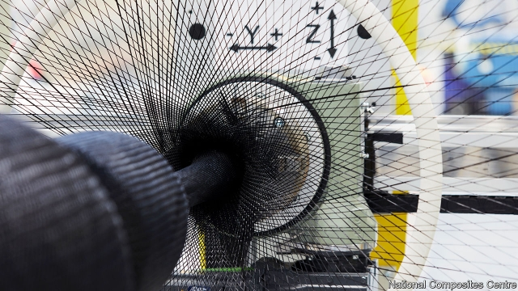

###### The new black arts of manufacturing

# How to knit a sports car with carbon fibre 

##### Replacing steel and aluminium in the factory 

 

> Apr 13th 2019 

BERTHA RESIDES on a quiet industrial estate in Bristol, in the west of Britain. The affectionate name has been given to what at first appears to be a giant loom from the Industrial Revolution. And in some ways it is. Bertha (pictured above) is an automated braiding machine. Like a horizontal maypole, ribbons of carbon fibre are drawn from 288 bobbins contained on a pair of huge rings, and passed over and under one another as they are wound tightly around a revolving mould. The final product could be a propeller for an aeroplane, a ship’s hydrofoil or a set of wheels for a sports car. In fact, Bertha can knit just about any hollow component up to 800mm by ten metres, and do so quickly and accurately by depositing some 300kg of carbon fibre an hour. 

Just as textile production began to be mechanised at the end of the 18th century, creating the modern factory, manufacturing is going through another revolution. This time it is driven by digital processes and new materials, such as carbon-fibre composites. Automated braiders are one of several new systems turning carbon-fibre production from a slow, labour-intensive craft into a mass-manufacturing process that will change many industries. 

Carbon fibre is attractive because it is lightweight and exceptionally strong. The toughest fibres are up to ten times stronger than steel and eight times more so than aluminium, reckons Zoltek, an American carbon-fibre producer. Carbon fibre is also five times lighter than steel and half the weight, or less, of aluminium. Nor does it corrode. In transport industries, where “lightweighting” is most valuable, carbon fibre allows aircraft and cars to be made lighter and so travel farther on the same amount of fuel or a single charge of their batteries. This will help them meet tougher emissions targets. 

And there are other advantages, too. One is that carbon fibre allows manufacturers to make much larger, more complex parts in one go, says Richard Oldfield, chief executive of the National Composites Centre (NCC), a research laboratory set up by the University of Bristol, and home to Bertha. Instead of making an aircraft’s wing or car body by welding, riveting and bolting together hundreds of individual components, these bits can be consolidated into a single carbon-fibre structure. This saves time and materials and allows designers to come up with novel products. 

Engineers got interested in carbon fibre in the 1960s. The fibres consist of carbonised polymers, made up of long strings of molecules bound together by the powerful bonds between carbon atoms. The fibres are made by heating a precursor material to around 3,000°C in a protective atmosphere of inert gases. The most commonly used precursor is polyacrylonitrile (PAN), which is produced by the petrochemicals industry. Pitch, obtained from coal tar, is sometimes used instead. Once carbonised, the fibres are wound onto bobbins, spun into yarns or formed into tapes. Depending on the final application, they can also be woven into fabric sheets. 

On their own, carbon fibres are brittle and can break easily. But their strength comes in tension (they resist being pulled apart). So, the fibres need to be aligned in such a way to impart their strength by distributing loads throughout a structure. This is done by placing the fibres, tapes or mats onto a mould in the required orientation, creating what is known as a preform. It is a slow process often done by hand. This is now being automated, aided by the fact that the optimal alignment of the fibres is often calculated using sophisticated computer-aided design systems, and the same data can program robots to lay-up the fibres or wind them on braiding machines such as Bertha. 

The preforms then need to be made solid. This is done by impregnating the fibres with a chemically activated resin, which hardens when it is cured. The curing process is usually carried out inside a large oven called an autoclave, which applies heat and pressure to consolidate the structure and force out any air bubbles. It can take hours, sometimes with autoclaves left to run overnight. For a relatively low throughput this might not be a problem. But for higher volumes, especially in carmaking, faster cycle times are needed. 

Various out-of-autoclave curing techniques are starting to be used. One is resin transfer moulding (RTM). This involves placing preforms inside a mould which is then closed. Resin is injected into the mould and heat and pressure applied. Depending on what is being produced, RTM can cut processing times by half or more. 

McLaren has been making sports cars out of carbon fibre since the British company used the material for the world’s first Formula 1 racing car in 1981. All F1 cars are now made from carbon fibre, and the protection it affords drivers has allowed many to walk away from spectacular crashes. To build its sports cars the company starts with a carbon-fibre “MonoCell”, a giant tub which forms the main structure of the vehicle. 

The company uses a specialist contractor to make MonoCells, although those for future car models will be produced at a new £50m ($65m) McLaren Composites Technology Centre in Sheffield, Britain. The first of the new cells has just been delivered. Impressively, the large and complicated structures are produced with RTM in one go—although McLaren is keeping the details secret. “I often look at the MonoCell and wonder myself how it is possible to make it,” says Claudio Santoni, the centre’s technical director. 

McLaren says carbon fibre will be essential in keeping weight down in future hybrid and electric models. By 2025 it expects the centre to be making MonoCells for some 6,000 cars a year. As a high-end brand, it is not seeking large volumes. But other carmakers are. One is BMW, which uses a variant of RTM in Leipzig, Germany, to make bodies for more than 130 of its i3 electric cars every day. BMW plans to increase that number substantially. 

Another speedy production process is “overmoulding”. This combines sheets of carbon fibre with injection-moulded plastic. Injection moulding has long been used to produce plastic parts by extruding a molten polymer into a mould. It is quick and accurate. By combining the two processes, overmoulding allows plastic parts to be selectively reinforced with carbon fibre. Thus strengthened, such parts could be used as car doors, aircraft interiors and in many other products. The NCC reckons an overmoulding system it is working with in Bristol can churn out finished components in just 60 seconds. 

Progress is also being made in reducing the cost of carbon fibre itself. Prices vary according to quality, but industrial-grade carbon fibre is roughly $20 a kilogram, although aerospace versions are more expensive. By comparison, steel used in carmaking is about $1 a kilogram. As carbon fibre is so much lighter and stronger than steel, less material is needed. And the additional cost is also compensated for by product-lifetime savings on fuel and emissions. Nevertheless, cheaper carbon fibre would find greater use in manufacturing. 

Oak Ridge National Laboratory in Tennessee thinks it could cut the cost of industrial-grade carbon fibre by about half with more efficient production processes. According to some estimates, roughly 90% of the energy needed to make things with carbon composites is consumed in producing the fibre itself. Oak Ridge is looking at the use of cheaper alternatives to PAN and low-temperature carbonisation processes. 

The lab also uses chopped-up carbon fibre in large-scale 3D printers to produce structures. It recently employed the system to print moulds for the precast concrete façade of the Domino tower, a new 42-storey building in Brooklyn, New York. 

Chopped carbon fibres can be made from manufacturing offcuts or recycled material. Recycling will become even more important once a greater number of carbon-fibre cars, aircraft, ships, wind turbines and other products reach the end of their working lives. There will be mountains of the black stuff to deal with. Companies are coming up with ways to recover the fibres, usually with heat or chemicals. Sometimes the fibres can be re-spun, but if they are too short they can still be suitable for parts subject to less stress. A combination of lower-cost mass-production techniques and effective carbon-fibre recycling, will lead to a lot more Berthas knitting away furiously. 

-- 

 单词注释:

1.manufacturing[.mænju'fæktʃәriŋ]:n. 制造业 a. 制造业的 

2.APR[]:[计] 替换通路再试器 

3.bertha['bә:θә]:n. 女式上衣的宽领 

4.reside[ri'zaid]:vi. 住, 居留, 属于 [法] 居住 

5.Bristol['bristәl]:n. 布里斯托尔(英国西部港口) 

6.affectionate[ә'fekʃәnәt]:a. 深情的, 充满情爱的 

7.loom[lu:m]:n. 织布机, 若隐若现的景象 vi. 朦胧地出现, 隐约可见, 可怕地出现 

8.bertha['bә:θә]:n. 女式上衣的宽领 

9.automate['ɔ:tәmeit]:vt.vi. (使)自动化 [计] 自动化 

10.braid[breid]:n. 辫子, 穗带 vt. 编成辫, 镶边 

11.maypole['meipәul]:n. 五朔节花柱 

12.bobbin['bɒbin]:n. 线轴, 缠线板, 缠线管 [电] 卷线轴 

13.tightly['taitli]:adv. 紧紧地, 坚固地 

14.revolve[ri'vɒlv]:v. (使)旋转, 反复考虑, 循环出现 

15.propeller[prә'pelә]:n. 螺旋桨, 推进器 [化] 搅拌叶片; 螺旋桨 

16.hydrofoil['haidrәu,fɔil]:n. 水翼艇 [化] 水翼 

17.quickly['kwikli]:adv. 很快地 

18.accurately['ækjurәtli]:adv. 正确地, 精确地 

19.mechanise['mekәnaiz]:vt. 使机械化, 用机器 

20.composite[kәm'pɒzit]:a. 合成的, 混合成的, 菊科的 n. 合成物, 复合材料, 菊科 

21.braiders[]:n. 编织机；打缏子的人 [网络] 编带机；编结机；编组机 

22.lightweight['laitweit]:n. 不到平均重量的人/物, 轻量级, 无足轻重的人, 性格不够强的人 a. 平均重量以下的, 重量轻的 [计] 轻便的, 轻量的 

23.exceptionally[]:adv. 特殊地；异常地；例外地 

24.reckon['rekәn]:vt. 计算, 总计, 估计, 认为, 猜想 vi. 数, 计算, 估计, 依赖, 料想 

25.zoltek[]:[网络] 卓尔泰克；美国卓尔泰克；美国卓尔泰克碳纤维公司 

26.producer[prә'dju:sә]:n. 生产者, 制作者, 制作人 [化] 发生器; (炉煤气)发生炉; 制气炉; 生产者 

27.les[lei]:abbr. 发射脱离系统（Launch Escape System） 

28.corrode[kә'rәud]:vt. 使腐蚀, 侵蚀, 破坏 vi. 被侵蚀, 起腐蚀作用 

29.lightweighting[ˈlaitweitiŋ]:n. 使用轻质[薄型]材料包装 

30.emission[i'miʃәn]:n. 发射, 射出, 发行 [医] 发射, 遗精 

31.richard['ritʃәd]:n. 理查德（男子名） 

32.Oldfield[]:奥德菲尔德 

33.NCC[]:[计] 网络控制中心 

34.rivet['rivit]:n. 铆钉 vt. 用铆钉固定, 敲进去, 注目, 吸引住 

35.consolidate[kәn'sɒlideit]:vt. 巩固, 使联合, 统一 vi. 巩固 [计] 合并计算 

36.designer[di'zainә]:n. 设计者, 谋划者, 制图者 [计] 设计员 

37.carbonised['kɑ:bənaiz]:vt. 使…碳化（等于carbonize） 

38.polymer['pɒlimә]:n. 聚合物, 聚合体 [化] 多聚体; 高分子; 大分子; 聚合物 

39.precursor[.pri:'kә:sә]:n. 先驱者, 前导, 前兆 [化] 前体; 前身; 产物母体 

40.inert[i'nә:t]:a. 惰性的, 迟钝的, 无活力的, 呆滞的 [医] 惰性的, 无作用的, 无效的 

41.polyacrylonitrile[,pɔli'ækrәlәu'naitril]:n. [化]聚丙烯腈 

42.petrochemical[.petrәu'kemikәl]:a. 石化的, 石化制品的, 岩石化学的 n. 石化产品 

43.tar[tɑ:]:n. 焦油, 柏油, 水手 vt. 涂以焦油, 玷污, 怂恿 a. 焦油的 

44.yarn[jɑ:n]:n. 纱, 纱线, 故事 [化] 纱 

45.align[ә'lain]:vi. 排列, 排成一行, 结盟 vt. 使结盟, 使成一行, 校正 

46.impart[im'pɑ:t]:vt. 给予, 传授, 告知 

47.orientation[.ɒ:rien'teiʃәn]:n. 定方位, 适应, 向东方 n. 方向 [计] 方向 

48.preform[pri:'fɒ:m]:vt. 预先形成 n. 预成型品 

49.optimal['ɒptimәl]:a. 最佳的, 最理想的 [化] 最优的 

50.alignment[ә'lainmәnt]:n. 队列, 结盟, 校正 [计] 校准; 对齐; 对准 

51.sophisticate[sә'fistikeit]:n. 久经世故的人, 精于...之道的人 vt. 篡改, 曲解, 使变得世故, 掺合, 弄复杂 vi. 诡辩 

52.datum['deitәm]:n. 论据, 材料, 资料, 已知数 [医] 材料, 资料, 论据 

53.impregnate['impregneit]:vt. 使怀孕, 使肥沃, 使充满, 灌输 a. 怀孕的, 充满的 

54.chemically['kemikli]:adv. 用化学, 以化学方法 

55.activate['æktiveit]:vt. 使活动, 使激活, 正式建成 vi. 有活力 

56.resin['rezin]:n. 树脂 vt. 涂树脂于 

57.autoclave['ɔ:tәukleiv]:n. 高压消毒锅, 高压锅 [计] 高压釜, 压热器 

58.throughput['θru:put]:n. 生产量, 通过量 [化] 通过量; 产量 

59.carmaking[]:[网络] 汽车制造 

60.rtm[]:abbr. 运转计时器（Running Time Meter） 

61.resin['rezin]:n. 树脂 vt. 涂树脂于 

62.inject[in'dʒekt]:vt. 注射, 注入, 使入轨 [医] 注射 

63.McLaren[]:n. 麦克拉伦（英国著名的赛车研发制造公司） 

64.spectacular[spek'tækjulә]:a. 公开展示的, 惊人的, 壮观的 n. 奇观, 惊人之举, 展览物 

65.monocell['mɔnәusel]:单电池 

66.contractor['kɒntræktә]:n. 立契约的人, 承包商 [化] 承包者; 承包工厂 

67.sheffield['ʃefi:ld]:n. 谢菲尔德（英国城市） 

68.impressively[]:adv. 令人难忘地；感人地 

69.Claudio[]:n. 克劳迪奥（男子名） 

70.santoni[]:[网络] 意大利圣东尼；意大利圣东尼公司；桑托尼 

71.hybrid['haibrid]:n. 混血儿, 杂种, 混合物 a. 混合的, 杂种的, 混合语的 [计] NetWare的主机实用程序, 双重用户建立程序 

72.carmaker['kɑ:,meikә(r)]:n. 汽车制造商 

73.bmw[]:abbr. 德国宝马汽车公司（Bavarian Motor Works） 

74.variant['vєәriәnt]:n. 变体, 异体 a. 不同的, 有差别的 [计] 变体型 

75.leipzig['laipzi^]:n. 莱比锡城 

76.substantially[sәb'stænʃәli]:adv. 实质上, 本质上, 大体上 

77.speedy['spi:di]:a. 快的, 迅速的 [经] 快的, 迅速的 

78.overmoulding[]:[网络] 双色模具 

79.extrude[ek'stru:d]:vt. 挤出, 压出, 逐出 vi. 伸出, 突出 

80.selectively[]:adv. 有选择地 

81.churn[tʃә:n]:n. 搅乳器 v. 搅拌, 搅动 

82.aerospace['єәrәuspeis]:n. 航天空间, 航天技术 

83.oak[әuk]:n. 橡树, 橡木 a. 橡木制的 

84.Tennessee[.teni'si:]:n. 田纳西州 

85.carbonisation[kɑ:bənaɪ'zeɪʃən]: 碳化 

86.precast[pri:'kɑ:st]:vt. 预浇制 a. 预制的 

87.domino['dɒminәu]:n. 化装外衣, 面具, 骨牌, 多米诺骨牌 

88.Brooklyn['bruklin]:n. 布鲁克林区(纽约行政区) 

89.york[jɔ:k]:n. 约克郡；约克王朝 

90.offcut[ˈɒfkʌt]:n. （木材等的）斜料, 纸边; 边角料 

91.recycling[]:[电] 再循环 

92.recycling[]:[电] 再循环 

93.berthas['bə:θə]:n. 女式上衣的宽领 

94.furiously[]:adv. 狂暴地；猛烈地 

