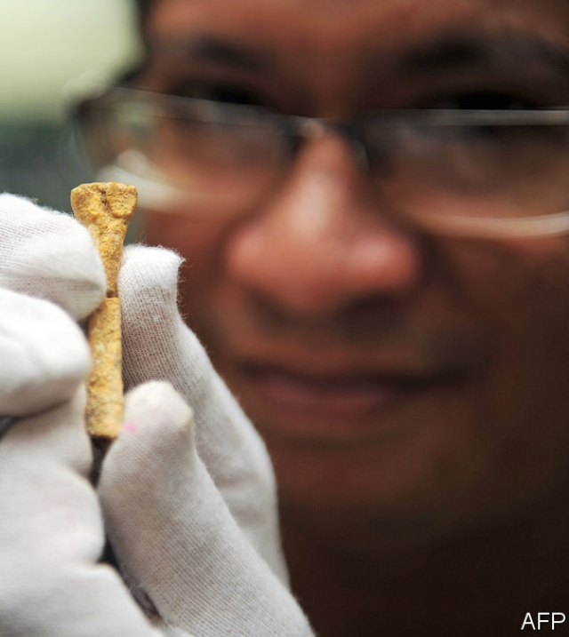
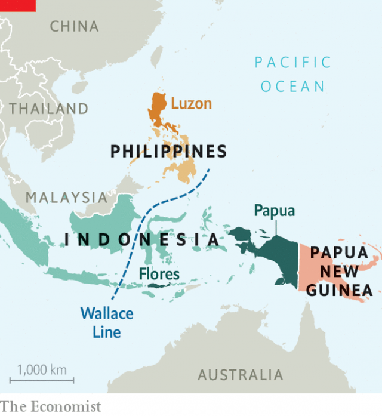

###### The Hobbit’s cousin

# More new human species are discovered 

##### South-East Asia reveals details of ancient relatives 

 

> Apr 11th 2019 

THE HUMAN species is a lonely one. Today there are two species of gorilla, two of chimpanzees and a whopping three species of orang-utan, but just one sort of human. It wasn’t always so. People are familiar with the idea that Homo sapiens once shared Eurasia with another human, H. neanderthalensis. In 2004 researchers announced to great fanfare that they had found the bones of a third contemporaneous relative, a rather short human species who lived on the Indonesian island of Flores. This became H. floresiensis, and was quickly dubbed the “Hobbit”. Then, in 2010, geneticists declared that a single finger bone found in a cave in the Altai Mountains of western Siberia carried a distinct genome which suggested it belonged to a fourth group, the Denisovans. 

Two new studies reveal that the landscape the ancestors of H. sapiens roamed across was even more crowded, until quite recently. One report draws on the power of genetic sequencing to show that the Denisovans comprised at least three different populations, which evolved separately for hundreds of thousands of years. The other study announces an entirely new species of hominin, H. luzonensis. Both findings centre on the islands that lay at the fringes of the ancient world; in South-East Asia, a region that has until quite recently been largely ignored by palaeoanthropologists. 

Glimpses of the new species came in 2010, when a collaboration of Philippine, French and Australian researchers announced that they had found a human-like foot bone (pictured opposite) on Luzon, the largest island in the Philippines. The bone was 67,000 years old, meaning its owner was alive shortly before H. sapiens ventured out of Africa. It was discovered alongside butchered animal bones on an island separated from mainland Asia by a sea. All this pointed to a fairly sophisticated human, capable of creating sharp cutting tools, and quite possibly also able to build and steer a boat or raft (though some argue it may have floated, or swam across to the islands). 

The same team, led by Florent Détroit of the Musée de l’Homme in Paris, report in Nature this week that alongside the foot bone they have also found two finger bones, two toe bones and a number of teeth. From these, they have identified at least three individuals with features that indicate that they belonged to a new species of human. 

The fossil remains of H. luzonensis are bizarre. The toe bones, for instance, suggest it was adapted to climbing trees as well as walking on two legs—something more typical of distant australopithecine relatives who lived millions of years ago in Africa. The Luzon premolar teeth also look primitive, but the molars are modern and H. sapiens-like. As with the Hobbit, it is likely that these features evolved in H. luzonensis as a result of its island living. Previous studies have shown that when species become isolated, as on an island, unusual features emerge. 

The islands of South-East Asia were also once home to the mysterious Denisovans. What little is known about them has more to do with laboratory work than digging in the ground for remains. That is because very few Denisovan fossils have been found. A finger bone, a skull fragment (announced in March) and a handful of teeth are the only physical testimonies to their existence. They are not enough to say what the Denisovans looked like, or to assign them a species name. 

However, by comparing DNA extracted from the finger bone to the genomes of people alive today, researchers have shown that Denisovans and Neanderthals shared a common ancestor sometime between 500,000 and 700,000 years ago, and that they interbred with each other and with the direct ancestors of H. sapiens on more than one occasion. These matings conveyed new traits to their descendants. Even today Tibetans carry a Denisovan gene that helps them reproduce at high altitudes. And the Denisovans seem to be widely travelled, with genetic evidence that at one time they could be found all the way from Western Siberia to Indonesia. 

Murray Cox, a computational biologist at Massey University in New Zealand, and his colleagues pushed the analysis further by probing a new genetic database, containing modern genomes from the islands of South-East Asia, a region that is both densely populated and largely unrepresented in genetic surveys. The database includes genomes from New Guinea, where previous studies have indicated modern genomes contain more Denisovan DNA than is found in other regions. 

As they report in Cell, Dr Cox and his colleagues found evidence of not one but three distinct groups of Denisovans that interbred with the ancestors of modern Papuans. One group, dubbed D2, evolved separately from the individual whose finger bone was found in the Siberian cave for 12,500 generations, or roughly 360,000 years. That makes it “about as different from the individual found in the Denisova cave [in Siberia] as it is from Neanderthals,” says Dr Cox. Indeed, D2 evolved separately for longer than the 300,000 years that H. sapiens has been around. 

There could be profound consequences, says Dr Cox’s collaborator Guy Jacobs of Nanyang Technological University in Singapore. For starters, D2 could have looked very different from the Siberian individual. “If we’re going to call Neanderthals and Denisovans by special names,” says Dr Cox, “this new group probably needs a new name, too.” 

The genetic analysis estimates that the D2 Denisovans interbred with H. sapiens in Papua roughly 30,000 years ago, which suggests they outlasted the Neanderthals by some 10,000 years. Another Denisovan population may have interbred with H. sapiens as recently as 15,000 years ago, say the researchers. That would mean the Denisovans, not Neanderthals, were the last cousin of humanity to vanish, leaving H. sapiens as the only hominin game in town. 

That they mated on the islands provides some of the first behavioural and social information about this group of early hominins. Like H. luzonensis or its ancestors, the Denisovans may have been capable of navigating, in order to cross the strong currents of the Wallace Line (see map). Present-day attempts to reproduce such journeys show this to be no small feat. Successful crossings require craft, and careful planning. 

 

Through their promiscuity with H. sapiens, Neanderthals and Denisovans passed on fragments of genetic code that survive in humans today. Some of the fragments identified by Dr Cox and his collaborators appear to have played a role in helping H. sapiens adapt its diet and immune system as it spread into new regions, and are still present to varying degrees in modern populations. As Michael Petraglia, a palaeoanthropologist at the Max Planck Institute for the Science of Human History in Germany, puts it: “This is a story not only about history but about us ourselves today.” 

-- 

 单词注释:

1.specie['spi:ʃi]:n. 硬币 [经] 硬币 

2.APR[]:[计] 替换通路再试器 

3.gorilla[gә'rilә]:n. 大猩猩, 残暴的男人, 歹徒 

4.chimpanzee[.tʃimpәn'zi:]:n. 黑猩猩 [医] 黑猩猩 

5.whop[hwɒp]:v. 打, 抽出, 打败, 征服 n. 重击, 打击声 

6.alway['ɔ:lwei]:adv. 永远；总是（等于always） 

7.HOMO['hәumәu]:[化] 最高占据轨道; 最高占据分子轨道; 最高已占分子轨道 [医] 人属 

8.sapien[]:n. 智慧 

9.Eurasia[ju'reiʒә]:n. 欧亚大陆 

10.H[eitʃ]:[计] 硬件, 高度, 水平, 主机 [医] 氢(1号元素), 亨[利](电感单位) 

11.neanderthalensis[]:[网络] 尼安德特人；尼安德塔人 

12.fanfare['fænfєә]:n. 喇叭边(或号角)嘹亮吹奏声, 吹牛 

13.contemporaneous[kәn.tempә'reinjәs]:a. 同时期的, 同时代的 

14.Indonesian[.indәu'ni:ʒәn]:a. 印尼的 n. 印尼人, 印尼语群 

15.flore['flәuә]:[机] 凝花 

16.floresiensis[]:[网络] 弗洛里斯人；佛罗勒斯人；哈比人 

17.quickly['kwikli]:adv. 很快地 

18.dub[dʌb]:vt. 配音, 轻点, 授予称号, 击 n. 一下击鼓声, 笨蛋 

19.hobbit['hɑbət]:n. （英国作家J R R Tolkien笔下的） 

20.geneticist[dʒi'netisist]:n. 遗传学家 [医] 遗传学家 

21.Altai[æl'teiai]:n. 阿尔泰语(苏联境内一语言),阿尔泰山 

22.siberia[sai'biәriә]:n. 西伯利亚 

23.genome['dʒi:nәum]:[化] 基因组 [医] 染色体组 

24.Denisovans[]:[网络] 丹尼索瓦人；丹尼索娃；丹尼索娃人 

25.landscape['lændskeip]:n. 风景, 山水, 风景画 vi. 从事景观美化 vt. 美化...景观 [计] 横向 

26.roam[rәum]:v. 漫游, 闲逛, 徜徉 n. 漫步, 漫游 

27.entirely[in'taiәli]:adv. 完全, 全然, 一概 

28.hominin[]:[网络] 人族；生存年代最久远的类人猿；人亚科原人 

29.fringe[frindʒ]:n. 边缘, 端, 流苏, 穗, 初步 vt. 加穗于, 加饰边于 a. 边缘的, 附加的 

30.palaeoanthropologists[]:[网络] 古人类学家 

31.collaboration[kә.læbә'ræʃәn]:n. 合作, 勾结 [法] 通敌卖国者, 奸细 

32.Philippine['filipi:n]:a. 菲律宾(群岛)的, 菲律宾人的 

33.Luzon[lu:'zɒn]:n. 吕宋岛 

34.Philippine['filipi:n]:a. 菲律宾(群岛)的, 菲律宾人的 

35.sophisticate[sә'fistikeit]:n. 久经世故的人, 精于...之道的人 vt. 篡改, 曲解, 使变得世故, 掺合, 弄复杂 vi. 诡辩 

36.raft[ræft]:n. 筏, 救生筏, 大量 vi. 乘筏 vt. 筏运, 制成筏 

37.florent[]:[网络] 弗洛伦特；佛罗伦特；弗洛朗餐厅 

38.de[di:]:[化] 非对映体过量 [医] 铥(69号元素铥的别名,1916年Eder离得的假想元素) 

39.fossil['fɒsәl]:n. 化石, 古物 a. 化石的, 陈腐的, 守旧的 

40.bizarre[bi'zɑ:]:a. 奇异的 

41.australopithecine[,ɔstrәlәj'piθәsi:n]:n. 更新纪灵长动物 a. 更新纪灵长动物的 

42.premolar[pri:'mәulә]:n. 前臼齿 [医] 前磨牙, 双尖牙, 磨牙前的 

43.molar['mәulә]:a. 磨碎的, 臼齿的, 摩尔的, 克分子的 n. 臼齿, 磨牙 

44.Denisovan[]:[网络] 丹尼索瓦人；丹尼索娃人；苏文 

45.skull[skʌl]:n. 头盖骨, 头脑, 好学生 [医] 头颅 

46.testimony['testimәni]:n. 证言, 证据, 声明 [医] 证据 

47.DNA[]:脱氧核糖核酸 [计] 无效数据, 数字网络体系结构, 分布式网络体系结构 

48.extract[ik'strækt]:n. 榨出物, 精汁, 摘录, 选段 vt. (费力地)取出, 采掘, 榨取, 摘录, 吸取 [计] 提取 

49.Neanderthal[ni'ændәtɑ:l]:a. 穴居人的 

50.mating['meitiŋ]:n. 交配 [化] 配套; 交配 

51.trait[treit]:n. 特征, 特性, 一笔, 少许 

52.descendant[di'sendәnt]:n. 后裔, 子孙 a. 传下的, 下降的 

53.Tibetan[ti'betn]:a. 西藏的 n. 藏语, 西藏人 

54.Indonesia[.indәu'ni:ʒә]:n. 印尼 

55.murray['mʌri, 'm\\:-]:n. 默里（男子名）；墨累河（澳大利亚东南部一条河流） 

56.cox[kɒks]:n. 舵手 v. 做舵手 

57.computational[.kɒmpju'teiʃәnәl]:a. 计算的 

58.biologist[bai'ɒlәdʒist]:n. 生物学家 [医] 生物学家 

59.Massey[]:n. 梅西；马西（女子名） 

60.zealand['zi:lәnd]:n. 西兰岛（丹麦最大的岛） 

61.probe[prәub]:n. 探索, 调查, 探针, 探测器 v. 用探针探测, 调查, 探索 

62.densely['densli]:adv. 浓密地, 浓厚地 

63.populate['pɔpjuleit]:vt. 使人口聚居在...中, 殖民于, 移民于, 居住于, 定居于 

64.unrepresented[]:[法] 无代表权的, 议会无代表的 

65.guinea['gini]:n. 几内亚 

66.Papuan['pæpjuәn]:a. 巴布亚岛的 n. 巴布亚人, 巴布亚语 

67.siberian[sai'biәriәn]:a. 西伯利亚（人）的；来自西伯利亚的 

68.denisova[]:[网络] 丹尼索瓦；丹尼索瓦洞穴；杰尼索娃山洞 

69.profound[prә'faund]:a. 极深的, 深厚的, 深刻的, 渊博的 

70.collaborator[kә'læbәreitә]:n. 合干者, 合作者, 通敌者 [法] 合作者, 协助者, 勾结者 

71.jacob['dʒeikәb]:n. [圣经]雅各（以色列人的祖先）；雅各布（男子名） 

72.nanyang[]:n. 河南南阳市 

73.technological[.teknә'lɒdʒikl]:a. 技术的 [经] 工艺的, 技术的 

74.Singapore[.siŋgә'pɒ:]:n. 新加坡 

75.starter['stɑ:tә]:n. 开端者, 在起跑线上的人, 参加赛跑的人, 调度员, 起动机, 酵母 [计] 启动程序, 启动器 

76.Papua['pæpjuә]:n. 巴布亚岛 

77.outlast[.aut'lɑ:st]:vt. 比...长久, 从...中逃生 

78.humanity[hju:'mæniti]:n. 人性, 人类, 博爱 

79.behavioural[bi'heivjәrәl]:a. 行为的 

80.hominins[]:[网络] 类人猿；人族存在者 

81.navigate['nævigeit]:vi. 航行 vt. 航行于, 驾驶, 操纵, 使通过 

82.wallace['wɔlis]:n. 华莱士（男子名） 

83.feat[fi:t]:n. 壮举, 功绩, 技艺表演 a. 灵巧的, 合适的, 整洁的 

84.promiscuity[.prɒmi'skju:iti]:n. 混乱, 杂乱, 放荡 

85.immune[i'mju:n]:a. 免疫的, 免除的, 不受影响的 n. 免疫者 

86.michael['maikl]:n. 迈克尔（男子名） 

87.petraglia[]:n. (Petraglia)人名；(意)彼得拉利亚 

88.palaeoanthropologist[]:[网络] 古人类学家 

89.MAX[mæks]:[计] 最大 

90.planck[plɑ:ŋk]:n. 普朗克（德国物理学家） 

