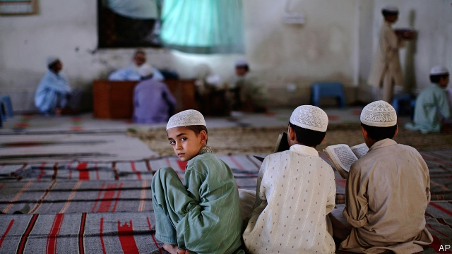

###### Religion and education

# A look inside a Pakistani madrassa 

##### Spiritual learning is growing in popularity 

 

> Apr 11th 2019 

AFTER HIS victory in the battle of Badr in 624, the Prophet released the prisoners he had taken, on condition that they teach others to read. That, says Muhammed Asghar Saqib, principal of the Jamia Ghousia Rizvia madrassa attached to the mosque in Lahore’s main market, is a measure of Islam’s respect for education. But, he goes on, “there is a misconception in our society about the purpose of education. Education is not for getting rich. Education is for becoming a better person.” 

In some countries, such as America, religion is banned from schools. A growing appetite for religious education is one of the drivers of the growth of the private sector: in America, enrolment in religious schools among 4- to 14-year-olds increased from 4m in 2011-12 to 4.4m in 2015-16. And even where government schools teach religion, as in Pakistan, parents sometimes want more of it than is on offer in the state sector. 

More than 2m Pakistani children attend madrassas, which troubles some of their compatriots for a couple of reasons. There are concerns that these schools serve as breeding-grounds for terrorism. Some are said to be financed by fundamentalists in the Gulf, but Mr Saqib says that his school, which is free to pupils, is paid for by the rents of 40 neighbouring shops which the mosque owns. There are also reasons to doubt the educational value of spending hours memorising the Koran. Mr Saqib is careful to emphasise that he believes in the value of both religious education—which the 300 boys at the school receive in the morning—and “contemporary” education, which they get in the afternoon. 

Aside from some dusty computers in one room, there is little evidence of the contemporary. The classrooms have no desks or chairs, just tilted stands, a few inches high, on which squatting boys place their books. The dormitories have no beds, only bedding rolls laid out close together. In the kitchen a stack of firewood sits ready for cooking dinner. “Gas problem,” says Mr Saqib. 

But there are spiritual if not physical comforts. Fifteen-year-old Ghulam Hassan from Layyah, a desert region of western Punjab where jobs are hard to come by, is learning to be a Koranic reciter. Offering to perform for the visitor, he intones verses from the Sura Yusuf, which tells the story of Joseph and his brothers. It is more a song than a recitation, and exquisitely beautiful. 

-- 

 单词注释:

1.Pakistani[.pɑ:ki'stɑ:ni]:a. 巴基斯坦的 n. 巴基斯坦人 

2.madrassa[]:[网络] 伊斯兰学校；伊斯兰宗教学校；伊斯兰神学院 

3.popularity[.pɒpju'læriti]:n. 名声, 受大众欢迎, 流行 

4.APR[]:[计] 替换通路再试器 

5.badr[]:n. (Badr)人名；(阿拉伯)巴德尔 

6.prophet['prɒfit]:n. 预言者, 先知, 提倡者 

7.Muhammed[]:n. (Muhammed)人名；(阿拉伯)穆罕默德 

8.asghar[]:n. (Asghar)人名；(阿拉伯、伊朗、巴基、阿富)阿斯加尔 

9.saqib[]:[网络] 萨基布 

10.jamia[]:[网络] Jnl of the American Medical Informatics Assoc; 清真寺; 美国医学信息学会杂志(Journal of the American Medical Informatics Association) 

11.mosque[mɒsk]:n. 清真寺 

12.misconception[.miskәn'sepʃәn]:n. 误解 

13.enrolment[in'rәulmәnt]:n. 登记, 注册, 入伍, 入学, 入会, 注册人数, 入学人数 

14.Pakistan[.pɑ:ki'stɑ:n]:n. 巴基斯坦 

15.sector['sektә]:n. 扇形, 部门, 部分, 函数尺, 象限仪, 段, 区段 vt. 把...分成扇形 [计] 扇面; 扇区; 段; 区段 

16.compatriot[kәm'pætriәt]:n. 同国人 a. 同国的, 同胞的 

17.terrorism['terәrizm]:n. 恐怖主义, 恐怖统治, 恐怖状态 [法] 胁迫, 暴政, 恐怖政治 

18.fundamentalist[.fʌndә'mentәlist]:n. 基要主义者 

19.educational[.edju'keiʃәnl]:a. 教育的, 教育性的 

20.memorise['meməraiz]:vt. 记住, 熟记, 记录, 存储 

21.Koran[kɒ'rɑ:n]:n. <<可兰经>> 

22.emphasise[]:vt. 强调, 重读, 加强...的语气, 着重 

23.tilt[tilt]:n. 倾斜, 倾向, 船篷, 车篷 vt. 使倾斜, 使倾侧, 用帆布篷遮盖 vi. 倾斜, 翘起, 冲, 评击 [计] 倾斜 

24.squat[skwɒt]:n. 蹲, 窝 a. 蹲着的, 矮胖的 vi. 蹲下, 蹲坐, 蹲伏 vt. 使蹲下, 擅自占有 

25.ghulam[]:[网络] 古拉姆；吴拉姆 

26.Hassan[]:n. 哈山（男子名） 

27.Layyah[]:[网络] 拉雅 

28.Punjab[pʌn'dʒɑ:b]:n. 旁遮普(南亚一地区) 

29.Koranic[kɒ'rænik]:a. <<可兰经>>的 

30.reciter[ri'saitә]:n. 背诵者, 吟诵者, 朗诵者 

31.intone[in'tәun]:v. 吟咏 

32.verse[vә:s]:n. 诗, 韵文, 诗句 vt. 用诗表达 vi. 作诗 

33.sura['suәrә]:[医] 腓肠, 小腿肚 

34.Yusuf[]:n. (Yusuf)人名；(土、哈萨、塔吉、吉尔、土库、巴基、索)优素福 

35.Joseph['dʒәuzif]:n. 约瑟夫（男子名）；约瑟（圣经中雅各的第十一子） 

36.recitation[.resi'teiʃәn]:n. 详述, 吟诵, 背诵的诗 [法] 叙述, 评述, 书面陈述 

37.exquisitely['ekskwizitli]:adv. 精巧地, 敏锐地 

