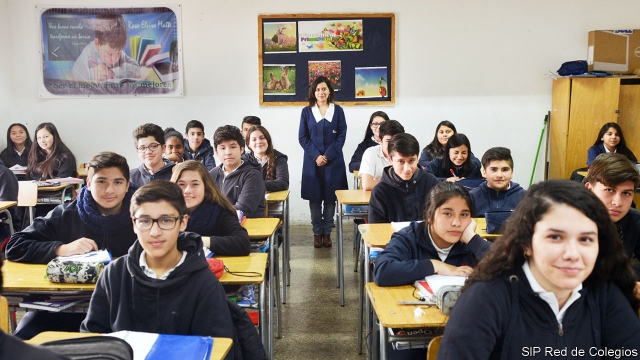
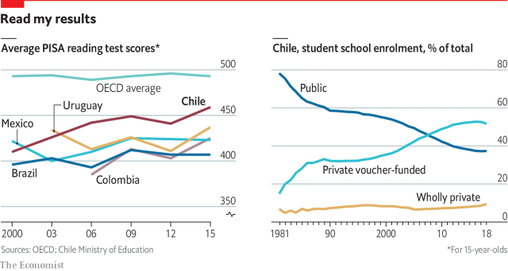

###### Public-private partnerships

# How Chile combines competition and public funding 

##### It is possible to have the best of both worlds 

 

> Apr 11th 2019 

ONE OF THE most effective soft-power programmes ever was launched in 1955 by the American government. Over the next 18 years, it sent over 100 Chilean students to Chicago University to study economics under Milton Friedman. The ideas those students absorbed were regarded as outlandish in their increasingly socialist country until Augusto Pinochet, brought to power by a coup in 1973, put them into practice. Among other things, he turned the entire education system into a voucher scheme. 

The Chilean experiment is unique in its scale but not its nature. In education, public-private partnerships of various kinds abound. At tertiary level, governments provide or guarantee loans for students to spend at private colleges. At primary and secondary level, they include charters, academies and vouchers. 

The Netherlands, perhaps surprisingly, runs much of its education system as a public-private partnership, because religious divisions meant that in the past parents did not trust the state to run schools. Its schools are publicly financed, not for profit, non-selective and close to free, but they enjoy a lot of autonomy. It works: education in the Netherlands is among the best in the world. 

The desire to liberate schools from the state—and the teachers’ unions—also lies behind the growth of the charter movement in America, and academies and “free schools” in Britain. America’s charters started in Minnesota in 1992 and spread state by state; Britain’s academies were conceived by a centrist Labour government in 2000. Both are publicly funded and privately run. Enrolment in charters rose from 400,000 in 2000 to 2.8m in 2015. Nearly three-quarters of British secondary-school pupils and one-third of primary-school pupils attend academies or free schools. 

In developing countries public-private partnerships are driven largely by the desire to maximise enrolment and minimise inequality. India’s government decreed in 2009 that 25% of places in private schools should be reserved for “economically weaker sections” who would be paid for by each state government. Colombia, Venezuela, Peru, Sierra Leone, Uganda, India, Pakistan and the Philippines now have voucher, charter or other sorts of subsidy schemes, but Chile’s is the only national-scale experiment. 

Chile has three sorts of schools: entirely private (which charge whatever fees they like and get no money from the government); private voucher-financed; and public schools. The children of the elite attend the first lot; both middle- and working-class families are gravitating towards the second (see chart). 

Those who run Chile’s private-voucher schools attribute their success to their autonomy. “We’ve introduced a Singaporean system for teaching maths in a more practical way that required us to buy special materials,” says Marianela Cisternas of Belén Educa, a Catholic foundation that runs 12 schools. “A municipal school could not have done that.” Principals also have more freedom to hire and fire staff. Jessica Vergara, principal of Colegio Rosa Elvira Matte de Prieto, a school in Lo Espejo, a rough area of southern Santiago, has fired 18 teachers in five years. In a municipal school, she says, she would not have been able to. 

 

Pupils at voucher schools do only a little better than those at municipal schools after allowing for their socioeconomic background. But that, says Harald Beyer, a former minister of education in Chile, is beside the point: competition has improved the municipal schools’ performance too. Academic studies cast doubt on whether competition has really improved outcomes, yet even sceptics see virtues in the system. Emiliana Vegas of the Inter-American Development Bank reckons that the main driver of improvement has been the rich data produced by the system, which allow the state to keep tabs on how it is doing. 

Chile’s educational performance, though far from stellar, is good by local standards. The country does better in reading (see chart), maths and science than the other Latin American countries for which the OECD, a club of mostly rich countries, collects data. It also spends less as a share of GDP. 

But the left is uncomfortable with competition, which it feels can increase inequality in an already unequal country. Schoolchildren protested against inequality in education in 2006, university students in 2011. Michelle Bachelet, a former Chilean president, shifted the system leftwards, first making vouchers income-related and subsequently banning profits, fees and selection in voucher schools. These changes are being implemented gradually. 

Supporters of the changes argue that credit for the improvement in standards should go mainly to the investments in the curriculum, teacher training and assessment in the 1990s, and that more state intervention will improve it further. “We now have a system that has a better chance of producing the combination of quality and equity that society needs,” says Cristian Cox Donoso of the Diego Portales University. Chile’s system, as Gregory Elacqua of the Inter-American Development Bank points out, is starting to look rather like the Netherlands’. But critics worry that the changes are undermining its virtues. Mr Beyer thinks banning fees and profits will discourage investment and innovation. Victor Gerardo, principal of the Liceo San Pedro Poveda, one of the best private voucher schools, says that without top-up fees his school will be “kaputt”. Mariana Aylwin, a former education minister whose foundation runs two schools, is concerned about the bureaucracy that inevitably comes with increasing government oversight. “With so many obligations and controls, schools are losing their autonomy and wasting time.” Ms Vergara reckons that she spends as much as half her working hours dealing with government paperwork. 

But the most contentious issue is selection. Its abolition, intended to increase social integration, has been exceedingly unpopular. “Families are in favour of segregation,” says Dante Contreras, an economist at the University of Chile. “They want to be segregated from poorer people.” Liliana Ramírez, who is head of the parents’ association at the Lo Espejo school, says that because selection has stopped, “there are lots of people in the school who shouldn’t be here. People who don’t do honest work, who take drugs or deal in drugs.” But this is not a problem for the elite, which, on both left and right, sends its children to the 9% of schools that are entirely private. 

The selection issue seems to have tipped the polls against Ms Bachelet. Her coalition lost power at the end of 2017 and she was replaced (for the second time) by Sebastián Piñera, who is trying to reintroduce a limited form of selection. But through all the arguments over its education system, not even the left suggested binning the voucher system. By and large, Chileans accept that it has worked. 

Charged as they are by the memory of military dictatorship, Chile’s arguments over the politics of education are especially intense, but there are similar tensions between individual freedom and collective values all over the world. In many countries, as in China, government is reacting to the growth of the private sector by tightening regulations. Last June Dubai imposed a freeze on school fees, and last December Pakistan’s Supreme Court decreed that schools charging more than 5,000 rupees a month must cut their fees by 20%. “A lot of schools will shut down if this isn’t rescinded,” says Kasim Kasuri, chief executive of Beaconhouse School System. Several Indian states have also introduced controls on fees, and closed down some private schools on the ground that they did not meet standards set by the Right to Education Act—even though only 8% of government schools comply with them. Bureaucrats use those standards to extract bribes. “To get your school recognised,” says Mr Dhankar at Hari Vidya Bhawan School in Delhi, “you have to pay for the proper infrastructure, you have to pay five lakh ($7,250) bribes on top of that, and then they’re expecting some other gifts at festivals.” 

Behind the tightening regulations lies a suspicion widespread among governments: that the growth of the private sector is bad for society. That view is not generally shared by parents. 

-- 

 单词注释:

1.partnership['pɑ:tnәʃip]:n. 合伙, 合股, 合作关系 [经] 合伙(合作)关系, 全体合伙人 

2.Chile['tʃili]:n. 智利 [化] 番椒; 辣椒 

3.APR[]:[计] 替换通路再试器 

4.Chilean['tʃiliәn]:n. 智利人, 智利讲的西班牙语 a. 智利文化的, 智利人的, 智利的 

5.Chicago[ʃi'kɑ:gәu]:n. 芝加哥 

6.milton['miltәn]:n. 米尔顿（男子名, 英国诗人） 

7.Friedman[]:n. 弗里德曼（男子名） 

8.outlandish[aut'lændiʃ]:a. 外国气派的, 偏僻的, 古怪的 

9.Augusto[]:n. (Augusto)人名；(西、葡、意)奥古斯托 

10.Pinochet[]:n. (Pinochet)人名；(西)皮诺切特 

11.coup['ku:]:n. 砰然的一击, 妙计, 出乎意料的行动, 政变 [医] 发作, 中, 击 

12.voucher['vautʃә]:n. 证人, 保证人, 证明者, 凭证, 凭单 vt. 证实...的可靠性 

13.abound[ә'baund]:vi. 大量存在, 富于, 充满 

14.tertiary['tә:ʃiәri]:a. 第三的, 第三位的, 第三产业的 n. 第三修道会会员, 第三纪 第三的; 三代的(指无机盐) 

15.charter['tʃɑ:tә]:n. 特许状, 执照, 宪章 vt. 特许, 发给特许执照 

16.Netherlands['neðәlәndz]:n. 荷兰 

17.autonomy[ɒ:'tɒnәmi]:n. 自治, 自治权 [医] 自主性 

18.Minnesota[.mini'sәutә]:n. 明尼苏达州 

19.conceive[kәn'si:v]:vt. 构思, 认为 vi. 怀孕 

20.centrist['sentrist]:n. 中间党派的成员, 温和主义者 [法] 中间派议员, 中立派议员 

21.privately[]:adv. 秘密地；私下地 

22.enrolment[in'rәulmәnt]:n. 登记, 注册, 入伍, 入学, 入会, 注册人数, 入学人数 

23.maximise['mæksimaiz]:vt. 把...增加到最大限度, 把...扩大到最大限度, 充分重视, 找出...的最高值 

24.enrolment[in'rәulmәnt]:n. 登记, 注册, 入伍, 入学, 入会, 注册人数, 入学人数 

25.minimise[]:vt. 使减到最少/最小, 使降到最低限度, 使缩到最小, 极度轻视 

26.inequality[.ini'kwɒliti]:n. 不平等, 不同, 不平坦, 不平均 n. 不平等, 不等式 [计] 不等式 

27.decree[di'kri:]:n. 法令, 判决, 天意 vt. 颁布, 判决 vi. 发布命令 

28.economically[i:kә'nɔmikәli]:adv. 节约地, 不浪费地, 节省地, 节俭地, 在经济上, 在经济学上 

29.Colombia[kә'læmbiә]:n. 哥伦比亚 

30.Venezuela[,vene'zweilә]:n. 委内瑞拉 

31.Peru[pә'ru:]:n. 秘鲁 

32.sierra[si'єәrә]:n. 呈齿状起伏的山脉 

33.Leone[li:'әun]:[经] 里昂 

34.Uganda[ju(:)'^ændә, u:'^ændә]:n. 乌干达 

35.Pakistan[.pɑ:ki'stɑ:n]:n. 巴基斯坦 

36.Philippine['filipi:n]:a. 菲律宾(群岛)的, 菲律宾人的 

37.entirely[in'taiәli]:adv. 完全, 全然, 一概 

38.elite[ei'li:t]:n. 精华, 精锐, 中坚分子 

39.gravitate['græviteit]:vi. 被重力吸引, 沉下, 下降 vt. 使受重力吸引 

40.singaporean[,siŋ^ә'pɔ:riәn]:n. 新加坡人 

41.cisterna[sis'tә:nә]:n. [解] 池, 内胞浆网槽 

42.Belén[]:[地名] 贝伦 ( 阿根、巴拉、巴拿、玻、哥伦、哥斯、尼加、乌拉、智 ) 

43.educa[]:[网络] 教育；教育展；易千家 

44.municipal[mju:'nisipl]:a. 市政的, 自治区的, 内政的 [经] 市政的, 市的 

45.jessica['dʒesikә]:n. 杰西卡（女子名） 

46.vergara[]: [地名] [阿根廷、哥伦比亚、古巴、乌拉圭、智利] 贝尔加拉; [地名] [西班牙] 贝尔加拉 

47.colegio[]:n. (Colegio)人名；(西)科莱希奥 

48.rosa['rәuzә]:[医] 蔷薇, 玫瑰 

49.Elvira[el'vaiәrә]:n. 埃尔韦拉(f.) 

50.matte[mæt]:a. 表面粗糙的 n. 无光粗糙层, 冰铜 

51.de[di:]:[化] 非对映体过量 [医] 铥(69号元素铥的别名,1916年Eder离得的假想元素) 

52.prieto[]: [人名] 普列托 

53.lo[lәu]:interj. 瞧, 看 

54.espejo[]: [地名] [玻利维亚、西班牙] 埃斯佩霍 

55.Santiago[sænti'ɑ:^әu]:n. 圣地亚哥 

56.socioeconomic['sәuʃiәu,i:kә'nɔmik]:a. 社会经济学的 

57.HARALD['hɑ:ræld]:n. 哈拉尔德（丹麦国王） 

58.beyer[]:n. 拜尔（男子名） 

59.sceptic['skeptik]:n. 怀疑论者 

60.vega['vi:^ә]:n. [天]织女星 

61.reckon['rekәn]:vt. 计算, 总计, 估计, 认为, 猜想 vi. 数, 计算, 估计, 依赖, 料想 

62.datum['deitәm]:n. 论据, 材料, 资料, 已知数 [医] 材料, 资料, 论据 

63.tab[tæb]:n. 制表(键), 搭襻, 标号, 调整片, (易拉罐)拉环, 帐单, 标签, 制表符 [计] 标签, 制表符, TAB键 

64.educational[.edju'keiʃәnl]:a. 教育的, 教育性的 

65.stellar['stelә]:a. 星的, 似星的, 星球的, 主要的 

66.Oecd[]:[经] 已开发国家组织 

67.les[lei]:abbr. 发射脱离系统（Launch Escape System） 

68.unequal[.ʌn'i:kwәl]:a. 不相等的, 不规则的, 不能胜任的 [经] 不平均的, 不等的 

69.schoolchild['sku:ltʃaild]:n. 学童 

70.Michelle[mɪ'ʃɛl]:n. 米歇尔（女子名） 

71.bachelet[]:n. (Bachelet)人名；(法)巴舍莱；(西)巴切莱特 

72.leftwards['leftwәdz]:adv. 在左边, 向左边 [计] 向左的 

73.subsequently['sʌbsikwәntli]:adv. 后来, 随后 

74.supporter[sә'pɒ:tә]:n. 支持者, 后盾, 迫随者, 护身织物 [法] 支持者, 赡养者, 抚养者 

75.intervention[.intә'venʃәn]:n. 插入, 介入, 调停 [经] 干预 

76.equity['ekwiti]:n. 公平, 公正 [经] 权益, 产权 

77.cristian[]:n. 克里斯蒂安（罗纳尔多的队友） 

78.cox[kɒks]:n. 舵手 v. 做舵手 

79.donoso[]:n. (Donoso)人名；(西、葡)多诺索 

80.diego[]:n. 迭戈（男子名） 

81.portales[]: [地名] [美国] 波塔利斯 

82.gregory['^re^әri]:n. 格雷戈里（男子名, 古代罗马教皇之名） 

83.undermine[.ʌndә'main]:vt. 在...下面挖, 渐渐破坏, 暗地里破坏 [法] 暗中破坏, 以阴谋中伤伤害 

84.innovation[.inәu'veiʃәn]:n. 改革, 创新 [法] 创新, 改革, 刷新 

85.victor['viktә]:n. 胜利者 a. 胜利的 

86.gerardo[]:n. (Gerardo)人名；(法、葡)热拉尔多；(意)杰拉尔多；(西)赫拉尔多；(俄)格拉尔多 

87.liceo[]:[网络] 虱子 

88.san[sɑ:n]:abbr. 存储区域网（Storage Area Networking） 

89.pedro['pi:drәu]:n. 彼得牌戏（一种纸牌戏） 

90.poveda[]:[网络] 波韦达；维达 

91.kaputt[]:a. 故障的;坏了的 

92.Mariana[.mæri'ɑ:nә]:n. 马里亚纳群岛 

93.Aylwin[]:n. (Aylwin)人名；(英)艾尔温；(西)艾尔文 

94.bureaucracy[bjuә'rɒkrәsi]:n. 官僚, 官吏 [法] 官僚主义, 官僚政治, 官僚机构 

95.inevitably[in'evitәbli]:adv. 不可避免地 

96.oversight['әuvәsait]:n. 勘漏, 失察, 失败, 照料 [经] 监督权 

97.contentious[kәn'tenʃәs]:a. 好争吵的, 爱争论的, 有异议的 [法] 诉讼的, 争执的, 引起争论的 

98.abolition[.æbәu'liʃәn]:n. 废除, 废奴运动 [医] 禁止, 消失 

99.integration[.inti'greiʃәn]:n. 综合, 与环境协调的行为, 集成 [化] 集成; 整合 

100.unpopular['ʌn'pɔpjulә]:a. 不得人心的, 不受欢迎的, 不流行的 

101.segregation[.segri'geiʃәn]:n. 隔离, 偏析, 被隔离的部分, 种族隔离 [化] 分离; 分凝; 离析; 偏析; 分聚 

102.dante['dænti]:n. 但丁（意大利诗人） 

103.contreras[]: [地名] [美国] 孔特雷拉斯 

104.economist[i:'kɒnәmist]:n. 经济学者, 经济家 [经] 经济学家 

105.segregate['segrigeit]:a. 分离的, 被隔离的 vi. 分离, 隔离, 分凝 vt. 使分离, 使隔离 

106.liliana[]:n. (Liliana)人名；(罗、意、西、保)利利亚娜；(英)利利安娜；(俄)利利阿纳 

107.coalition[.kәuә'liʃәn]:n. 结合体, 结合, 联合 [经] 联合, 联盟 

108.reintroduce[ri:intrә'dju:s]:vt. 再引进, 再介绍 

109.bin[bin]:n. (贮存谷物等的)容器, 箱子 [计] 二进制, 商业信息网 

110.Chilean['tʃiliәn]:n. 智利人, 智利讲的西班牙语 a. 智利文化的, 智利人的, 智利的 

111.dictatorship[dik'teitәʃip]:n. 独裁者之职位, 独裁, 独裁政权 [法] 专攻, 独裁权 

112.politic['pɒlitik]:a. 精明的, 明智的, 策略的 

113.sector['sektә]:n. 扇形, 部门, 部分, 函数尺, 象限仪, 段, 区段 vt. 把...分成扇形 [计] 扇面; 扇区; 段; 区段 

114.tighten['taitn]:vt. 勒紧, 使变紧 vi. 变紧, 绷紧 

115.dubai['dju:bai]:n. 迪拜（阿拉伯联合酋长国的酋长国之一）；迪拜港（阿拉伯联合酋长国港市） 

116.rupee[ru:'pi:]:n. 卢比(印、巴等国货币单位) 

117.rescind[ri'sind]:vt. 废止, 使无效, 取消, 撤消, 解除 [经] 取消, 废除 

118.kasim[]:n. (Kasim)人名；(中)哈斯木(维吾尔·汉语拼音)；(俄、塞、巴基、坦桑)卡西姆 卡西姆 

119.comply[kәm'plai]:vi. 顺从, 依从 [法] 遵守, 承诺, 照做 

120.bureaucrat['bjuәrәukræt]:n. 官僚作风的人, 官僚, 官僚主义者 [法] 官僚, 官僚作风的人 

121.extract[ik'strækt]:n. 榨出物, 精汁, 摘录, 选段 vt. (费力地)取出, 采掘, 榨取, 摘录, 吸取 [计] 提取 

122.bribe[braib]:n. 贿赂 vt. 贿赂, 收买 vi. 行贿 

123.Hari[]:n. 哈里（男子名） 

124.vidya[]:n. (Vidya)人名；(印、尼)维迪亚；(阿拉伯)维迪娅 

125.bhawan['hʌvən]:n. = bhavan 

126.delhi['deli]:n. 德里（印度城市名） 

127.infrastructure['infrәstrʌktʃә]:n. 基础结构, 基础设施 [经] 基础设施 

128.lakh[læk]:n. 十万, 十万卢比, 多数 [化] 紫胶; 虫胶 

