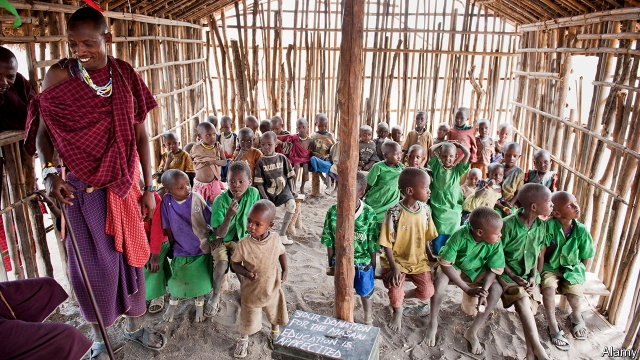

###### Costs and benefits

# Private education can complement the public sort 

##### It is good at providing access where the state does not have capacity 

 

> Apr 11th 2019 

“WE WANTED TO pop champagne when they said they were opening Spark Soweto,” said Ntebogeleng Malevu. Before the new branch of a fast-growing chain of low-cost South African schools opened in the township on the outskirts of Johannesburg in January, Ms Malevu, a nurse, would wake her six-year-old daughter Qhawe at 4am to travel to another Spark school in the city’s northern suburbs. The transport cost nearly as much as the tuition (2,310 rand, or $158, a month for primary-school pupils). 

Parents prefer private schools. A global survey in 2017 found that they were a lot more likely to give the teaching at their children’s school a positive rating if it was private than if it was public; parents in Chile have voted with their children’s feet in favour of the private sector. 

Governments are often less keen on private education. Some of the reasons for their hostility are bad ones: a reluctance to cede power, the opportunity for patronage, the influence of teachers’ unions. But some are entirely in order: governments need to promote quality, access to schooling and equity. The private sector is good at some, but not all, of those. 

The evidence on quality is ambiguous. Private institutions dominate the upper ranks of the global higher-education leagues. Seven of the top ten places in the Times Higher Education ranking are taken by American private non-profit universities and three by British institutions, which although regarded as public in Britain, are privately run and funded largely by user fees. The most highly rated clearly public institution, ETH Zurich, which is, ultimately, run by the state, is in 11th place. 

But these rankings depend almost entirely on the universities’ research performance. The standard of education they deliver is hard to measure. The only useful proxy is earnings, but a study of alumni of America’s most selective colleges by Stacy Dale and Alan Krueger found that their higher earnings were explained by background and intellect. Top universities provided a boost only to blacks and Hispanics—presumably because they gained a useful network to which many white students already had access. 

At the bottom of the market, America’s for-profit colleges—largely vocational outfits that take students who cannot get into the state system—do poorly. A study of their alumni’s employment history showed not just that they performed worse in the labour market than similar people who went to (much cheaper) public colleges, but also that they barely earned more than those who did not go to college at all. On average, in other words, the time and money that they spent on their education had been largely wasted. 

In some countries private schools do exceptionally well. According to Varsity, Cambridge University’s student newspaper, Westminster got an average of 79 pupils a year into Oxford and Cambridge in 2006-16, more than any other school in the world. But Westminster is one of Britain’s most selective schools, attracts bright pupils from all over the world and spends four and a half times as much per child as the public sector does. Educating the world’s cleverest children with vast resources is not the biggest challenge in teaching. 

A better test of schools is whether they add value—in other words, produce outcomes better than would be expected given where children started. In the OECD’s latest PISA test private-school pupils did a lot better than public-school ones in reading and science, but after controlling for economic background they did little better in reading and worse in science. An American study concluded that private schools added no value, a British one the opposite: the university and labour-market outcomes of two cohorts of people, born in 1958 and 1970, who attended private schools were considerably better than those of government-school alumni, even when ability and background were taken into account. The gap was bigger in the younger cohort, presumably because private schools have come to focus more on academic achievement. 

In poor countries, the evidence tends to favour the private sector. Out of 21 studies in Africa and South Asia surveyed for Britain’s Department for International Development (DFID), 14 found that children learned more at private schools and seven found no difference. In none of the studies did government schools come out on top, but the private-schools’ margin was not overwhelming. In the most rigorous study, carried out in the Indian state of Andhra Pradesh, pupils’ scores in most subjects were the same in both types of schools, though they did better in Hindi at private schools. The maths scores of the private schools that taught in the local language, Telugu, were higher than those taught in English, suggesting that while private schools confer an advantage, being taught in English is a disadvantage. 

Opponents of private schools often argue that they undermine public schools, but the evidence does not support that claim. A review of studies from America, Canada and Sweden concludes that virtually all of them showed that public schools do better when they are up against voucher schools; the few studies of the issue in the DFID review, from India, Pakistan and Kenya, found the same. 

The qualitative differences between private and public schools are marginal, though. More strikingly, private schools cost less. Of seven studies in the DFID review, none found government schools to be cheaper. A study comparing the cost-effectiveness of public and private schools in eight Indian states found that the private sector did better in all of them; the differential ranged from 1.5 times in Bihar to 29 times in Uttar Pradesh. 

The private sector’s efficiency is one reason why it does well at providing access to education. Another is its speed: in fast-growing cities, governments struggle to provide schools, but wherever there are people, schools spring up. A worldwide review of voucher schemes has shown that governments that cannot provide enough capacity can increase access by enabling children to attend private schools. “Kids are being born every day,” says Murad Raas, education minister in Pakistan’s Punjab province, where 2.6m children are in private schools on voucher schemes and 11m in government schools. “We don’t have the funds to accommodate them all. I’m very open to anything that can benefit them.” 

The main reason for the private sector’s superior efficiency seems to be teachers, who are paid less and are more likely to turn up for work than at government schools. Politics has a lot to do with that. Teachers’ unions have huge bargaining power—in India, for instance, they man polling stations and have reserved seats in state assemblies—and can therefore protect their members from being held to account for poor performance. An Indian study found that in 3,000 government schools, only one principal had ever dismissed a teacher; among 600 private schools, 35 had. 

The other explanation for better performance in the private sector could be competition, but it does not seem to be working all that well. One problem with the market is that parents often lack information. Researchers in Pakistan tried providing parents with cards showing their child’s test scores and the average scores of the schools in the village. Where this was done, children learned substantially more, fees were lower, enrolment went up and bad private schools were more likely to close down. 

A second problem is parental priorities. Parents want their children to go to schools with the best outcomes, but those establishments may achieve good results not because they add more value but because their intake is richer and cleverer. A Chilean study showed that parents presented with data on both outcomes and value added were interested in the former, not the latter. 

They are being perfectly rational. Parents want to ensure not just that their children get a good education, but also that their classmates come from “good” families, because the company they keep will shape their behaviour and provide their network. Employers, too, are likely to favour the products of schools with good exam results. But the incentive for parents to choose outcomes over value added limits the efficacy of parental choice as a mechanism for improving schools. 

It also helps explain why the market tends to increase inequality. Whereas governments promote social integration, parents actively seek stratification. Furong Ren, a parent at Dehong, Dulwich College International’s bilingual sister school in Shanghai, explains that “when parents get together, all they talk about is how China is developing a class system, and they want their children to be on top.” Fees and selective admissions, which favour rich kids, encourage schools and families to sort themselves by income. For governments concerned about social mobility, that is a problem. 

As private education grows, its strengths and weaknesses are becoming increasingly apparent. It is good at providing access where the state does not have capacity; in poor countries, the education it offers is slightly better than the government variety. But it also encourages inequality and discourages social mobility. 

Many teachers’ unions and left-wing politicians favour getting rid of private schools. That would solve the equity problem, but there would be a cost in terms of both access and quality. Without the private sector, many children in fast-growing cities in the developing world would be in worse schools or on the streets. 

Another approach is to regulate private education, by, for instance, setting stringent standards for facilities and teaching. That is a reasonable thing to do in countries where the state works well, but a state that cannot provide decent education is unlikely to be a good regulator. DFID looked at 19 studies to see whether developing-country governments were any good at regulating schools; 14 concluded that they were not, three that they were, and two were not sure. Bribery is a common problem. 

A third approach is for governments to partner with the private sector, through vouchers or subsidies. The idea is to allow society to benefit from the private sector’s virtues while mitigating the inequality it fosters. 

Such partnerships are spreading, but their performance so far has been mixed. They suffer from the same problem as regulation does: governments that cannot provide education are unlikely to be good at commissioning it. India’s reservation of 25% of private-school places for poorer children has not been a great success. The government has been slow to pay its bills, the initiative has got bogged down in legal action, ten years after launch only 16% of private schools are taking part, and a study in Karnataka found that most of the families taking up the vouchers had been sending their children to private school anyway. And where schools charge fees or set admissions tests, such partnerships can become vehicles for subsidies to the better-off and encourage stratification, as Chile’s original voucher system did. 

Yet well-designed public-private partnerships can work. Two of the world’s best education systems—those of the Netherlands and Hong Kong—are based on them. In both places, schools get public funding, a lot of autonomy and hefty state regulation to raise standards and limit inequity. Chile’s voucher-based education system, despite its flaws, outperforms those of its neighbours. They are especially good for countries whose governments struggle to provide access to education: in Pakistan’s Punjab province 2.6m children go to school thanks to vouchers; a PPP in Uganda enrolled 400,000. Design and monitoring are crucial, says Harry Patrinos of the World Bank: “performance has to be measured, rigorously and often, and schemes adjusted accordingly.” 

Above all, governments should stop regarding private education as an enemy. Its growth is the result of people’s deepest urge—to look after their children. Whether through buying expensive houses near the best government schools or by forking out for private-school fees, they will find a way to do that. The private-education boom may be fostering inequality but it is also causing unprecedented amounts of money and energy to be spent on improving humanity’s brains. Governments should encourage that—but spread the benefits as widely as possible. 

-- 

 单词注释:

1.complement['kɒmplimәnt]:n. 补足物, 补语, 补数 vt. 补充, 补足 [计] 补码; 反相器; 补数 

2.APR[]:[计] 替换通路再试器 

3.champagne[ʃæm'pein]:n. 香槟酒, 香槟酒色 [化] 香槟酒 

4.Soweto[sɔ:'wetj]:索韦托[南非] 

5.township['taunʃip]:n. 小镇, 镇区 [法] 镇区, 乡 

6.Johannesburg[dʒәu'hænisbә:^]:约翰内斯堡[南非(阿扎尼亚)东北部城市] 

7.rand[rænd]:n. 兰特, (非正式)边, 田埂, 缘 [经] 兰特 

8.Chile['tʃili]:n. 智利 [化] 番椒; 辣椒 

9.sector['sektә]:n. 扇形, 部门, 部分, 函数尺, 象限仪, 段, 区段 vt. 把...分成扇形 [计] 扇面; 扇区; 段; 区段 

10.les[lei]:abbr. 发射脱离系统（Launch Escape System） 

11.hostility[hɒs'tiliti]:n. 敌意, 敌对, 反对 

12.reluctance[ri'lʌktәns]:n. 不情愿, 勉强 [电] 磁阻 

13.cede[si:d]:vt. 割让 [法] 割让, 让与, 放弃 

14.patronage['pætrәnidʒ]:n. 赞助, 恩赐态度, 光顾, 任免权, 保护人的身分 [经] 光顾, 资助, 赞助 

15.entirely[in'taiәli]:adv. 完全, 全然, 一概 

16.equity['ekwiti]:n. 公平, 公正 [经] 权益, 产权 

17.privately[]:adv. 秘密地；私下地 

18.eth[eð]:abbr. 埃塞俄比亚全国运动联合会（National Ethiopian Sports Confederation） 

19.Zurich['zuәrik]:n. 苏黎士 

20.ranking['ræŋkiŋ]:n. 等级, 地位 a. 上级的, 头等的, 超群的 

21.proxy['prɒksi]:n. 代理, 代理人, 委托书 [经] 代理人, 代表权, 授权书 

22.earning['ә:niŋ]:n. 收入（earn的现在分词） 

23.alumni[ә'lʌmni]:pl. 男毕业生, 男校友 

24.selective[si'lektiv]:a. 选择的, 选择性的 [经] 选择的, 选择性的 

25.stacy[]:n. 史黛西（女子名）；斯特西（男子名） 

26.dale[deil]:n. 小谷, 溪谷 

27.alan['ælәn]:n. 艾伦（男子名） 

28.krueger[]:克鲁格 

29.intellect['intәlekt]:n. 智力, 出众的才华, 知识分子 [医] 智力, 才智 

30.vocational[vәu'keiʃәnl]:a. 职业的 [法] 职业上的, 天职的 

31.outfit['autfit]:n. 用具, 配备, 机构 vt. 配备, 供应 vi. 得到装备 

32.cannot['kænɒt]:aux. 无法, 不能 

33.poorly['puәli]:adv. 贫穷地, 不充分地, 贫乏地 a. 身体不舒服的 

34.exceptionally[]:adv. 特殊地；异常地；例外地 

35.varsity['vɑ:sәti]:n. 大学运动代表队；大学 

36.Cambridge['keimbridʒ]:n. 剑桥 

37.Westminster['westminstә]:n. 威斯敏斯特 

38.Oxford['ɒksfәd]:n. 牛津, 牛津大学 

39.Pisa['pi:zә]:n. 比萨城 

40.cohort['kәuhɒ:t]:n. 一群；步兵大队；支持者；共同特点的一群人 

41.considerably[kәn'sidәrәbli]:adv. 非常地, 很, 颇 

42.DFID[]:abbr. 英国国际发展署（UK Department for International Development） 

43.overwhelm[.әuvә'hwelm]:vt. 淹没, 受打击, 制服, 压倒, 使不知所措 [法] 打翻, 倾覆, 覆盖 

44.rigorous['rigәrәs]:a. 严厉的, 严酷的, 严格的, 苛刻的, 严密的, 精确的 

45.andhra[]:[网络] 安得拉邦；安德拉；印度安得拉 

46.Pradesh[]:邦 

47.Hindi['hindi:]:a. 印地语的, 印度北部的 n. 印地语 

48.telugu['telә,^u:]:n. 泰卢固语（印度东部德拉维拉语言）；泰卢固人 

49.confer[kәn'fә:]:vt. 授予, 带来 vi. 协商 

50.undermine[.ʌndә'main]:vt. 在...下面挖, 渐渐破坏, 暗地里破坏 [法] 暗中破坏, 以阴谋中伤伤害 

51.Sweden['swi:dn]:n. 瑞典 

52.voucher['vautʃә]:n. 证人, 保证人, 证明者, 凭证, 凭单 vt. 证实...的可靠性 

53.Pakistan[.pɑ:ki'stɑ:n]:n. 巴基斯坦 

54.Kenya['kenjә]:n. 肯尼亚 

55.qualitative['kwɒlitәtiv]:a. 性质的, 质的, 定性的 

56.marginal['mɑ:dʒinәl]:a. 边缘的, 最低限度的, 有旁注的 [医] 缘的 

57.strikingly[]:adv. 显著地, 惊人地, 引人注目地 

58.differential[difә'renʃәl]:a. 差别的, 特异的, 微分的 n. 差别, 两路线运费差额, 工资差额 

59.Bihar[bi'hɑ:]:n. 比哈尔邦(印度地名) 

60.uttar[]:[网络] 北方；乌塔茹阿；太邦 

61.Murad[]:穆拉德（人名） 

62.raas[]:[网络] 血管紧张素一醛固酮系统；肾素血管紧张素醛固酮系统(renin aniotension aldosterone system)；醛固酮系统(renin-angiotensin-aldosterone system) 

63.Punjab[pʌn'dʒɑ:b]:n. 旁遮普(南亚一地区) 

64.politic['pɒlitik]:a. 精明的, 明智的, 策略的 

65.substantially[sәb'stænʃәli]:adv. 实质上, 本质上, 大体上 

66.enrolment[in'rәulmәnt]:n. 登记, 注册, 入伍, 入学, 入会, 注册人数, 入学人数 

67.parental[pә'rentәl]:a. 父母亲的, 做双亲的, 作为渊源的 [医] 父母的, 双亲的 

68.intake['inteik]:n. 入口, 吸入, 吸入量 [医] 摄取量 

69.Chilean['tʃiliәn]:n. 智利人, 智利讲的西班牙语 a. 智利文化的, 智利人的, 智利的 

70.datum['deitәm]:n. 论据, 材料, 资料, 已知数 [医] 材料, 资料, 论据 

71.incentive[in'sentiv]:n. 动机 a. 激励的 

72.efficacy['efikәsi]:n. 功效, 效力 [医] 效能, 功效, 效验 

73.mechanism['mekәnizm]:n. 机械, 机构, 结构, 机理, 技巧 [化] 机理; 历程; 机构 

74.inequality[.ini'kwɒliti]:n. 不平等, 不同, 不平坦, 不平均 n. 不平等, 不等式 [计] 不等式 

75.integration[.inti'greiʃәn]:n. 综合, 与环境协调的行为, 集成 [化] 集成; 整合 

76.actively['æktivli]:adv. 活跃地, 积极地 

77.stratification[.strætifi'keiʃәn]:n. 层化, 阶层的形成, 成层 [医] 分层 

78.REN[]:[计] DOS内部命令:更改文件名 [医] 肾 

79.dulwich[]:n. 达利奇（英国地名） 

80.bilingual[bai'liŋgwәl]:a. 双语的 

81.mobility[mәu'biliti]:n. 可动性, 流动性, 机动性 [化] 迁移率 

82.stringent['strindʒәnt]:a. 迫切的, 严厉的, 银根紧的 [医] 约束的, 紧迫的 

83.regulator['regjuleitә]:n. 调整者, 校准者, 校准器, 调整器, 标准钟 [化] 调节剂; 调节器 

84.bribery['braibәri]:n. 贿赂行为, 行贿, 受贿 [经] 行贿, 受贿 

85.mitigate['mitigeit]:vt. 温和, 缓和, 减轻 [医] 缓和, 减轻 

86.foster['fɒstә]:a. 收养的, 养育的 vt. 养育, 抚育, 培养, 鼓励, 抱(希望) 

87.partnership['pɑ:tnәʃip]:n. 合伙, 合股, 合作关系 [经] 合伙(合作)关系, 全体合伙人 

88.bog[bɒg]:n. 沼泽 vt. 使陷于泥沼 vi. 陷于泥沼 

89.Karnataka[kɑ:'nɑ:tәkә]:卡纳塔克邦[印度邦名](旧称迈索尔邦) 

90.Netherlands['neðәlәndz]:n. 荷兰 

91.hong[hɔŋ]:n. （中国、日本的）行, 商行 

92.autonomy[ɒ:'tɒnәmi]:n. 自治, 自治权 [医] 自主性 

93.hefty['hefti]:a. 重的, 肌肉发达的 

94.inequity[in'ekwiti]:n. 不公平, 不公正 

95.flaw[flɒ:]:n. 缺点, 裂纹, 瑕疵, 一阵狂风 [化] 划痕; 裂缝; 裂纹 

96.outperform[.autpә'fɔ:m]:vt. 胜过；做得比……好 

97.PPP[]:[计] 点到点协议 [化] PPP法 

98.Uganda[ju(:)'^ændә, u:'^ændә]:n. 乌干达 

99.enrol[in'rәul]:vt. 登记, 使加入 vi. 参军, 注册 

100.harry['hæri]:vt. 掠夺, 使苦恼, 强使前行, 折磨, 骚扰 

101.Patrinos[]:[网络] 帕崔诺；帕特里诺斯；帕特尼斯 

102.rigorously[]:adv. 严厉地；残酷地 

103.unprecedented[.ʌn'presidentid]:a. 空前的 [经] 空前的, 无前例的 

