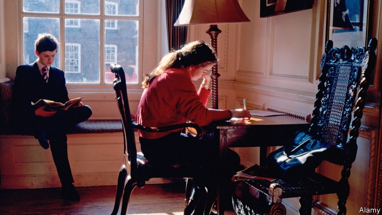
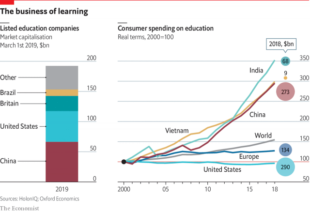
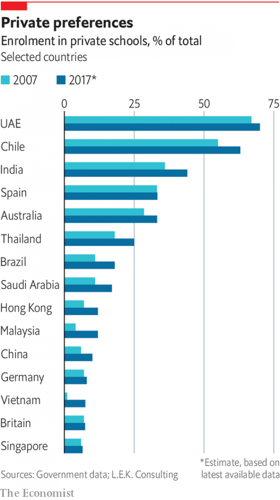

###### A class apart

# Private education is booming in new markets and new forms 

##### Governments should support, not suppress it, says Emma Duncan 

 

> Apr 11th 2019 

HOUSED in a jumble of ancient buildings in the shadow of Westminster Abbey, Westminster School has been educating boys since it was founded in 1560 by Queen Elizabeth I to provide lessons for 40 poor scholars. It has evolved since then—its 750 pupils now include some girls, and with fees of £39,252 a year for boarders and £27,174 for day pupils, poor scholars are thin on the ground—but for nearly half a millennium, these historical premises defined its geographical limits. 

That is about to change. A ground-breaking ceremony on April 9th marked the start of the construction of Westminster Chengdu, the first stage in a venture with a local partner, Hong Kong Melodious Education Technology Group. The school is due to open in September 2020 and will have 2,500 pupils from the ages of 3 to 18. It will be followed by a further five establishments of a similar size in other Chinese cities over the next ten years, by the end of which Westminster will be educating 20 times as many children in China as in the heart of London. 

A slice of the Chinese operation’s income will flow back to the mother ship, enabling Westminster to increase the share of pupils on bursaries in Britain from around 5% to 20%. “It will give us a revenue stream that will allow us to go back to our roots,” says Rodney Harris, deputy headmaster in London, who is moving to Chengdu in September to take the top job there. By extending its model to China, the school thus hopes to mitigate the inequality to which it contributes in Britain. 

Education used to be provided by entrepreneurs and religious organisations, but starting in Prussia in the 18th century, governments began to take over. In more recent years the state has dominated education in the rich world, with the private sector restricted to the elite and the pious. In the developing world, too, new states created from crumbling empires were keen to provide (and control) education, both to respond to their people’s ambitions and to shape the minds of the next generation. 

But now the private sector is enjoying a resurgence. Enrolment in private schools has risen globally over the past 15 years, from 10-17% at primary level and from 19-27% at secondary level; the increases are happening not so much in the rich world as in low- and middle-income countries. People are pouring money into schooling, tuition and higher education (see chart). 

 

Four factors are driving the increase. First, incomes are rising, especially among the better-off. Since birth rates are falling, the amount of money available for each child is rising even faster than incomes. In China the one-child policy has meant that in many families six people (four grandparents and two parents) are prepared to invest in the education of a single child. 

Second, thanks to the relative decline and increasing capital intensity of manufacturing, job opportunities for the less well-educated are shrinking. Even good factory jobs require qualifications. The returns to education have risen despite the rise in the supply of well-educated people. In developing countries, which have fewer of them, the returns are higher than in the rich world, making it even more important for young people there to go to school. 

Third, the output of education also provides some of the input: the more children that are educated, the more teachers will be available to bring on the next lot. This is especially true in countries in which job opportunities for women are limited: lots of educated women translate into a ready supply of cheap teachers. 

Fourth, technology is creating a demand for new skills which the private sector seems better at providing. It is also opening up new markets as the internet enables people to get educated in different ways and at different times in their lives. 

The dividing line between private and public is often unclear—many countries have government schools that are partly privately financed, for instance, and private schools that are publicly financed—and the size and growth of the private sector varies from country to country. Broadly, the more developed the country, the smaller the private sector’s role tends to be. In Haiti about 80% of primary-school pupils are being educated privately; in Germany, just 5%. In mainland Europe, the quality of state education is generally high, so the private sector tends to play a smallish role—though there are wrinkles. For example, a history of religious divisions in the Netherlands has meant that three-quarters of pupils go to private schools, the great majority of them publicly financed; in Sweden, 10% do. In America and Britain the quality of government schools is variable, which explains sizeable elite private sectors and a growing number of privately managed, publicly funded schools—“charters” in America, “academies” in Britain. In the tertiary sector, private institutions have a big role in America, both at the top and the bottom of the market; in Britain, the tertiary sector is now largely privately financed. 

In Latin America the Catholic church’s big role in schooling, the low quality of state provision and the rapid growth in demand for tertiary education have all contributed to a big role for the private sector. In much of South Asia and Africa, poverty, migration and population growth make it hard for governments to provide schooling in many cities, so the private sector is big, and growing fast. The elites have already left the public systems, and many middle-class and poorer people are following. 

 

Like Europe, East Asia has generous and mostly good state provision, but unlike Europe it also has a fast-growing private sector. Vietnam has both the best state-school system in a low-income country and probably the world’s fastest-growing private-school sector. The market capitalisation of Chinese education companies, bigger than those of any other country, suggests that investors see it as a golden opportunity. 

The Chinese state is clamping down on the private sector’s role between the ages of 6 and 16, but there is still room for growth. If the child goes to a private nursery and a private university, and receives two hours of private tuition on each school day and eight at the weekends, with a summer maths camp thrown in—a fairly standard routine for a child of Chinese professionals—he or she will spend as much time in the private as in the state sector. 

All of this makes education attractive to investors, says Ashwin Assomull of L.E.K. Consulting. Demand is growing faster than incomes and holds up well in economic downturns. Technology is creating new markets. Schooling is fragmented, but there are large and growing chains, such as GEMS Education, a Dubai-based company with 47 schools mostly in the Middle East; Cognita, a British company with 73 schools in eight countries; and Beaconhouse School Systems, a Pakistani company with 200 schools in seven countries. 

The main downside is the sector’s political sensitivity. Private investment in education makes governments uncomfortable because it pits a private good against a social one. Governments, like parents, want children to learn, but they also want to maximise social mobility and minimise inequality, whereas parents simply want to ensure that their children do better than anyone else’s. 

These objectives inevitably conflict, so governments regulate and restrict the private sector, controlling what is taught, banning profits, outlawing selection, cutting fees and generally making the business unattractive to investors. Yet they need it, too, so they work with it, channelling its skills, inventiveness and capital and pouring taxpayers’ money into it. 

This special report will consider what the private sector is providing that the state is not, and look at the costs and benefits of its growth. It will examine how well it is performing, and conclude by asking how the private sector and the state can work together to best effect. 

-- 

 单词注释:

1.suppress[sә'pres]:vt. 镇压, 使止住, 禁止, 抑制, 查禁 [法] 镇压, 平定, 禁止出版 

2.emma['emә]:n. 艾玛（女子名） 

3.duncan['dʌŋkәn]:n. 邓肯（姓氏） 

4.APR[]:[计] 替换通路再试器 

5.jumble[dʒʌmbl]:vi. 搀杂, 混杂 vt. 搞乱, 使混乱 n. 混乱, 薄饼 

6.Westminster['westminstә]:n. 威斯敏斯特 

7.abbey['æbi]:n. 大修道院 

8.elizabeth[i'lizәbәθ]:n. 伊丽莎白（女子名） 

9.boarder['bɒ:dә]:n. 寄膳者, 寄膳宿者 

10.millennium[mi'leniәm]:n. 千禧年, 一千年 

11.premise['premis]:n. 前提, 房屋连地基, 上述各项 vt. 预先提出, 引出, 作为...的前提 vi. 作出前提 

12.geographical[dʒiә'græfikl]:a. 地理学的, 地理的 

13.chengdu['tʃʌŋ'du:]:n. 成都市（中国四川省省会） 

14.hong[hɔŋ]:n. （中国、日本的）行, 商行 

15.kong[kɔŋ]:n. 含锡砾石下的无矿基岩；钢 

16.melodious[mә'lәudiәs]:a. 旋律美妙的, 旋律优美的, 有乐曲的 

17.bursary['bә:sәri]:n. 财务办公室, 大学奖学金 

18.rodney['rɔdni]:n. 罗德尼（男子名） 

19.harris['hæris]:n. 哈里斯（英国苏格兰一地区）；哈里斯（姓氏） 

20.mitigate['mitigeit]:vt. 温和, 缓和, 减轻 [医] 缓和, 减轻 

21.inequality[.ini'kwɒliti]:n. 不平等, 不同, 不平坦, 不平均 n. 不平等, 不等式 [计] 不等式 

22.entrepreneur[.ɒntrәprә'nә:]:n. 企业家, 主办人 [经] 承包商, 企业家 

23.organisation[,ɔ: ^әnaizeiʃən; - ni'z-]:n. 组织, 团体, 体制, 编制 

24.Prussia['prʌʃә]:n. 普鲁士 

25.sector['sektә]:n. 扇形, 部门, 部分, 函数尺, 象限仪, 段, 区段 vt. 把...分成扇形 [计] 扇面; 扇区; 段; 区段 

26.elite[ei'li:t]:n. 精华, 精锐, 中坚分子 

27.pious['paiәs]:a. 虔诚的, 敬神的, 尽责的, 可嘉的, 不可能实现的 

28.crumble['krʌmbl]:v. (使)粉碎, (使)成为碎屑, 瓦解, 崩溃, 败落 

29.resurgence[ri'sә:dʒәns]:n. 再起, 复活, 再现 

30.enrolment[in'rәulmәnt]:n. 登记, 注册, 入伍, 入学, 入会, 注册人数, 入学人数 

31.globally[]:[计] 全局地 

32.manufacturing[.mænju'fæktʃәriŋ]:n. 制造业 a. 制造业的 

33.les[lei]:abbr. 发射脱离系统（Launch Escape System） 

34.privately[]:adv. 秘密地；私下地 

35.broadly['brɒ:dli]:adv. 宽广地, 明白地, 无礼貌地 

36.Haiti['heiti]:n. 海地 

37.smallish['smɒ:liʃ]:a. 有点小的, 短小的 

38.Netherlands['neðәlәndz]:n. 荷兰 

39.Sweden['swi:dn]:n. 瑞典 

40.sizeable['saizәbl]:a. 相当大的, 可观的 

41.tertiary['tә:ʃiәri]:a. 第三的, 第三位的, 第三产业的 n. 第三修道会会员, 第三纪 第三的; 三代的(指无机盐) 

42.migration[mai'greiʃәn]:n. 移民, 移往, 移动 [计] 迁移 

43.Vietnam[.vjet'næm]:n. 越南 

44.capitalisation[,kæpitәlai'zeiʃən;-li'z-]:n. <主英>=capitalization 

45.investor[in'vestә]:n. 投资者 [经] 投资者 

46.clamp[klæmp]:n. 夹钳 vt. 夹紧, 强加 

47.ashwin[]:n. (Ashwin)人名；(泰)阿斯温 

48.assomull[]:[网络] 沙图什披肩的阿苏木 

49.lek[lek]:n. 列克(阿尔巴尼亚货币单位) 

50.downturn['dauntә:n]:n. (尤指经济方面的)衰退, 下降趋势 [电] 低迷时期 

51.gem[dʒem]:n. 珠宝, 宝石, 珍贵之物 vt. 饰以宝石 

52.Pakistani[.pɑ:ki'stɑ:ni]:a. 巴基斯坦的 n. 巴基斯坦人 

53.downside['daunsaid]:n. 底侧；下降趋势 

54.sensitivity[.sensә'tiviti]:n. 敏感, 灵敏度 [计] 灵敏度 

55.maximise['mæksimaiz]:vt. 把...增加到最大限度, 把...扩大到最大限度, 充分重视, 找出...的最高值 

56.mobility[mәu'biliti]:n. 可动性, 流动性, 机动性 [化] 迁移率 

57.minimise[]:vt. 使减到最少/最小, 使降到最低限度, 使缩到最小, 极度轻视 

58.inevitably[in'evitәbli]:adv. 不可避免地 

59.outlaw['autlɒ:]:n. 被剥夺法律保护的人, 罪犯 vt. 使...失去法律保护, 将...逐出社会, 宣告非法, 取缔 

60.unattractive[.ʌnә'træktiv]:a. 无吸引力的, 无魅力的, 乏味的, 不美的 

61.inventiveness[]:n. 发明创造能力, 创造性 

