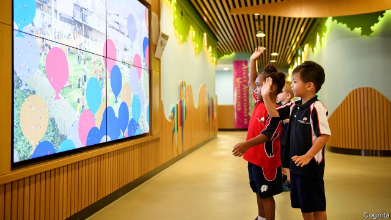
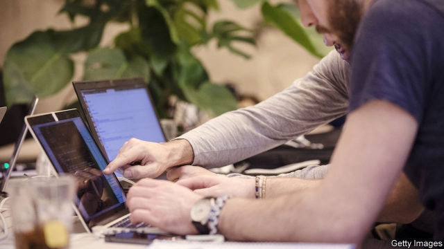

###### Filling the gaps

# Private education is stepping in where the state leaves off 

##### Rich and poor parents alike are spending more than ever on their children’s education 

 

> Apr 11th 2019 

DOGS AND emaciated cows pick their way through the rubbish dump that marks the visitor’s arrival in Sangam Vihar, an “unauthorised colony” amidst the sprawl of south Delhi. It sprang up without planning permission and now houses 1.5m people. The government offers very little in the way of services. Water arrives in trucks run by gangs whose members have a habit of murdering each other. Education is provided by four government schools and around 100 private ones, according to Sushil Dhankar, who runs Hari Vidya Bhawan School. 

At Mr Dhankar’s smart, modern establishment in an alley off the grubby main street, pupils in spotless cream uniforms welcome the visitor with floral garlands. The school was set up by Mr Dhankar’s father, who begged his son to return from a job in accountancy in Australia to help run it. Mr Dhankar’s sister runs the primary school and his wife the secondary one. It is a flourishing enterprise with 2,000 students from 4 to 18 and an average result in the Central Board of Secondary Education exam of 86%, slightly above the national average. Fees range from 850 rupees ($12) a month for the little ones to 1,800 rupees for the oldest. By Indian standards, this is not cheap. But local parents, mostly labourers or drivers earning around 500 rupees a day, are prepared to make sacrifices, says Mr Dhankar: “They don’t want their children to do what they are doing.” 

In most of the world the state provides most of the population with primary and secondary education. But in some countries it struggles to keep up with population growth and movement, and the countries whose populations are growing and moving fastest tend to be poorer ones with less capable governments. 

Most low-cost private schools are mom-and-pop outfits. A few chains are emerging, some of which are for profit, such as Bridge International Academies, whose investors include Bill Gates of Microsoft and Mark Zuckerberg of Facebook. It has produced good results but has become controversial, partly because the idea of foreigners making profits out of providing education for poor people is politically sensitive. The non-profit model is an easier sell. Bangladesh and Pakistan, both weak states with a huge need for education, have produced two impressive non-profit operators, Brac (which educates 1m children) and The Citizen’s Foundation (TCF, with 220,000) respectively. A few Western-run non-profit chains, such as Peas, have produced excellent results in Africa. 

The private sector is also filling gaps in provision for children’s early years. Enrolment in pre-school education varies widely, even in rich countries. Most countries mandate formal education only from age five or six onwards, but attitudes are changing as the early years are increasingly seen as the most crucial period in the development of the human brain. Across the OECD, preschool attendance among under-threes rose from 18% to 33% between 2005 and 2016, and among three- to five-year-olds from 76% to 86%. Last year France announced it would make enrolment from age three compulsory. But governments are not keen to take on extra financial burdens, so in most places the extra demand is being met largely by the private sector. 

Wealthy people will spend heavily to buy their children an early advantage, as demonstrated by Cognita’s new “early-learning village” in Singapore, which will eventually cater for 2,100 children aged 18 months to six years. Facilities include 114 outside spaces, one for each classroom, and nine playdecks equipped with pirate ships, tricycle tracks and suchlike. The classrooms are arranged in groups of four, each with a central space to create a sense of community. “The building develops with the children,” says Adam Paterson, one of the centre’s two headteachers. “They move through it as they grow.” Fees range from S$14,832 ($8,393) to S$35,610 a year. 

But despite strong demand, the early-years business is not all plain sailing for companies. Some, such as Australia’s G8, have struggled in an oversupplied market. Barriers to entry are low, and firms need to be careful when looking after people’s most valued assets; the stock price of RYB, a big Chinese operator, crashed after staff at its nurseries were found to be punishing children by pricking them with needles and feeding them pills to make them sleep. 

Demand for education outstrips public-sector supply not just in the early years but at core school age as well. The state may provide it five days a week, but many parents cannot get enough of it, so the private sector supplements it in the evenings, at the weekends and in the holidays. A survey by Ipsos MORI for the Sutton Trust showed that the share of British children who had had private tuition rose from 18% in 2005 to 30% in 2017. And British children get off relatively lightly, with an average of ten hours’ extra tuition a week, compared with 12 in China, 15 in South Korea and 16 in Bulgaria. 

It is not just the elite that buys tuition. The Ipsos MORI survey showed that although richer parents were somewhat more likely to resort to it than poorer ones, parents from ethnic minorities, both black and Asian, were much more likely to use it than white ones. Shehda Asif, a maid with three children at the Royal Public School, a small establishment on the outskirts of Lahore, spends 1,700 rupees ($12) a month on the fees and a further 1,000 rupees on after-school tuition. Almost all of her income goes on education; for the rest of its outgoings the family relies on her husband, a labourer. 

In much of the world, private tuition is a small-scale business, often using casual labour which itself has become available because many more people are being educated. At Heaven Kids School in Township, a lower-middle-class area of Lahore, most of the young men in a group of tutors are themselves students. Tutoring one child in one subject for Pakistan’s matriculation exam for one hour six days a week can cost up to 10,000 rupees a month; for the International Baccalaureate, twice as much. Tutors tend to check out the parents’ house before setting a price. The system suits the tutors, but some disapprove. “There’s too much competition among parents,” says Mohammed Ashfaq, who is studying for a master’s degree. 

But some large companies are involved, too. Two of the world’s biggest listed education companies, New Oriental and TAL Education, are Chinese providers of tuition and test-preparation. Technology is driving the expansion of the business, for instance by allowing the children of the well-off in emerging markets to be tutored by hard-up young people in the rich world (see article). India’s biggest ed-tech company, Byju’s, sells test-prep apps, charging a subscription of up to 37,000 rupees a month; it has 2.2m paid subscribers, who spend an average of 64 minutes each day on the app. It is cheaper than hiring an American over the internet, but still only for the well-off. 

The private sector has long played an important part in the tertiary-education market, perhaps because the benefits of a degree go more clearly to the individual than to society as a whole. In rich countries, policy has also pushed in that direction. The top ranks of America’s higher-education system—financed by user fees and student loans—are dominated by non-profit private institutions, the middle by public institutions and the bottom by the for-profit private sector. (The last part is currently the only large chunk of the world’s private-education market that is shrinking; poor results at for-profit colleges prompted the Obama administration to restrict access to government loans for students.) Britain and Australia, too, have moved towards a system of user fees. In developing countries the trend towards privatisation in higher education is even more pronounced. In Latin America, especially, governments have left the tertiary sector largely to private companies: three-quarters of Brazilian students, for instance, attend private universities. 

 

Technological change is driving the adult-education business because it is generating demand for new skills. It has created the bootcamp business, in which recent graduates or adults already in the workplace take short and brutally intense courses that boost their market value by training them in various aspects of tech. “I’ve never seen people work so hard,” says Natasha Jahchan, a former structural engineer who took a ten-week course at General Assembly, the star of the sector, in UX (user experience), costing $15,000. She left a job that bored her and got a better-paid one she enjoyed: “I spent my savings but I made it back in three months.” Since GA was founded in 2011 it has trained more than 50,000 people, and revenues are growing at 30% a year. Last year it was bought by Adecco, a recruitment company, for $412m. 

Tech has also increased the supply of adult education, since students no longer have to sit in a classroom. Online education started in the for-profit private sector, but has moved into the non-profit and public sectors. Ann Cleland, who had been working as an accountant on the post-hurricane disaster-recovery programme in Puerto Rico, signed up for the Harvard Business School’s business analytics programme, an online nine-month course which teaches strategy in the age of big data, blockchain, machine learning and AI. At $50,000 it’s not cheap, but to Ms Cleland it was worth every cent. “I cried at graduation and hugged my professors and told them it had changed my life.” 

About a third of graduate education is now online, according to Richard Garrett of Eduventures, a consultancy. In this bit of the market, private and public sectors are melding: public universities such as Arizona State University and private non-profits such as the University of Southern New Hampshire offer online courses designed, supplied and marketed by firms such as Pearson and 2U which commonly take around two-thirds of the revenue. 

But the private sector does not just supply education at times and in places where the public sector is not active. It also offers different kinds of education altogether. 

-- 

 单词注释:

1.APR[]:[计] 替换通路再试器 

2.emaciate[i'meisieit]:vt. 使消瘦, 使憔悴 vi. 消瘦 

3.sangam[]: [地名] [印度] 森格姆; [电影]合流 

4.vihar[]:[网络] 毘诃羅 

5.unauthorised[ʌn'ɔ:θəraizd]:a. 无权的（等于unauthorized） 

6.amidst[ә'midst]:prep. 在...当中 

7.sprawl[sprɒ:l]:vi. 伸开手足躺, 爬行, 蔓生, 蔓延 vt. 懒散地伸开, 使蔓生, 使不规则地伸展 n. 伸开手足躺卧姿势 

8.delhi['deli]:n. 德里（印度城市名） 

9.sushil[]:[网络] 苏希尔 

10.Hari[]:n. 哈里（男子名） 

11.vidya[]:n. (Vidya)人名；(印、尼)维迪亚；(阿拉伯)维迪娅 

12.bhawan['hʌvən]:n. = bhavan 

13.grubby['grʌbi]:a. 污秽的, 肮脏的, 生蛆的 

14.spotless['spɒtlis]:a. 无脏污的, 无缺点的, 无可挑剔的 

15.floral['flɒ:rәl]:a. 花似的, 花的, 植物的 

16.garland['gɑ:lәnd]:n. 花环, 荣誉 vt. 戴花环 

17.accountancy[ә'kauntәnsi]:n. 会计工作, 会计学 [经] 会计工作, 会计学术, 会计职业 

18.rupee[ru:'pi:]:n. 卢比(印、巴等国货币单位) 

19.les[lei]:abbr. 发射脱离系统（Launch Escape System） 

20.outfit['autfit]:n. 用具, 配备, 机构 vt. 配备, 供应 vi. 得到装备 

21.investor[in'vestә]:n. 投资者 [经] 投资者 

22.Microsoft[]:n. (美国)微软公司 [电] 微软公司 

23.zuckerberg[]:扎克伯格 

24.facebook[]:n. 脸谱网 

25.politically[]:adv. 政治上 

26.Bangladesh[,bɑ:ŋ^lә'deʃ]:n. 孟加拉国 [经] 孟加拉共和国 

27.Pakistan[.pɑ:ki'stɑ:n]:n. 巴基斯坦 

28.BRAC[]:abbr. 孟加拉乡村进步委员会（Bangladesh Rural Advancement Committee）；基地关闭与重组委员会（Base Realignment and Closure） 

29.tcf[]: [医][=thymus crude factor]胸腺粗提因子 

30.sector['sektә]:n. 扇形, 部门, 部分, 函数尺, 象限仪, 段, 区段 vt. 把...分成扇形 [计] 扇面; 扇区; 段; 区段 

31.enrolment[in'rәulmәnt]:n. 登记, 注册, 入伍, 入学, 入会, 注册人数, 入学人数 

32.mandate['mændeit]:n. 命令, 指令, 要求 vt. 委任统治 

33.onward['ɒnwәd]:a. 向前的, 前进的 adv. 向前, 前进, 在先 

34.Oecd[]:[经] 已开发国家组织 

35.preschool['pri:'sku:l]:a. 就学前的 n. 育幼院, 幼稚园 

36.attendance[ә'tendәns]:n. 出席, 出席的人数, 照料 [法] 管理, 照料, 资助 

37.enrolment[in'rәulmәnt]:n. 登记, 注册, 入伍, 入学, 入会, 注册人数, 入学人数 

38.Singapore[.siŋgә'pɒ:]:n. 新加坡 

39.pirate['paiәrәt]:n. 海盗, 盗印者, 侵犯专利权者 vt. 盗印, 掠夺, 翻印 vi. 做海盗, 从事劫掠 

40.tricycle['traisikl]:n. 三轮车 

41.suchlike['sʌtʃlaik]:pron. 这一类的人 a. 那样的, 类似的, 同样的, 这样的, 那种的 

42.Adam['ædәm]:n. 亚当 [计] 自动直接存取管理 

43.Paterson['pætәsәn]:帕特森[美国新泽西州东北部城市] 

44.oversupply[.әuvәsә'plai]:vt. 过度供给 n. 过多的供应品 

45.asset['æset]:n. 资产, 有益的东西 

46.prick[prik]:vt. 刺, 戳, 刺痛, 使竖起 vi. 刺, 竖起 n. 扎, 一刺, 刺痛 a. 竖起的 

47.outstrip[.aut'strip]:vt. 追过, 胜过, 凌驾 

48.cannot['kænɒt]:aux. 无法, 不能 

49.ipso[]:abbr. incremental phase shift oscillator 增量移相振荡器; Internet protocol security option 因特网协议安全选件; iodized poppy-seed oil 碘化罂粟子油 

50.MORI[]:abbr. 国际市场研究公司（Market &Opinion Research International） 

51.sutton['sʌtәn]:n. 萨顿（英国英格兰东南部城市） 

52.Korea[kә'riә]:n. 朝鲜, 韩国 

53.Bulgaria[bʌl'^eәriә]:n. 保加利亚 [经] 保加利亚 

54.elite[ei'li:t]:n. 精华, 精锐, 中坚分子 

55.ethnic['eθnik]:a. 人种的, 种族的 [医] 人种的 

56.Asif[]:n. 阿西夫（男子名） 

57.lahore[lә'hɔ:]:n. 拉合尔（巴基斯坦城市） 

58.township['taunʃip]:n. 小镇, 镇区 [法] 镇区, 乡 

59.matriculation[mә.trikju'leiʃәn]:n. 大学入学许可, 入学, 入学考试 

60.baccalaureate[.bækә'lɒ:riәt]:n. 学士学位, 毕业班临别宗教仪式 

61.Mohammed[mu'hæmәd]:n. 穆罕默德(伊斯兰教创始人) 

62.ashfaq[]:n. (Ashfaq)人名；(巴基)阿什法克 

63.tal[]:abbr. 事物处理应用语言（Transaction Application Language） 

64.provider[prә'vaidә]:n. 供应者, 供养人, 伙食承办人 [计] 提供器 

65.tutore[]:[网络] 图托雷 

66.APP[]:[计] 应用, 应用程序; 相联并行处理器 

67.subscription[sәb'skripʃәn]:n. 捐献, 订金, 订阅, 签署, 同意 [化] 订购 

68.subscriber[sʌbs'kraibә]:n. 签署者, 捐献者, 订户 [经] 定户 

69.currently['kʌrәntli]:adv. 现在, 当前, 一般, 普通 [计] 当前 

70.chunk[tʃʌŋk]:n. 大块, 矮胖的人(或物) [经] 定样 

71.obama[]:n. 奥巴马(姓) 

72.privatisation[ˌpraɪvətaɪ'zeɪʃən]:n. 私有化, 非国营化（将国营企业转为民营） 

73.tertiary['tә:ʃiәri]:a. 第三的, 第三位的, 第三产业的 n. 第三修道会会员, 第三纪 第三的; 三代的(指无机盐) 

74.Brazilian[brә'ziljәn]:n. 巴西人 a. 巴西的, 巴西人的 

75.technological[.teknә'lɒdʒikl]:a. 技术的 [经] 工艺的, 技术的 

76.bootcamp[]:n. 训练营地 

77.brutally[]:adv. 残忍地, 蛮横地 

78.tech[tek]:n. 技术学院或学校 

79.Natasha[nә'tɑ:ʃә]:n. 娜塔莎(亦作Natascha)(f.) 

80.UX[]:abbr. 用户体验（User Experience） 

81.Ga[]:[医] 镓(31号元素) 

82.adecco[]:n. 阿第克（瑞典公司名） 

83.recruitment[ri'kru:tmәnt]:n. 新兵征召 [医] 募集[反应], 募集[现象](生理), 复聪(耳科) 

84.tech[tek]:n. 技术学院或学校 

85.online[]:[计] 联机 

86.ann[æn]:n. 安（女子名） 

87.Cleland[]:克莱兰德（男子名） 

88.Puerto[]:n. 垭口, 港口, 山口 n. (Puerto)人名；(西)普埃尔托 

89.rico[]:abbr. 反诈骗腐败组织集团犯罪法（Racketeer Influenced and Corrupt Organizations Act） 

90.Harvard['hɑ:vәd]:n. 哈佛大学 

91.analytic[.ænә'litik]:a. 分析的, 善于分析的, 解析的 [医] 分析的 

92.online[]:[计] 联机 

93.datum['deitәm]:n. 论据, 材料, 资料, 已知数 [医] 材料, 资料, 论据 

94.blockchain[blɒkt'ʃeɪn]:na. (脚踏车等的)车链 [网络] 块环链；数据块链；资料块链 

95.AI[ai]:[计] 附加信息, 人工智能 [化] 人工智能 

96.richard['ritʃәd]:n. 理查德（男子名） 

97.garrett['^ærәt]:n. 加勒特（男子名） 

98.consultancy[]:n. 商量, 协商, 磋商, 会诊, 与...商量, 咨询, 请教, 找(医生)看病, 查阅, 考虑 [经] 咨询业务, 咨询服务 

99.Arizona[æri'zәunә]:n. 亚利桑那州 

100.hampshire['hæmpʃiә]:n. 汉普郡（英国南部之一郡） 

101.pearson['piәsn]:n. 皮尔森（人名） 

