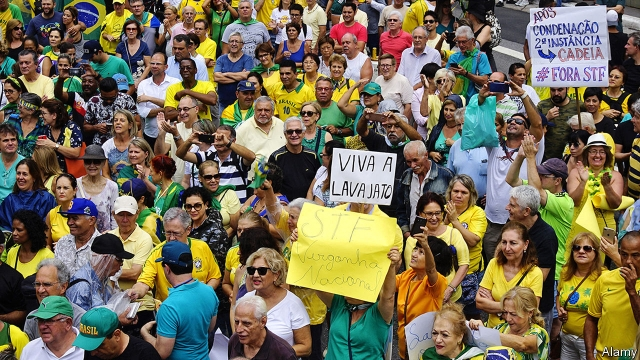
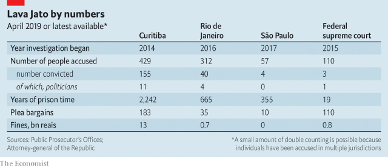

###### Coming up at the car wash

# Brazil’s biggest anti-corruption investigation is at a turning point 

##### A chance to curb systemic graft could be squandered 

 

> Apr 11th 2019 

FOR FIVE years Lava Jato (Car Wash), a sprawling anti-corruption investigation, has dominated headlines in Brazil. It ended political careers, led to the lockingup of company bosses and helped make possible last year the election of Jair Bolsonaro, a low-ranking right-wing congressman, to Brazil’s presidency. He fulminated against corruption during the campaign, but the investigation itself disappeared from the headlines. The arrest last month of Michel Temer, a former president, brought it back. Prosecutors say he ran a scheme that embezzled up to 1.8bn reais ($427m) over four decades, including during his presidency in 2016-18. Mr Temer denies the charges. A judge released him while the investigation continues. 

Lava Jato began as a routine money-laundering case in the southern city of Curitiba. It led to revelations that construction companies had paid billions of dollars in bribes to politicians in exchange for lucrative contracts with Petrobras, the state-controlled oil company. Prosecutors in Curitiba have won convictions of 155 people, and prison sentences totalling more than 2,000 years. Luiz Inácio Lula da Silva, a former president from the left-wing Workers’ Party, is serving jail sentences totalling 25 years in the city. Investigations in Curitiba and in other cities have led to scores of convictions and billions of dollars in fines (see table overleaf). Brazilian prosecutors have helped foreign ones pursue related cases, especially in Peru. Mr Bolsonaro appointed Sérgio Moro, the judge who jailed Lula, to be his justice minister. 

Through Lava Jato Brazilians have come to view systemic corruption as outrageous rather than inevitable. Citizens held massive demonstrations against it and voted corrupt politicians out of office. Businesses have created compliance departments. The supreme court banned corporate contributions to election campaigns and ruled that convicted criminals could be jailed after losing their first appeal (rather than remaining free until all their appeals were exhausted). Lava Jato has both encouraged and benefited from public anger. “Without society’s insistence, we wouldn’t have Lava Jato,” says Deltan Dallagnol, a prosecutor. 

It grinds on. Hundreds of suspects besides Mr Temer await rulings from courts in Curitiba and other cities, where other corruption schemes are being investigated. But this sort of investigation “looks to the past”, says Silvana Batini, a prosecutor for Lava Jato’s task force in Rio. 

Its future is uncertain. Mr Moro’s move from the courtroom to Mr Bolsonaro’s cabinet is a chance to strengthen anti-corruption laws and beef up enforcement. Yet Lava Jato faces new challenges, which could reverse the progress Brazil has made against political graft. One comes from congress, which could thwart Mr Moro’s attempts at reform. Another is that the supreme court, initially supportive of the investigation, has turned sceptical. That is partly in response to excesses by prosecutors and judges such as Mr Moro, and partly because of pressure from politicians. 

A third threat is the demagogic response of Mr Bolsonaro’s supporters to such setbacks. They accuse the highest court of being in league with the velha política (old politics). One of Mr Bolsonaro’s sons, Eduardo, a federal deputy from São Paulo, said before the election that a “soldier and a corporal” could shut the court down. Taking a different tack, Mr Bolsonaro proposed doubling the number of justices, so he could pack it with his appointees. Such zealotry in defence of the rule of law could end up weakening it. 

Lava Jato was born from two trends: the strengthening of Brazil’s judiciary and the weakening of its political system. A harbinger was the mensalão, a scandal during Lula’s presidency in 2005 that involved the government buying votes in congress. A new generation of prosecutors and judges won its spurs through trials of the miscreants. When Lava Jato began in 2014 judicial officials had new tools: agreements to share information on money-laundering with other countries; a law passed in 2010 that bans politicians with corruption convictions (such as Lula) from running for office; and, most important, a law from 2013 that expanded the use of plea bargaining. Without it, “we’d still be stuck going after money-launderers for 10,000 reais,” says Paulo Galvão, a Lava Jato prosecutor. 

 

Politicians’ reputations sank. Brazilians’ anger about corruption and economic recession led to the impeachment of President Dilma Rousseff in 2016 (for budgetaccounting violations, not corruption). Mr Temer, her successor, spent political capital fending off corruption allegations. The prestige of the judiciary rose. It began to act as if it could “solve all of Brazil’s problems”, says Oscar Vilhena, the dean of the law school at Fundação Getulio Vargas (FGV). 

Investigators, led by judges like Mr Moro, became more aggressive and less careful. They made liberal use of pre-trial detention and arrested suspects to force them to testify. Both practices are banned by the constitution in most circumstances. Whereas American prosecutors spent decades refining the practice of plea bargaining before using it to clobber mafia dons, its swift deployment in Lava Jato was akin to “changing the tyre as you drive”, says Matthew Taylor of American University in Washington, DC. 

The “ends-justify-the-means” attitude led to mistakes, says Heloísa Estellita, a former clerk of the supreme court. In 2016, in an apparent attempt to stop Ms Rousseff appointing Lula as minister, which would have shielded him from prosecution, Mr Moro leaked to the media taped conversations between them. That aroused suspicions among their supporters that the judge was targeting the left. Suspicion increased when he agreed to join the cabinet. In 2017 Lava Jato prosecutors gave immunity to two businessmen who claimed to have bribed Mr Temer. The information they provided was incomplete. It later emerged that one prosecutor was also working for the law firm defending them. 

That error became Lava Jato’s “Trojan horse”, says Felipe Recondo, a founder of Jota, a news site that focuses on Brazil’s judiciary. It helped bring about a new confrontation within the judiciary, between Lava Jato operatives and the supreme court. Mr Bolsonaro and most Brazilians back the investigators. Politicians tend to root for the higher court. Much will depend on the outcome of that duel. 

Many Brazilians regard the supreme court as an ally of corrupt politicians. In part that is because sitting politicians enjoy a right called foro privilegiado. This means that only the supreme court can try them for acts of corruption they commit while in office. The overburdened court almost never convicts. It heard 404 cases against politicians between 2011 and 2016 but issued guilty verdicts in just three. After the death in 2017 of one gung-ho justice and missteps by investigators, the court became more sceptical of Lava Jato. 

The new bench has issued politician-friendly rulings. Some, like limits on plea bargaining and a ban on coercive questioning, corrected excesses. Others seemed arbitrary, like the release of a former minister who had been convicted of corruption and lost his first appeal. One justice, Gilmar Mendes, freed 19 defendants in 30 days in 2018. “The supreme court does not exist,” says Conrado Hübner Mendes, a law professor at the University of São Paulo. “There are 11 mouths and 11 pens.” 

It will soon be at the centre of another controversy. It plans to reconsider its earlier ruling that people convicted of crimes can be jailed after they lose their first appeal. A reversal of that decision could result in the release of thousands of convicts not deemed a danger to society, including ordinary criminals. It could also undermine Lava Jato, investigators fear, by weakening suspects’ incentive to co-operate. 

Such a decision could provoke popular as well as prosecutorial fury. It flared last month, when the supreme court ruled that electoral courts rather than criminal ones should deal with campaign-related corruption. Mr Bolsonaro’s supporters erupted. The hashtag ASoldierACorporal trended again. The episode shows that Brazilians are apt to back pseudo-cures for impunity rather than the surer but slower remedy of building institutions. “We are living in a populist Brazil, which is challenging for the rule of law,” says Ms Estellita. 

Institution-builders are looking to Mr Moro. He says he accepted the job in Mr Bolsonaro’s cabinet to ensure that Lava Jato does not end up like Italy’s “clean hands” investigations of the 1990s, which implicated a lot of politicians without changing the system. Mr Moro brought to his first meeting with Mr Bolsonaro a 624-page document called “New Measures Against Corruption”, drawn up by FGV and Transparency International, a watchdog. 

But politics may limit Mr Moro’s ambitions. His first anti-crime bill has some valuable ideas, including protection for whistleblowers and a longer statute of limitations for corruption. But it leaves out many useful anti-graft measures, such as ending foro privilegiado. Congressional resistance forced him to delay a proposal to criminalise illegal campaign donations. 

Now the Bolsonaro family itself is facing scrutiny from investigators, which may cool its enthusiasm for graft-busting. In January another of the president’s sons, Flávio, a senator from Rio de Janeiro, tried to claim foro privilegiado to avoid an inquiry into suspicious transactions recorded in the bank account of his driver. If such scandals multiply, Lava Jato’s most vociferous allies could become its worst enemies. 

-- 

 单词注释:

1.curb[kә:b]:n. 抑制, 勒马绳, 边石 vt. 抑制, 束缚, 勒住 

2.systemic[si'stemik]:a. 系统的, 体系的, 全身的 [医] 系统的, 全身的 

3.graft[grɑ:ft]:n. 嫁接, 贪污 v. 嫁接, 移植, 贪污 

4.squander['skwɒndә]:vt. 浪费, 使分散 vi. 浪费, 漂泊, 四散 

5.APR[]:[计] 替换通路再试器 

6.lava['lɑ:vә]:n. 熔岩, 火山岩 [医] 火山石(一种顺势疗法药) 

7.jato['dʒeitәu]:n. 喷气起飞助推器 

8.sprawl[sprɒ:l]:vi. 伸开手足躺, 爬行, 蔓生, 蔓延 vt. 懒散地伸开, 使蔓生, 使不规则地伸展 n. 伸开手足躺卧姿势 

9.Brazil[brә'zil]:n. 巴西 

10.jair[]:[网络] 睚珥；贾伊尔；睢珥 

11.congressman['kɒŋgresmәn]:n. 国会议员, 众议院议员 [法] 国会议会 

12.presidency['prezidәnsi]:n. 总统职权, 总裁职位 

13.fulminate['fʌlmineit]:vt. 使爆发, 以严词谴责 vi. 爆炸, 怒喝, 电闪 n. 雷酸盐, 烈性炸药 

14.corruption[kә'rʌpʃәn]:n. 腐败, 堕落, 贪污 [计] 论误 

15.michel[]:n. 米歇尔（男子名） 

16.Temer[]:[网络] 了不起；铁木耳 

17.prosecutor['prɒsikju:tә]:n. 实行者, 告发者, 公诉人 [法] 原告, 起诉人, 检举人 

18.embezzle[im'bezl]:vt. 盗用, 挪用 [经] 贪污(公款), 盗用 

19.reais[]:[网络] 雷亚尔；黑奥；雷阿尔 

20.Curitiba[,kjәri'ti:bә]:库里提巴[巴西东南部城市] 

21.revelation[.revi'leiʃәn]:n. 揭露, 泄露, 发觉, 默示, 启示 

22.bribe[braib]:n. 贿赂 vt. 贿赂, 收买 vi. 行贿 

23.lucrative['lu:krәtiv]:a. 有利益的, 获利的, 合算的 

24.conviction[kәn'vikʃәn]:n. 定罪, 信服, 坚信 [法] 定罪, 证明有罪, 判罪 

25.luiz[]:n. (Luiz)人名；(西、葡)路易斯 

26.lula[]:n. 卢拉（男子名） 

27.DA[,di:'ei]:美国地方检察官 [计] 数据采集, 数据管理员, 数据分析, 设计自动化 

28.silva['silvә]:n. 森林, 森林志 

29.overleaf['әuvәli:f]:adv. 在背面, 在次页 

30.Brazilian[brә'ziljәn]:n. 巴西人 a. 巴西的, 巴西人的 

31.Peru[pә'ru:]:n. 秘鲁 

32.Moro['mәurәu]:n. 摩洛族, 摩洛语 

33.Brazilian[brә'ziljәn]:n. 巴西人 a. 巴西的, 巴西人的 

34.outrageous[aut'reidʒәs]:a. 暴虐的, 极无礼的, 可恶的 

35.demonstration[.demәn'streiʃәn]:n. 示范, 实证 [医] 示教, 实物教授 

36.compliance[kәm'plaiәns]:n. 遵从, 顺从, 屈从 [化] 柔顺; 顺应 

37.corporate['kɒ:pәrit]:a. 社团的, 合伙的, 公司的 [经] 团体的, 法人的, 社团的 

38.convict[kәn'vikt]:n. 囚犯, 罪犯 vt. 宣告有罪, 使知罪 

39.insistence[in'sistәns]:n. 坚持, 坚决主张 

40.deltan[]: [医]Dimethyl Sulfoxide 

41.ruling['ru:liŋ]:n. 判决, 裁定, 统治 a. 统治的, 支配的, 普遍的 

42.Silvana[sil'vænә,-'vɑ:-]:n. 西尔瓦娜(Silvia的异体)(f.) 

43.batini[]:[网络] 巴庭尼 

44.rio[]:n. 里约（巴西共和国的旧首都） 

45.courtroom['kɒ:trum]:n. 法庭, 审判室 [法] 法庭, 审判室 

46.enforcement[in'fɒ:smәnt]:n. 执行, 强制 [法] 实施, 加强, 厉行 

47.thwart[θwɒ:t]:a. 横放的 vt. 反对, 阻挠, 横过 prep. 横过 adv. 横过 

48.initially[i'niʃәli]:adv. 最初, 开头 

49.supportive[sә'pɔ:tiv]:a. 支撑, 支承, 资助, 赞助, 支援, 经受, 忍受, 扶养, 证实, 鼓励, 维持, 伴奏 

50.demagogic[,demә'^ɔ^ik]:a. 煽动的, 蛊惑的 

51.supporter[sә'pɒ:tә]:n. 支持者, 后盾, 迫随者, 护身织物 [法] 支持者, 赡养者, 抚养者 

52.setback['setbæk]:n. 挫折, 退步, 逆流 

53.velha[]:n. (Velha)人名；(葡)韦利亚 

54.politic['pɒlitik]:a. 精明的, 明智的, 策略的 

55.Eduardo[]:n. 爱德华多（姓氏） 

56.paulo[]:n. 保罗（男子名） 

57.corporal['kɒ:pәrәl]:n. 下士 a. 肉体的, 身体的, 个人的 

58.tack[tæk]:n. 平头钉, 大头钉, 粗缝针脚, 行动方针, 食物 vt. 以大头针钉住, 附加 

59.appointee[ә.pɒin'ti:]:n. 被任命者 [法] 被指定的人, 被任命者 

60.zealotry['zelәtri]:n. 过度热心, 狂热, 狂热行为 

61.judiciary[dʒu:'diʃiәri]:a. 司法的, 法院的, 法官的 n. 司法部, 司法系统, 法官 

62.harbinger['hɑ:bindʒә]:n. 通告者, 预告者, 先驱, 预兆 vt. 预告, 充做...的前驱 

63.miscreant['miskriәnt]:a. 邪恶的, 邪道的, 异端的 n. 罪大恶极的人, 恶棍, 异端 

64.judicial[dʒu:'diʃәl]:a. 法庭的, 公正的, 审判上的, 司法的 [法] 司法的, 审判上的, 法官的 

65.plea[pli:]:n. 恳求, 辩解, 抗辩, 诉讼, 请愿, 托词 [法] 抗辩, 申诉案件, 答辩 

66.recession[ri'seʃәn]:n. 后退, 凹处, 衰退, 归还 [医] 退缩 

67.impeachment[im'pi:tʃmәnt]:[法] 控告, 检举, 弹劾 

68.Dilma[]:[网络] 迪尔玛；总统迪尔玛 

69.rousseff[]:[网络] 罗塞夫；总统罗赛夫 

70.violation[.vaiә'leiʃәn]:n. 违反, 违背, 妨碍 [法] 违犯, 违背, 违反 

71.successor[sәk'sesә]:n. 继承者, 接任者 [计] 后继 

72.fend[fend]:vt. 击退, 保护, 供养 

73.allegation[.æli'geiʃәn]:n. 断言, 主张, 申辩 [法] 声明, 事实陈述, 断言 

74.prestige[pre'sti:ʒ]:n. 声望, 威望, 威信 [经] 商誉, 声誉 

75.Oscar['ɔskә]:n. 奥斯卡金像奖, 钱, 现金 

76.Vilhena[]:[地名] 维列纳 ( 巴西 ) 

77.dean[di:n]:n. 院长, 主持牧师 [法] 外交团长, 学院院长, 教务长 

78.getulio[]:[网络] 格图利奥；格图柳 

79.VARGAS[]:瓦尔加斯, 瓦格斯（人名） 巴尔加斯（地名, 在阿根廷、巴拿马、玻利维亚、古巴、洪都拉斯） 

80.fgv[]:[网络] 巴西瓦加斯商学院(Fundação Getúlio Vargas)；未来成长价值(Future growth value)；瓦加斯基金会(Fundacao Getulio Vargas) 

81.investigator[in'vestigeitә]:n. 调查者, 审查者 [法] 审查员, 侦查员, 调查员 

82.les[lei]:abbr. 发射脱离系统（Launch Escape System） 

83.detention[di'tenʃәn]:n. 阻止, 监禁, 拘留 [医] 隔离, 拘留, 滞留, 停滞 

84.testify['testifai]:v. 证明, 作证, 声明, 表明 

85.clobber['klɒbә]:n. 衣服, (鞋匠用来掩饰皮革缝的)软膏 vt. 痛打, 击倒, 拉垮 

86.mafia['mæfiә]:n. 黑手党, 秘密政党 

87.don[dɒn]:n. 西班牙贵族(或绅士), 先生, 阁下 vt. 穿上 

88.deployment[]:[计] 展开 

89.akin[ә'kin]:a. 同类的, 同族的, 同源的 

90.Matthew['mæθju:]:n. 马太, 马太福音 

91.taylor['teilә]:n. 泰勒 

92.Washington['wɒʃiŋtn]:n. 华盛顿 

93.DC[]:直流电 [计] 数据单元, 数据中心, 数据代码, 数据通信, 数据控制, 数字控制, 直流 

94.prosecution[.prɒsi'kju:ʃәn]:n. 执行, 经营, 起诉 

95.immunity[i'mju:niti]:n. 免疫, 免疫性, 免除 [化] 免疫性 

96.incomplete[.inkәm'pli:t]:a. 不完全的, 未完成的, 不完善的 [机] 不完全的 

97.Trojan['trәudʒәn]:a. 特洛伊的, 特洛伊人的 n. 特洛伊人, 勤勉的人, 勇士 

98.Felipe[]:n. (Felipe)人名；(西、葡、罗)费莉佩(女名), 费利佩 

99.founder['faundә]:n. 创立者, 建立者 vt. 使沉没, 使摔倒, 弄跛, 浸水, 破坏 vi. 沉没, 摔到, 变跛, 倒塌, 失败 

100.jota['hәutә]:n. (西班牙)霍塔舞 

101.confrontation[.kɔnfrʌn'teiʃәn]:n. 对抗；对质；面对 

102.operative['ɒpәrәtiv]:a. 动作的, 运转的, 有效的, 关键的, 手术的 n. 技工, 侦探 

103.duel['dju:әl]:n. 决斗, 斗争 vi. 决斗 

104.ally['ælai. ә'lai]:n. 同盟者, 同盟国, 助手 vt. 使联盟, 使联合, 使有关系 vi. 结盟 

105.foro[]:[网络] 广场；福乐；议事广场 

106.overburden[.әuvә'bә:dn]:vt. 装载过多, 负担过多, 使过劳 [经] 过重的货物, 重担, 过度的负担 

107.verdict['vә:dikt]:n. 裁决, 判决, 判断性意见, 定论, 结论 [法] 定论, 判断, 意见 

108.misstep[.mis'step]:n. 踏错, 错误, 失策 [法] 失足, 过失, 失策 

109.coercive[kәu'ә:siv]:a. 强制的, 强压的, 强迫的 [法] 强制的, 强迫的, 强行的 

110.gilmar[]:[网络] 吉尔马；吉尔玛集团公司；日尔玛尔 

111.mende['mendi]:n. 光滑细里子哔叽 

112.defendant[di'fendәnt]:n. 被告 [经] 被告方 

113.conrado[]:[网络] 孔拉多；康拉多 

114.controversy['kɒntrәvә:si]:n. 论争, 辩论, 论战, 争论 [法] 论战, 争论, 争吵 

115.reconsider[.ri:kәn'sidә]:v. 再考虑, 重新考虑 

116.reversal[ri'vә:sl]:n. 翻转, 颠倒, 反转 [医] 逆转, 颠倒 

117.deem[di:m]:v. 认为, 相信 

118.undermine[.ʌndә'main]:vt. 在...下面挖, 渐渐破坏, 暗地里破坏 [法] 暗中破坏, 以阴谋中伤伤害 

119.incentive[in'sentiv]:n. 动机 a. 激励的 

120.provoke[prә'vәuk]:vt. 激怒, 惹起, 诱导 [法] 刺激, 煽动, 激怒 

121.prosecutorial[prɒsɪkju:'tɔ:rɪəl]:a. 公诉人的, 原告的； 起诉的 

122.fury['fjuri]:n. 愤怒, 狂暴, 狂怒的人 [医] 狂乱, 狂暴, 狂怒 

123.electoral[i'lektәrәl]:a. 选举人的, 选举的, (有关)选举的 [法] 选举的, 选举人的, 由选举人组成的 

124.hashtag['hæʃtæg]:n. 井号(#)标签（微博twitter中用来标注线索主题的标签） 

125.apt[æpt]:a. 有...倾向的, 易于的, 恰当的, 聪明的 [计] 自动数控语言, 自动图象传输, 自动程序控制, 自动程序设计工具 

126.impunity[im'pju:niti]:n. 不受惩罚, 无事, 无患 [法] 不受刑罚, 免罚, 免罪 

127.Populist['pɔpjulist]:n. 民粹派的成员 

128.implicate['implikeit]:vt. 涉及, 含意, 暗示, 牵连 n. 包含的东西 

129.corruption[kә'rʌpʃәn]:n. 腐败, 堕落, 贪污 [计] 论误 

130.transparency[træns'pærәnsi]:n. 透明, 透明度, 透过性, 透明物, 清晰 [计] 透明性; 透明 

131.watchdog['wɒtʃdɒg]:n. 看门狗, 监察人 [化] 监控设备; 监视器 

132.whistleblower['wɪsəlˌbləʊə]: <美俚>告密者, 揭发者 

133.congressional[kәn'greʃәnl]:a. 会议的, 议会的, 国会的 [法] 代表大会的, 大会的, 议会的 

134.criminalise['krimənəlaiz]:vt. [主英国英语] =criminalize 

135.donation[dәu'neiʃәn]:n. 捐赠物, 捐款, 捐赠 [经] 赠品, 捐款, 捐赠 

136.scrutiny['skru:tini]:n. 细看, 仔细检查, 监视, 选票检查 [经] 复查, 评核, 仔细检查 

137.senator['senәtә]:n. 参议员, (某些大学的)理事 [法] 参议员, 上议员 

138.de[di:]:[化] 非对映体过量 [医] 铥(69号元素铥的别名,1916年Eder离得的假想元素) 

139.Janeiro[]:n. （葡）一月 

140.transaction[træn'sækʃәn]:n. 交易, 办理, 学报, 和解协议 [计] 事务处理 

141.vociferous[vәu'sifәrәs]:a. 大声叫的, 喊叫的, 喧嚷的 

