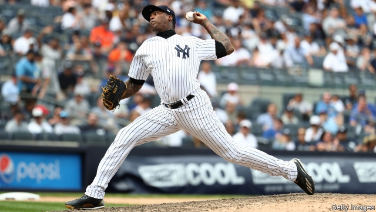

###### Stop taking pitchers

# Donald Trump seeks to hurt Cuba by shutting out its baseball players 

##### It won’t work, but it will annoy baseball fans 

 

> Apr 11th 2019 

AROLDIS CHAPMAN, now a pitcher for the New York Yankees, has hurled the fastest fastball ever thrown in a major-league baseball game. It was a 105.1mph (169kph) scorcher in a game against the San Diego Padres in 2010. Fans call him the “Cuban Missile”. He is one of a score of Cuban-born players in the United States’ top league. Most, including Mr Chapman, defected from the communist island, often in harrowing circumstances. Yasiel Puig, a right-fielder for the Cincinnati Reds, was held hostage by gangsters at a motel in Mexico for months on one of his many attempts to escape Cuba. 

Under an agreement between Major League Baseball (MLB) and the Cuban Baseball Federation reached in December, the exodus of Cuban talent to the United States was to have become less perilous for the players and more profitable for Cuba. MLB teams would have paid the Cuban federation a fee worth 15-20% of the contract. Newly enriched players would board commercial jets to join their new clubs and pay income tax to the Cuban government. 

On April 8th the Trump administration cancelled the deal. Far from keeping aspiring major-leaguers out of the clutches of people-smugglers, the agreement would encourage “human trafficking”, an American official claimed. More plausibly, the administration pointed out that money sent to Cuba would end up in the coffers of its repressive government. 

The tag-out is the latest expression of Mr Trump’s determination to undo the rapprochement with Cuba that his predecessor, Barack Obama, had brought about. The baseball deal would not have been negotiated without it. 

Mr Trump has maintained diplomatic relations. There is currently no US ambassador to Cuba, but that is true of many places under this president. However, he has made it harder for Americans to travel to the island. Last month the administration said it would allow Americans to sue Cubans holding property that had been confiscated by Cuba’s government after the country’s revolution in 1959. This reversed a longstanding policy of suspending that right. Two American senators have introduced a bill to prevent courts from recognising trademarks owned by Cuban confiscators. It is nicknamed the “rum bill”, because it would affect a Cuban-French venture that sells Havana Club rum. 

Like most other measures the United States has adopted to force out Cuba’s communist regime, the baseball ban is likely to prove futile. More than 350 ballplayers have defected from Cuba since 2014. 

-- 

 单词注释:

1.pitcher['pitʃә]:n. 有把的大罐, 瓶状体, 投手, 摊贩 

2.Cuba['kju:bә]:n. 古巴 

3.APR[]:[计] 替换通路再试器 

4.chapman['tʃæpmәn]:n. 流动商贩, 小贩, 叫卖小贩 

5.york[jɔ:k]:n. 约克郡；约克王朝 

6.Yankee['jæŋki]:n. (美国的)新英格兰人, (美国)北方诸州的人, 美国佬 

7.hurl[hә:l]:n. 用力的投掷 vt. 用力投掷, 发射, 愤慨地说出, 丢下 vi. 猛投, 猛掷 

8.fastball['fɑ:stbɔ:l]:n. [棒](投手投出的)快球 

9.scorcher['skɔ:tʃә]:n. 大热天 

10.san[sɑ:n]:abbr. 存储区域网（Storage Area Networking） 

11.diego[]:n. 迭戈（男子名） 

12.padre['pɑ:dri]:n. 神父, 随军牧师 

13.Cuban['kju:bәn]:a. 古巴的, 古巴人的 n. 古巴人 

14.chapman['tʃæpmәn]:n. 流动商贩, 小贩, 叫卖小贩 

15.harrow['hærәu]:n. 哈罗公学, 耙 vt. 耙掘, 伤害, 使苦恼 vi. 被耙松 

16.puig[]: [地名] [西班牙] 普奇 

17.Cincinnati[,sinsi'næti]:n. 辛辛那提 [经] 辛辛纳提 

18.hostage['hɒstidʒ]:n. 人质, 抵押品 [经] 人质, 抵押品 

19.gangster['gæŋstә]:n. 流氓, 歹徒 [法] 暴徒, 恶棍, 打手 

20.mlb[]:abbr. 金属链带（Metallic Link Belt）；航海劳工局（Maritime Labor Board）；美国职棒大联盟（Major League Baseball） 

21.federation[fedә'reiʃәn]:n. 联邦, 联合, 联盟 [法] 联邦, 联盟, 联邦政府 

22.exodus['eksәdәs]:n. 大批的离去 [法] 退出, 大批离去, 成一外出 

23.les[lei]:abbr. 发射脱离系统（Launch Escape System） 

24.perilous['perilәs]:a. 危险的, 濒临毁灭的 

25.federation[fedә'reiʃәn]:n. 联邦, 联合, 联盟 [法] 联邦, 联盟, 联邦政府 

26.enrich[in'ritʃ]:vt. 使富足, 使肥沃 

27.aspire[ә'spaiә]:vi. 渴望, 立志于 

28.clutch[klʌtʃ]:n. 抓紧, 掌握, 离合器, 一窝小鸡 vt. 抓住, 踩汽车离合器踏板 vi. 抓 [计] 联轴器; 离合器 

29.trafficking[ˈtræfikɪŋ]:n. 非法交易 

30.plausibly[ˌplɔ:zəblɪ]:adv. 似真地 

31.coffer['kɒfә]:n. 保险箱, 金库 vt. 把...锁进箱子 

32.repressive[ri'presiv]:a. 压抑的, 抑制的, 镇压的 

33.rapprochement[ræ'prɔʃmә:ŋ]:n. 和解, 恢复邦交, 恢复友好关系, 重归于好 

34.predecessor[.predi'sesә]:n. 前任, 先辈, 前身 [医] 初牙, 前辈, 祖先 

35.barack[bɑ:'ræk]:n. 巴拉克（男子名） 

36.obama[]:n. 奥巴马(姓) 

37.diplomatic[.diplә'mætik]:a. 外交的, 老练的 [法] 外交的, 外交上的, 文献上的 

38.currently['kʌrәntli]:adv. 现在, 当前, 一般, 普通 [计] 当前 

39.sue[su:]:vt. 控告, 起诉, 请求 vi. 提出诉讼, 提出请求 

40.Cuban['kju:bәn]:a. 古巴的, 古巴人的 n. 古巴人 

41.confiscate['kɒnfiskeit]:vt. 没收, 把...充公, 查抄 a. 被没收的 

42.longstanding['lɔŋ'stændiŋ;'lɔ:ŋ-]:a. 长期间的, 长期存在的 

43.senator['senәtә]:n. 参议员, (某些大学的)理事 [法] 参议员, 上议员 

44.trademark['treidmɑ:k]:n. 商标 [法] 商标 

45.confiscators[]:n. 充公，没收 

46.nickname['nikneim]:n. 绰号, 昵称 vt. 给...取绰号, 叫错名字 [计] 绰号 

47.rum[rʌm]:n. 朗姆酒 a. 古怪的, 奇特的 

48.Havana[hә'vænә]:n. 哈瓦那, 哈瓦那雪茄烟 

49.regime[rei'ʒi:m]:n. 政权, 当权期间, 政体, 社会制度, 体制, 情态 [医] 制度, 生活制度 

50.futile['fju:tail]:a. 无用的, 琐细的, 不重要的 

51.ballplayer['bɔ:l,pleiә(r)]:n. 棒球手 

