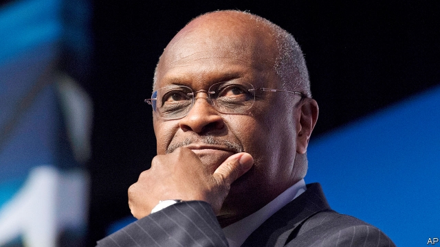

###### Free exchange

# Business this week 

 

> Apr 11th 2019 

Saudi Aramco raised $12bn from its first bond sale on international markets. Five different bonds were reportedly sold in an offer that was heavily oversubscribed, with investors submitting $100bn in orders. Saudi’s state oil firm will put the proceeds towards its $69bn acquisition of the kingdom’s majority stake in SABIC, a chemical company, a deal orchestrated by the government. The bond sale went some way to restoring investors’ confidence in Saudi Arabia following the murder of Jamal Khashoggi, a journalist, and an opaque crackdown on top officials and businessmen. 

America ratcheted up its trade dispute with the European Union, warning that it was preparing a list of tariffs on $11bn-worth of EU goods in retaliation for subsidies given to Airbus, which the World Trade Organisation has ruled are illegal. The WTO is yet to decide on the amount of tariffs that America can impose on the EU in light of that ruling, but Brussels says $11bn is an exaggeration. It is drawing up its own catalogue of American products that it will levy penalties on if Washington goes ahead with its threat. 

Airbus recommended René Obermann to shareholders as its next chairman. Mr Obermann is a non-executive director on the aerospace company’s board and used to run Deutsche Telekom. Guillaume Faury started his job as chief executive at Airbus this week, succeeding Tom Enders. 

Boeing’s share price fell sharply, after it temporarily reduced production of its 737 aircraft by a fifth following two fatal crashes involving the 737 MAX 8. Boeing said it wanted to focus resources on updating the software for the 737 “to prevent accidents like these from ever happening again”. 

The IMF forecast global economic growth of 3.3% this year, down from the 3.7% it had projected back in October. The fund highlighted the risks of a no-deal Brexit, estimating that the resulting border disruption would slice 1.4% off British GDP in the first year and 0.2% from the EU’s. 

Britain’s economy grew by 0.3% in the three months ending February compared with the previous three months. That was a bit faster than markets had expected. Manufacturing output in February grew to its highest level since April 2008, probably because firms were gearing up ahead of the original Brexit deadline of March 29th. 

The threat of protectionism was one factor cited by the European Central Bank as it reiterated its pledge not to raise interest rates in the euro zone until “at least” the end of 2019 and to continue its monetary-stimulus programme. The IMF has downgraded its forecast for growth in the euro zone this year to 1.3%. 

Debenhams, a British department-store chain, entered a bankruptcy plan under which the business was taken over by creditors, wiping out shareholders’ holdings. That includes Sports Direct, which had held a 30% stake. 

Pinterest, one of a number of tech firms launching noteworthy stockmarket flotations this year, provided an initial price range of between $15 and $17 a share for its IPO. That could value the social-media site at somewhere around $11.3bn, less than the $12bn it was reckoned to be worth by investors in 2017. 

Uber also prepared its prospectus, ahead of its long-awaited IPO. The ride-hailing firm will have noted Lyft’s flotation. Two weeks after its market debut, Lyft’s share price fell by almost 11% in a day, to end up 16% below the IPO price of $72. 

In a surprise turn of events, the judge hearing the trial of John Varley, a former chief executive of Barclays, and three other former senior executives at the bank, discharged the jury. The men faced allegations of fraud relating to a deal with Qatari investors to shore up the bank in 2008, which they all deny. 

Standard Chartered agreed to pay more than $1bn to settle allegations with American and British regulators that it violated sanctions on Iran and other countries. It is one of the biggest fines to date levied on a bank for busting sanctions. 

Senior Republicans aired misgivings about Donald Trump’s desire to give Herman Cain a seat on the board of the Federal Reserve. Mr Trump did not formally nominate Mr Cain, a former Republican presidential hopeful and pizza magnate, nor has he officially proposed Stephen Moore, a low-tax crusader. But both potential choices raise questions about whether Mr Trump wants to politicise the Fed. See article. 

Mr Trump, meanwhile, increased the pressure on the Fed to cut interest rates, saying its monetary-tightening policies had “really slowed” American growth. Pursuing a path of easier monetary policy would result in “a rocket ship” economy, said Mr Trump. See article. 

-- 

 单词注释:

1.APR[]:[计] 替换通路再试器 

2.saudi['sajdi]:a. 沙乌地阿拉伯（人或语）的 

3.aramco[]:abbr. 沙特阿美石油公司（Arabian-American Oil Company） 

4.reportedly[ri'pɒ:tidli]:adv. 根据传说, 根据传闻, 据报道 

5.oversubscribe[.әuvәsәb'skraib]:vt. 超额认购(公债等), 过量预订 [经] 超额认购(公债等), 订购(某物)过多 

6.investor[in'vestә]:n. 投资者 [经] 投资者 

7.SABIC[]:[网络] 沙特基础工业公司(Saudi Basic Industries Corporation)；沙特基础工业(Saudi Basic Industries Corp)；沙特阿拉伯 

8.orchestrate['ɒ:kistreit]:v. 编管弦乐曲 

9.Arabia[ә'reibiә]:n. 阿拉伯半岛 

10.Jamal[]:n. 贾马尔（男子名） 

11.khashoggi[]:卡舒吉 

12.opaque[әu'peik]:n. 不透明物 a. 不透明的, 不传热的, 不传导的, 阴暗的 [计] 白底 

13.crackdown['krækdaun]:n. 制裁, 镇压, 痛击 

14.tariff['tærif]:n. 关税, 关税表, 价格表, 收费表 vt. 课以关税 [计] 价目表 

15.EU[]:[化] 富集铀; 浓缩铀 [医] 铕(63号元素) 

16.retaliation[ri.tæli'eiʃәn]:n. 报复 [法] 报仇, 报复, 回敬 

17.airbus['eәbʌs]:空中客车 

18.organisation[,ɔ: ^әnaizeiʃən; - ni'z-]:n. 组织, 团体, 体制, 编制 

19.WTO[]:[计] 给操作员送信息 

20.Brussel[]:n. 布鲁塞尔（比利时首都） 

21.exaggeration[ig.zædʒә'reiʃәn]:n. 夸张, 夸大的事物, 夸大之词 

22.levy['levi]:n. 税款, 所征的人数, 征收 vi. 征税, 课税 vt. 征收, 强求, 召集 

23.penalty['penәlti]:n. 处罚, 刑罚, 罚款, 罚球, 报应, 不利结果, 妨碍 [经] 罚金(款), 违约金 

24.Washington['wɒʃiŋtn]:n. 华盛顿 

25.René[]:[地名] 勒内 ( 海 ) 

26.obermann[]:[网络] 奥柏曼 

27.shareholder['ʃєә.hәuldә]:n. 股东 [法] 股东, 股票持有人 

28.aerospace['єәrәuspeis]:n. 航天空间, 航天技术 

29.deutsche[]:n. 德意志联邦共和国马克 

30.telekom[]:[网络] 电讯；电信公司；德国电信车队 

31.Guillaume[,^i:'jәum]:纪尧姆(①姓氏 ②Charles Edouard, 1861-1938, 生于瑞士的法国物理学家, 曾获1920年诺贝尔物理学奖) 

32.tom[tɒm]:n. 雄性动物, 雄猫 

33.ender[]:n. 安德（游戏中的人物名）；恩德（男子名） 

34.temporarily['tempәrәrәli]:adv. 暂时, 一时, 临时 

35.MAX[mæks]:[计] 最大 

36.boe[bəu]:abbr. back outlet eccentric 后偏心（轮）出口 

37.update[ʌp'deit]:vt. 更新, 使现代化 n. 更新 [计] 更新 

38.IMF[]:国际货币基金组织 [经] 国际货币基金 

39.Brexit[]:[网络] 英国退出欧盟 

40.disruption[dis'rʌpʃәn]:n. 分裂, 崩溃, 瓦解 

41.manufacturing[.mænju'fæktʃәriŋ]:n. 制造业 a. 制造业的 

42.protectionism[prә'tekʃәnizm]:n. 贸易保护主义, 贸易保护制 [经] 保护(贸易)主义, 保护(贸易)制 

43.cite[sait]:vt. 引用, 引证, 表彰 [建] 引证, 指引 

44.reiterate[ri:'itәreit]:vt. 反复地说, 重申, 反复地做 [法] 重述, 重申, 反覆地做 

45.pledge[pledʒ]:n. 诺言, 保证, 誓言, 抵押, 信物, 保人, 祝愿 vt. 许诺, 保证, 使发誓, 抵押, 典当, 举杯祝...健康 

46.euro['juәrәu]:n. 欧元（欧盟的统一货币单位） 

47.downgrade['dajn^reid]:vt. 降低, 贬低 n. 下坡 a. 下坡 adv. 下坡 

48.Debenhams[]:[网络] 德本汉姆；德本罕百货公司；德本汉姆商场 

49.bankruptcy['bæŋkrәptsi]:n. 破产者 [经] 破产, 倒闭 

50.creditor['kreditә]:n. 债权人 [法] 债权人, 债主, 贷方 

51.holding['hәuldiŋ]:n. 把持, 支持, 保持 [法] 租借地, 占有物, 拥有的财产 

52.Pinterest[]:[网络] 品趣志；兴趣钉板；图片分享社交应用 

53.tech[tek]:n. 技术学院或学校 

54.noteworthy['nәutwә:ði]:a. 值得注目的, 显著的 

55.stockmarket[s'tɒkmɑ:kɪt]: 证券市场; 证券交易所; 证券行情 

56.flotation[flәu'teiʃәn]:[化] 浮; 浮游选矿 [医] 浮集(法), 浮选(法) 

57.ipo[]:abbr. 首次公开募股（Initial Public Offerings）；初次公开发行（Initial Public Offering） 

58.les[lei]:abbr. 发射脱离系统（Launch Escape System） 

59.reckon['rekәn]:vt. 计算, 总计, 估计, 认为, 猜想 vi. 数, 计算, 估计, 依赖, 料想 

60.uber['ju:bә]:[医] 乳房 

61.prospectus[prәs'pektәs]:n. 创办计划书, (内容)说明书, 内容简介 [经] (募债)说明书 

62.debut['deibju:]:n. 初次登台, 开张 v. 初次登台 

63.john[dʒɔn]:n. 盥洗室, 厕所, 嫖客 

64.Varley['vɑ:li]:loop[电]华莱回路(一种用电桥比较电阻和测定故障位置的装置) 

65.barclay['bɑ:kli]:n. 巴克利（姓氏, 男子名） 

66.allegation[.æli'geiʃәn]:n. 断言, 主张, 申辩 [法] 声明, 事实陈述, 断言 

67.fraud[frɒ:d]:n. 欺骗, 欺诈, 诡计, 骗子 [经] 欺诈, 舞弊, 骗子 

68.Qatari['kɑ:təri]:n. 卡塔尔人 a. 卡塔尔的 

69.charter['tʃɑ:tә]:n. 特许状, 执照, 宪章 vt. 特许, 发给特许执照 

70.regulator['regjuleitә]:n. 调整者, 校准者, 校准器, 调整器, 标准钟 [化] 调节剂; 调节器 

71.sanction['sæŋkʃәn]:n. 核准, 制裁, 处罚, 约束力 vt. 制定制裁规则, 认可, 核准, 同意 

72.Iran[i'rɑ:n]:n. 伊朗 

73.bust[bʌst]:n. 半身像, 胸部, 失败, 殴打 vt. 使爆裂, 使破产 vi. 爆裂, 破产 [计] 操作错 

74.misgiving[mis'^iviŋ]:n. 疑虑, 不安, 害怕, 担扰, 疑惧 

75.herman['hә:mәn]:n. 赫尔曼（男子名） 

76.cain[kein]:n. 凶手；杀兄弟者；该隐（亚当之子） 

77.formally['fɒ:mәli]:adv. 正式地, 形式上 

78.nominate['nɒmineit]:vt. 提名, 任命, 命名 [法] 提名...为候选人, 指定, 推荐 

79.presidential[.prezi'denʃәl]:a. 总统制的, 总统的, 首长的, 统辖的 [法] 总统的, 议长的, 总经理的 

80.pizza['pi:tsә]:n. 比萨饼 

81.magnate['mægneit]:n. 大官, 巨头 [法] 大官, 权贵, 大资本家 

82.officially[ә'fiʃәli]:adv. 作为公务员, 职务上, 官方地 

83.stephen['sti:vn]:n. 斯蒂芬（男子名） 

84.moore['muә]:n. 摩尔（男子名） 

85.crusader[kru:'seidә]:n. 十字军战士, 改革者 

86.politicise[pɒ'lɪtɪsaɪs]:vt. 使政治化, 使具有政治性; 使对政治有兴趣 

87.monetary['mʌnitәri]:a. 货币的, 金钱的 [经] 货币的, 金融的 

