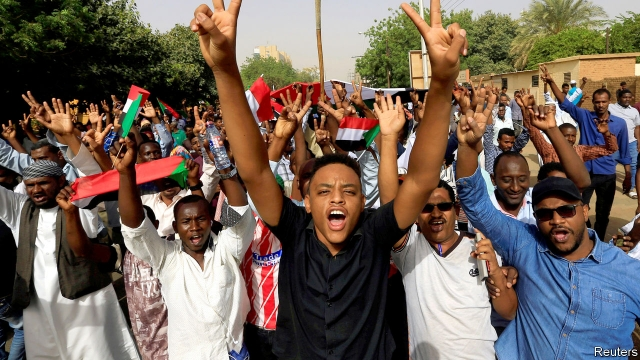
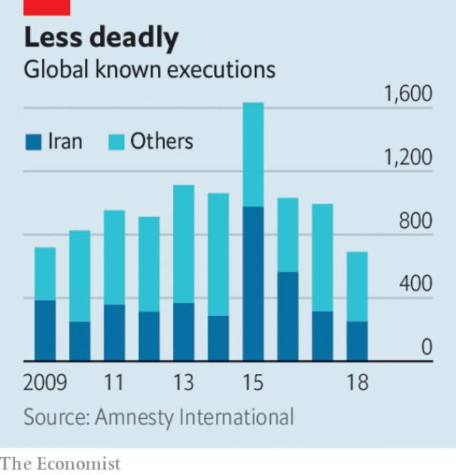

###### Free exchange

# Politics this week 

 

> Apr 11th 2019 

Following months of mass protests in Sudan, it appeared that Omar al-Bashir had been ousted as president by the army. Mr al-Bashir had misruled since taking power in a coup in 1989. His civil war against non-Muslim black Africans ended with the secession of South Sudan. Separately, the International Criminal Court charged him with overseeing genocide in Darfur. See article.  

Binyamin Netanyahu won a record fifth term as prime minister of Israel. His Likud party tied with Blue and White, a centrist rival. But the right-wing and religious bloc, of which Likud is a part, won a majority of seats in the Knesset. In the final days of the campaign Mr Netanyahu vowed to begin annexing parts of the West Bank, further dimming the prospect of any peace with the Palestinians based on a two-state solution. See here and here.  

Khalifa Haftar, Libya’s most powerful warlord, attacked Tripoli, which is controlled by the UN-backed government. Dozens of people were killed in the fighting, as militias allied to the government rallied to defend the capital. A UN peace conference, scheduled for this month, was postponed. See article.  

Protests continued in Algeria, where crowds called for the resignation of Abdelkader Bensalah, the interim president. Mr Bensalah succeeded Abdelaziz Bouteflika, who resigned amid widespread anger at his regime after 20 years in charge. For the first time police used tear-gas to disperse the demonstrators. Mr Bensalah said the country would hold a presidential election on July 4th. 

Theresa May, Britain’s prime minister, attended a summit in Brussels to discuss another delay to Brexit. The European Union offered Britain six more months, pushing the deadline to October 31st, Halloween. That means Britain faces having to vote in elections to the European Parliament next month, though British MEPs will have to step down if Brexit actually happens. The president of the European Commission, Jean-Claude Juncker, joked that if there was another late-night meeting on the last day of the talks he might have to leave at midnight; his term ends on November 1st. See article.  

Julian Assange, a founder of WikiLeaks, was arrested by British police in the Ecuadorean embassy in London. Ecuador had granted Mr Assange refuge in 2012 after he had jumped bail while facing rape allegations. His relationship with his hosts soured after a change of government in Ecuador, where a leftist president was replaced by a more moderate one. Mr Assange has said he fears extradition to the United States, where WikiLeaks is not popular, having published reams of leaked American military secrets. 

Turkey’s ruling party demanded a fresh vote in Istanbul, where it narrowly lost the mayoralty in elections on March 31st. 

Italy’s deputy prime minister, Matteo Salvini, announced the formation of a new nationalist group within the European Parliament, to be called the European Alliance for People and Nations. However, none of the party leaders he hoped would attend from other countries turned up. 

The Trump administration cancelled a four-month-old agreement under which Cuban baseball players could join Major League teams in America without defecting from their country. The administration said the agreement would encourage human trafficking and help enrich Cuba’s communist government. See article.  

Jair Bolsonaro, Brazil’s president, sacked the education minister, Ricardo Vélez, who shared his socially conservative views. Mr Vélez had courted controversy by instructing schools to film classes singing the national anthem and repeating Mr Bolsonaro’s campaign slogan. His replacement, Abraham Weintraub, an economist, has said that crack cocaine was introduced to Brazil deliberately by the left. See here.  

Thanathorn Juangroongruangkit, the leader of the Future Forward party, was charged with sedition in relation to a protest against Thailand’s military junta in 2015. It is one of several repressive steps that has marred the country’s supposed return to democracy after an election last month. See article.  

Kassym Jomart Tokayev, Kazakhstan’s interim president following the sudden resignation of Nursultan Nazarbayev after three decades in power, called a snap election for June 9th. See article.  

South Korea’s constitutional court ruled that the government must end the country’s ban on abortion, in place since 1953, before the end of 2020. Doctors can currently be imprisoned if they perform the procedure. However, tens of thousands of abortions are carried out each year. 

Voting began in India’s seven-stage election. The final phase will take place on May 19th and the results for all seven stages will be announced on May 23rd. Polls suggest the ruling Bharatiya Janata Party will remain the biggest party. See article.  

A court in Hong Kong found nine people guilty of “public nuisance” charges relating to their leading roles in the Umbrella Movement of 2014, which involved weeks of sit-ins and demonstrations in busy commercial districts in support of democratic reform. Among the defendants were three founders of a group involved in the unrest.  

Kirstjen Nielsen resigned as the secretary of America’s Department of Homeland Security. Donald Trump is trying to replace the department’s top officials with people who will try harder to keep Mexicans out of the United States. Mr Trump has threatened to close the border entirely, despite advice that this would cause economic chaos. See article.  

Randolph Alles, the head of America’s Secret Service, is quitting. He had reportedly been asked to go before the recent security breach at Mr Trump’s private club, involving a Chinese woman with several thumb drives. 

 

Amnesty International’s annual report on the death penalty recorded a drop of nearly a third in known executions worldwide last year. There were 690 in 2018, down from 1,061 in 2015. The number of death sentences passed by courts also declined slightly, though in the Middle East and north Africa death sentences nearly doubled to 1,170. The region is responsible for two-thirds of the world’s known executions. (China is also thought to execute thousands of people every year, but keeps its figures secret.) Of the countries that release figures, Iran is by far the most avid executioner, putting 409 people to death each year on average for the past decade. 

-- 

 单词注释:

1.politic['pɒlitik]:a. 精明的, 明智的, 策略的 

2.APR[]:[计] 替换通路再试器 

3.Sudan[su:'dæn]:n. 苏丹 [化] 苯偶氮间苯二酚; 苏丹 

4.omar['әjmɑ:(r)]:n. 奥马尔（男子名） 

5.oust[aust]:vt. 逐出, 罢黜, 剥夺, 驱逐 [法] 驱逐, 剥夺, 免职 

6.misrule[mis'ru:l]:vt. 施暴政 n. 暴政 

7.coup['ku:]:n. 砰然的一击, 妙计, 出乎意料的行动, 政变 [医] 发作, 中, 击 

8.secession[si'seʃәn]:n. 脱离, 分离 

9.oversee[.әuvә'si:]:vt. 向下看, 了望, 监督, 偷看到 [法] 监察, 监督, 俯瞰 

10.genocide['dʒenәu,said]:n. 种族灭绝, 灭绝整个种族的大屠杀 [医] 种族灭绝(侵略军队加害居民的罪行) 

11.darfur[dɑ:'fuə]:n. 达尔富尔（苏丹地名） 

12.binyamin[]:本雅明 

13.Netanyahu[]:n. 内塔尼亚胡（人名） 

14.Israel['izreil]:n. 以色列, 以色列后裔, 犹太人 

15.Likud[li:'ku:d]:n. 利库德集团(以色列右翼党派的政治联盟,长期为以色列执政党) 

16.centrist['sentrist]:n. 中间党派的成员, 温和主义者 [法] 中间派议员, 中立派议员 

17.bloc[blɒk]:n. 集团 

18.Knesset['kneset]:n. (以色列)议会 

19.vow[vau]:n. 誓约, 誓言, 许愿 vi. 起誓, 发誓, 郑重宣言 vt. 立誓, 起誓要, 郑重地宣布 

20.annex[ә'neks]:n. 附加物, 附属建筑物 vt. 附加, 盖(印), 并吞 

21.Palestinian[,pælis'tiniәn]:[经] 巴勒斯坦的 

22.khalifa[kɑ:'li:fә]:n. (=caliph)哈里发(伊斯兰教国家政教领袖的尊称) 

23.warlord['wɒ:lɒ:d]:n. 军阀, 军阀式领袖 

24.tripoli['tripәli]:n. 硅藻土 [医] 硅藻岩 

25.militia[mi'liʃә]:n. 义勇军, 民兵组织, 国民军 

26.ally['ælai. ә'lai]:n. 同盟者, 同盟国, 助手 vt. 使联盟, 使联合, 使有关系 vi. 结盟 

27.rally['ræli]:n. 重振旗鼓, 集合, 群众集会, 跌停回升 v. 重整旗鼓, 集合, 恢复精神, 团结, 挖苦, 嘲笑 

28.UN[ʌn]:pron. 家伙, 东西 [经] 联合国 

29.Algeria[æl'dʒiәriә]:n. 阿尔及利亚 

30.Abdelkader[]:n. (Abdelkader)人名；(阿拉伯)阿朴杜勒-卡德尔；(1808-83)阿卜杜卡迪尔〈阿尔及〉军事家。 

31.interim['intәrim]:a. 暂时的, 临时的, 间歇的 n. 过渡时期 

32.abdelaziz[]:n. (Abdelaziz)人名；(阿拉伯)阿卜杜勒-阿齐兹 

33.bouteflika[]:[网络] 布特弗利卡；阿尔及利亚总统布特弗利卡；布特佛里卡 

34.amid[ә'mid]:prep. 在其间, 在其中 [经] 在...中 

35.regime[rei'ʒi:m]:n. 政权, 当权期间, 政体, 社会制度, 体制, 情态 [医] 制度, 生活制度 

36.disperse[dis'pә:s]:vt. 分散, 传播, 散开 vi. 分散 a. 分散的 [计] 分散 

37.demonstrator['demәnstreitә]:n. 论证者, 证明者, 指示者, 示威者 [医] 示教者 

38.presidential[.prezi'denʃәl]:a. 总统制的, 总统的, 首长的, 统辖的 [法] 总统的, 议长的, 总经理的 

39.theresa[ti'ri:zә]:n. 特丽萨（女子名） 

40.Brussel[]:n. 布鲁塞尔（比利时首都） 

41.Brexit[]:[网络] 英国退出欧盟 

42.Halloween[.hælәu'i:n]:n. (基督教)万圣节前夕 

43.MEP[]:[化] 最低能量途径 

44.juncker[]:[网络] 容克；欧元集团现任主席容克；欧元区主席容克 

45.Julian['dʒu:ljәn]:a. 尤利乌斯恺撒的 

46.Assange[]:[网络] 阿桑奇；阿桑奇先生；维基解密创办人阿尚吉 

47.founder['faundә]:n. 创立者, 建立者 vt. 使沉没, 使摔倒, 弄跛, 浸水, 破坏 vi. 沉没, 摔到, 变跛, 倒塌, 失败 

48.wikileaks[]: 维基解密 

49.Ecuadorean[]:厄瓜多尔人 厄瓜多尔的 厄瓜多尔人的 

50.Ecuador['ekwәdɒ:]:n. 厄瓜多尔 

51.bail[beil]:n. 保释, 拎环, 杓, 栅栏 vt. 保释, 舀水 

52.rape[reip]:n. 抢夺, 掠夺, 强奸, 葡萄渣, 芸苔 vt. 掠夺, 抢夺, 强奸 

53.allegation[.æli'geiʃәn]:n. 断言, 主张, 申辩 [法] 声明, 事实陈述, 断言 

54.leftist['leftist]:n. 左翼的人, 左派 a. 左派的 

55.extradition[.ekstrә'diʃәn]:n. 引渡逃犯, 亡命者送还本国 [法] 引渡 

56.ream[ri:m]:n. 令, 大量 vt. 扩(孔), 榨取, 挖 

57.Istanbul[.istæn'bu:l]:n. 伊斯坦布尔 

58.narrowly['nærәuli]:adv. 狭窄地, 严密地, 仔细地, 几乎不, 勉强地, 仅仅 

59.mayoralty['mєәrәlti]:n. 市长职位 [法] 市长职位, 市长任期 

60.matteo[]:马泰奥（人名） 

61.salvini[]:[网络] 索氏丽体鱼；萨尔维尼 

62.nationalist['næʃәnәlist]:n. 国家主义者, 民族主义者 

63.alliance[ә'laiәns]:n. 联盟, 联合 [法] 同盟, 联盟, 联姻 

64.Cuban['kju:bәn]:a. 古巴的, 古巴人的 n. 古巴人 

65.trafficking[ˈtræfikɪŋ]:n. 非法交易 

66.enrich[in'ritʃ]:vt. 使富足, 使肥沃 

67.jair[]:[网络] 睚珥；贾伊尔；睢珥 

68.Ricardo[ri'kɑ:dәu]:里卡多(姓氏) 

69.Vélez[]:[地名] 贝莱斯 ( 哥伦 ) 

70.socially['sәuʃәli]:adv. 在社会上, 在社交上, 以社会生活方式 

71.controversy['kɒntrәvә:si]:n. 论争, 辩论, 论战, 争论 [法] 论战, 争论, 争吵 

72.anthem['ænθәm]:n. 圣歌, 赞美诗 

73.replacement[ri'pleismәnt]:n. 归还, 更换, 代替者 [医] 复位, 置换 

74.abraham['eibrәhæm, -hәm]:n. 亚伯拉罕（男子名） 

75.weintraub[]: [人名] 温特劳布 

76.economist[i:'kɒnәmist]:n. 经济学者, 经济家 [经] 经济学家 

77.cocaine[kә'kein]:n. 可卡因, 古柯碱 [化] 可卡因; 古柯碱 

78.Brazil[brә'zil]:n. 巴西 

79.sedition[si'diʃәn]:n. 煽动骚乱, 暴动, 妨害治安, 骚动 [法] 煽动, 煽动叛逆罪, 暴动 

80.junta['dʒʌntә]:n. 以武力政变上台的(军)政府, 私党, 阴谋小集团, 政务会 

81.repressive[ri'presiv]:a. 压抑的, 抑制的, 镇压的 

82.mar[mɑ:]:vt. 损毁, 损伤, 糟蹋 n. 三月 

83.nursultan[]:[网络] 努苏坦 

84.nazarbayev[]:[网络] 纳扎尔巴耶夫；总统纳扎尔巴耶夫；哈萨克的纳扎尔巴耶夫 

85.constitutional[.kɒnsti'tju:ʃәnl]:a. 宪法的, 立宪的, 体质的 [医] 全身的; 体质的 

86.currently['kʌrәntli]:adv. 现在, 当前, 一般, 普通 [计] 当前 

87.tens[]:十位 

88.Bharatiya[]:[网络] 巴拉蒂亚 

89.Janata['dʒʌnətɑ:]:n. （印度）人民团体；人民党（印度联合政党） 

90.hong[hɔŋ]:n. （中国、日本的）行, 商行 

91.kong[kɔŋ]:n. 含锡砾石下的无矿基岩；钢 

92.demonstration[.demәn'streiʃәn]:n. 示范, 实证 [医] 示教, 实物教授 

93.defendant[di'fendәnt]:n. 被告 [经] 被告方 

94.nielsen[]:n. 尼耳森（人名） 

95.entirely[in'taiәli]:adv. 完全, 全然, 一概 

96.chao[]:n. 钞（货币） 

97.randolph['rændɔlf]:n. 伦道夫（男子名） 

98.alle[]:n. 政府彩票组织国际协会；阿莱（电影名称） 

99.reportedly[ri'pɒ:tidli]:adv. 根据传说, 根据传闻, 据报道 

100.breach[bri:tʃ]:n. 裂口, 违背, 破坏, 违反, 突破, 破裂 vt. 攻破, 突破 vi. 跳出水面 

101.amnesty['æmnisti]:n. 大赦, 赦免 

102.penalty['penәlti]:n. 处罚, 刑罚, 罚款, 罚球, 报应, 不利结果, 妨碍 [经] 罚金(款), 违约金 

103.execution[.eksi'kju:ʃәn]:n. 实行, 完成, 执行, 死刑 [计] 执行 

104.Iran[i'rɑ:n]:n. 伊朗 

105.avid['ævid]:a. 渴望的, 急切的, 劲头十足的 

106.executioner[.eksi'kju:ʃәnә]:n. 刽子手 [法] 死刑执行人, 刽子手, 行刑者 

