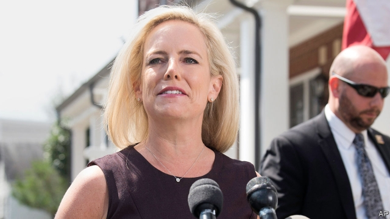

###### Chaos at the DHS

# Donald Trump does away with another member of his cabinet 

##### The president will struggle to get what he wants at the border 

 

> Apr 11th 2019 

“SECRETARY OF HOMELAND SECURITY Kirstjen Nielsen will be leaving her position, and I would like to thank her for her service,” tweeted Donald Trump on the afternoon of April 7th. Ms Nielsen stepped down on April 10th, but she had been twisting in the wind for months. Though she had publicly defended Mr Trump’s immigration policies, the president thought her weak. Her departure seems to presage a harsher turn on immigration from a president who considers the issue central to his re-election strategy. 

Few on the left will sympathise with Ms Nielsen. She was one of the faces of the Trump administration’s “zero tolerance” policy, under which anyone who crossed America’s border illegally was referred to the Justice Department for prosecution. That resulted in the separation of thousands of children from their parents. Identifying all the families thus sundered, said the government in a court document filed last week, could take up to two years. She also defended two policies halted, to Mr Trump’s fury, by federal courts: one that would have prevented anyone who crossed the border illegally from claiming asylum, and another that would force asylum seekers to wait in Mexico rather than America while their claims were evaluated. 

She reportedly almost resigned last year, after Mr Trump publicly berated her for failing to stop illegal immigration. Then she improved her standing with the president last autumn after the Border Patrol fired tear-gas into Mexico at unarmed protesters. But the president had grown increasingly agitated in recent months as the number of border apprehensions rose (though they remain far below their levels of a decade ago). 

The administration’s decision last week to withdraw the nomination of Ronald Vitiello to lead the Border Patrol, which Ms Nielsen had backed, suggested the writing was on the wall. Mr Trump said he wanted to “go in a tougher direction”. After returning from a visit to the southern border last weekend, he demanded and received Ms Nielsen’s resignation. Her departing letter sounded a Trumpian tone, blaming “Congress and the courts” for not “fixing the laws which have impeded our ability to fully secure America’s borders and which have contributed to discord in our nation’s discourse.” 

Her departure—and that on April 9th of Claire Grady, the acting deputy secretary—leaves Mr Trump’s chosen successor, Kevin McAleenan, as acting homeland-security secretary. He thus becomes the sixth current interim holder of a cabinet-level position. How long he will last is unclear, as is the full scope of his power. On April 10th Mr Trump announced that “there’s only one person running [immigration policy]. You know who that is? It’s me.” 

The problem is that Mr Trump seems to want to do things that American law does not allow—and among the things that reportedly soured him on Ms Nielsen were her reminders that legal constraints existed. The New York Times reported that he demanded that Ms Nielsen should stop migrants from claiming asylum, which is both illegal and impossible. 

Shortly before his most recent visit to the border, the president said America needs to “get rid of the whole asylum system” and “get rid of judges”. He reportedly told border policemen to break the law and deny asylum-seekers entry to America. “Our country is full,” Mr Trump declared on April 5th at the Mexican border. “We can’t take you any more…so turn around, that’s the way it is.” 

More departures from Homeland Security may soon follow, including the department’s general counsel and the head of Citizenship and Immigration Services. On April 8th Mr Trump also announced that Randolph Alles would step down as head of the Secret Service, though that may be connected to an embarrassing security breach at Mar-a-Lago, his Florida country club. 

Stopping the tide of migrants completely is beyond the power of any homeland-security secretary. But it is not beyond their power to try—or at least to appear on television to be trying, and then blame Democrats and feckless judges for any failures. The president seems to like that sort of performance more than any realistic policy. Throughout his time in office, Mr Trump has preferred fighting public battles on immigration and much else to the unglamorous work of compromise and governance. 

As next year’s election approaches, that attitude may become even more apparent. Immigration policy offers the sharpest possible contrast between Mr Trump and most Democrats. That helped put him in office two years ago. Ms Nielsen’s departure, and the “tougher direction” he claims to want, suggest that he is gearing up to fight the same battle again. 

-- 

 单词注释:

1.chao[]:n. 钞（货币） 

2.dhs[]:数据处理系数（Data Handing System）；癸二酸二己酯 

3.APR[]:[计] 替换通路再试器 

4.nielsen[]:n. 尼耳森（人名） 

5.tweet[twi:t]:vi. 啁啾 n. 小鸟叫声 

6.presage['presidʒ]:n. 预感, 预兆, 预知 vt. 预示, 预言 vi. 预感, 预言 

7.sympathise['simpәθaiz]:vi. 同情, 表示同情, 同感, 一致, 共鸣, 同意, 赞同, 赞成, 吊唁, 吊慰 

8.illegally[]:[法] 非法地, 不合法地, 违法地 

9.prosecution[.prɒsi'kju:ʃәn]:n. 执行, 经营, 起诉 

10.sunder['sʌndә]:v. 切开, 分离 

11.fury['fjuri]:n. 愤怒, 狂暴, 狂怒的人 [医] 狂乱, 狂暴, 狂怒 

12.asylum[ә'sailәm]:n. 庇护, 收容所 [医] 养育院 

13.seeker['si:kә]:n. 搜索者, 探求者 [法] 搜索人, 搜查人 

14.reportedly[ri'pɒ:tidli]:adv. 根据传说, 根据传闻, 据报道 

15.berate[bi'reit]:vt. 严责 

16.patrol[pә'trәul]:n. 巡逻, 巡逻员, 侦察队 v. 巡逻, 巡视 

17.unarm[.ʌn'ɑ:m]:vt. 缴械 vi. 放下武器 

18.protester[]:n. 抗议者, 持异议者, 拒付者 [经] 反对者 

19.agitate['ædʒiteit]:vt. 使摇动, 搅动, 使激动, 使不安 vi. 鼓动, 煽动 

20.apprehension[.æpri'henʃәn]:n. 理解, 忧惧, 逮捕 [医] 领会 

21.nomination[.nɒmi'neiʃәn]:n. 提名, 任命, 提名权 

22.ronald['rɔnәld]:n. 罗纳德（男子名） 

23.vitiello[]:[网络] 维迪耶罗；维蒂洛；维蒂埃洛 

24.Trumpian[]:特朗普的 

25.impede[im'pi:d]:vt. 妨碍, 阻碍, 阻止 

26.fully['fuli]:adv. 十分地, 完全地, 充分地 

27.discord['diskɒ:d]:n. 不调和, 不和 vi. 不一致, (声音)刺耳 

28.discourse['diskɒ:s]:n. 谈话, 演讲 vi. 谈话, 讲述 

29.claire[kleә]:n. 克莱儿（女子名） 

30.grady[]:n. 格雷迪（男子名） 

31.successor[sәk'sesә]:n. 继承者, 接任者 [计] 后继 

32.kevin['kenin]:n. 凯文（男子名） 

33.interim['intәrim]:a. 暂时的, 临时的, 间歇的 n. 过渡时期 

34.holder['hәuldә]:n. 持有人, 所有人, 支持物 [化] 夹持器; 夹具; 贮罐 

35.unclear[.ʌn'kliә]:a. 不易了解的, 不清楚的, 含混的 

36.reminder[ri'maindә]:n. 提醒的人, 暗示 [经] 催单 

37.constraint[kәn'streint]:n. 强制, 约束 [计] 约束 

38.york[jɔ:k]:n. 约克郡；约克王朝 

39.migrant['maigrәnt]:n. 候鸟, 移居者 [法] 移居者 

40.counsel['kaunsәl]:n. 商议, 忠告, 法律顾问 v. 商议, 劝告 

41.citizenship['sitizәnʃip]:n. 国籍, 市民权, 市民的身份 [法] 公民权, 公民资格, 公民身分 

42.randolph['rændɔlf]:n. 伦道夫（男子名） 

43.alle[]:n. 政府彩票组织国际协会；阿莱（电影名称） 

44.breach[bri:tʃ]:n. 裂口, 违背, 破坏, 违反, 突破, 破裂 vt. 攻破, 突破 vi. 跳出水面 

45.Florida['flɒridә]:n. 佛罗里达州 

46.democrat['demәkræt]:n. 民主人士, 民主主义者, 民主党党员 [经] 民主党 

47.feckless['feklis]:a. 无效的, 无能的, 不负责任的 

48.realistic[riә'listik]:a. 现实的, 逼真的, 现实主义的, 实在论的 

49.unglamorous[,ʌn'^læmәrәs]:a. 没有魅力的,无浪漫色彩的,乏味的,单调的 

50.governance['gʌvәnәns]:n. 统治, 统辖, 管理 [法] 统治, 管理, 支配 

51.Sharpe['ʃa:p]:n. 夏普指数；夏普指标；夏普（人名） 

