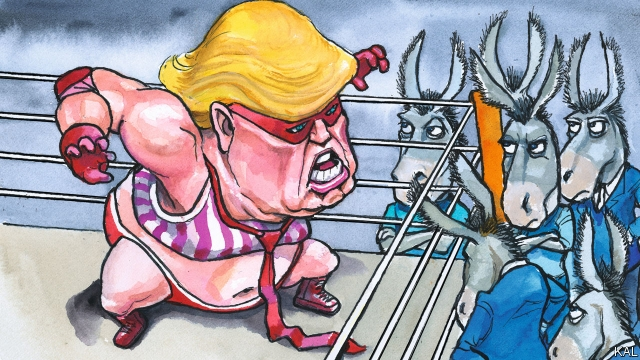

###### Lexington

# Donald Trump is a pro wrestler masquerading as commander-in-chief 

##### What WrestleMania says about the president and American voters 

 

> Apr 13th 2019 

THE FIRST time Lexington thought of Donald Trump at WrestleMania this week was when, to the fading strains of “America the Beautiful”, a helicopter flyover churned the night sky over the MetLife Stadium in New Jersey. Was the president about to make a surprise reappearance at the annual WWE sports-entertainment extravaganza to which he owes so much of his political method? The second time, well into the seven-hour grapplefest, was as the veteran star-wrestler “Triple H” was ripping out his grudge-rival’s nose-rings with a pair of pliers. 

That was not only a reflection on how Mr Trump treats his cabinet. Paul Levesque, as Triple H was originally known, these days spends most of his time as a senior executive in the billion-dollar WWE business, having married into the McMahon clan that owns it. In reality-bending WWE style, he first married and divorced Stephanie McMahon, daughter of WWE founder Vince, fictitiously. This was part of a story-line in which she and her brother Shane, both WWE executives who appear in WWE productions as villainous executives and wrestlers, tried to steal their parents’ business. Triple H then actually married and had three children with her. 

Those developments are now part of his wrestling character. As Triple H was mock-torturing his rival Batista this week, a WWE commentator—broadcasting live to 180 countries and one of America’s biggest television audiences—said mock-fearfully: “That’s my boss…” This disorienting mix of business, dynasty and entertainment—scrambling performance and reality, ham interests and financial ones—is the defining characteristic of professional wrestling and of its chief emulator, the president. 

Mr Trump is another sometime WWE performer with close ties to the McMahons. A longtime fixture at WrestleMania, he launched a semi-scripted assault on Vince McMahon at the 2007 version. Having been inducted into the WWE Hall of Fame, he returned the favour by appointing Vince’s wife Linda to his cabinet, as head of the Small Business Administration. She will soon leave it to run a pro-Trump Super PAC. Yet such personal links do not begin to do justice to Mr Trump’s stylistic debt to spoof wrestling. 

To appreciate that, consider why it has proved so alluring. It is not because fans think the fights are real, exactly. Testifying before the New Jersey Senate in 1989—when the McMahons were trying to evade regulations on competitive sport—Mrs McMahon admitted they were fake. After this unprecedented flouting of “kayfabe”, as wrestlers call their scripted reality, some said the industry was finished. That it has instead grown hugely is chiefly owing to the power of escapism. The 80,000 WWE fans at the MetLife, typically young men with defiant slogans such as “I’m not dead yet muthafucker!” on their T-shirts, are the heroes of their own imaginations. Many carried chunky replicas of WWE (fake) championship belts. “It’s like Santa Claus, not real, but that’s not the point,” said Jason, a banker from Manhattan with a $300 belt over his shoulder. 

WWE has also found new ways, in its scripting and use of digital media, to buttress the fantasy. Most important, it constantly shifts between different registers of make-believe, from real to credible to absurd. Thus, for example, its use of executives as characters. Similarly, its stars appear in and out of character on social media. In a pre-WrestleMania rant Ronda Rousey, a former mixed martial arts champion, slammed WWE as “not real” and vowed henceforth to do “whatever the hell I want”. Such tricks create sufficient doubt about what is real for WWE fans to keep living their dream. 

A blurring of the age-old distinction between “faces and heels” also supports this shift towards realism: Triple H, once a heel, is now considered a good guy. So does the frenetic way WWE scriptwriters distract their audience with new talking-points: while it was legal for Triple H to take a sledge hammer to Batista, did it make sense, given his (actual) torn pectoral muscle, tactically? 

Mr Trump’s success lies in applying WWE principles where the line between performance and reality is even finer. In “The Apprentice” he played a successful businessman. In politics he saw that the contest of ideas its participants claimed to be engaged in was really a partisan slugfest almost as contrived and absurd as the WWE. He therefore offered a more ghoulishly watchable version of what voters were already getting. Why choose Jeb Bush trying to be a pantomime bad-ass when you could have the real thing? 

The president also employs the WWE’s new stagecraft. Mixing family, business and politics infuriates sticklers for the law, but makes his fans think he is somehow more real—or “authentic”—than his rivals. He is also a master of shifting between degrees of make-believe. “I’m not supposed to say this,” he interjects into his speeches, “but what the hell?” And then there are his constantly distracting micro-dramas, breathlessly echoed by a commentariat every bit as emotionally invested in the drama as the press gallery at WrestleMania, which often erupted into spontaneous gasps or applause. How much of Mr Trump’s behaviour is concocted is debatable; private Trump is also pretty pantomime. But that uncertainly merely adds, WWE style, to the reality-tumbling effect. 

Mr Trump’s ham performance has been endangered by its own success—represented by two years of unified Republican government. A WWE performer without an adversary would be a pitiful spectacle. It is therefore testament to the president’s genius that he was able to fill the void, not with policies, obviously, but rather a parade of new enemies: immigrant children, black football players, the late John McCain. Yet with the Democrats soon to choose a new champion, his performance may be about to get easier. 

His opponents should be advised by this. The WWE’s popularity suggests their main hope, that voters will tire of Mr Trump’s grim clowning, may be wishful. More specifically, they should recognise that no professional politician can beat him in a grudge match. They would do better, where possible, to ignore him. 

-- 

 单词注释:

1.lexington['leksiŋtәn]:n. 列克星敦市（位于美国肯塔基州） 

2.pro[prәu]:adv. 正面地 [计] 可编程远程操作 

3.wrestler['reslә]:n. 摔跤选手 

4.masquerade[.mɑ:skә'reid]:n. 化装舞会, 伪装 vi. 参加化装舞会, 伪装, 假装 

5.wrestlemania[]: 摔角狂热 

6.voter['vәutә]:n. 选民, 投票人 [法] 选民, 选举人, 投票人 

7.APR[]:[计] 替换通路再试器 

8.flyover['flaiәjvә(r)]:n. 立交桥, 天桥, 立交马路 

9.churn[tʃә:n]:n. 搅乳器 v. 搅拌, 搅动 

10.metlife[]: 都市人寿保险公司总部所在地：美国主要业务：保险 

11.jersey['dʒә:zi]:n. 运动衫 

12.reappearance[.ri:ә'piәrәns]:n. 再现 

13.wwe[]:abbr. 美国职业摔角（World Wrestling Entertainment） 

14.extravaganza[eks,trævә'^ænzә]:n. 狂文, 铺张华丽的表演, 狂行, 狂言, 狂剧, 狂曲, 狂诗 

15.triple['tripl]:n. 三倍数, 三个一组 a. 三倍的 vt. 使增至三倍 vi. 增至三倍 

16.H[eitʃ]:[计] 硬件, 高度, 水平, 主机 [医] 氢(1号元素), 亨[利](电感单位) 

17.rip[rip]:n. 裂痕, 破绽, 拉裂, 浪子, 巨浪 vi. 被拉开, 裂开, 猛冲 vt. 撕, 扯, 劈 

18.plier['plaiә(r)]:n. 钳子(如老虎钳,手钳,扁嘴钳等),镊子 

19.paul[pɔ:l]:n. 保罗（男子名） 

20.levesque[]: [人名] 莱韦斯克 

21.originally[ә'ridʒәnli]:adv. 本来, 原来, 最初, 就起源而论, 独创地 

22.McMahon[]:n. 麦克马洪（姓） 

23.clan[klæn]:n. 氏族, 宗族, 集团 [医] 支 

24.stephanie[]:n. 斯蒂芬妮（女子名） 

25.founder['faundә]:n. 创立者, 建立者 vt. 使沉没, 使摔倒, 弄跛, 浸水, 破坏 vi. 沉没, 摔到, 变跛, 倒塌, 失败 

26.vince[vins]:n. 文斯（男子名, Vincent的昵称） 

27.fictitiously[fɪk'tɪʃəslɪ]:adv. 虚构地; 假地 

28.shane[ʃein]:n. 谢恩（女子名） 

29.villainous['vilәnәs]:a. 坏人似的, 恶棍的, 罪恶的, 极坏的 [法] 歹徒的:邪恶的, 恶的 

30.batista[]:n. 巴蒂斯塔（姓氏） 

31.disorient[dis'ɒ:rient]:vt. 使失去方向, 使迷惑 

32.emulator['emjuleitә]:n. 竞争者 [计] 仿真器; 仿真程序 

33.mcmahons[]:n. 麦克马洪（姓） 

34.longtime['lɔŋtaim;'lɔ:ŋ-]:a. (已持续)长时间的,为时甚久的 adv. 长久 

35.fixture['fikstʃә]:n. 固定(状态), 固定物, 设备 [计] 夹具 

36.assault[ә'sɒ:t]:n. 攻击, 袭击 vt. 袭击, 攻击 vi. 发动攻击 

37.induct[in'dʌkt]:vt. 引导, 使入门, 引入, 使就职 

38.linda[]:n. 琳达（女子名） 

39.PAC[pæk]:[医] 一六零五, 二乙基对硝基苯硫代磷酸酯(有机磷杀虫药) 

40.stylistic[stai'listik]:a. 格式上的, 体裁上的 

41.spoof[spu:f]:n. 幽默的讽刺诗文, 愚弄, 戏弄 v. 对...作幽默讽刺, 戏弄, 哄骗 a. 哄骗认的 

42.allure[ә'luә]:vt. 引诱, 吸引 n. 魅力, 诱惑力 

43.testify['testifai]:v. 证明, 作证, 声明, 表明 

44.evade[i'veid]:v. (巧妙地)逃脱, 规避, 逃避 

45.fake[feik]:n. 假货, 欺骗, 诡计 a. 假的 vt. 假造, 仿造 vi. 伪装 

46.unprecedented[.ʌn'presidentid]:a. 空前的 [经] 空前的, 无前例的 

47.flout[flaut]:vt. 嘲笑, 愚弄 vi. 表示轻蔑 n. 嘲笑, 愚弄, 轻视 

48.kayfabe[]:[网络] 折断手臂；炸伤；董与另一位公司所有人 

49.script[skript]:n. 手迹, 手稿, 正本, 手写体 vt. 改编为演出本 [计] 手写体, 小型程序 

50.hugely['hju:dʒli]:adv. 巨大地, 非常地 

51.chiefly['tʃi:fli]:adv. 主要地 

52.escapism[is'keipizәm]:n. 逃避现实, 逃避主义 

53.typically['tipikәli]:adv. 代表性地；作为特色地 

54.defiant[di'faiәnt]:a. 挑衅的, 目中无人的 

55.chunky['tʃʌŋki]:a. 矮矮胖胖的 

56.replica['replikә]:n. 复制品 [计] 目录分区复制 

57.championship['tʃæmpiәnʃip]:n. 冠军身份, 冠军称号, 捍卫 

58.santa['sæntә]:n. 圣诞老人（等于Santa Claus） 

59.claus[]:n. 克劳斯（男子名） 

60.jason[]:n. 詹森（男子名） 

61.banker['bæŋkә]:n. 银行家, 庄家 [经] 银行业者, 银行家 

62.Manhattan[mæn'hætәn]:n. 曼哈顿 

63.buttress['bʌtris]:n. 拱壁, 扶壁, 支持物 vt. 支持, 以扶壁支撑 

64.constantly['kɒnstәntli]:adv. 不变地, 不断地, 时常地 

65.credible['kredәbl]:a. 可信的, 可靠的 [法] 可信的, 可靠的 

66.rant[rænt]:v. 咆哮, 痛骂 n. 咆哮, 大话 

67.Ronda['rɔndә]:朗达(女子名) 

68.martial['mɑ:ʃәl]:a. 战争的, 军事的, 尚武的, 威武的 [医] 含铁的 

69.vow[vau]:n. 誓约, 誓言, 许愿 vi. 起誓, 发誓, 郑重宣言 vt. 立誓, 起誓要, 郑重地宣布 

70.henceforth[hens'fɒ:θ]:adv. 自此以后, 今后 

71.blur[blә:]:vt. 使模糊, 弄脏 vi. 弄脏, 模糊 

72.frenetic[fri'netik]:a. 发狂的, 狂热的 n. 发狂者 

73.scriptwriter['skript.raitә]:n. 编剧 

74.distract[dis'trækt]:vt. 转移, 分心, 使发狂 

75.sledge[sledʒ]:n. 雪橇, 大锤 vt. 用雪橇搬运 vi. 坐雪橇 

76.pectoral['pektәrәl]:a. 胸的, 治疗胸科病的, 戴在胸前的, 出自内心的, 发自胸腔的 n. 胸饰, 胸部器官, 遮胸, 祛痰药 

77.apprentice[ә'prentis]:n. 学徒, 生手 vt. 使做学徒 

78.politic['pɒlitik]:a. 精明的, 明智的, 策略的 

79.participant[pɑ:'tisipәnt]:n. 参加者, 参与者 a. 有份的, 参加的, 参与的 

80.partisan['pɑ:tizn]:n. 党羽, 虔诚信徒, 同党, 游击队员 a. 党派的, 偏袒的, 效忠的, 献身的, 盲目推崇的 

81.slugfest['slʌgfest]:n. 激烈殴斗 

82.contrive[kәn'traiv]:v. 发明, 设计, 图谋 

83.ghoulishly[ˊguːliʃli,  ˊgauliʃli]:adv. 残忍地 

84.watchable['wɔtʃәbl, 'wɔ:-]:a. 值得注意的, 值得注视的 

85.jeb[]:n. (Jeb)人名；(英)杰布 

86.pantomime['pæntәmaim]:n. 手势, 哑剧, 舞剧 v. 打手势, 演哑剧 

87.stagecraft['steidʒkrɑ:ft; -kræft]:n. 演剧技巧 

88.infuriate[in'fjuәrieit]:a. 狂怒的 vt. 激怒 

89.stickler['stiklә]:n. 坚持要求某种品质的人, 坚持要求一丝不苟者, 难题, 费解的事物 

90.interject[.intә'dʒekt]:vt. 插嘴, 突然插入 

91.breathlessly['breθləslɪ]:adv. 气喘地, 屏息地 

92.commentariat[]:[网络] 无怪整个美国右翼评论界；评论人士 

93.emotionally[i'mәuʃәnәli]:adv. 在情绪上 

94.concoct[kәn'kɒkt]:vt. 调合, 捏造, 编造 [建] 调制, 混合 

95.debatable[di'beitәbl]:a. 可争论的, 成问题的, 未决定的 

96.uncertainly[]:adv. 没把握地；犹豫地；不确定地 

97.endanger[in'deindʒә]:vt. 危及 [法] 使危险, 危及 

98.unify['ju:nifai]:v. 统一, 使成一体 

99.adversary['ædvәsәri]:n. 敌手, 对手 a. 敌手的, 敌对的 

100.pitiful['pitiful]:a. 慈悲的, 可怜的, 令人同情的, 可鄙的 

101.testament['testәmәnt]:n. 遗嘱, <<圣约书>> [法] 遗言, 遗嘱, 确实的证明 

102.void[vɒid]:n. 空虚, 空间, 空白, 空隙, 空虚感 a. 空的, 无效的, 无人的, 没有的, 无用的 [计] 脱墨; 空白点 

103.john[dʒɔn]:n. 盥洗室, 厕所, 嫖客 

104.mccain[]:n. 麦凯恩（美国共和党议员）；麦凯恩（姓氏） 

105.democrat['demәkræt]:n. 民主人士, 民主主义者, 民主党党员 [经] 民主党 

106.popularity[.pɒpju'læriti]:n. 名声, 受大众欢迎, 流行 

107.grim[grim]:a. 冷酷的, 坚强的, 残忍的, 可怕的, 讨厌的 

108.clown[klaun]:n. 小丑, 乡下人 

109.wishful['wiʃful]:a. 愿望的, 渴望的, 一厢情愿的 

110.specifically[spi'sifikli]:adv. 特定地, 明确地, 按特性 

111.grudge[grʌdʒ]:n. 怨恨, 恶意 vt. 怀恨, 嫉妒, 吝惜 

