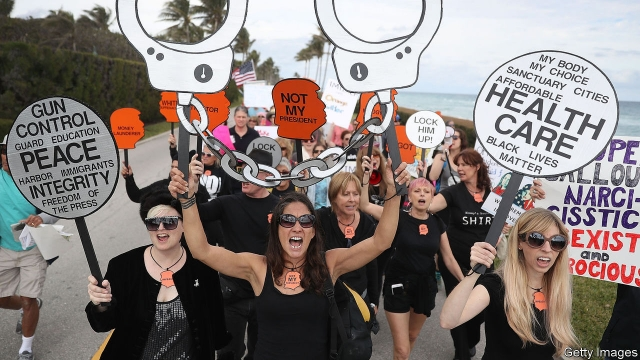
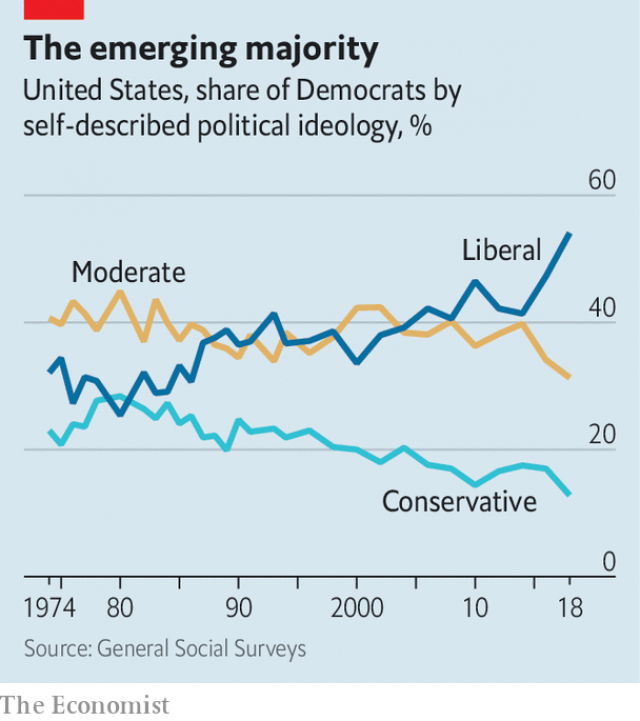

###### Feeling out left

# For the first time ever, a majority of Democrats identify as liberals 

##### But will they vote that way? 

 

> Apr 11th 2019 

AS THE 2020 Democratic primary heats up, a brace of left-wingers are fighting over who can be more radical. They will take heart from the fact that for the first time, more Americans who affiliate with the Democratic Party call themselves liberals rather than moderates or conservatives. According to the newest figures from the General Social Survey (GSS), a long-running poll from the University of Chicago, 54% of Democrats describe themselves with the L word. In 1974, when the GSS first asked the question, only 32% did. 

What exactly the word “liberal” means in America is contested. But it does seem that Democrats are indeed moving to the left. The Co-operative Congressional Election Study (CCES), a poll led by researchers at Harvard University, also released new survey data this year. The numbers show that even Democrats who describe themselves as conservative tend to support left-wing policies. Over nine-tenths support Medicare for All (a form of universal health care). About the same proportion want the federal minimum wage to increase to $12 per hour (it is currently $7.25), and the Environmental Protection Agency to regulate CO2 emissions. Four-fifths say that women’s access to abortion should be unrestricted. 

There are limits to the leftward swing. According to the CCES, less than a quarter of Democrats believe that they are “very liberal,” the left-most position on the scale. Some popular positions among high-profile Democrats are not yet mainstream among the rank and file. For example, the idea of paying reparations for the costs of slavery, endorsed by Alexandria Ocasio-Cortez, a firebrand member of the House, is not universally accepted. Only 51% think that black Americans should get special treatment to help them catch up. 

 

In the end, it is not enough to win over registered voters. Though Democrats outnumber Republicans, Republicans tend to turn out. Democrats have to win over more independents too. 

-- 

 单词注释:

1.democrat['demәkræt]:n. 民主人士, 民主主义者, 民主党党员 [经] 民主党 

2.APR[]:[计] 替换通路再试器 

3.brace[breis]:n. 支柱, 曲柄, 支撑, 一对 vt. 紧缚, 支撑, 激励 vi. 打起精神 [计] 花括号 

4.affiliate[ә'filieit]:vt. 使紧密联系, 使附属, 接纳, 收养 vi. 发生联系, 参加 

5.gss[]:abbr. guidance system simulator 制导系统模拟器 

6.Chicago[ʃi'kɑ:gәu]:n. 芝加哥 

7.L[el]:n. 见习驾驶员 [计] 电感, 标记, 语言, 负载, 局部, 线路 

8.congressional[kәn'greʃәnl]:a. 会议的, 议会的, 国会的 [法] 代表大会的, 大会的, 议会的 

9.Harvard['hɑ:vәd]:n. 哈佛大学 

10.datum['deitәm]:n. 论据, 材料, 资料, 已知数 [医] 材料, 资料, 论据 

11.medicare['medi,keә]:n. 医疗照顾方案, 医疗照顾项目 [法] 公办的医疗保险制 

12.currently['kʌrәntli]:adv. 现在, 当前, 一般, 普通 [计] 当前 

13.environmental[in.vaiәrәn'mentәl]:a. 周围的, 环境的 [经] 环境的, 环保的 

14.emission[i'miʃәn]:n. 发射, 射出, 发行 [医] 发射, 遗精 

15.unrestricted[.ʌnri'striktid]:a. 无限制的 

16.leftward['leftwәd]:a. 左方的, 左侧的 adv. 在左方, 在左手 

17.les[lei]:abbr. 发射脱离系统（Launch Escape System） 

18.mainstream['meinstri:m]:n. 主流 

19.reparation[.repә'reiʃәn]:n. 补偿, 赔偿, 弥补, 修复, 修理 [经] 赔偿, 补偿, 修理 

20.endorse[in'dɒ:s]:vt. 支持, 赞同, 背书于, 签署 [经] 赞成, 背书 

21.alexandria[,æli^'zɑ:ndriә]:n. 亚历山大港（位于埃及）；亚历山大市（美国弗吉尼亚一城市）；亚历山大大帝 

22.firebrand['faiәbrænd]:n. 火把, 在燃烧的木柴, 煽动叛乱者 

23.universally[ju:ni'v\\:sәli]:adv. 宇宙, 全世界, 普遍, 一般, 普通, 全体, 一致, 通用, 万能, 广用, 广泛 

24.voter['vәutә]:n. 选民, 投票人 [法] 选民, 选举人, 投票人 

25.outnumber[.aut'nʌmbә]:vt. 数目超过, 比...多 

