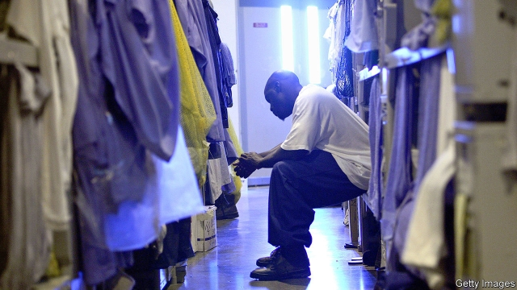
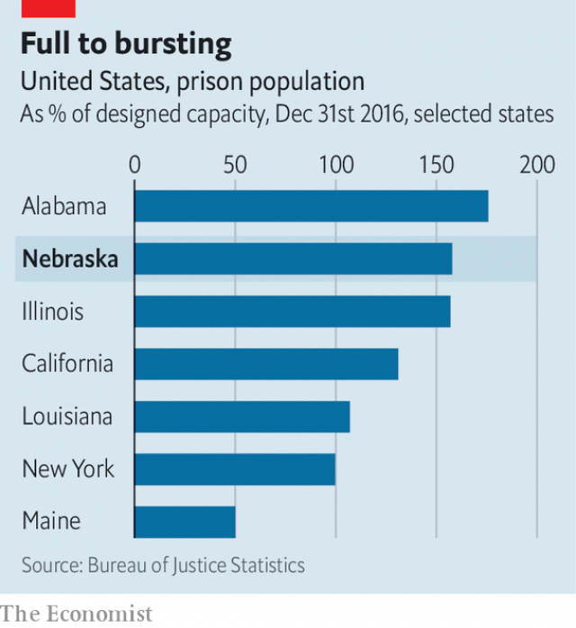

###### Mass incarceration

# Nebraska faces a prison-crowding emergency 

##### Longer sentences for violent crimes are why prisons are full 

 

> Apr 11th 2019 

IN 2015 A prison in Nebraska was taken over by its inmates for several hours. Two were killed before staff regained control. The riot was worsened by the fact that the state’s prisons were horrifically overcrowded. “Nobody was surprised it happened,” says Jason Witmer, who was serving a 17-year sentence for robbery and home invasion at the time. “Trying to contain things, they got more restrictive, then the restrictions became new norms.” 

That year, the Nebraska legislature unanimously passed a sentencing-reform bill that was designed, among other things, to ease that overcrowding. It was forecast to get the prison population down to around 4,500 people, or 139% of capacity, by 2019. Four years later, however, things are worse. Nebraska’s prison system today holds more people than it ever has. Seven of its ten prisons are stuffed to more than 150% of their designed capacity. Its most crowded holds more than three times as many inmates as it should. If the situation does not improve by July 1st 2020 the governor will have to declare an emergency. That would impel officials to consider immediate parole for all eligible inmates. 

Between 2008 and 2016 America’s imprisonment rate fell by 11%. Some hope that the era of mass incarceration that began in the 1980s may be nearing its end. But Nebraska’s troubles show that reducing prison populations is not always as simple as mustering political will. The state’s legislature, judiciary and multiple governors have all agreed that they need to trim its prison population—to no avail. Nebraska illustrates the complex incentives at work in America’s harsh penal system. 

 

The state’s sentencing-reform bill failed to work as intended for several reasons. One aim was to improve parole and post-release supervision to reduce the risk of reoffending. The bill ruled that people who violate the terms of their parole should be returned to prison for brief periods rather than—as often happened—the duration of their sentences. But according to the American Civil Liberties Union (ACLU) of Nebraska, the number of people returning to prison for parole revocations rose by 29% between 2015 and 2017. 

The bill also did nothing to change a principal driver of prison population: long sentences for felonies. Most Americans agree that non-violent drug offenders are better served by treatment than prison; in recent years Nebraska has expanded its use of drug courts for just that reason. But violent crimes pose a more difficult political problem. Few hot-headed young men remain so into middle age—keeping people locked up for decades is not an effective way of reducing crime. But arguing that murderers should spend less time in prison carries immense political risks. 

In Nebraska the average length of sentence rose by 16% from 2000 to 2015, almost entirely as a result of longer sentences for violent crimes. The state’s “habitual criminal” statute imposes a mandatory-minimum sentence of at least ten and up to 60 years for a third conviction on any felony. Prosecutors like such laws because they help to compel suspects to co-operate. But they keep people in prison far longer than public safety dictates. 

They also push back a prisoner’s parole eligibility—as does persistent understaffing. In Nebraska prisoners become eligible for parole after completing half of their sentences’ minimum term. However they also have to complete rehabilitation programmes, such as anger-management or substance-abuse counselling, in order to be released. High turnover and staff shortages mean that the state has too few counsellors to teach those programmes, and often too few guards to transport prisoners. 

A booming economy does perverse damage. In rural areas, where prisons usually are, workers are scarce. The state has been busing people to its maximum-security prison in Tecumseh from Omaha, more than 90 minutes away. Staff shortages can become self-sustaining—mandatory overtime lowers morale, which increases turnover. Nebraska pays its prison employees more than neighbouring states do, but county jails often pay more, with better conditions. In state prisons, working double eight-hour shifts many times a week is common. Union officials complain about inadequate pay increases for seniority. 

Few believe Nebraska will be able to avoid having to declare an emergency next year. The ACLU has sued Nebraska, arguing that its prison conditions violate the Eighth Amendment’s ban on cruel and unusual punishment. In 2011 a similar argument led the Supreme Court to order California to cut its prison population, and on April 2nd the Justice Department found that staff shortages and overcrowding contributed to unconstitutional conditions in Alabama’s prisons. 

Pete Ricketts, the state’s governor, talks of “changing the culture [to] help our inmates get back to society”. His proposed budget includes $6.6m for increasing prison staffing and rehabilitation programmes. He also wants $49m to build two new high-security units with an additional 384 beds at a prison in Lincoln, the state capital. But even if they were available and filled tomorrow, Nebraska would still run at 143% of designed capacity. 

Ultimately reducing prison overcrowding requires more than just building more cells; states have to make a concerted effort to send fewer people to prison for less time. Mike Lawlor, who helped engineer Connecticut’s sizeable decline in prison population and now teaches law at the University of New Haven, says it took a reassessment of risk. “We said, ‘Let’s figure out who the dangerous people are and reserve our incarceration for them.’” Shorter sentences were a large part of the reform. 

Since 2008 Connecticut’s prison population has declined by 32%. Its 18-to-21-year-old population has fallen by more than 60%. “The goal of [our] public policy”, explains Mr Lawlor, “was to reduce crime. Maybe your goal is more punishment. If you do that, you’ll get more crime.” 

-- 

 单词注释:

1.incarceration[in.kɑ:sә'reiʃәn]:n. 下狱, 监禁, 禁闭 [医] 箝闭 

2.Nebraska[ni'bræskә]:[经] 内布拉斯加州, (美国中西部的一州) 

3.APR[]:[计] 替换通路再试器 

4.inmate['inmeit]:n. 同住者, 被收容者 [法] 内部的, 接近中心的, 内在的 

5.regain[ri'gein]:vt. 取回, 恢复, 重回, 复得 [化] 回潮 

6.riot['raiәt]:n. 暴动, 喧闹, 放纵 vi. 发动, 暴动, 纵情, 放荡 vt. 浪费, 挥霍 

7.worsen['wә:sn]:vt. 使更坏, 使恶化 vi. 变得更坏, 恶化 

8.horrifically[hɔ'rifikəli]:adv. 极其可怕地；令人恐惧地 

9.overcrowd[.әuvә'kraud]:vt. 容纳过多的人, 使过度拥挤 

10.jason[]:n. 詹森（男子名） 

11.witmer[]: [人名] 威特默 

12.restrictive[ri'striktiv]:a. 限制的, 约束的, 限定的 n. 限制词 

13.norm[nɒ:m]:n. 基准, 模范, 标准, 准则, 平均数 [化] 定额 

14.legislature['ledʒisleitʃә]:n. 立法机关, 议会, 立法院 [法] 立法机构, 立法机关 

15.unanimously[]:adv. 全体一致, 无异议, 一致同意 

16.impel[im'pel]:vt. 推动, 激励, 驱使, 迫使 

17.parole[pә'rәul]:n. 假释, 誓言, 释放宣言 vt. 宣誓后释放, 使假释出狱 

18.eligible['elidʒәbl]:a. 有资格当选的, 合格的 n. 有资格者, 合格者, 适任者 

19.imprisonment[im'priznmәnt]:n. 监禁, 下狱, 坐牢 [法] 监禁, 徒刑, 拘禁 

20.alway['ɔ:lwei]:adv. 永远；总是（等于always） 

21.muster['mʌstә]:n. 召集, 集合, 检阅, 清单, 花名册, 样品 vt. 召集, 集合, 应召 vi. 集合, 集中 

22.judiciary[dʒu:'diʃiәri]:a. 司法的, 法院的, 法官的 n. 司法部, 司法系统, 法官 

23.avail[ә'veil]:vi. 有用, 有利 vt. 有利于 n. 效用, 利益 

24.incentive[in'sentiv]:n. 动机 a. 激励的 

25.penal['pi:nl]:a. 有关处罚的, 刑的, 刑罚的, 刑法上的, (课税)繁重的 [法] 刑事的, 刑法的, 受刑罚的 

26.supervision[.sju:pә'viʒәn]:n. 监督, 管理 [经] 监督, 管理 

27.reoffend[]: 再犯罪；再犯法 

28.aclu[]:abbr. 美国公民自由协会（American Civil Liberties Union） 

29.revocation[.revә'keiʃәn]:n. 废止, 取消, 撤回 [经] 撤销 

30.felony['felәni]:n. 重罪 [法] 重罪, 重刑罪 

31.offender[ә'fendә]:n. 罪犯, 无礼的人, 得罪人的人 

32.les[lei]:abbr. 发射脱离系统（Launch Escape System） 

33.entirely[in'taiәli]:adv. 完全, 全然, 一概 

34.conviction[kәn'vikʃәn]:n. 定罪, 信服, 坚信 [法] 定罪, 证明有罪, 判罪 

35.prosecutor['prɒsikju:tә]:n. 实行者, 告发者, 公诉人 [法] 原告, 起诉人, 检举人 

36.persistent[pә'sistәnt]:a. 固执的, 坚持的, 持续的, 作用持久的 [法] 坚持的, 固执的, 持续的 

37.understaff[]:v. 人员过少 [网络] 少的员工；尽可能少的员工 

38.rehabilitation['ri:(h)ә,bili'teiʃәn]:n. 复原 [医] 复原, 恢复, 康复 

39.counsel['kaunsәl]:n. 商议, 忠告, 法律顾问 v. 商议, 劝告 

40.turnover['tә:n.әuvә]:n. 翻倒, 翻转, 半圆酥饼, 营业额, 流通, 周转 a. 可翻转的 

41.counsellor['kaunsәlә]:n. 顾问, 辅导员, 律师 

42.perverse[pә'vә:s]:a. 乖张的, 故意作对的, 有悖常情的, 执迷不悟的, 歪曲的, 错误的, 不正当的 [法] 邪恶的, 罪恶的:堕落的, 不合法的 

43.buse[]: [人名] 布斯 

44.Tecumseh[ti'kʌmsə]:n. 特库姆塞（美国一个地区） 

45.omaha['әumәhɑ:]:n. 奥马哈市（美国内布拉斯加州）；美国奥马哈族印第安人；奥马哈 

46.morale[mɒ'rɑ:l]:n. 士气, 道德 

47.inadequate[in'ædikwәt]:a. 不充分的, 不适当的 [法] 不充分的, 不适当的 

48.seniority[.si:ni'ɒriti]:n. 长辈, 老资格 [经] 资历, 服务年限 

49.sue[su:]:vt. 控告, 起诉, 请求 vi. 提出诉讼, 提出请求 

50.California[.kæli'fɒ:njә]:n. 加利福尼亚 

51.unconstitutional['ʌnkɔnsti'tju:ʃәnәl]:a. 违反宪法的, 不符合宪法的 [法] 违反宪法的, 违宪的, 不合宪法规定的 

52.Pete[pi:t]:n. 皮特（等于Peter, 男子名） 

53.rickett[]: [人名] [英格兰人姓氏] 里基特 Rich的昵称 

54.staffing['stɑ:fiŋ]:[计] 人员指挥 [经] 配备职工 

55.Lincoln['liŋkәn]:n. 林肯 

56.concerted[kәn'sә:tid]:a. 商定的, 协定的, 一致的 [法] 一致的, 协力的, 共同的 

57.mike[maik]:vi. 偷懒, 游手好闲 n. 休息, 游手好闲, 扩音器, 话筒 

58.Lawlor[]:n. (Lawlor)人名；(英)劳勒 

59.sizeable['saizәbl]:a. 相当大的, 可观的 

60.haven['heivn]:n. 港, 避难所, 安息所 vt. 安置...于港中, 庇护, 入港 

61.reassessment[]:[经] 重新估价 

