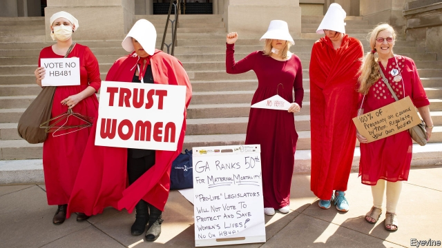

###### In a heartbeat

# The new push to overturn Roe v Wade 

##### A dozen states have introduced “heartbeat” bills that would ban early abortion 

 

> Apr 11th 2019 

THOUGH CONSERVATIVES are by and large taking a kicking in the culture wars, they continue to hold ground on one front: abortion. Americans increasingly accept the right of gays to adopt children and marry. But they have not moved in a similar direction on women’s right to terminate unwanted pregnancies. Abortion is as controversial as it was 46 years ago when the Supreme Court ruled it a constitutional right in Roe v Wade. Hence the success of “Unplanned”, a low-grade, blood-spattered film about an abortion nurse-turned pro-lifer that has become a box-office hit. 

More significant fresh evidence of Americans’ antipathy to abortion comes in the form of legislation. In the first three months of 2019, 12 states introduced bills that ban abortion from the moment a fetal heartbeat is detectable. That happens around the sixth week of pregnancy, two weeks after a missed menstrual period, when many women do not yet know they are pregnant. In other words, the bills come close to being total abortion bans. 

Around half have made it through at least one legislative chamber. In some states they have been signed into law. In March a “heartbeat” bill was signed by Mississippi’s Republican governor. Georgia’s governor, also a Republican, is expected to approve a similar bill there—sparking threats of a Hollywood boycott of a state that is a hub for film and TV production. 

The rush of state-level heartbeat bills represents a shift in strategy by some anti-abortionists. Since 1973, pro-lifers have for the most part focused on chipping away at Roe by introducing burdensome regulations that make it harder to obtain an abortion. These range from imposing waiting periods between a consultation at a clinic and an abortion (which can be difficult for women in states with few clinics) to dictating the width of clinic corridors. This approach has been successful. The Guttmacher Institute, a pro-choice research group, says 401 abortion restrictions were introduced between 2011 and 2017. Eight states have only one abortion clinic. 

Heartbeat bills, by contrast, are straightforward violations of Roe—and so liable to be struck down by the courts almost as soon as they become law. In March a federal judge in Kentucky blocked a heartbeat bill the day the governor signed it. A similar law was blocked in Iowa in January. Mississippi’s will almost certainly be halted before it comes into effect in July. 

Pro-lifers are nonetheless persisting with this campaign in the hope of getting the Supreme Court to weigh in on the issue. Excited by the court’s new conservative majority, champions of heartbeat bills hope the justices may use one to overturn Roe—as Donald Trump promised them during his presidential campaign. As that suggests, Republican politicians are aware that merely dangling that prospect is a big vote-winner.  

In reality, heartbeat bills are unlikely to achieve their promised goal. Mr Trump’s new justices, Neil Gorsuch and Brett Kavanaugh, are conservative Christians who hate abortion. But neither appears ready to overturn the 46-year precedent that Roe represents. And Chief Justice John Roberts, a conservative who has himself expressed scepticism about Roe’s legal basis, is anxious for the court to appear non-partisan. 

It is more likely that the Supreme Court’s conservative majority will undermine Roe by upholding stringent anti-abortion regulations. Mary Ziegler, a professor at the Florida State University College of Law, says it may inflict the worst damage by agreeing that regulations do not create an “undue burden” on women’s access to abortion, the standard used by courts to determine whether restrictions are constitutional. 

The court is expected to rule soon on one such law passed in Louisiana. It requires abortion doctors to have “admitting privileges”, or the right to admit patients to a nearby hospital which many hospitals do not allow and which, elsewhere, has led to the widespread closure of clinics. In 2016 the Supreme Court struck down an almost identical law in Texas, saying it imposed an undue burden. Chief Justice Roberts dissented from that ruling, though in February he voted to temporarily halt the law in Louisiana while the court decided whether to take it up. The other four conservatives voted to uphold it. 

-- 

 单词注释:

1.heartbeat['hɑ:tbi:t]:n. 心跳 

2.overturn[.әuvә'tә:n]:n. 倾覆, 破灭, 革命 vt. 推翻, 颠倒 vi. 翻倒 

3.roe[rәu]:n. 狍, 鱼子, 鱼卵 [医] 鱼卵, 牝鹿 

4.V[vi:]:[计] 溢出, 变量, 向量, 检验, 虚拟, 垂直 [医] 钒(23号元素) 

5.wade[weid]:vi. 跋涉 vt. 涉水 n. 跋涉, 浅滩 

6.APR[]:[计] 替换通路再试器 

7.terminate['tә:mineit]:a. 有结尾的, (可)结束的 vi. 结束, 终止, 满期 vt. 使停止, 使结束, 使终止 [计] 终止 

8.unwanted[.ʌn'wɒntid]:a. 没人要的, 不需要的, 多余的 

9.pregnancy['preɡnәnsi]:n. 怀孕；丰富, 多产；意义深长 

10.constitutional[.kɒnsti'tju:ʃәnl]:a. 宪法的, 立宪的, 体质的 [医] 全身的; 体质的 

11.unplanned['ʌn'plænd]:a. 无计划的, 未经筹划的, 意外的, 在计划外的 

12.antipathy[æn'tipәθi]:n. 厌恶, 反感 [医] 反感, 厌恶; 相克疗法 

13.fetal['fi:tәl]:a. 胎儿的, 胎的 [医] 胎的, 胎儿的 

14.detectable[di'tektәbl]:a. 可察觉的, 易发现的 [计] 可检测的 

15.menstrual['menstruәl]:a. 月经的, 一月一次的, 每月的 [医] 月经的 

16.legislative['ledʒislәtiv]:n. 立法机构 a. 立法的, 有立法权的 

17.Hollywood['hɔliwud]:n. 好莱坞, 美国电影界, 美国电影工业, 美国式电影 

18.hub[hʌb]:n. 毂, 木片, 中心 [计] 插座; 插孔; 集线器, 集中器, 连接器, 中继站 

19.chip[tʃip]:n. 屑片, 薄片, 碎片 vt. 削, 切, 削成碎片, 使摔倒, 凿 vi. 削下屑片 [计] 孔屑; 组件; 晶片; 芯片 

20.burdensome['bә:dnsәm]:a. 累赘的, 恼人的, 繁重的 [法] 难于负担的, 压抑的, 累赘的 

21.consultation[.kɒnsәl'teiʃәn]:n. 请教, 咨询, 磋商会 [医] 会诊 

22.guttmacher[]: [人名] 古特马赫 

23.heartbeat['hɑ:tbi:t]:n. 心跳 

24.violation[.vaiә'leiʃәn]:n. 违反, 违背, 妨碍 [法] 违犯, 违背, 违反 

25.Kentucky[kәn'tʌki]:n. 肯塔基州 

26.Iowa['aiәwә]:n. 衣阿华州 

27.nonetheless[,nʌnðә'les]:conj. 然而, 尽管, 不过 adv. 不过, 仍然, 尽管如此, 然而 

28.presidential[.prezi'denʃәl]:a. 总统制的, 总统的, 首长的, 统辖的 [法] 总统的, 议长的, 总经理的 

29.dangle['dæŋgl]:vi. 摇晃地悬挂着, 追求 vt. 使摇晃地悬挂 n. 悬垂 

30.neil[]:n. 尼尔（男子名） 

31.gorsuch[]: [人名] [英格兰人姓氏] 戈萨奇 Gossage的变体 

32.brett[bret]:n. 布雷特（男子名） 

33.kavanaugh[]: [人名] 卡瓦诺 

34.precedent['presidәnt]:n. 先例, 前例 a. 在先的, 在前的 

35.john[dʒɔn]:n. 盥洗室, 厕所, 嫖客 

36.Robert['rɔbәt]:[法] 警察 

37.scepticism['skeptisizm]:n. 怀疑论, 怀疑主义 [医] 多疑癖 

38.uphold[ʌp'hәuld]:vt. 支撑, 赞成, 鼓励, 举起, 坚持 [法] 确认, 赞成, 支持 

39.stringent['strindʒәnt]:a. 迫切的, 严厉的, 银根紧的 [医] 约束的, 紧迫的 

40.mary['meәri]:n. 玛丽（女子名） 

41.ziegler['zi:^lә]:n. 齐格勒（德语人名）；捷格罗白葡萄酒 

42.Florida['flɒridә]:n. 佛罗里达州 

43.inflict[in'flikt]:vt. 施以, 加害, 使承受 [法] 处, 加, 予以 

44.undue[.ʌn'dju:]:a. 不适当的, 过度的, 未到期的 [经] 未到(支付)期的 

45.Louisiana[lu:.i:zi'ænә]:n. 路易斯安那(美国州名) 

46.closure['klәuʒә]:n. 关闭 vt. 使终止 

47.Texas['teksәs]:n. 德克萨斯 

48.dissent[di'sent]:n. 异议 vi. 持异议, 不同意 

49.temporarily['tempәrәrәli]:adv. 暂时, 一时, 临时 

